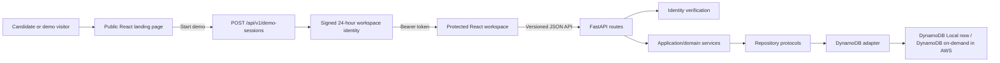
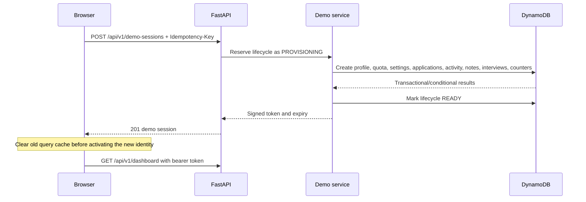
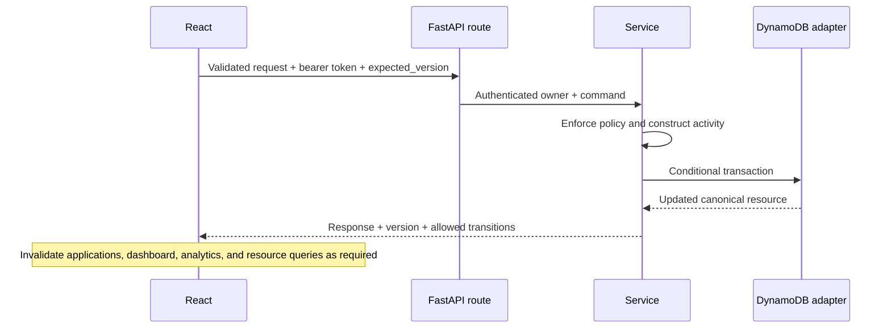
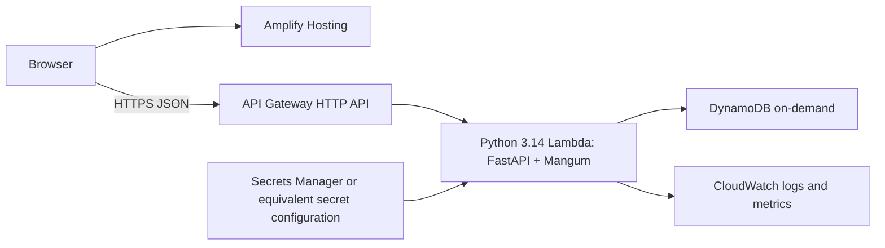

# HireFlux architecture

## Purpose and current state

HireFlux is a modular-monolith job application tracker designed as a realistic,
low-cost portfolio system. The implemented local application consists of:

```text
React/Vite browser client -> FastAPI REST API -> DynamoDB Local
```

The public landing page requires no account. Starting the demo creates a unique
24-hour workspace, seeds 16 fictional applications, and returns a signed bearer
token. Protected pages provide Home/dashboard, applications, interviews,
analytics, and settings. No AWS resource is required or currently provisioned
for this local milestone.

The planned staging shape is:

```text
Amplify Hosting -> API Gateway HTTP API -> Lambda/FastAPI/Mangum -> DynamoDB
                                                     |
                                                     +-> CloudWatch
```

Cognito accounts, private S3 attachments, EventBridge reminders, and SES email
are later capabilities, not dependencies of the current demo.

## System context



The browser is untrusted. The API derives ownership from the verified token and
owns all business decisions. DynamoDB keys, conditions, and transactions stay
behind repository protocols.

## Frontend

The frontend is a React and TypeScript single-page application built by Vite.

- React Router separates the public `/` route from protected workspace routes.
- TanStack Query owns server-state fetching, caching, mutation invalidation,
  and loading/error states.
- Zod validates every untrusted API response before components consume it.
- React Hook Form and schema validation handle editable input.
- Tailwind CSS provides responsive styling while semantic HTML, skip links,
  visible focus, labeled fields, dialogs, and screen-reader chart summaries
  provide the accessibility baseline.

The frontend does not decide ownership, legal status transitions, analytics
denominators, or historical milestones. It renders API contracts such as
`allowed_transitions`. On demo launch, reset, exit, expiry, or authorization
failure, it clears query data before switching identity so one workspace's data
cannot appear in another.

## API and backend boundaries

The backend is a FastAPI modular monolith. Its dependency direction is:

```text
routes -> application services -> repository protocols -> DynamoDB adapters
```

1. **Routes** validate HTTP input, obtain the authenticated identity, invoke a
   service, and serialize the response.
2. **Application and domain services** enforce ownership-sensitive rules,
   status policy, cross-field validation, milestones, metrics, concurrency, and
   activity meaning.
3. **Repository protocols** describe required persistence behavior without
   exposing boto3 or physical key details.
4. **DynamoDB adapters** build keys and expressions, execute transactions,
   maintain sparse indexes, sign cursors, and translate conditional/AWS errors.

Pydantic validates requests and responses. Failures use the stable envelope:

```json
{
  "error": {
    "code": "conflict",
    "message": "The application changed. Refresh and try again.",
    "request_id": "...",
    "details": {}
  }
}
```

`details` is optional and contains only safe validation context. Internal
exceptions, AWS responses, table keys, tokens, and stack traces are never
returned.

## Authentication, authorization, and demo lifetime

`AUTH_MODE=demo` issues an HMAC-signed token containing a generated standard-user
identity and expiry. The signing key is configuration, not source code. Every
request verifies the signature and expiration before deriving `owner_user_id`.
The client never supplies authoritative ownership.

`AUTH_MODE=local` is a deterministic developer convenience and is rejected
outside local/test environments. A future Cognito adapter can replace token
verification for persistent accounts without changing service or repository
ownership contracts.

Demo authorization ends at token expiry. Every temporary DynamoDB item also has
an `expires_at` TTL value, but TTL cleanup is asynchronous and is not used as an
authorization mechanism. A guessed UUID under another owner resolves exactly
like a missing record and returns `404`.

Provisioning creates an owner-partition lifecycle item in `PROVISIONING` before
the profile and seed writes begin. It moves to `READY` only after all seed
resources succeed. A failure is translated to a safe persistence error, the
partial owner/application partitions are deleted best-effort, and the lifecycle
marker moves to `FAILED` with a 15-minute default TTL. Requests may supply an
`Idempotency-Key`; its SHA-256 mapping is stored in a separate TTL item, so a
retry after a successful response reissues the same deterministic signed token.
Requests that arrive while provisioning is in progress or after a failed
attempt receive a conflict and must retry with the appropriate key.

## DynamoDB model

HireFlux uses one table with `PK` and `SK` string keys. The primary application
partition is owner-qualified:

```text
PK = USER#<owner_id>#APPLICATION#<application_id>
```

Application metadata, append-only activity, notes, and interviews share that
partition. Profile, settings, quota, and aggregate counters live in the owner
partition. This model makes the main authorization boundary part of the key
used to address the data.

Three sparse global secondary indexes support current access patterns:

- **GSI1**: non-archived applications by update time and a separate owner
  interview projection.
- **GSI2**: applications by owner and status; explicit `ACTIVE`, `ALL`, and
  `ARCHIVED` views query their required status partitions.
- **GSI3**: outstanding follow-ups and scheduled interviews by owner and time.

Normal request paths use `GetItem`, `Query`, conditional writes, and
`TransactWriteItems`; they never use `Scan`. A guarded, local-only reconciliation
script may scan the explicitly confirmed local table to rebuild projections and
counters. Index reads are eventually consistent, while canonical item reads and
conditional writes protect correctness.

Full key shapes and query contracts are documented in
[docs/dynamodb-access-patterns.md](docs/dynamodb-access-patterns.md).

## Write and read data flows

### Start or reset a demo



Seed creation uses ordinary trusted services and persistence paths so the demo
exercises the same business rules as subsequent user actions.

If a seed write fails, the service marks the lifecycle `FAILED`, deletes known
partial records through owner-scoped queries and batch deletes, and keeps only
the short-lived lifecycle/idempotency markers. Cleanup is not authorization;
token expiry and the verified workspace identity remain the security boundary.

### Mutate an application or child resource



Optimistic concurrency prevents silent overwrites. Application creation,
transitions, follow-up changes, notes, and interviews keep required activity,
counters, and sparse projections atomic with their canonical change.

### Read dashboard and analytics

The backend reads strongly consistent owner counters for current totals and
historical funnel facts, then combines bounded owner-scoped application and
schedule queries for actions, recent work, trends, and breakdowns. A workspace
has a lifetime application quota, so bounded fan-out across status partitions
is deliberate for this demo scale. The API returns counts and denominators;
React formats rather than reinterprets rates.

Follow-up dates are calendar-only values evaluated in the saved workspace IANA
time zone. Interview timestamps are UTC instants displayed in that selected
zone. This prevents a follow-up due "today" from shifting to yesterday when a
browser and workspace use different zones.

## Local runtime

The frontend and backend run directly on the developer host for fast reloads.
Docker Compose runs only DynamoDB Local on loopback. The root `.env` configures
local endpoints and visibly fake AWS-SDK credentials. Application startup never
creates or migrates the table; an operator runs the initializer explicitly.

Backend tests use isolated Moto tables, so they do not depend on Docker.
Frontend tests mock the HTTP boundary. The supported Python range is 3.13 and
3.14.

## AWS staging target and service choices



- **Amplify Hosting** fits a static Vite SPA, supplies managed HTTPS, and keeps
  frontend deployment separate from API execution. It needs an asset-aware SPA
  rewrite and security headers. The repository root `customHttp.yml` supplies
  the hosted security-header policy for the `frontend/` monorepo app; its CSP
  `connect-src` must be kept aligned with each environment's API origin.
- **API Gateway HTTP API** provides the public HTTPS boundary and routing with
  less complexity and lower baseline cost than an ALB/API Gateway REST API for
  this small JSON API.
- **Lambda with Mangum** reuses the tested FastAPI application without managing
  servers. Reserved concurrency, throttling, and timeouts will bound demo abuse
  and cost.
- **DynamoDB on-demand** matches the implemented access-pattern-first model,
  requires no idle database capacity, and supports conditional and transactional
  writes. The deployed client uses its IAM role and no explicit credentials.
- **CloudWatch** supplies structured request-ID logs, metrics, alarms, and
  finite retention. Logs must exclude tokens and private content.
- **Secret configuration** holds the non-default signing key. It must not be
  embedded in frontend assets, source, or deployment output.

The staging stack should be expressed in TypeScript CDK, deployed manually and
smoke-tested first, then automated with GitHub Actions OIDC. Budgets are alerts,
not hard spending caps, so throttling, constrained concurrency, short retention,
and least-privilege IAM are required controls.

## Deferred AWS services

- **Cognito**: persistent user registration, password reset, MFA, and verified
  claims when real accounts are introduced. The demo workspace remains
  passwordless.
- **Private S3**: attachment bytes, with metadata in DynamoDB and access through
  short-lived signed operations after attachment policy is designed.
- **EventBridge Scheduler**: durable reminder scheduling. It must target a
  purpose-built event handler or worker, not pretend the Mangum ASGI entry point
  is an HTTP request.
- **SES**: real email reminders only after verification, unsubscribe, abuse,
  and delivery-state requirements exist.

## Why this is a modular monolith

The expected traffic and team size do not justify distributed services. One
deployable API keeps transactions, authorization, tracing, local development,
and portfolio review understandable. Internal service/protocol boundaries leave
room to split a worker or replace authentication later without paying the
operational cost of microservices now.

## Explicit exclusions

PostgreSQL, RDS, SQLAlchemy, Alembic, ECS, Fargate, EC2, ALB, NAT Gateway,
ElastiCache, OpenSearch, provisioned concurrency, WAF, and multi-region recovery
are not part of the current architecture. They require measured access,
reliability, or abuse-prevention needs and an explicit architecture decision.

## Related documentation

- [docs/dynamodb-access-patterns.md](docs/dynamodb-access-patterns.md)
- [docs/domain-model.md](docs/domain-model.md)
- [docs/status-transitions.md](docs/status-transitions.md)
- [docs/dashboard-and-analytics.md](docs/dashboard-and-analytics.md)
- [docs/deployment-environments.md](docs/deployment-environments.md)
- [docs/roadmap.md](docs/roadmap.md)
- [docs/adr/](docs/adr/)
