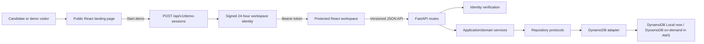
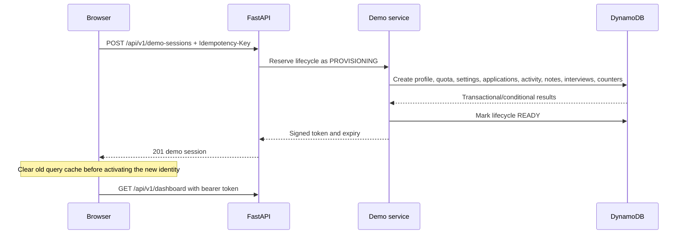
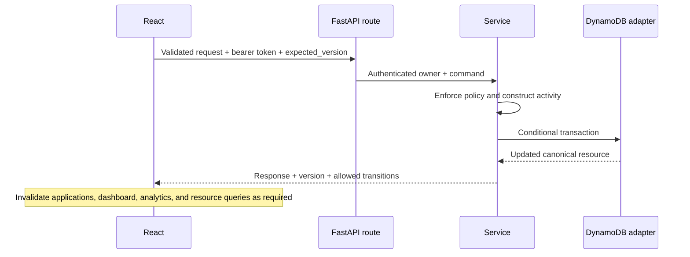
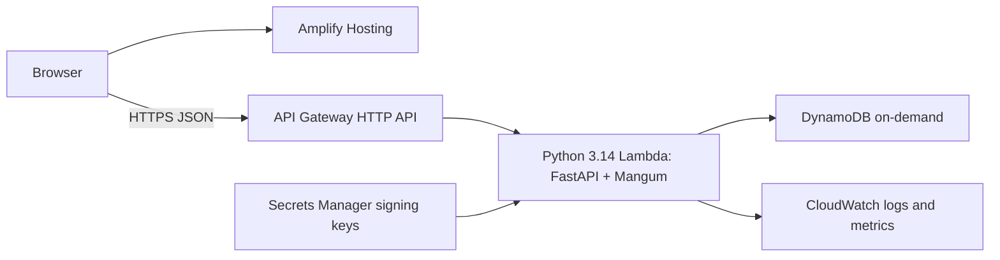

# HireFlux architecture

## Purpose and current state

HireFlux is a modular-monolith job application tracker designed as a realistic,
low-cost portfolio system. The implemented local application consists of:

```text
React/Vite browser client -> FastAPI REST API -> DynamoDB Local
```

The public landing page requires no account. Starting the demo creates a unique
24-hour workspace, seeds a realistic fictional application dataset, and returns a signed bearer
token. Protected pages provide Home/dashboard, applications, interviews,
analytics, and settings. No AWS resource is required or currently provisioned
for this local milestone.

The planned staging shape is:

```text
Amplify Hosting -> API Gateway HTTP API -> Lambda/FastAPI/Mangum -> DynamoDB
                                                     |
                                                     +-> CloudWatch
```

Cognito accounts, private S3 attachments, EventBridge reminders, and SES email
are later capabilities, not dependencies of the current demo.

## System context


```mermaid
flowchart LR
    User["Candidate or demo visitor"] --> Landing["Public React landing page"]
    Landing -->|"Start demo"| DemoAPI["POST /api/v1/demo-sessions"]
    DemoAPI --> Identity["Signed 24-hour workspace identity"]
    Identity -->|"Bearer token"| SPA["Protected React workspace"]
    SPA -->|"Versioned JSON API"| FastAPI["FastAPI routes"]
    FastAPI --> Auth["Identity verification"]
    FastAPI --> Services["Application/domain services"]
    Services --> Ports["Repository protocols"]
    Ports --> Adapter["DynamoDB adapter"]
    Adapter --> DB["DynamoDB Local now / DynamoDB on-demand in AWS"]
```

The browser is untrusted. The API derives ownership from the verified token and
owns all business decisions. DynamoDB keys, conditions, and transactions stay
behind repository protocols.

## Frontend

The frontend is a React and TypeScript single-page application built by Vite.

- React Router separates the public `/` route from protected workspace routes.
- The public landing feature is lazy-loaded separately from authenticated
  routes. Its scoped GSAP hero timeline and single desktop body-story
  ScrollTrigger are confined to the landing chunk; authenticated navigation
  does not request the landing, GSAP, or ScrollTrigger assets. The body story
  keeps one bounded HireFlux shell mounted while its Applications, Interviews,
  Preparation, and Action Center workspaces spatially reorganize. React updates
  semantic chapter state only at range boundaries, while one scoped GSAP
  timeline owns visual interpolation and its single pin. The same four
  workspaces render as concise normal-flow chapters below the desktop/height
  threshold and for reduced motion.
- TanStack Query owns server-state fetching, caching, mutation invalidation,
  and loading/error states.
- Zod validates every untrusted API response before components consume it.
- React Hook Form and schema validation handle editable input.
- Tailwind CSS provides responsive styling while semantic HTML, skip links,
  visible focus, labeled fields, dialogs, and screen-reader chart summaries
  provide the accessibility baseline.

The frontend does not decide ownership, legal status transitions, analytics
denominators, or historical milestones. It renders API contracts such as
`allowed_transitions`. A provider-neutral `WorkspaceSessionProvider` owns
initialization, activation/bootstrap, ready, switching, expired/invalidation,
anonymous, and stable error states. Each transition advances an immutable
generation before cancelling and clearing the prior QueryClient. Protected
query consumers remount with a fresh client; queries, mutation callbacks and
continuations, 401 handling, settings/theme updates, navigation, toasts, and
downloads retain and check their originating generation.

The normal build uses the tab-scoped signed demo adapter. Development can pair
`VITE_WORKSPACE_MODE=local` with backend `AUTH_MODE=local`. This adapter sends no
fabricated bearer, browser-selected owner, or trusted profile fields. It calls
the Phase 2A bootstrap before protected consumers mount and seeds validated
profile/settings into the current cache. Refresh replays bootstrap; leaving
clears browser state while preserving server data. A tab-local boolean records
intentional leave. Production local mode fails closed. This is development
access to the backend's fixed identity, not real login or sign-out.

Temporary/durable capabilities centralize expiry, reset, optional account
simulation, and full JSON export presentation. Durable preferences remain
server-authoritative even for UTC/default values and absent tab markers. Demo
auto-detection remains temporary-only. Voluntary leave confirms registered
unsaved edits; reset explicitly warns about discarding edits. Forced
expiry/invalidation immediately fences and removes protected data. Sidebar and
device appearance preferences remain device UI state. See
[ADR 0006](docs/adr/0006-frontend-workspace-session-boundary.md).

## API and backend boundaries

The backend is a FastAPI modular monolith. Its dependency direction is:

```text
routes -> application services -> repository protocols -> DynamoDB adapters
```

1. **Routes** validate HTTP input, obtain the authenticated identity, invoke a
   service, and serialize the response.
2. **Application and domain services** enforce ownership-sensitive rules,
   status policy, cross-field validation, milestones, metrics, concurrency, and
   activity meaning.
3. **Repository protocols** describe required persistence behavior without
   exposing boto3 or physical key details.
4. **DynamoDB adapters** build keys and expressions, execute transactions,
   maintain sparse indexes, sign cursors, and translate conditional/AWS errors.

Pydantic validates requests and responses. Failures use the stable envelope:

```json
{
  "error": {
    "code": "conflict",
    "message": "The application changed. Refresh and try again.",
    "request_id": "...",
    "details": {}
  }
}
```

`details` is optional and contains only safe validation context. Internal
exceptions, AWS responses, table keys, tokens, and stack traces are never
returned.

## Authentication, authorization, and demo lifetime

`AUTH_MODE=demo` issues an HMAC-signed token containing a generated standard-user
identity and expiry. The signing key is configuration, not source code. Every
request verifies the signature and expiration before deriving `owner_user_id`.
The client never supplies authoritative ownership.

`AUTH_MODE=local` is a deterministic developer convenience and is rejected
outside local/test environments and when deployment runtime markers are present.
It now owns durable data and requires explicit `POST /api/v1/me/bootstrap` before
ordinary workspace operations. The body is absent or `{}`; ownership, profile
attributes, roles, and lifetime come from the server. Bootstrap creates an empty
workspace, profile, and UTC settings atomically, with no seed data or eager counters.
A future Cognito adapter can replace token
verification for persistent accounts without changing service or repository
ownership contracts.

`CurrentIdentity` contains only the verified owner, role, identity kind, and
`data_expires_at`. Demo identities require a data expiry; `LOCAL` and the
provider-neutral future `PERSISTENT` kind prohibit it. Credential expiration
remains outside that data-lifetime contract. Trusted display name and email are
separate bootstrap attributes. No Cognito verifier or production account session
is implemented. Auth modes remain exclusive; the current SPA still runs demos.

Durable readiness is centrally checked before all ordinary owner routes, including
`GET /me`, settings, insights, pipeline, resource writes, and exports. Missing or
incomplete initialization returns `409 WORKSPACE_BOOTSTRAP_REQUIRED`; incompatible
ownership/type/lifetime returns `409 WORKSPACE_BOOTSTRAP_CONFLICT`. Verified demo
identities bypass this durable check because their tokens are issued only after
demo provisioning. Health, demo creation, and authenticated bootstrap are exempt.

`GET /me` only reads an established profile. The legacy demo display name is
normalized only for a demo identity without writing on reads. The nullable,
deprecated `last_login_at` response field is always null: profile creation and
ordinary requests are not observed login events. Legacy stored timestamps are
preserved during adoption but are not treated as login evidence.

Demo authorization ends at token expiry. Every temporary DynamoDB item also has
an `expires_at` TTL value, but TTL cleanup is asynchronous and is not used as an
authorization mechanism. A guessed UUID under another owner resolves exactly
like a missing record and returns `404`.

Provisioning creates an owner-partition lifecycle item in `PROVISIONING` before
the profile and seed writes begin. It moves to `READY` only after all seed
resources succeed. A failure is translated to a safe persistence error, the
partial owner/application partitions are deleted best-effort, and the lifecycle
marker moves to `FAILED` with a 15-minute default TTL. Requests may supply an
`Idempotency-Key`; its SHA-256 mapping is stored in a separate TTL item, so a
retry after a successful response reissues the same deterministic signed token.
Requests that arrive while provisioning is in progress or after a failed
attempt receive a conflict and must retry with the appropriate key.

## DynamoDB model

HireFlux uses one table with `PK` and `SK` string keys. The primary application
partition is owner-qualified:

```text
PK = USER#<owner_id>#APPLICATION#<application_id>
```

Application metadata, append-only activity, notes, and interviews share that
partition. Profile, settings, durable readiness metadata, quota, and aggregate counters live in the owner
partition. This model makes the main authorization boundary part of the key
used to address the data.

Three sparse global secondary indexes support current access patterns:

- **GSI1**: non-archived applications by update time, owner interviews, and
  opportunity context in separate owner-qualified partitions.
- **GSI2**: applications by owner and status; explicit `ACTIVE`, `ALL`, and
  `ARCHIVED` views query their required status partitions.
- **GSI3**: outstanding follow-ups and scheduled interviews by owner and time.

The exact physical index keys are GSI1PK/GSI1SK, GSI2PK/GSI2SK and GSI3PK/GSI3SK,
all strings, with ALL projections. Local initialization and the Phase 3C cloud
definition share this contract through an explicit Python/CDK parity check.

Normal request paths use `GetItem`, `Query`, conditional writes, and
`TransactWriteItems`; they never use `Scan`. A guarded, local-only reconciliation
script may scan the explicitly confirmed local table to rebuild projections and
counters. Index reads are eventually consistent, while canonical item reads and
conditional writes protect correctness.

Durable metadata uses the existing owner `WORKSPACE` slot with a distinct
`DURABLE_WORKSPACE` entity type, identity kind, bootstrap version, `ACTIVE` state,
and creation/update timestamps, without TTL. Sharing the slot with demo lifecycle
metadata prevents an in-place type conversion. Bootstrap strongly reads the owner
partition and conditionally transacts all three required records. Concurrent
requests reread on conditional conflicts; existing preferences and timestamps are
never replaced. Compatible local legacy records and incomplete `PROVISIONING`
markers can be adopted/repaired. An active workspace missing settings requires
operator recovery rather than recreating possibly customized preferences.
Legacy adoption discovers applications through every existing GSI2 status
partition and strongly checks their child partitions for TTL conflicts. This is
eventually consistent discovery, not a strong application manifest or an erasure
guarantee. Phase 2C now supplies the stronger inventory described below. Existing
local data requires explicit manifest backfill, without a table reset or new index;
schema operations remain explicit commands.

### Durable workspace safety (Phase 2C)

Durable WORKSPACE states are PROVISIONING, ACTIVE, DELETING, and DELETED.
Only ACTIVE admits ordinary access. Bootstrap never recovers DELETING/DELETED.
Every ordinary durable write atomically checks ACTIVE/provenance/schema/no TTL
alongside its existing version/activity/quota/projection writes. Demo writes keep
their separate verified-token/TTL behavior and pay no durable guard overhead.

Creation adds a minimal owner `APPLICATION_REF#<id>` in that same transaction.
Archive/restore retain references. `application_manifest_version=1` records known
completeness independently from bootstrap version. New empty workspaces have it;
older LOCAL data uses the guarded operator backfill with lifetime quota evidence,
strong canonical checks, and a quota-conditioned completion marker.

Authenticated durable DELETE `/api/v1/me` and POST `/api/v1/me/deletion/retry`
freeze and advance bounded synchronous erasure. GET `/api/v1/me/deletion` reports
safe lifecycle status. Strong reference/application queries discover whole owned
partitions without Scan/GSI authority. Batch retries are bounded; refs disappear
only after confirmed empty partitions. Owner data is cleared before a minimal
non-TTL DELETED tombstone remains. Remaining keys are resumable progress; there is
no background worker or provider identity deletion. Existing reads that passed
preflight can finish; commit-time conditions guarantee mutation exclusion.

Full JSON exports require the complete manifest, strongly read canonical records,
and enforce incremental record/public UTF-8 byte/elapsed-work budgets plus an
exact final response check. This is not a transactional snapshot. Tombstone
retention, historical backup erasure, recent-auth policy, and provider finalization
remain production hardening/authentication work. See
[ADR 0007](docs/adr/0007-durable-workspace-manifest-and-erasure.md).

Full key shapes and query contracts are documented in
[docs/dynamodb-access-patterns.md](docs/dynamodb-access-patterns.md).

## Write and read data flows

### Start or reset a demo


```mermaid
sequenceDiagram
    participant B as Browser
    participant A as FastAPI
    participant S as Demo service
    participant D as DynamoDB
    B->>A: POST /api/v1/demo-sessions + Idempotency-Key
    A->>S: Reserve lifecycle as PROVISIONING
    S->>D: Create profile, quota, settings, applications, activity, notes, interviews, counters
    D-->>S: Transactional/conditional results
    S->>D: Mark lifecycle READY
    S-->>A: Signed token and expiry
    A-->>B: 201 demo session
    Note over B: Clear old query cache before activating the new identity
    B->>A: GET /api/v1/dashboard with bearer token
```

Seed creation uses ordinary trusted services and persistence paths so the demo
exercises the same business rules as subsequent user actions.

If a seed write fails, the service marks the lifecycle `FAILED`, deletes known
partial records through owner-scoped queries and batch deletes, and keeps only
the short-lived lifecycle/idempotency markers. Cleanup is not authorization;
token expiry and the verified workspace identity remain the security boundary.

### Mutate an application or child resource


```mermaid
sequenceDiagram
    participant UI as React
    participant R as FastAPI route
    participant S as Service
    participant D as DynamoDB adapter
    UI->>R: Validated request + bearer token + expected_version
    R->>S: Authenticated owner + command
    S->>S: Enforce policy and construct activity
    S->>D: Conditional transaction
    D-->>S: Updated canonical resource
    S-->>UI: Response + version + allowed transitions
    Note over UI: Invalidate applications, dashboard, analytics, and resource queries as required
```

Optimistic concurrency prevents silent overwrites. Application creation,
transitions, follow-up changes, notes, and interviews keep required activity,
counters, and sparse projections atomic with their canonical change.

### Read dashboard and analytics

The backend reads strongly consistent owner counters for current totals and
historical funnel facts, then combines bounded owner-scoped application and
schedule queries for actions, recent work, trends, and breakdowns. A workspace
has a lifetime application quota, so bounded fan-out across status partitions
is deliberate for this demo scale. The API returns counts and denominators;
React formats rather than reinterprets rates.

Follow-up dates are calendar-only values evaluated in the saved workspace IANA
time zone. Interview timestamps are UTC instants displayed in that selected
zone. This prevents a follow-up due "today" from shifting to yesterday when a
browser and workspace use different zones.

## Local runtime

The frontend and backend run directly on the developer host for fast reloads.
Docker Compose runs only DynamoDB Local on loopback. The root `.env` configures
local endpoints and visibly fake AWS-SDK credentials. Application startup never
creates or migrates the table; an operator runs the initializer explicitly.

Backend tests use isolated Moto tables, so they do not depend on Docker.
Frontend tests mock the HTTP boundary. The supported Python range is 3.13 and
3.14.

## Infrastructure foundation (Phase 3A)

`infra/` now contains the standalone TypeScript CDK v2 package. Explicit staging
and production context selects one shared, minimal stack implementation with
distinct stack identities/namespaces and common tags. Both retain `us-east-1`.
Accounts are unbound for local synth unless separately supplied through validated
environment-specific context. The local CLI wrapper isolates AWS credentials and
disables lookups/telemetry; tests block network attempts and assert repeatability.

Both templates now contain the DynamoDB table, ten backend request-path resources
and two static Amplify hosting resources, plus twelve operational declarations
(three conditional on an alert email), with zero outputs. Each template declares
25 resources; the blank-email configuration selects 22. Default CDK bootstrap parameters/rules
and assembly role/asset references are future deployment contracts, not deployed
infrastructure. Phase 3B packaging and 3C data definition are implemented locally;
3D compute/integration and 3E hosting/origin definitions are complete locally;
3F operational controls and 3G final review are complete locally;
actual staging deployment remains Phase 4 and Cognito remains Phase 5. See
[infra/README.md](infra/README.md) for commands, naming, secret/lifecycle rules,
and the open bundled dependency audit finding, and
[ADR 0008](docs/adr/0008-aws-cdk-environment-foundation.md).

## Cloud data definition (Phase 3C)

The mature single-region CDK Table L2 defines the existing single table, eight
string key attributes and exactly three ALL-projection GSIs. Both environments
use PAY_PER_REQUEST, STANDARD class, optional epoch-seconds `expires_at` TTL and
AWS-owned encryption. No streams, replicas, seeding, custom resources or
customer KMS keys are added. Phase 3D adds the scoped request-path resources.

The stable semantic ID WorkspaceTable and logical ID WorkspaceTable68AC2584 are
stateful contracts. Physical names are generated independently per stack;
Phase 3D consumes the readonly `workspaceTable` construct and its name/ARN
tokens directly. Renaming/reparenting, primary-key/physical-name changes and
future GSI evolution require deliberate migration/replacement review.

Immutable environment data policy makes staging replaceable (PITR/deletion
protection off, Delete on removal/replacement) and production protected (PITR/
deletion protection on, Retain on removal/replacement). The parity helper exports
the actual local initializer and TTL contract; the explicit network-blocked check
compares both synthesized schemas. Normal synth requires the verified prebuilt
Lambda artifact, but never invokes Python, Docker or the builder. Local data
and the table schema remain unchanged.

Production PITR historical retention is separate from Phase 2C live-table erasure.
Phase 6 must define backup retention, restore procedures, deletion-tombstone
handling after restore and privacy/erasure reconciliation. No claim extends live
erasure to all historical copies. Nothing is deployed. See
[ADR 0010](docs/adr/0010-dynamodb-cloud-lifecycle.md) and [infra guide](infra/README.md).

## Backend artifact boundary (Phase 3B)

Phase 4A verifies the accepted source on GitHub with all five quality jobs green
and actual artifact/contract checks. The Linux CI ZIP and Windows zlib-ng ZIP
have identical expanded files and protected inputs; a controlled compression
experiment reproduces the remote ZIP hash exactly. Artifact identity includes
the compression toolchain, so retain the chosen ZIP with its own manifest.
The [Phase 4A record](docs/production-account-readiness.md#47-phase-4a-source-control-and-remote-ci-qualification)
closes source/CI condition L01 and carries nineteen AWS/release qualifications.
Phase 4B completed read-only preflight and is blocked: the confirmed target is
shared and needs a reviewed deployment-permission design, Lambda concurrency
cannot admit the planned reservation, and the Billing baseline is unconfirmed.
No bootstrap or HireFlux resource was created. See the
[Phase 4B record](docs/production-account-readiness.md#48-phase-4b-read-only-aws-preflight-and-blocked-bootstrap).

The existing factory now has independent local ASGI and Lambda entry points.
Lambda uses `hireflux_backend.lambda_handler.handler`, one cold-start app/SDK
client, Mangum with lifespan off, and environment-only validated configuration.
No application startup/shutdown hooks or filesystem writes are required.
Adapter error logging preserves the application's safe-error policy.

The backend-owned builder exports production dependencies from `backend/uv.lock`
and installs hash-verified CPython 3.14 Linux x86_64 wheels. The ZIP includes
locked boto3/botocore, native libraries and runtime assets at its root; it excludes
development tooling and private configuration. Two clean builds match. A pinned
official AL2023 Python 3.14 image validates isolated imports, read-only execution,
native dependencies and cold/warm HTTP API v2 invocations without network access.
Phase 3D uses Python 3.14/x86_64 and the documented handler. CDK verifies and binds
the prebuilt ZIP; synth never runs the builder or installs Python dependencies.
See [backend guide](backend/README.md) and
[ADR 0009](docs/adr/0009-lambda-runtime-and-deterministic-packaging.md).


## Backend request-path definition (Phase 3D, local synthesis only)

Each environment defines HTTP API `$default` route/stage -> one Python 3.14
x86_64 ZIP Lambda -> its own DynamoDB table. `BackendApi` exposes the function,
API and endpoint tokens directly for Phase 3E. No CloudFormation outputs, lookup,
Function URL, VPC, authorizer, application S3 bucket or deployment is added.

Staging uses `AUTH_MODE=demo`; production uses `AUTH_MODE=cognito` and retains
the existing 503 authentication-unavailable behavior for protected/demo routes.
Health is liveness, not production readiness. Phase 5 must evolve exclusive auth
modes to support demo and persistent accounts together and revisit preflight.

One explicit role trusts only Lambda, with scoped CreateLogStream/PutLogEvents
permissions for its explicit log group,
seven audited DynamoDB data actions and exact secret GetSecretValue permissions.
Item actions are table-only; Query includes the table and its three exact GSI
ARNs. Scan, table administration, broad secret access and cross-environment
references are absent. Two generated 64-character signing secrets have disposable
staging and retained production lifecycles; rotation remains deferred. Runtime
resolves them once before app construction and reuses the app/keys on warm calls.

Typed environment CORS feeds both HTTP API and FastAPI: GET/POST/PATCH/DELETE/
OPTIONS; Accept, Authorization, Content-Type, Idempotency-Key, X-Request-ID;
exposed X-Request-ID and Content-Disposition; credentials false for the bearer
client. Phase 3E derives each exact frontend origin from the configured main
branch and that stack's Amplify App.DefaultDomain token. HTTP API is the deployed
CORS authority and handles preflight. No hostname has been provisioned yet.

Memory is 1024 MB, Lambda timeout 15s and integration timeout 20s. The unchanged
4,000,000-byte export budget sits below Lambda's 6 MiB synchronous response and
HTTP API's 10 MB payload limits. Proxy JSON escapes a body again; a narrow Lambda
wrapper switches large bodies to base64 when needed, retaining the original
browser bytes after API decoding. A 64 KiB envelope reserve and safe 413 fallback
protect the synchronous limit without lowering/increasing product budgets or
enabling streaming. Work limits remain export 5s and erasure 2s.

Phase 3F defines explicit logging retention, alarms, concurrency and throttling;
local final review is 3G, actual staging deployment/live qualification 4, Cognito 5 and backup/
rotation/privacy hardening 6. Production synthesis is not deployability. See
[ADR 0011](docs/adr/0011-lambda-http-api-security-boundary.md),
[infra guide](infra/README.md) and [backend guide](backend/README.md).

## Operational guardrails (Phase 3F, local synthesis only)

The [Phase 3G complete-system review](docs/production-account-readiness.md#46-phase-3g-final-synthesized-review-and-handoff)
concludes PASS WITH EXPLICIT PHASE 4 CONDITIONS. It corrected paginated interview
label collection and caps configurable interview capacity at 25: the previous
96-action-based bound ignored full-item transaction bytes. Current maximum label
sync is 29 durable actions and a conservative 2,529,011 bytes. The final rebuilt
artifact passes full checks. Anonymous issuance remains a cost amplification risk;
API throttles, reservations and budgets do not cap cumulative spending. Soft
export/erasure work budgets cannot interrupt an SDK call. Caller diagnostic IDs
remain distinct from AWS native IDs; live correlation, timing, IAM, billing and
hosted behavior must qualify in supervised Phase 4. No AWS resource is deployed.

`OperationalLogs` owns separate STANDARD Lambda and HTTP API access log groups.
Both retain 14 days in staging (Delete/Delete) and 30 days in production
(Retain/Retain). Lambda selects JSON, application WARN and system WARN: installed
Mangum logs raw request paths at INFO, so INFO is deliberately excluded. Existing
sanitized error logging remains. Access logs contain request ID, route key,
method, status, response size, latency, integration latency/status and protocol;
they omit raw paths, IPs, user agents, credentials and request/response contents.
Only CreateLogStream and PutLogEvents for the Lambda group's ARN are granted.

The existing default HTTP API stage disables detailed metrics and applies
rate/burst 10/20 in staging and 20/40 in production. Lambda reservations are
5/10. These controls constrain scaling; throttling is best-effort and reserved
concurrency needs Phase 4 account-quota qualification. No provisioned concurrency
or new request-path service is introduced.

`OperationalGuardrails` owns five native alarms and six dashboard graphs per
environment. Lambda Errors/Throttles, HTTP API 5xx and DynamoDB ThrottledRequests
alarm at one event in one five-minute window; DynamoDB SystemErrors requires
two of three such windows. All missing data is notBreaching. DynamoDB error and
throttle sums use TableName plus each actual request Operation; table-only
SystemErrors would silently miss data. Routine 4xx, conditional conflicts and
user errors are not alarms. No custom metrics, log queries or collectors exist.

An optional NoEcho deployment email conditions the SNS topic/subscription/policy,
five alarm actions and direct budget emails. Empty input creates no SNS resource;
confirmation and delivery tests remain Phase 4. Monthly USD 10/30 COST budgets
use Project=HireFlux AND Environment=<environment>, UNBLENDED_COST and actual
80%/100% notifications. Tags need billing activation and attribution validation.
Budgets are delayed advisory controls, can miss shared/untaggable costs, and do
not stop spending. No BudgetsAction exists. See [ADR 0013](docs/adr/0013-operational-guardrails.md)
and [infra operational contract](infra/README.md#operational-guardrails-phase-3f).
AWS deployment, notification delivery and billing activation have not occurred.

## AWS staging target and service choices

Phase 3E locally defines static WEB Amplify App/Branch resources for each
environment. App uses a NoEcho/no-default GitHub deployment input only for
repository connection, plus the static frontend monorepo root. Branch uses
same-stack API endpoint and frontend URL tokens at Vite build time. Both source
main; staging BETA auto-builds, production PRODUCTION does not. No App/domain is
live, and production's demo frontend adapter does not implement Cognito.

Configured branch + App.DefaultDomain → exact backend CORS; API endpoint →
Branch variables. App contains no API reference and backend contains no Branch
reference, preserving acyclic prerequisite order App → backend → Branch.
Repository-root customHttp.yml owns static headers; the regional HTTPS API CSP
source supports generated IDs without an App→API edge. The asset-aware 200 SPA
rewrite preserves static-file errors. Source maps and frontend runtime/session
code remain unchanged. See
[ADR 0012](docs/adr/0012-amplify-hosting-origin-wiring.md) and
[frontend validation guide](frontend/README.md).


```mermaid
flowchart LR
    Browser["Browser"] --> Amplify["Amplify Hosting"]
    Browser -->|"HTTPS JSON"| APIGW["API Gateway HTTP API"]
    APIGW --> Lambda["Python 3.14 Lambda: FastAPI + Mangum"]
    Lambda --> DynamoDB["DynamoDB on-demand"]
    Lambda --> CloudWatch["CloudWatch logs and metrics"]
    Secrets["Secrets Manager signing keys"] --> Lambda
```

- **Amplify Hosting** fits a static Vite SPA, supplies managed HTTPS, and keeps
  frontend deployment separate from API execution. It needs an asset-aware SPA
  rewrite and security headers. The repository root `customHttp.yml` supplies
  the hosted security-header policy for the `frontend/` monorepo app; its CSP
  `connect-src` permits self and the narrow us-east-1 execute-api HTTPS pattern;
  exact origin enforcement remains in API/FastAPI CORS.
- **API Gateway HTTP API** provides the public HTTPS boundary and routing with
  less complexity and lower baseline cost than an ALB/API Gateway REST API for
  this small JSON API.
- **Lambda with Mangum** reuses the tested FastAPI application without managing
  servers. Defined reserved concurrency, throttling, and timeouts bound backend
  scaling; they do not establish a spending cap.
- **DynamoDB on-demand** matches the implemented access-pattern-first model,
  requires no idle database capacity, and supports conditional and transactional
  writes. The deployed client uses its IAM role and no explicit credentials.
- **CloudWatch** supplies structured request-ID logs, metrics, alarms, and
  finite retention. Logs must exclude tokens and private content.
- **Secrets Manager** generates the cursor and demo-session signing keys. They are read once at Lambda cold start and must not be
  embedded in frontend assets, source, or deployment output.

The staging stack should be expressed in TypeScript CDK, deployed manually and
smoke-tested first, then automated with GitHub Actions OIDC. Budgets are alerts,
not hard spending caps, so throttling, constrained concurrency, short retention,
and least-privilege IAM are required controls.

## Deferred AWS services

- **Cognito**: persistent user registration, password reset, MFA, and verified
  claims when real accounts are introduced. The demo workspace remains
  passwordless.
- **Private S3**: attachment bytes, with metadata in DynamoDB and access through
  short-lived signed operations after attachment policy is designed.
- **EventBridge Scheduler**: durable reminder scheduling. It must target a
  purpose-built event handler or worker, not pretend the Mangum ASGI entry point
  is an HTTP request.
- **SES**: real email reminders only after verification, unsubscribe, abuse,
  and delivery-state requirements exist.

## Why this is a modular monolith

The expected traffic and team size do not justify distributed services. One
deployable API keeps transactions, authorization, tracing, local development,
and portfolio review understandable. Internal service/protocol boundaries leave
room to split a worker or replace authentication later without paying the
operational cost of microservices now.

## Explicit exclusions

PostgreSQL, RDS, SQLAlchemy, Alembic, ECS, Fargate, EC2, ALB, NAT Gateway,
ElastiCache, OpenSearch, provisioned concurrency, WAF, and multi-region recovery
are not part of the current architecture. They require measured access,
reliability, or abuse-prevention needs and an explicit architecture decision.

## Related documentation

- [docs/dynamodb-access-patterns.md](docs/dynamodb-access-patterns.md)
- [docs/domain-model.md](docs/domain-model.md)
- [docs/status-transitions.md](docs/status-transitions.md)
- [docs/dashboard-and-analytics.md](docs/dashboard-and-analytics.md)
- [docs/deployment-environments.md](docs/deployment-environments.md)
- [docs/roadmap.md](docs/roadmap.md)
- [docs/adr/](docs/adr/)
