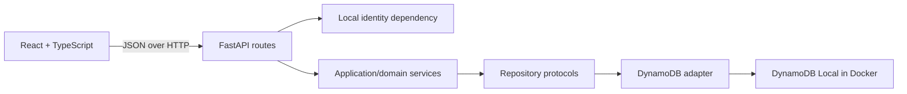
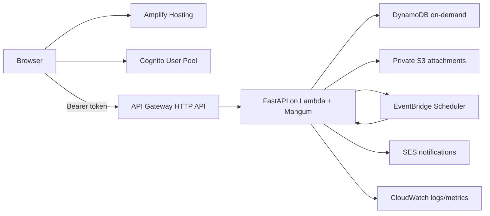

# Architecture

## Decision summary

HireFlux is a modular monolith optimized for a low-traffic portfolio demo. A React single-page application calls a versioned FastAPI REST API. The API owns authorization and business rules and persists an access-pattern-first single-table model in DynamoDB.

The source UML and DFDs remain useful domain input, but this document and the bootstrap requirements are authoritative where they differ. Cognito owns credentials, integer identifiers become UUIDs, the logical DFD stores become item types in one DynamoDB table, and `Company` remains denormalized as `company_name` until an access pattern justifies a separate entity.

## Local Milestone 1

The API process and frontend run directly on the host for fast reloads. Docker Compose runs only DynamoDB Local. Table creation is an explicit operator command, never an application-startup side effect. Tests substitute a Moto-backed table and do not require Docker.

## Backend boundaries

1. Routes translate HTTP input/output and authenticated identity.
2. Application services enforce ownership, cross-field validation, optimistic concurrency, and the status policy.
3. Repository protocols describe persistence needs without AWS types.
4. The DynamoDB adapter owns keys, expressions, signed cursors, transactions, and SDK error translation.

The dependency direction points inward. React never decides whether a transition is legal; it renders `allowed_transitions` returned by the API. DynamoDB code never trusts an owner supplied by a browser.

## Request flow

1. Request middleware creates or accepts a safe correlation ID and returns it as `X-Request-ID`.
2. The auth dependency creates the fixed local identity only in a validated local/test environment. Cognito JWT verification replaces this dependency later.
3. Pydantic validates untrusted request data.
4. A service applies domain rules and calls an owner-scoped repository method.
5. The adapter issues `GetItem`, `Query`, conditional writes, or a transaction.
6. Exception handlers return a stable machine-readable error envelope without internal details.

The error contract is `{"error":{"code":"...","message":"...","request_id":"...","details":...}}`; `details` is optional and reserved for safe validation information.

## Aggregate and consistency choices

Application is the central aggregate. The application metadata and its activity records share an owner-qualified application partition. Notes, interviews, and attachment metadata will join that partition later. Sparse indexes support ordered owner lists and status queries without scans.

Edits and transitions carry an expected version. Conditional writes reject stale updates rather than silently overwriting a newer change. Application creation and status changes persist their append-only activity records in the same transaction.

## Target AWS architecture

The Lambda uses an IAM execution role; no AWS keys are embedded in code, images, GitHub, or browser assets. CDK in TypeScript and GitHub Actions with OIDC are later milestones. A private S3 bucket holds bytes while DynamoDB holds attachment metadata.

EventBridge Scheduler cannot invoke a Mangum/API Gateway entry point as though it were an HTTP request. Milestone 6 must either add a small event-dispatching Lambda handler beside the ASGI handler or create a separate reminder worker; that choice is intentionally deferred until the reminder contract exists.

## Security and cost posture

- Cognito will own passwords, verification, reset, MFA options, and tokens. DynamoDB never stores passwords or hashes.
- Ordinary queries are owner-scoped before touching child records. Admin access will use separate role checks and repository methods.
- Cognito groups/custom claims will be authoritative for the deployed role. The profile role is a read projection, never client-editable, and a later reconciliation path must only move it from a verified Cognito claim.
- CORS is configured from a concrete allowlist.
- Logs carry request IDs but not tokens, credentials, or attachment contents.
- DynamoDB on-demand, one Lambda, HTTP API, short log retention, private S3 lifecycle rules, and low budget alerts fit the intended low-traffic cost posture. Costs remain usage-dependent, and budgets are alerts rather than hard caps.

## Explicitly excluded initial architecture

PostgreSQL, RDS, SQLAlchemy, Alembic, ECS, Fargate, EC2, ALB, NAT Gateway, ElastiCache, OpenSearch, provisioned concurrency, and WAF are not part of the demo architecture. A production evolution could revisit multi-region recovery, stronger abuse prevention, search infrastructure, and relational reporting only after measured needs justify their cost and complexity.
