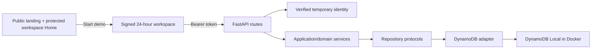
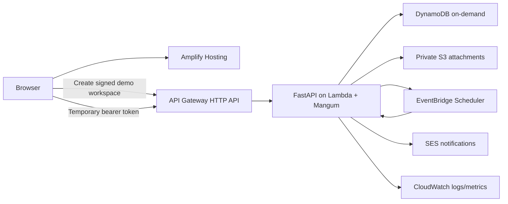

# Architecture

## Decision summary

HireFlux is a modular monolith optimized for a low-traffic portfolio demo. A React single-page application calls a versioned FastAPI REST API. The API owns authorization and business rules and persists an access-pattern-first single-table model in DynamoDB.

The source UML and DFDs remain useful domain input, but this document and the bootstrap requirements are authoritative where they differ. The recruiter demo has no passwords; future persistent accounts may use Cognito. Integer identifiers become UUIDs, the logical DFD stores become item types in one DynamoDB table, and `Company` remains denormalized as `company_name` until an access pattern justifies a separate entity.

## Local Milestone 1

The API process and frontend run directly on the host for fast reloads. Docker Compose runs only DynamoDB Local. A demo launch creates a unique owner UUID, seeds a deterministic 16-application fictional scenario through trusted service paths, and returns a signed bearer token. The protected `/dashboard` route is the workspace Home; applications, interviews, analytics, and settings remain dedicated destinations. Table creation and TTL enablement are explicit operator commands, never application-startup side effects. Tests substitute a Moto-backed table and do not require Docker.

## Backend boundaries

1. Routes translate HTTP input/output and authenticated identity.
2. Application services enforce ownership, cross-field validation, optimistic concurrency, and the status policy.
3. Repository protocols describe persistence needs without AWS types.
4. The DynamoDB adapter owns keys, expressions, signed cursors, transactions, and SDK error translation.

The dependency direction points inward. React never decides whether a transition is legal; it renders `allowed_transitions` returned by the API. DynamoDB code never trusts an owner supplied by a browser.

## Request flow

1. Request middleware creates or accepts a safe correlation ID and returns it as `X-Request-ID`.
2. The auth dependency verifies the signed demo token and derives the owner identity. Fixed local identity remains an explicit test/development mode; Cognito may plug into the same dependency for future persistent accounts.
3. Pydantic validates untrusted request data.
4. A service applies domain rules and calls an owner-scoped repository method.
5. The adapter issues `GetItem`, `Query`, conditional writes, or a transaction.
6. Exception handlers return a stable machine-readable error envelope without internal details.

The error contract is `{"error":{"code":"...","message":"...","request_id":"...","details":...}}`; `details` is optional and reserved for safe validation information.

## Aggregate and consistency choices

Application is the central aggregate. Application metadata, append-only activity, notes, and interviews share an owner-qualified application partition. Workspace settings and aggregate counters use the owner's user partition. Sparse indexes support ordered owner lists, status queries, and scheduled work without scans.

Edits and transitions carry an expected version. Conditional writes reject stale updates rather than silently overwriting a newer change. Application creation and status changes persist their append-only activity records in the same transaction.

Dashboard and analytics rules live in backend services. Server-owned first-milestone timestamps preserve historical response, screening, interview, offer, and acceptance facts after the current status changes. The API includes metric counts and denominators so React renders rather than reinterprets rates. Status and funnel counters are maintained transactionally; bounded owner-scoped queries provide the richer local analytics needed for a workspace capped at 100 applications.

The Action Center derives outstanding follow-ups, upcoming interviews, and aging active applications from owner-scoped schedule projections and application milestones. Completing or rescheduling a follow-up, changing an interview, and mutating a note appends activity atomically with the resource write.

## Target AWS architecture

The Lambda uses an IAM execution role; no AWS keys are embedded in code, images, GitHub, or browser assets. CDK in TypeScript and GitHub Actions with OIDC are later milestones. A private S3 bucket holds bytes while DynamoDB holds attachment metadata.

EventBridge Scheduler cannot invoke a Mangum/API Gateway entry point as though it were an HTTP request. Milestone 6 must either add a small event-dispatching Lambda handler beside the ASGI handler or create a separate reminder worker; that choice is intentionally deferred until the reminder contract exists.

## Security and cost posture

- The recruiter demo stores no passwords or password hashes. If persistent accounts are added, Cognito will own password, verification, reset, MFA, and account tokens.
- Ordinary queries are owner-scoped before touching child records. Admin access will use separate role checks and repository methods.
- Demo tokens always create standard-user identities. If Cognito is added, its verified groups/custom claims will become authoritative for deployed persistent-account roles.
- CORS is configured from a concrete allowlist.
- Logs carry request IDs but not tokens, credentials, or attachment contents.
- Temporary records carry DynamoDB TTL timestamps, but access stops at token expiry rather than waiting for asynchronous deletion.
- DynamoDB on-demand, one Lambda, HTTP API throttling, constrained concurrency, short log retention, and low budget alerts fit the intended low-traffic cost posture. Costs remain usage-dependent, and budgets are alerts rather than hard caps.

## Explicitly excluded initial architecture

PostgreSQL, RDS, SQLAlchemy, Alembic, ECS, Fargate, EC2, ALB, NAT Gateway, ElastiCache, OpenSearch, provisioned concurrency, and WAF are not part of the demo architecture. A production evolution could revisit multi-region recovery, stronger abuse prevention, search infrastructure, and relational reporting only after measured needs justify their cost and complexity.
