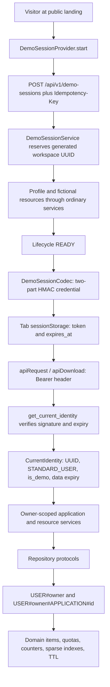
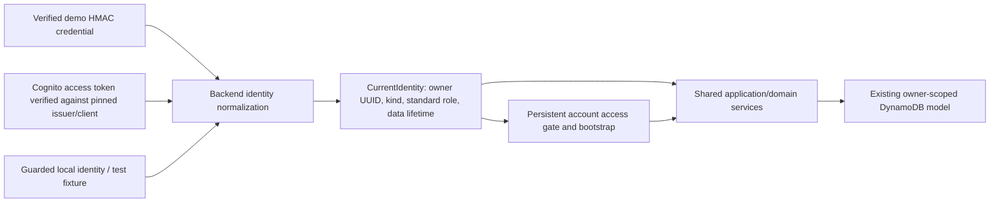

# Production account readiness — Phase 1

Date: 2026-10-05. Status: architecture proposal for review, not an accepted implementation ADR.

**Current Phase 3G update (2026-10-07): PASS WITH EXPLICIT PHASE 4 CONDITIONS.**
The complete synthesized/runtime system was reviewed and freshly revalidated.
Two local defects were corrected: interview-key query pagination and the unsafe
96 interview transaction setting (maximum/default now 25). Final backend 422,
frontend 364, infra 119 and real-artifact CLI four tests pass; the rebuilt Linux
ZIP, both actual synths, schema parity, condition/graph and secret/build checks pass.
There are zero open local pre-4 defects, 20 pending Phase 4 live qualifications
and six production finding groups. CDK's bundled high dependency finding and
anonymous issuance cost amplification remain open; initial staging must be
supervised. No AWS/GitHub/Billing/SNS action, commit/push or remote CI occurred.
See [complete A–AF handoff and all 86 exit questions](#46-phase-3g-final-synthesized-review-and-handoff).

**Historical Phase 3F update (2026-10-06):** both environment templates now include
finite explicit JSON logs, scoped logging IAM, five native alarms, one dashboard,
API throttles, reserved concurrency and AND-tagged monthly budgets. Each declares
25 resources and zero outputs; blank optional alert email selects 22 resources
without SNS or notification actions. Retention is 14/30 days, rate/burst 10/20
and 20/40, reservations 5/10, budgets USD 10/30. The unchanged runtime ZIP,
schema, protected production data and acyclic hosting/CORS wiring remain intact.
All 119 infra unit tests, four real-artifact CLI tests, both actual synths and
fresh schema parity pass; focused backend and frontend hosting checks pass.
No AWS/Billing/SNS account action or deployment occurred. Cost-tag coverage,
concurrency quota, log delivery and confirmed optional emails remain Phase 4.
Budget alerts do not cap spend or cover every untaggable/shared charge.
See [ADR 0013](adr/0013-operational-guardrails.md) and
[section 45](#45-phase-3f-implementation-and-handoff). Phase 3G review is next;
the CDK bundled advisory and later production/authentication gates remain open.

**Phase 3E implementation update (2026-10-06):** both environment templates
define the full browser-to-backend path with separate static Amplify App/Branch
resources, NoEcho GitHub deployment input, public branch-level API/site variables
and exact App.DefaultDomain-derived CORS. Each has 13 resources and zero outputs.
The graph is acyclic App → backend → Branch; SPA/header/build checks pass.
No hosting/domain exists and no AWS/GitHub authorization or deployment occurred.
Production auto-build is disabled and Cognito remains unavailable until Phase 5.
The Phase 3D runtime ZIP and all 71 backend runtime sources remain unchanged.
See [ADR 0012](adr/0012-amplify-hosting-origin-wiring.md) and
[section 44](#44-phase-3e-implementation-and-handoff). Earlier updates are
historical completion snapshots. Phase 3F is next; the CDK bundled advisory
remains open and production hardening/launch qualification remains later work.

**Phase 3A implementation update (2026-10-06):** the standalone TypeScript CDK
foundation now exists. Explicit staging/production configuration composes one
shared empty stack with distinct identity, namespace, and tags in `us-east-1`.
Accounts are unbound by default with optional environment-specific context.
Local synthesis is credential-isolated and tested with network blocking. No AWS
application resources or deployment exist. See [infra guide](../infra/README.md),
[ADR 0008](adr/0008-aws-cdk-environment-foundation.md), and section 40. Phase 3B
packaging is next; the bundled CDK dependency advisory remains an open follow-up.

**Phase 2C implementation update (2026-10-05):** the durable safety foundation is
implemented and validated. Strong application references, verified local backfill,
atomic ACTIVE write guards, DELETING/DELETED lifecycle, bounded resumable erasure,
and record/public-byte/work-limited strong JSON export are current local behavior.
See [ADR 0007](adr/0007-durable-workspace-manifest-and-erasure.md) and section 39.
The historical audit below remains historical. Phase 3A's current foundation is
described above; public authentication/deletion UX, provider finalization,
backup/privacy guarantees, and AWS deployment are still later work.
Repository baseline: `533cee182dc1a20ef7edb45db5d2c0ee21635dfd`.

**Phase 2A implementation update (2026-10-05):** the historical findings and
proposals below describe the Phase 1 baseline. Durable local principal/data-lifetime
separation, empty atomic bootstrap, and central durable readiness are now implemented;
see [ADR 0005](adr/0005-durable-local-workspace-bootstrap.md) and section 37.
No Cognito or AWS deployment is implemented.

**Phase 2B implementation update (2026-10-05):** general frontend workspace
sessions, the preserved demo adapter, and a development-only durable local
adapter are now implemented. Bootstrap precedes protected rendering; generation
fences, fresh caches, durable preference handling, and truthful lifetime UI are
validated. See [ADR 0006](adr/0006-frontend-workspace-session-boundary.md) and
section 38. This is not production authentication or personal-account readiness.
The accepted follow-on scope/order supersedes the earlier grouped Phase 2 proposal:
Phase 2B frontend sessions (completed); Phase 2C account deletion state, strong application
manifest, write guards, and expanded export safety; Phase 3 CDK synth only;
Phase 4 AWS staging demo; Phase 5 Cognito accounts in staging; Phase 6 hardening;
Phase 7 production deployment. Direct verified Cognito sub ownership remains
approved for the future verifier.

This audit covers the implemented local React/Vite → FastAPI → DynamoDB Local
system. AWS, Cognito integration, and CDK deployment remain future work. Phase 1
creates this document only; it does not change authentication, persistence, UI,
infrastructure, or existing product policy. File references below are relative
to the repository root. Proposed module names and contracts are explicitly future work.

## 1. Executive finding

**HireFlux is structurally ready to evolve, but is not ready to accept persistent
personal accounts today.** Its backend authentication seam is real: routes take
`CurrentIdentity`, services derive ownership from its `user_id`, and adapters use
owner-qualified keys. Persistent data is already representable by omitting TTL.
This does not require a database replacement, new general-purpose indexes,
microservices, or a separate implementation of the candidate workflow.

The smallest defensible evolution is:

- Preserve signed, fictional, disposable demos and their separate provisioning service.
- Accept verified Cognito **access tokens** alongside demo credentials at one backend boundary.
- Use the verified Cognito `sub` directly as owner ID within one pinned pool per environment.
- Separate credential expiration from workspace-data expiration explicitly.
- Bootstrap an empty durable workspace idempotently from authenticated requests.
- Replace frontend demo-only orchestration with a general workspace session boundary,
  retaining the demo adapter and clearing all identity-scoped state on replacement.
- Start with Cognito managed login, authorization code with PKCE, and no BFF.
- Keep FastAPI responsible for verification on shared demo/account API routes.
- Add account lifecycle and erasure access paths before public personal-data release.

The principal blockers are exclusive auth modes, no Cognito verifier/configuration,
ambiguous lifetime semantics, stale profile authority, frontend credential/session
coupling, returning-user preference handling, and missing persistent account
disable/delete/recovery operational contracts. Domain ownership and status policy
are assets to preserve, not redesign.

### Evidence and scope

Reviewed `AGENTS.md`, `ARCHITECTURE.md`, `README.md`, `.env.example`,
`docs/roadmap.md`, `docs/deployment-environments.md`,
`docs/dynamodb-access-patterns.md`, `docs/domain-model.md`, `docs/data-export.md`,
`docs/status-transitions.md`, and all four current ADRs. Inspected backend auth,
dependencies, composition/configuration, domain models, service/port boundaries,
routes/schemas, serializers, quota/counter/projection writes, demo cleanup,
cursors, and export behavior; frontend auth/storage, API/download helpers,
router/layout, settings, landing, forms, query hooks, and test fixtures.
Repository-wide searches covered the identity/lifetime/session/role/export terms
in the request and additional logging, browser-storage, and projection coupling.

Existing tests were inspected for owner isolation, foreign-resource 404s, request
validation, optimistic conflicts, quotas, cursors, seed failures, settings,
exports, configuration guards, route protection, cache clearing, and expiry.
The validation record at the end distinguishes tests run from code inspection.
This is a readiness assessment, not proof of a deployed AWS system or a complete
penetration test.

## 2. Current identity and data flow



`application/demo_sessions.py` reserves `WORKSPACE` plus an optional hashed
idempotency record, creates 30 fictional applications and related resources,
then issues a token only after `READY`. Failures get best-effort cleanup and a
short-lived `FAILED` marker. The HMAC payload in `auth/demo.py` contains `sub`,
`iat`, `exp`, `kind=demo_session`, and version; it is **not a three-part JWT**.
`auth/demo.identity_from_claims` normalizes it to `CurrentIdentity` with a
synthetic email. `api/dependencies.py` verifies before services see an owner.

The owner UUID doubles as the demo workspace ID. No separate tenant/membership
model exists. `auth/local.py` supplies a fixed, non-demo identity with no expiry;
this already exercises many durable backend semantics in tests.

## 3. Demo-coupling inventory

Classification applies to the current implementation, not just its naming.

- **Already identity-agnostic:** `application/services.py`, `resource_services.py`,
  `insights.py`, `pipeline.py`, and `opportunity_workspace.py` consume normalized
  identity or owner strings. `application/ports.py` and `resource_ports.py` expose
  no boto3 keys. Application/child primary keys, all current GSI partitions, and
  `CursorCodec` scopes are owner-derived. HTTP writes exclude ownership fields.
- **Already identity-agnostic with a bounded-scale condition:** application lists,
  duplicate advice, dashboard/analytics, notes/interviews and CSV export. They
  remain viable only while the configured lifetime/child limits bound fan-out.
- **Thin adaptation required:** `domain/models.CurrentIdentity` has mandatory
  name/email and optional `expires_at`, but no explicit provider/kind invariant.
  Keep owner-neutral identity; distinguish profile attributes and token lifetime.
  `UserService` and `DynamoUserRepository` need an explicit persistent profile
  projection contract; `WorkspaceResourceService.get_settings` can be reused.
- **Production-account blocker:** `config.AuthMode`, `api/dependencies.py`, and
  `api/routes/demo_sessions.py` select exactly one mode. `COGNITO` exists but
  always returns authentication-unavailable; it does not support coexistence.
- **Production-account blocker:** `frontend/src/main.tsx`,
  `auth/DemoSessionProvider.tsx`, `demoSessionContext.ts`, `DemoSessionGuard.tsx`,
  `sessionStore.ts`, `api/client.ts`, and `app/router.tsx` assume authenticated
  access means a demo. Storage restoration and API 401 handling are demo-specific.
- **Thin adaptation required:** `components/AppLayout.tsx`, `pages/SettingsPage.tsx`,
  and `pages/LandingPage.tsx` select identity wording/actions from demo context;
  query keys throughout `features/*/queries.ts` omit owner identity.
- **Thin adaptation required:** `auth/timeZonePreference.ts` and
  `features/resources/queries.useAutoDetectTimeZone` treat a tab marker as evidence
  of a manual preference. Returning accounts need server-persisted initialization
  semantics. Search-tour state and Settings preview state need centralized cleanup.
- **Demo-specific by design:** codec, demo-session endpoint, fictional seed,
  lifecycle/idempotency records, failed-seed cleanup, countdown, demo reset/exit,
  demo trust copy, and account-control simulations. Keep these separate adapters
  and surfaces; do not run them when provisioning real users.
- **Demo-specific policy by design:** full JSON export rejects `identity.is_demo`;
  CSV remains available. The future UI should consume one small capabilities
  object rather than infer this from the presence of a stored demo token.

## 4. Existing production-ready seams

`CurrentIdentity` is provider-neutral enough for ownership. No Cognito SDK or
demo token object enters ordinary application/domain methods. The domain and
resource dataclasses all allow `expires_at=None`; `mapping.serialize_item`
omits `None` values, and readers accept missing TTL. Quotas and counters append
TTL assignments only when a data expiration exists. Optimistic concurrency and
transactional activity/projection updates are independent of the provider.

`get_or_create_profile` and `create_settings` use conditional creation and
strongly consistent reads after a lost race. Empty counters are read as zero;
empty application/child queries are valid. No fixture seed is required for the
backend dashboard. Local auth is rejected outside local/test and under the two
AWS runtime markers checked in `config.py`. CORS is explicit; errors are safely
normalized; table operations remain operator commands.

These seams are implemented. Registration, JWKS handling, returning browser
sessions, account erasure, and deployed operations are not.

## 5. Production-account blockers and priority

1. **Before any account integration:** separate data lifetime from token `exp`;
   enforce valid identity kinds; establish additive auth capability configuration;
   define profile/verification authority and idempotent empty bootstrap.
2. **Before browser account flows:** general credential access and route guards;
   initialization state; session generation fencing; identity replacement cleanup;
   demo-specific capability presentation; persistent time-zone initialization.
3. **Before AWS staging:** real signature/claims verifier, safe JWKS cache,
   public-client OAuth configuration, callback handling, deployment isolation,
   packaging and observability. Missing Cognito configuration must fail startup.
4. **Before accepting public personal data:** tested logout/recovery/revocation
   semantics, account access-denial and recoverable erasure, export limits in
   bytes/time as well as records, abuse limits, backups/restore and privacy hygiene.

The current 2,048-character demo token bound cannot be blindly reused for Cognito
tokens carrying scopes/groups/revocation metadata. Use a bounded, tested JWT
limit appropriate to the selected configuration and infrastructure header limits.

## 6. Recommended target identity model



One identity owns one personal workspace. No tenant selection, team memberships,
identity broker, or browser-selected owner is needed. Define kinds such as demo,
persistent, and guarded local; local exercises durable semantics. Verification
outputs credential expiry separately. In a durable identity, domain expiry must
be absent, regardless of how frequently the browser refreshes its tokens.

Allow one fixed Cognito issuer/client configuration per deployment initially.
Do not accept arbitrary pools based on unverified `iss`. Existing owner key
strings stay intact. Reject a bootstrap that encounters a profile with a
conflicting recorded identity kind/provider binding instead of adopting or
stripping TTL from another workspace.

## 7. Cognito sub versus internal HireFlux ID

**Option A: verified `sub` → `owner_user_id`. Recommended initially.** It fits
the UUID conventions and documented intent in `docs/domain-model.md`, eliminates
a mapping lookup/transaction on first use, and preserves all key constructors.
Security depends on pinning issuer/client before trusting `sub`. Email and
username must never be ownership keys or account-linking evidence. AWS itself
recommends `sub` instead of mutable/case-varying usernames or emails.
[AWS identifier guidance](https://docs.aws.amazon.com/en_en/cognito/latest/developerguide/user-pool-case-sensitivity.html).

The cost is a genuine pool-lifecycle dependency. Recreating/deleting the pool or
deleting/recreating a user does not restore the old workspace association.
Protect durable pools against accidental replacement/removal; document recovery
and require explicitly verified operator-assisted re-linking/migration if this
ever happens. A DynamoDB restore alone does not restore Cognito accounts.
Retaining provenance (`identity_provider`, pinned issuer, schema version) in a
profile helps diagnose mismatches but is not an internal-ID mapping.

**Option B: `(issuer, sub)` → generated internal UUID → owner.** This isolates
physical owner keys from a provider change and lets approved replacement
identities attach to existing owners. It requires a unique linkage entity,
atomic account/link creation, race handling, deletion of links, and a carefully
authorized recovery/linking workflow. It does not by itself establish who owns
an orphaned account after a disaster. Lookup by verified email alone remains
unsafe. It could use primary-key lookups without a GSI, but adds work to every
account lifecycle operation.

Both options can be secure. At portfolio scale, with one pool per environment
and no current provider migration requirement, Option B buys hypothetical
portability at disproportionate complexity. Option A is the approval-level
ownership tradeoff. A later migration would need an explicit old-owner/new-owner
plan covering all partitions/projections, not just profile replacement.

## 8. Identity source of truth and profile audit

Current `DynamoUserRepository.get_or_create` stores name, email, role,
`created_at`, `last_login_at`, and optional TTL only on creation. On subsequent
calls it returns the old profile. Its sole synchronization is a string-based
`Demo Recruiter` → `Demo Workspace` rename when the incoming name matches.
`last_login_at` therefore currently means first profile initialization, not
latest login. `/me` reads can also create a profile; authentication itself does
not ensure one exists. Profiles have no account-state/verification fields or
profile-edit endpoint. Routes authorize using identity, not the stored role.

Recommended authorities:

- **User ID:** verified Cognito issuer/sub, mapped directly as in section 7;
  generated demo UUID or configured local UUID for their respective modes.
- **Email and verification:** Cognito. Store an optional display/export projection
  with synchronization time; it is not proof for linking accounts or sending
  future email. Verification is checked from a trusted provider response.
- **Display name:** Cognito `name` initially, projected for display/export. A
  missing name uses a neutral display fallback without changing ownership.
  Future editing calls the provider and refreshes the projection; do not turn
  the existing local preview into a second authority.
- **Role:** server policy gives all initial identities `STANDARD_USER`.
  Stored role is informational; ignore arbitrary group/custom role values for
  privilege. Reserve `ADMIN` without implementing an administrative access path.
- **Authentication account state:** Cognito controls confirmation, disablement,
  credentials and recovery. Offline JWT validation has bounded stale acceptance.
- **HireFlux account state:** a durable server-owned account record controls
  workspace bootstrap version and `ACTIVE`/`DELETING`/`DELETED` denial. It cannot
  reactivate a Cognito-disabled user or authorize an invalid token.

Cognito access tokens ordinarily provide identity/scopes, not the email/name
fields this `CurrentIdentity` currently requires. Do not invent those claims or
accept a browser's ID-token payload as enrichment. Separate the verified
principal from optional profile attributes. At persistent bootstrap and renewed
session hydration, the backend fetches configured Cognito `userInfo` with the
verified access token and requested `openid email profile` scopes, checks its
`sub` against the principal, validates types, and requires verified email.
`email_verified` can be returned as a string; normalize strictly, never by
truthiness. Provider rejection denies hydration; provider outage returns safe
retryable failure. Do not create a durable account from unverified metadata.
[AWS userInfo contract](https://docs.aws.amazon.com/cognito/latest/developerguide/userinfo-endpoint.html).

Email/name changes update only their projections after a successful trusted
refresh; they never rename partitions. Configure verification-before-email-
update so the original address remains active pending verification.
[AWS attribute update settings](https://docs.aws.amazon.com/cognito-user-identity-pools/latest/APIReference/API_UserAttributeUpdateSettingsType.html).
Admin confirmation must not implicitly bypass the verified-email gate. The
backend's session-validation snapshot may be reused only until that access
token expires; reject expired or missing snapshots for workspace access and
hydrate again. Cognito remains the authority; this short-lived snapshot is not
an indefinitely trusted DynamoDB `email_verified` flag.

Replace misleading login timestamps with explicit `last_seen_at`/attribute-sync
semantics, or update `last_login_at` only when a real authentication event can
be established. Avoid per-request profile writes. Preserve the legacy demo
rename narrowly for demo identity and make concurrent synchronization conditional
so a delayed refresh cannot overwrite newer metadata.

## 9. Backend authentication boundary

Keep credential parsing and authentication selection in `auth/` composed by
`app_factory.py` and invoked by `api/dependencies.py`. A small typed verifier
interface is justified for demo, Cognito, and deterministic test fixtures; it
needs only verify/normalize behavior, not an enterprise provider framework.
Provider-specific claim parsing, cryptography and network calls do not enter
application/domain services. Profile enrichment/account access is a separate
service using a provider port and repository protocol.

Retain `AUTH_MODE=local` as a strictly guarded developer convenience. Evolve
deployed configuration additively to specify demo availability independently
from persistent verifier availability. Preserve legacy demo/local defaults;
do not silently reinterpret `AUTH_MODE=cognito` as permission to issue demos
with an unchecked default key. Validate every enabled capability's configuration.

Central bearer parsing rejects ambiguous/multiple credentials and bounds input.
The two-part legacy demo format and three-part JWT format can select an enabled
verifier; format selection is not authentication. Each verifier must fully
verify its own format. A failed JWT must never fall back to local identity or
demo verification. Unknown formats/issuers fail closed. Local ignores credentials
today; keep that behavior only behind its explicit local/test guard.

Preserve existing demo error codes. Add general required/expired/invalid auth
categories for persistent tokens; return the existing safe envelope, 401 with
`WWW-Authenticate`, and distinguish configuration/provider outages (503).
Authorization against foreign resources remains 404; account state denial is
separate from resource existence. No user-selectable provider/owner query fields.

## 10. Frontend auth and session boundary

Replace the top-level demo-only context with a `WorkspaceSessionProvider`
(proposed name) with a discriminated authenticated session and separate demo
operations. Prefer orthogonal lifecycle (`initializing`, `anonymous`, `ready`,
`switching`, `signing_out`, `error`) and identity kind, plus an expiry reason,
over duplicating every lifecycle state for each provider. During initialization
or switching, unmount/block workspace consumers. Preserve demo reset failure
recovery intentionally; it is distinct from account logout.

The provider owns asynchronous credential retrieval/refresh, session hydration,
safe redirect state, bootstrap readiness, logout, and identity replacement.
`api/client.ts` obtains the active credential from this boundary for JSON and
downloads; it no longer directly reads demo storage. OAuth exchange requests
must never accidentally receive the demo bearer token. API and UI session
events carry a generation identifier so an old request's 401 cannot log out a
new identity. Retry refresh once under a shared in-flight promise; do not replay
non-idempotent writes on uncertain network outcomes.

Use owner/kind-scoped query keys or a QueryClient per active session, plus a
session generation fence on mutation callbacks, downloads, auto-detection,
toasts and navigation. Query cancellation alone cannot stop a mutation already
accepted by the server. Existing hooks call `setQueryData` on mutation success;
clearing the cache without fencing those callbacks is not a sufficient proof
of isolation. `keepPreviousData` must never span identities. No persisted
personal-data query cache is required.

Current coupling and required behavior:

- **Routes/deep links:** `DemoSessionGuard` currently redirects to `/` with
  `from`; account restoration must finish before deciding anonymous. OAuth
  return paths must be validated same-origin workspace paths; reject `//`,
  external URLs, auth callbacks, and foreign application redirects. The current
  landing allowlist does not preserve all query-string-only deep links.
- **Expiry:** current provider schedules one demo deadline and the API clears
  only demo 401 categories. Durable token expiry triggers refresh/re-authentication,
  never data expiry. No refresh loop or repeated expired-credential requests.
- **Refresh:** demo restores validated `sessionStorage`. Persistent hydration
  re-establishes credentials/readiness, then loads profile/settings before workspace
  content. Invalid storage must become anonymous safely, including storage errors.
- **Cross-tab:** current custom session event is window-local, with no auth
  `BroadcastChannel` or cross-tab logout coordination. Keep demos tab-scoped.
  Durable logout/account switch broadcasts a credential-free event to clear other
  account tabs; do not broadcast tokens or workspace content.
- **Preferences:** clear manual-zone marker, both tour keys, account-preview key,
  query/mutation state, drawers, forms, download references and identity toasts
  centrally. Current tour cleanup is in layout reset/exit, not provider expiry.
  Theme and sidebar collapse may remain device preferences; apply saved account
  theme once available, without leaking profile/content.
- **Time zone:** `useAutoDetectTimeZone` can PATCH the browser zone even when the
  saved zone differs; the only manual marker is tab-scoped. Initialize once on
  new durable workspace using a validated hint, or persist an initialization
  flag. Returning visits must not silently replace the saved zone.
- **Unsaved forms:** `ApplicationForm` has `useBlocker` and `beforeunload`.
  Intentional sign-in/switch/logout should confirm discard before leaving;
  forced expiry/denial clears sensitive state even if a navigation blocker is
  active. No automatic upload or carryover of drafts to the new identity.
- **Anonymous landing:** remains available without hydration-dependent marketing
  content. Provide distinct Try demo, Create account, Sign in and Continue actions.
  Do not issue a new demo merely because account restoration failed.

## 11. Initial browser session architecture

**Recommendation: managed Cognito login using authorization code + S256 PKCE,
a public client with no client secret, and a SPA bearer session.** Managed login
and PKCE are complementary choices: the former owns credential/verification/
recovery screens; the latter secures the redirect code exchange. Validate OAuth
`state`, OIDC nonce when processing ID tokens, exact callback URI and code
transaction expiry; remove code/state from browser history promptly. Use a
maintained OAuth client with explicitly configured storage, not hand-written
protocol/cryptography. Cognito supports public-client PKCE code exchange.
[AWS token endpoint](https://docs.aws.amazon.com/cognito/latest/developerguide/token-endpoint.html).

For the initial model, keep access/ID tokens in memory, and the rotating refresh
token plus short-lived PKCE transaction in tab `sessionStorage` so refresh and
return visits in that tab work. Do not use persistent `localStorage` for account
credentials. On a new tab/closed-browser return, redirect to managed login;
its provider session may allow continuation, otherwise the user signs in again.
The workspace is durable even when browser credentials are gone. Never equate
remembered identity with a valid session. This is a deliberate UX/security
tradeoff requiring approval, not an assertion that sessionStorage prevents XSS.

Recommend five-minute access tokens and a bounded seven-day refresh lifetime
initially, rotation enabled, minimal bounded grace for retry races, and one
refresh at a time per tab. Re-check exact supported limits/tier at Phase 3/4;
these are proposed settings, not current configuration. Cognito rotation returns
replacement refresh tokens; clients must save the replacement and handle a lost
response without uncontrolled retries. Rotation must be supported by the chosen
client's actual refresh method.
[AWS refresh/rotation behavior](https://docs.aws.amazon.com/cognito/latest/developerguide/amazon-cognito-user-pools-using-the-refresh-token.html).

Realistic alternatives:

- **Custom signup/login UI using Cognito APIs:** still delegates passwords to
  Cognito but puts challenge, recovery, resend, enumeration and error-flow
  complexity in HireFlux. It does not fix JavaScript token exposure. Defer until
  there is a real product need for custom authentication screens.
- **HttpOnly-cookie/BFF session inside the existing FastAPI deployment:** protects
  refresh/access tokens from direct JavaScript reading and allows shared browser
  sessions, but adds server session storage, cookie-domain/SameSite decisions,
  CSRF checks, OAuth backend callbacks, session rotation, and expiry/cleanup.
  Cookies must be Secure/HttpOnly, narrowly scoped, and mutations require origin
  checks plus CSRF protection. XSS can still act through the victim's session.
  This need not be a new microservice, but is more work than current needs justify.
- **Memory-only refresh credential:** reduces at-rest exposure but loses tab
  refresh continuity and relies on reauthorization; viable if that UX is preferred.
- **Gateway JWT authorizer:** a verification layer, not a browser-session design;
  see section 12. It does not create recovery, refresh, or logout behavior.

Bearer API calls are not automatically authenticated by cookies, so traditional
API CSRF is reduced; OAuth login/session substitution still needs state/PKCE.
All JavaScript-readable tokens remain exposed to successful XSS. Preserve strict
script CSP, safe React text rendering, dependencies/lockfile checks, HTTPS and
no credentials in URLs/logs. Public OAuth clients using refresh tokens need a
replay-defense design such as rotation.
[OAuth security BCP](https://www.rfc-editor.org/rfc/rfc9700.html).

Logout clears/fences local data first, revokes the refresh session using the
provider, broadcasts logout, and redirects through managed `/logout` to clear
provider browser continuity. Provider failures leave the local session signed
out with safe retry guidance, not restored personal content.
[Cognito revocation](https://docs.aws.amazon.com/cognito/latest/developerguide/token-revocation.html),
[managed logout](https://docs.aws.amazon.com/cognito/latest/developerguide/logout-endpoint.html).

Initial credibility requires PKCE/state, server verification, explicit storage,
refresh rotation, reliable cleanup, bounded tokens and truthful logout. A BFF,
long-lived remember-me, custom auth screens, MFA/session-device dashboards,
federation and immediate per-token revocation are future hardening unless the
approved threat/UX requirements make them release gates.

## 12. JWT and claim-validation contract

Before assigning owner identity, the Cognito verifier must:

- Verify an RS256 signature with the configured pool's public key; reject `none`,
  HMAC substitution, unsupported algorithms, missing/invalid `kid`, and malformed JWTs.
- Pin `iss` exactly; require `token_use=access` and the configured `client_id`.
  An ID token is not accepted for API access. If resource-bound `aud` is enabled,
  validate that exact resource as well; do not substitute `aud` for `client_id`.
- Require a nonempty valid subject compatible with the UUID ownership contract,
  numeric non-boolean `exp`/`iat`, valid optional `nbf`, and sensible chronology.
  Reject expired tokens, excessive future issue times and malformed scope types.
- Require the agreed API scope when introduced; no group/custom claim may grant
  privileges without explicit server policy. Metadata cannot establish ownership.

AWS documents the access-token client/issuer/token-use distinction and signature
checks. These are validation requirements, not a license to decode and trust.
[AWS JWT validation](https://docs.aws.amazon.com/cognito/latest/developerguide/amazon-cognito-user-pools-using-tokens-verifying-a-jwt.html).

HireFlux-specific operational policy: allow at most 30 seconds configured clock
skew; include that in the advertised acceptance bound. Cache JWKS with bounded
freshness in warm processes; refresh once on unknown `kid`, single-flight and
rate-limit misses, retain known keys only under a documented freshness policy.
Use HTTPS to a derived allowlisted JWKS URL, timeouts and response-size bounds;
never follow token `jku`/`x5u`/arbitrary issuer URLs. Unknown keys and outages
without usable trusted keys fail closed. Inject clock/key provider for tests.

**Initial choice: FastAPI verifies both formats.** This preserves shared
`/api/v1/applications`, settings, interviews and export routes for demo and account
identities, local/test portability and the error envelope. An API Gateway HTTP
API route's native Cognito JWT authorizer would reject the demo's non-JWT
credential before FastAPI. Do not attach it to all shared routes or claim it
supports either credential. Edge throttling still applies without a JWT authorizer.

**Gateway-only** verification would require trusted integration context handling
and guaranteed absence of direct backend bypass; it also leaves local auth
behavior different. **Both** are useful if account-only route groups are later
justified, but duplicate key/claim configuration and may require separate paths
or a custom multi-format Lambda authorizer. Defer that complexity initially.
If a native JWT authorizer is added, require route scopes to distinguish access
tokens, align issuer/audience, and test resource-bound `aud` versus fallback
`client_id`. Gateway key caching and claims behavior differ from application
verification.
[AWS HTTP API authorizer contract](https://docs.aws.amazon.com/apigateway/latest/developerguide/http-api-jwt-authorizer.html).

Offline checks cannot establish immediate revocation/disablement/deletion.
For ordinary access accept only the proposed short token lifetime plus skew,
with provider-backed hydration no longer valid than its token and immediate
HireFlux tombstone denial. Sensitive account changes/erasure require fresh online
provider validation and recent authentication. If instant rejection of all
stolen tokens is required, add online status checks or server sessions; do not
pretend Gateway or signature verification supplies it.

## 13. Persistent account lifecycle

The initial flow is managed signup → email confirmation → code/PKCE login →
trusted attribute/verification hydration → empty HireFlux bootstrap → first
workspace visit. Returning sessions refresh/hydrate without seeding or replacing
settings. Logout removes session access, not workspace data. Recovery and
password reset belong to Cognito; HireFlux provides entry/return/error guidance
and session cleanup. Passwords/codes never enter HireFlux DynamoDB or logs.

Responsibility and edge cases:

- **Cognito:** account uniqueness, password policy, confirmation/resend/code
  expiry, authentication challenges, recovery, provider sessions/tokens, account
  disablement and identity deletion. Configure verified email as the initial
  confirmation/recovery channel; no HireFlux password endpoint or email worker.
  [AWS signup/confirmation](https://docs.aws.amazon.com/cognito/latest/developerguide/signing-up-users-in-your-app.html),
  [recovery policy](https://docs.aws.amazon.com/cognito/latest/developerguide/managing-users-passwords.html).
- **HireFlux:** callbacks/session UI, verified workspace admission, profile
  projection, settings, account access gate, data retention/export/erasure, safe
  error handling, and retryable bootstrap. The browser reports intent only.
- **Abandoned unverified signup:** no workspace is created. Do not scan/delete
  DynamoDB to clean a user who never reached HireFlux. A later pool-retention
  operator policy can address abandoned identity records if needed.
- **Duplicate signup/already-used email:** provide safe continuation to sign-in
  or recovery. Do not link a new subject to an existing workspace by email.
  Enable existence-error suppression where applicable but acknowledge signup
  uniqueness and alias behavior can still reveal existence; managed UI must be
  tested. Do not claim the setting prevents every enumeration path.
  [AWS existence-error behavior](https://docs.aws.amazon.com/cognito/latest/developerguide/cognito-user-pool-managing-errors.html).
- **Expired verification/recovery challenge:** return to resend/recovery with
  bounded retry guidance, never self-confirm through a browser flag.
- **Changed email:** Cognito verification-before-update, then refresh projection;
  failed confirmation preserves current ownership/settings and provider authority.
- **Disabled/deleted provider user:** subsequent hydration/refresh fails. Already
  issued offline-verifiable credentials have the bounded acceptance described
  above. Disablement is not an erasure request.

## 14. First-login provisioning

Backend dashboard needs valid identity and settings; the profile is consumed by
`/me`/layout and export. Quotas/status/funnel counters are not preconditions:
`DynamoApplicationRepository.create` creates them transactionally on first write,
and counter reads supply zeros when absent. No onboarding record, fictional
application, interview, note, notification, schedule, or attachment is required.

Choose **explicit request-driven, idempotent bootstrap with lazy counters**.
A proposed authenticated `POST /api/v1/me/bootstrap` coordinates trusted metadata,
account access state, conditional profile creation and conditional default
settings. It returns the resulting profile/settings/capabilities and a bootstrap
schema version. An ordinary workspace-access dependency rejects uninitialized
persistent accounts with a safe bootstrap-required response; bootstrap itself
does not require prior readiness. Authentication and bootstrap failures remain
distinct so Cognito success plus a DynamoDB outage can be retried without
creating another account.

Do not copy the demo `PROVISIONING`/seed-cleanup workflow. For these small durable
records, each conditional ensure operation can safely resume after partial
success. Mark an account `ACTIVE`/bootstrap version complete only after required
records exist. Creation must never overwrite existing settings or reactivate a
`DELETING`/`DELETED` account. Concurrent callers read the conditional winner and
continue; existing metadata synchronization uses its own version/observation
ordering. A READY marker is not evidence that a settings read can never fail:
if a required record is missing, repair only defaults under an active account
gate, then return the recovered result.

Profile/settings race handling already exists in their adapters; atomic account
state checks must be added to bootstrap completion and future persistent writes.
Use a small account-state transaction condition for mutating paths so deletion
cannot race a preflight-only state check. The provider response is fetched and
verified before database provisioning, not within a long DynamoDB transaction.
No Cognito trigger or event bus is necessary for initial provisioning.

For time zone, a validated initial hint is a preference, never identity proof.
Set it only when initializing a new settings record; returning accounts keep
their stored zone. UTC remains the fallback. Defer product onboarding state
until a real onboarding flow exists.

## 15. Demo and durable workspace coexistence

Both identities use the same applications, notes, interviews, dashboard,
analytics, settings, status transitions, concurrency and owner isolation.
Centralize a small server-reported capability contract alongside session
hydration: demo reset, workspace deadline, full-account export, and available
account management. Do not add an entitlement engine. Frontend capabilities
choose presentation; server endpoints still enforce identity/type/state.

Demo shows fictional/temporary copy, deadline, reset and exit; reset creates a
new owner, rather than deleting a permanent workspace. Persistent shows durable
workspace copy, sign out, account/recovery management and export; no reset-to-
fiction button or data-lifetime countdown. Delete account is a separately
authorized destructive flow, not a renamed demo exit. Notifications remain
unavailable until delivery exists. Quotas remain server-owned for both types;
initially the same bounded limits are acceptable if clearly disclosed.

## 16. Demo → account transition

**No automatic migration.** Demo data is explicitly fictional, uses historical
seed timestamps, synthetic profile details and TTL, and may have been edited
arbitrarily. Importing it would pollute a real search, retain demo TTL on
auxiliary records, and complicate ownership/erasure. Registration creates an
empty durable workspace under a different owner. This is an instruction of this
phase, not an unresolved approval question.

Sequence for a deliberate conversion action:

1. Confirm any unsaved-form discard before beginning the intentional redirect.
2. Enter switching state and advance generation; unmount personal workspace
   consumers and stop new queries/mutations.
3. Cancel queries, clear query and mutation state, and fence all late completion
   callbacks/401s/exports from the old generation.
4. Remove demo credential and demo-specific tour, zone marker, preview preferences
   and UI state. Preserve only device theme/sidebar if desired.
5. Authenticate/verify the persistent session, validate callback state, then run
   empty bootstrap and obtain its server identity/capabilities.
6. Activate a fresh scoped client/state and navigate to Home or a safe return
   route. Old demo application IDs do not become new-account resources.

The demo's server data expires normally; there is no cross-owner copy, TTL
removal, or aliasing. Cancellation/failure leaves anonymous retry guidance or an
explicit new demo option; do not silently revive a credential already cleared
for account conversion. Future selective import would require a separate
verified, transactional migration design and explicit user intent.

## 17. Complete implemented DynamoDB persistence audit

Owner scope comes from identity, not from provider-specific key encodings.
For all ordinary implemented entities below, demo TTL is the workspace epoch;
durable TTL is **omitted**. There is no independent TTL per GSI entry: indexes
project the underlying item and eventually reflect its removal/update.

- **USER_PROFILE:** `USER#owner / PROFILE`; conditional creation by
  `DynamoUserRepository`, strong read on race, legacy demo-name update. Owner
  partition; TTL optional through `profile_to_item`. No ordinary delete API.
- **WORKSPACE_SETTINGS:** `USER#owner / SETTINGS`; lazy conditional creation,
  versioned replacement; strong GetItem. TTL optional through settings mapping.
  No ordinary delete API.
- **WORKSPACE_QUOTA:** `USER#owner / WORKSPACE_QUOTA`; created/incremented by
  application transaction; optional TTL assignment; bounds lifetime creations.
  No decrement on application archive, no standalone client mutation/delete.
  The primary key supplies scope; this item need not repeat owner as an attribute.
- **APPLICATION:** `USER#owner#APPLICATION#id / METADATA`; versioned transactional
  writes; owner GetItem, GSI1 recent non-archived and GSI2 every-status lists;
  GSI3 only outstanding active follow-ups. Archive/restore keeps the item and
  GSI2 discoverability. TTL optional and preserved during edits/transitions.
- **ACTIVITY:** same application partition, `ACTIVITY#instant#id`; transactionally
  appended by services; bounded owner/parent prefix Query with signed cursor.
  TTL taken from normalized identity on new events, optional serializer. Ordinary
  behavior never deletes/edits history; account erasure is a separate service.
- **NOTE:** same partition, `NOTE#id`; parent authorization, conditional/versioned
  create/edit/delete plus activity and resource quota. Optional identity TTL on
  create, preserved on edit. Prefix query and bounded recent preview. Notes can
  be physically deleted ordinarily; that does not delete their activity record.
- **INTERVIEW:** same partition, `INTERVIEW#id`; transactional create/update/status/
  preparation/debrief writes; parent authorization. Optional identity TTL on
  create, preserved on replace. GSI1 `USER#owner#INTERVIEWS` includes history;
  GSI3 `USER#owner#SCHEDULE` includes scheduled interviews only. There is no
  separate owner-interview projection entity: index keys live on the interview.
  Completion/cancellation retains history; no ordinary physical-delete route.
- **RESOURCE_QUOTA:** same partition, `RESOURCE_QUOTA`; transaction updates
  activity/note/interview bounds. `resource_quota_update` conditionally assigns
  optional TTL. Some paths inherit application/child TTL, note deletion inherits
  activity TTL. Notes decrement their count on removal; interviews/activity retain
  lifetime bounds. No direct client access or ordinary deletion.
- **WORKSPACE_CONTEXT:** same partition, `WORKSPACE_CONTEXT`; earliest scheduled
  interview/preparation projection created/replaced/deleted in interview
  transactions; GSI1 `USER#owner#OPPORTUNITY_CONTEXT`; TTL comes from the proposed
  interview. Deleted when no scheduled interview remains. This is a separate
  physical item and must be covered by TTL and account erasure tests.
- **Status counters:** `USER#owner / COUNTER#STATUS#status`; atomic create/transition
  increments/decrements; strongly consistent base counter prefix Query. TTL
  inherited from application only if present. They are not separate GSI records.
- **Funnel counter:** `USER#owner / COUNTER#FUNNEL`; atomic historical milestone
  increments, strong owner query; optional application TTL. Historical counters
  are not reset when a current status changes.
- **Demo lifecycle:** `USER#workspace / WORKSPACE`, entity `DEMO_WORKSPACE`;
  conditional reservation and state transactions, strong lookup. Expiration is
  required; no durable use. Failed cleanup retains the marker briefly.
- **Demo idempotency:** `DEMO_IDEMPOTENCY#sha256(key) / SESSION`; separate non-owner
  primary partition containing a generated workspace reference, created with
  reservation and updated with lifecycle state. Required demo/failure TTL; queried
  by opaque operation key, not by a client-selected owner. It grants replay access
  to the same demo token: treat the raw key as sensitive until expiry. No durable
  account linkage, session record, or export record exists here.
- **Export metadata:** no stored job/artifact entity today; CSV/JSON are generated
  synchronously. Application/account responses omit physical storage keys.
- **Attachments, notifications/reminders, durable sessions and account linkage:**
  documented future concepts, not implemented persistence. Do not count roadmap
  item shapes as audited live resources.

Primary evidence: `infrastructure/dynamodb/mapping.py`, `resource_mapping.py`,
`repositories.py` (quota/status/funnel updates), `resource_quota.py`,
`resource_repositories.py` (`_opportunity_context_write`),
`demo_workspace_repository.py`, `table_schema.py`, and service constructors in
`application/services.py`/`resource_services.py`. The guarded local
`reconciliation.py` rebuilds projections/counters from canonical resources and
also supports missing TTL; it is not a production migration/erasure API.

No ordinary path inspected requires an expiry for every owner. The deliberate
exceptions are demo session/lifecycle models. **A fresh durable owner works
without TTL; reusing a demo owner does not safely convert it.** Update expressions
that omit TTL do not REMOVE a previously stored TTL. Replacements can preserve
it on canonical records, while new activity uses identity TTL. That is another
reason to forbid in-place demo conversion and verify parent/profile lifetime
consistency before introducing durable identities.

## 18. Lifetime invariants and persistence tests

- Demo identity has a verified future workspace deadline; every temporary
  domain, quota, counter, context, lifecycle and idempotency item receives its
  intended TTL. Token expiry denies access immediately, regardless of cleanup.
- Durable/local identity has no data expiration; every ordinary item written
  from it omits numeric `expires_at`, including helper updates and projections.
- JWT `exp`, refresh-token expiry, authentication failure, sign out, and browser
  closure never add TTL, archive, decrement counters, or delete durable resources.
- Child/projection lifetime matches canonical owner/application lifetime;
  transitions and reflection updates preserve it. Reject conflicting owner/kind
  admission; do not attempt to repair lifetime by clearing TTL opportunistically.
- Account erasure uses explicit, resumable owner-scoped deletion. Account access
  tombstones and deletion recovery metadata must not accidentally expire and
  allow workspace recreation. Future export/session artifacts may have their
  own cleanup deadlines, never shared with ordinary workspace domain data.

Phase 2 must inspect actual serialized items after create/edit/transition/
archive/restore/note delete/interview scheduling/preparation/status changes for
both kinds. A test merely asserting `identity.expires_at is None` is insufficient.
Include status/funnel counters, both quotas and context, not just METADATA.

## 19. Authorization and role findings

Inspected `api/routes/applications.py`, `workspace_resources.py`, `settings.py`,
`insights.py`, `pipeline.py`, `me.py`, their services/ports and adapter queries.
All current owner-sensitive routes obtain `IdentityDependency`; public exceptions
are health and demo creation. Route UUIDs identify resources, never owners.
`RequestModel` forbids extra body fields; domain services whitelist mutable
fields. `ApplicationService.get` and resource parent checks address the owner
partition; notes/interviews must first belong to an owned parent. Guessing a
foreign ID yields the same missing-resource behavior, without an admin bypass.
Dashboard/analytics/quotas and export all derive owner from identity. Cursor
signatures bind owner fingerprint, kind and query/parent scope; index partitions
are rebuilt from trusted identity. No request-path Scan was found.

No current cross-owner access gap was identified in the inspected paths.
This is evidence for retaining the design, not a guarantee about future account
endpoints. GSI results are eventually consistent; that is a correctness/erasure
enumeration concern, not permission to query another owner's partition.
Existing tests cover foreign/missing application, notes/interviews, forbidden
ownership fields, cursor scope/tamper and bounded exports.

`UserRole` defines STANDARD_USER/ADMIN, but no administrative service or role
gate grants an owner bypass. Initial accounts need ordinary candidate access
only. Assign STANDARD_USER in normalization. Do not build Cognito groups or a
HireFlux editable role field now. If administration later becomes required,
choose one authoritative role source (a narrowly mapped verified group or a
server-controlled authorization record), implement a separate guarded service,
and define change/revocation latency. The stored profile must remain a projection
and browser inputs must never grant role. This recommendation revises the
future Cognito-group assumption in `docs/domain-model.md`, not live policy.

## 20. Account erasure and export readiness

Distinguish operations precisely: sign out ends a session; disable blocks
authentication/account access; delete workspace data erases domain records;
delete account erases workspace and provider identity under a tracked lifecycle.
Ordinary application DELETE continues to archive. Account erasure is a new,
separately authorized exception to ordinary append-only history preservation.

### Erasure

Current demo cleanup is best effort, not a complete durable erasure mechanism.
Applications occupy many primary partitions. `Query PK=USER#owner` cannot find
those partitions; GSI2 can discover all statuses including archive, but is
eventually consistent. `demo_workspace_repository.cleanup` supplements GSI
enumeration with known created IDs, may leave failed batches, retains lifecycle,
and depends on TTL as fallback. Do not present it as Delete my account.

Recommend one small additive owner application manifest:
`USER#owner / APPLICATION_REF#id`, created atomically with every persistent
application and retained on archive. Strong owner-prefix Query then enumerates
application partitions without a Scan/new GSI. This resolves a real erasure
access-pattern gap, not hypothetical general search needs. Add it before real
persistent writes; demo support may carry demo TTL if the same transaction
builder is reused. Backfill only deliberately retained old durable/local test
workspaces; disposable demos need not be migrated into accounts.

At this scale choose a synchronous **bounded batch attempt with durable resume
state**, not a guarantee that one HTTP call erases up to all configured maxima.
An account can accumulate thousands of items across partitions. First validate
recent authentication online and freeze the account (`DELETING`). Persistent
mutations must transactionally check ACTIVE to prevent in-flight creation after
freeze. Deny bootstrap, normal reads and exports while deleting; keep a narrow
authenticated status/retry path.

Query manifest strongly, query each application partition, delete children,
metadata/context/quotas and then its manifest reference only after the partition
is confirmed empty. Handle unprocessed BatchWrite entries with bounded backoff;
store progress safely and return in-progress if the time/item budget runs out.
Delete owner settings/profile/counters/quota after application erasure; preserve
minimal deletion/tombstone state. Recheck residual manifest/owner records before
claiming workspace completion. Deleting canonical records removes GSI entries
eventually; indexes are not independent objects to delete.

Delete Cognito identity **last**, after workspace erasure is complete, so a
provider deletion failure can be retried while the subject still authenticates
only to deletion recovery. If provider identity disappears earlier/outside the
flow, use a separately authorized operator procedure with the stored deletion
state; never allow email-based self-reclaim. Duplicate delete requests see the
same progress; a failed attempt never reactivates or lazily reseeds the workspace.
A deleted-account tombstone rejects still-live old tokens until they cannot be
accepted; initial permanent minimal tombstone retention avoids unsafe bootstrap.

No queue/worker is required now. If browser-independent completion, measured
maximum duration or future attachments/reminders require it, add a job/worker
as a distinct later capability. Future erasure must remove private S3 objects,
export artifacts, notification records and schedules before deleting the final
account reference. Backup retention/restore must document how deletion
tombstones are reapplied; do not promise immediate erasure from historical backups.

### Export

`WorkspaceExportService.export` already rejects demos (403), queries only the
owner, collects profile/settings/all statuses/activities/notes/interviews, and
returns `export_version=1` plus counts. CSV is safe for both kinds, includes
archived applications, escapes CSV text and neutralizes formula prefixes. Routes
set `no-store`; there are no persistent export artifacts, tokens or password data
in either export. Durable profile projection becomes real PII.

Keep the synchronous endpoints at initial bounded scale, but do not equate
`max_sync_export_records=5000` with a byte/time limit: large descriptions/notes
can produce an oversized Lambda/API response, and child pages are collected
before the cumulative count is checked. Add incremental count/serialized-byte/
duration budgets and safe too-large guidance before public account release.
Neither export is a transactional point-in-time snapshot; application discovery
uses eventual GSI reads, then child reads occur over time. Describe it as a
best-effort current copy, or use the strong manifest for complete discovery and
explicit snapshot expectations. Do not claim it includes Cognito MFA/security
events or future attachments that are not represented.

Future larger jobs read bounded pages, write a private expiring S3 artifact and
authorize job/download access by owner, with short-lived links and cancellation
on account deletion. No such system is implemented in Phase 1. Export cannot
run concurrently with account erasure; do not retain artifacts after deleting
the source account. Ordinary resource export needs current auth; account deletion
and security changes additionally need recent authentication.

## 21. Focused threat findings

The transition raises the consequence of existing issues from disposable fiction
to a private job-search history. The following controls address concrete paths.

- **Token theft/replay:** demo token and future tab refresh token are readable by
  JavaScript; PKCE does not protect tokens after an XSS compromise. Strict hosted
  script CSP and text rendering reduce injection exposure; short access lifetime,
  refresh rotation and logout cleanup bound persistence. Never put credentials
  in URL query strings, telemetry or error details. Stolen tokens may still be
  used within the bounded acceptance window; immediate revocation is a distinct
  architecture requirement.
- **Forged credentials/auth bypass:** the current codec verifies HMAC and expiry;
  Cognito must verify signature and pinned claims. Current Cognito requests fail
  closed at dependency time, but there is no startup validation of pool/client.
  Add it, preserve local runtime guards, and reject verifier fallback.
- **Account enumeration/recovery:** managed authentication reduces HireFlux's
  challenge implementation surface; configure existence-error behavior and test
  actual signup/recovery response distinctions. Do not expose provider exceptions
  or implement email-based workspace linking.
- **Cross-identity browser leakage:** unscoped query keys, `keepPreviousData`,
  delayed mutation cache writes, old 401s, account preview storage and tour state
  require generation fencing and centralized cleanup. Reset currently cancels
  queries and hides content; start/exit/expiry mainly clear. Extend the invariant
  to all switch paths and writes, with explicit adversarial timing tests.
- **IDOR/cursor replay:** owner-qualified primary/GSI keys and signed scoped
  cursors are strong existing controls. Keep foreign children and parent reads
  at 404. New account/bootstrap/delete/export-job routes must use the same
  server-derived owner and their own capability/state checks.
- **Accidental persistent deletion:** populating identity TTL from token expiry,
  reuse of demo IDs, or auto-repair of stale TTL would destroy durable data.
  Encode kind/lifetime invariants and assert every serialized helper item.
- **PII leakage through responses/logs:** safe error handlers drop raw AWS errors,
  exception content and validation input values. Future gateway/access/ASGI logs
  need scrutiny: URL queries can contain company searches and cursors. Log route
  templates rather than full request URLs; never enable request/response bodies
  or Authorization logging for diagnosis.
- **Excessive payload/cost:** schemas bound individual prose/arrays and quotas
  bound growth; parsing still has no application-wide request byte limit in the
  inspected code. Define a body limit appropriate to actual forms and reject
  oversize requests early. Bounded record export alone does not bound memory,
  serialized bytes or Lambda execution time.
- **CORS/redirect/environment mistakes:** current allowlist is a good seam;
  deployed origin validation should additionally require exact HTTPS origins,
  no embedded credentials/wildcards. Separate pool/table/API/CSP/callback values
  across staging/production. CORS is not authentication, and copying `user_id`
  from browser state is never acceptable.
- **Erasure race:** preflight ACTIVE checks alone do not prevent a concurrently
  accepted write after freeze. Transactional account-state conditions, strong
  manifests and resumable batches are required for an erasure completion claim.
- **Infrastructure exposure:** API execution role must access only its own
  table/indexes and required secret configuration. No browser DynamoDB credentials,
  public data bucket, deployed local endpoint, Lambda public URL bypass, or
  broad Cognito admin role is needed for the proposed initial flow.

## 22. Privacy and PII hygiene

Applications contain employer/role/location, compensation context, private
description and job-search outcomes; notes, next-step prose, interview meeting
URLs, questions, preparation and reflections are private content. Email/name
become identity PII. Meeting links can contain reusable join secrets. Exports
contain that content and must be treated as personal downloads, not test artifacts.

`api/error_handlers.unexpected_exception_handler` currently logs only a generic
event, request ID and exception type without stack trace. Validation details
exclude raw inputs. Searches found no production browser tracking integration
or server content-logging framework; product Analytics is owner-specific domain
analysis, not third-party behavioral telemetry. Existing seed/test/browser
fixtures use synthetic identities and sample content. Preserve that boundary.

Do not capture real-account browser screenshots/traces in committed Playwright
snapshots, seed fixtures, CI artifacts or support messages. Staging uses synthetic
workspaces/test email accounts only. Developer tools and routine CloudWatch logs
must exclude tokens, email/name, form bodies, export contents, meeting URLs,
passwords/codes and provider responses. Prefer field/error categories and counts,
not rejected values. Device storage retains only permitted credentials and
non-sensitive preferences; do not add job-search drafts or query persistence
without a privacy design. No legal/compliance program is proposed here.

## 23. Observability and auditability

Request-ID middleware already validates a supplied ID against a safe 64-character
pattern and returns `X-Request-ID`. Unexpected errors use safe categories.
It does not currently provide a complete request latency/metric pipeline.

Before staging add structured events with request ID, route template, method,
status, duration, environment, identity kind, and safe auth/provisioning failure
category. A stable environment-specific pseudonymous owner identifier is useful
for correlated failures; hash/HMAC it deliberately, restrict access/retention,
and recognize that pseudonyms remain sensitive operational data. Do not use raw
owner IDs as high-cardinality metric dimensions. Prefer metrics for auth failures,
bootstrap failures, conditional conflicts, throttling, DynamoDB errors,
Lambda duration/error/concurrency, and export-too-large events. Separate normal
optimistic 409 conflicts from persistence 503 failures.

Application activity remains the owner's append-only workflow history; it is
not operational logging or an authentication audit trail. Record safe lifecycle
operation state for deletion and bootstrap recovery separately. Do not log
signup forms, full JWT claims, recovery codes, changed emails or note/reflection
content as security events. Provider audit sources, alarm routing, retention
and diagnostic access belong in the later infrastructure/release plan.

## 24. Abuse, quota and cost boundaries

**Before public staging:** protect public demo creation and API request volume
with HTTP API throttles, bounded Lambda concurrency/timeouts, table limits and
alerts; preserve demo idempotency and resource quotas. Use a restricted preview
origin/access policy when possible. Pool signup/verification/recovery limits and
safe retry handling must be tested; do not build a second HireFlux email system.
Demo creation seeds many transactional writes, so a public button has greater
cost than one request. Warm JWKS miss storms also need bounded refresh behavior.

**Before public production:** decide and disclose durable workspace lifetime
quotas, export frequency/size limits and support behavior when full. Defaults
currently permit 100 lifetime applications, 100 notes/application, 25 interviews
and 500 activity entries/application. Archive does not free application capacity;
there is no activity reset. Raising limits affects dashboard/list/export memory
and query cost, not just one validation check. Validate worst-case configured
bounds, ensure signup/recovery throttling monitoring, deletion retry budgets,
finite logs and spend alarms. Budget alarms are alerts, not spending caps.

**Safely deferred:** WAF/CAPTCHA unless observed abuse warrants it; paid tiers,
entitlements, scalable asynchronous export workers, attachment storage quotas,
reminder/email delivery limits until those features exist. Before introducing
attachments or reminders, add size/ownership/content/cleanup and per-user send
controls in that feature's release gate. Do not add Redis/queues for hypothetical
cost problems.

## 25. Configuration and secrets

Current `Settings` has local/demo/cognito modes but no pool/client/issuer/OAuth
configuration. It validates signing-key length/local prefix, configured local
endpoint, CORS, docs exposure and selected runtime guards. `app_factory.py`
constructs the demo codec/service even when auth mode is not demo; current demo
key validation runs only in DEMO mode. A combined mode must validate the demo
key whenever demo creation or verification is enabled.

Configuration classes for future work:

- **Secret, backend only:** demo signing key, cursor signing key, any future
  server session encryption/HMAC secret, and any confidential-client secret if
  a BFF is chosen. No client secret is needed for the recommended SPA client.
  Passwords, tokens, recovery codes and real AWS credentials are secrets/data,
  not checked-in environment configuration.
- **Public browser environment configuration:** API/site origin, Cognito region,
  pool ID, public app-client ID, managed-login domain, callback/logout URLs and
  scopes. Client ID identifies a public client; it is not a password. Each
  `VITE_*` value is compiled into downloadable assets. Use visibly fake examples.
- **Server-only non-secret configuration:** pinned issuer/client/region and JWKS
  derivation, table name, enabled verifier capabilities, token skew/size policy,
  allowed API scopes, quotas, CORS, logs and export/body limits. Some identifiers
  are also public, but the backend's independently configured trust settings are
  authoritative; it must never load them from browser payloads.

Preserve fail-closed startup. Invalid enabled Cognito config, missing deployed
secrets, local signing defaults or incompatible origins must prevent startup.
In deployed environments require HTTPS browser/API/provider URLs. Test
configuration isolation and reject local/test identity fixtures under AWS markers.
The current DynamoDB client omits endpoint and explicit credentials when no
local endpoint exists; deployed Settings should also explicitly reject supplied
local credential-shaped settings. Boto3's ambient credential resolution still
needs an IAM-role-only deployment environment; Lambda platform role credentials
are distinct from committed/user-provided keys.

`.env.example` remains unchanged in Phase 1, because none of these values is live.
Future additions must not make Cognito a hidden dependency of the local demo.
Update `frontend/src/securityHeaders.ts`, `customHttp.template.yml` and hosted
header rendering together: OAuth token/userInfo/revocation fetches introduce
provider connect origins beyond the existing exact API allowlist. Allow only
the exact required HTTPS origins, not a broad AWS wildcard or unsafe scripts.
Callback routes also require SPA rewriting without hiding missing static assets.

## 26. Local development strategy

Continue ordinary development with demo auth and the existing fixed local
identity. The fixed identity is already non-expiring and non-demo; extend its
bootstrap/profile semantics rather than requiring live AWS. Backend tests can
inject a verifier/principal and provider-attribute fixture through app composition
or dependency overrides, with fixtures impossible to enable in deployed config.
Frontend tests use deterministic anonymous/demo/durable session adapters and
MSW HTTP contracts. These fixtures must exercise real services/serializers and
must never be selected by a browser header in a deployed API.

Locally verify JWT cryptography against generated test RSA keys and simulated
JWKS/provider responses, including rotation and failures. Moto remains the
DynamoDB integration boundary; Docker is optional for tests. No live Cognito
signup, SES, AWS admin credentials or table creation at API startup is needed.

Staging alone validates actual managed-login callback/cookie behavior, signup
email and confirmation/recovery delivery, real OAuth refresh/rotation/revocation,
disabled/deleted accounts against provider endpoints, HTTP API/Lambda payloads,
CORS/security headers, real GSI lag/TTL cleanup, IAM and deployed resource limits.
Local mocks can validate decisions and failure handling, not those services'
real operational behavior.

## 27. Implementation test matrix

The current suites supply a baseline, not Cognito/account coverage. Extend
existing tests instead of replacing them with provider-dependent smoke tests.

- **Unit — identity:** signature/RS256 allowlist, wrong issuer/client/token_use,
  ID-token rejection, scopes, malformed subject/timestamps/claims, future time,
  skew boundaries, unknown/rotated keys, bounded JWKS outage/misses, no verifier
  fallback; normalized kind/lifetime and strict userInfo boolean/subject handling.
  Extend `backend/tests/unit/test_config.py` and add verifier tests beside
  `test_demo_session_codec.py`; keep generated keys and clocks deterministic.
- **Unit — account:** bootstrap decisions, active/deleting/deleted admission,
  trusted profile projection synchronization and last-seen semantics; no seed
  or token-expiry-to-data mapping. Existing domain matrix, milestone/time-zone
  and export-formula tests remain unchanged.
- **Moto/API — persistence:** two durable owners and two demos; missing/foreign
  equivalence across all routes; body ownership rejection; cursor owner/parent/
  filter scope; complete serialized TTL/no-TTL inventory; transaction rollback
  when quotas, account-state condition or projection fails; bootstrap races,
  partial profile/settings recovery, empty dashboard/analytics and limits.
  Extend `test_api_flow.py`, `test_workspace_resources.py`, `test_demo_sessions.py`
  and `test_insights.py`. Add strong manifest enumeration and erasure/retry tests
  when those contracts are implemented.
- **Frontend — session:** initializing/anonymous/demo/durable/error/expired;
  refresh and storage failures; deep links/callback state; logout; failed reset;
  generation fencing for delayed query, mutation, download and old 401; cache/
  tour/preview/manual-zone clearing; device preference preservation; no prior
  identity placeholder; returning settings not overwritten; unsaved discard and
  forced expiry focus/routing. Extend `DemoSessionFlow.test.tsx`, `client.test.ts`,
  `AppLayout.test.tsx` and `WorkspaceFeatures.test.tsx` with durable fixtures.
- **E2E local:** real demo remains intact; deterministic durable identity exercises
  empty-first-visit → create → interview/note → refresh → logout → return. Include
  account A → B and demo → account with deferred responses and multi-tab cleanup.
  Current Playwright `e2e/fixtures.ts` injects a demo-shaped stored session and
  mocks API calls, so it does not validate real authentication/DynamoDB wiring.
  Add a distinct full local API path and retain useful mocked layout coverage.
- **AWS staging:** actual signup/resend/expired code/verification/duplicate email,
  login/recovery failure/reset, token/refresh rotation and lost response,
  logout/provider continuity, disabled/deleted user and stale-token bound,
  bootstrap outage recovery, environment issuer/table separation, direct route
  refresh/missing assets/CSP/CORS, Lambda packaging/JWKS cold start and quotas.
  If a Gateway authorizer is later selected, test both its rejection cases and
  intentional demo route compatibility; otherwise verify FastAPI shared-route auth.

All account behavior changes must run the full affected checks from `AGENTS.md`.
Do not claim a mock proves delivery, managed browser cookies, IAM, JWT-authorizer
payload mapping, DynamoDB eventual deletion, or maximum deployed response size.

## 28. First-login failure and recovery matrix

Each case states durable recovery; no manual database repair is the normal path.

- **Cognito account exists, profile absent:** verified hydration plus bootstrap
  conditionally creates an empty profile/settings/account record; no seed.
- **Profile exists, settings absent:** active bootstrap creates defaults only,
  preserves profile creation time, and returns authoritative resulting settings.
- **Settings exist, profile absent:** ensure missing profile from trusted metadata;
  preserve user's settings and validate lifetime/provider compatibility.
- **Duplicate/retried bootstrap:** conditional ensures return the same owner and
  winner records; do not update settings/version as a side effect of retry.
- **Two tabs bootstrap concurrently:** unique owner partition and conditional
  creation select one record; losing requests strongly read/retry completion.
  Conflicting preference hints cannot overwrite the winner.
- **Provider login succeeds, bootstrap database call fails:** browser holds an
  authenticated but not workspace-ready state; show safe retry and request ID.
  Retry same owner; do not sign up again or create a demo fallback.
- **Network fails after server success:** repeating bootstrap reads completed
  state; never repeat seed or replace resource ownership.
- **Account marker incomplete after profile/settings success:** validate existing
  records and conditionally finish schema version/ACTIVE transition. No cleanup
  deleting a durable partial account.
- **Account marked ready, required record missing:** under active state, repair
  the missing default/metadata projection; surface unavailable errors honestly.
  Do not guess user's previously customized missing settings.
- **Browser thinks onboarding incomplete but workspace exists:** server bootstrap
  readiness wins; frontend dismissal/tour state does not cause reprovisioning.
- **Metadata refresh delayed/out of order:** newer server observation/version wins;
  stale tab cannot roll name/email/verification projection backward.
- **Provider unavailable/attributes invalid:** deny hydration with retryable
  provider failure or safe invalid-auth category; no fabricated verified profile.
  Ordinary cached validation is usable only within its previously verified token
  lifetime, never renewed by an outage.
- **Deleting/deleted account receives bootstrap:** deny ordinary recreation and
  expose only the authorized deletion-status/retry path. Missing profile is not
  proof of a new user if a tombstone exists.

For the proposed server attribute-validation snapshot, use a bounded in-memory
cache keyed by token digest and principal, never raw tokens in logs/persistence.
Expire it no later than the access token; a Lambda cold start/cache miss performs
the online check again. This makes a cached verified-email result usable without
adding token-expiry TTL to durable domain records or trusting client metadata.

## 29. AWS target architecture and orphan behavior

Retain Amplify static hosting → API Gateway HTTP API → one Lambda with
FastAPI/Mangum → one on-demand DynamoDB table per environment, plus Cognito User
Pool and CloudWatch. The repository includes Mangum as a dependency but inspected
`main.py` currently exports the ASGI `app`, not a `Mangum` Lambda handler. Packaging/
handler wiring is future work, not an already-deployed integration. Keep Python
3.13/3.14 support and choose the deployed runtime after verifying its current AWS
support; Python 3.14 is listed by AWS at this audit date.
[Lambda runtime reference](https://docs.aws.amazon.com/lambda/latest/dg/lambda-runtimes.html).

No VPC/private-subnet compute/NAT is required for the API to use DynamoDB/Cognito.
No EC2/ECS/RDS/Redis/OpenSearch, worker, queue, or event bus is justified by initial
identity/provisioning. Amplify hosting does not require using Amplify to provision
an independent second authentication backend. API execution uses its role;
browser authentication requires no Cognito Identity Pool or direct AWS credentials.

Realistic divergences and initial response:

- **Provider deleted externally, workspace remains:** inaccessible orphan after
  the bounded token window; durable data does not acquire TTL. Use an explicit
  audited operator cleanup/recovery process tied to proven subject provenance.
  Never reconnect by matching email. Avoid routine console deletion by access
  controls and documented procedures.
- **Provider disabled:** auth renewal/hydration rejects; keep workspace for possible
  re-enable. Operators needing immediate HireFlux denial also set its account
  access gate. No content deletion is implied.
- **Profile without provider:** fixed local/test is legitimate; otherwise preserve
  orphan state for operator resolution. Do not create provider users from a
  stale DynamoDB email automatically.
- **Partial deletion:** DELETING state plus retained progress permits bounded
  retries; provider deletion occurs after data completion. Failure is observable
  without logging personal content.
- **Profile/email/name mismatch:** synchronize from trusted provider observation;
  account-role/access decisions do not consult old display projections.
- **Pool disaster/recreation:** retained table does not establish replacement
  identity ownership; controlled migration is required. Protect and separately
  document recovery of pool and table. Direct sub mapping makes this dependency
  explicit rather than claiming portable identities.

Do not add an orphan-cleanup Scan to ordinary request paths or require event-driven
identity synchronization. Later operational reconciliation can be a separate
guarded access path if measured need warrants it.

## 30. CDK readiness and environment boundaries

TypeScript CDK remains appropriate: the frontend already uses TypeScript, target
AWS resources are small, and deterministic synth/assertion tests can precede
deployment. No CDK source/stack is added now.

Start with a reusable construct set and **one environment stack for each staging
and production**. Constructs group user pool/public client/domain, DynamoDB,
API/Lambda, secrets references and monitoring; hosting integration/environment
outputs may be configuration or a small construct. Do not create one stack per
resource. Split retained state from replaceable execution later only if a clear
deployment lifecycle makes it safer; protect stateful resources from accidental
replacement regardless of stack count.

Each deployed environment has distinct pool/client/domain, table, API/Lambda,
demo/cursor secret values, log groups, alarms, callback/logout allowlists and
hosting environment. Local is a separate Compose/runtime configuration, not a
CDK-managed AWS pool. Separate AWS accounts are desirable when available, but
unique resource identities and scoped roles are still required. No mutable data
or signing secrets are shared between staging and production.

**Configuration:** environment name/region, origins, quotas, token lifetimes,
retention/concurrency budgets. **Outputs:** API origin, region, pool/public-client
ID, managed-login domain and frontend public settings. **Secrets:** signing keys
through secret references/secure deployment configuration; no secret-valued
CloudFormation output or Vite setting. **Shared constructs:** implementation,
not shared tables/pools/secrets.

Ordering: settle stable frontend callback/logout origins → create retained
pool/client/table and secret references → package/deploy API with exact trust/
table/origin settings → publish frontend with matching public outputs and
rendered CSP/rewrite policy → staging smoke tests → protected production promotion.
If hosting origin is not known until creation, provision hosting identity first
and configure the pool/client before releasing auth UI. No table initialization
from app startup and no local reset script used as a deployment migration.

CDK assertions should check separate names/outputs, no client secret for SPA,
verification and rotation configuration, least-privilege IAM, TTL attribute,
deletion protection/removal/backup policies, explicit origins, docs exposure,
concurrency/throttles, finite log retention and no accidental NAT/VPC resources.
Review Cognito immutable settings/replacement diffs before any deploy.

## 31. Schema evolution and backwards compatibility

**Persistence alone requires no table/index migration:** optional TTL and current
owner keys already support durable local identities. Cognito access integration
needs additive application contracts, not table replacement.

Recommended additive evolution for complete account readiness:

- profile provenance/schema version and explicit synchronization/last-seen fields,
  with legacy name/email/role/time defaults readable;
- an owner account-state/bootstrap record with no domain TTL;
- a small `APPLICATION_REF#id` manifest entity for strong erasure discovery,
  atomically written with future persistent applications;
- optional persistent settings initialization metadata if needed to fix returning
  time-zone behavior; no extra onboarding system by default.

No account linkage record is required under direct sub mapping. No new GSI is
required for these owner-prefix access patterns. New attribute readers must
handle existing demo/local items; only the verified demo adapter may classify
legacy demo identities. Do not infer authority solely from a browser-stored
session, profile name/email, or missing TTL. Existing signed demo token format
can remain valid for its issued lifetime. If reconfigured signing keys rotate,
declare demo-session invalidation behavior explicitly.

Backwards gates: one-click demo without signup; complete fictional seed;
signature/tamper/expiry handling; TTL on all temporary items; reset to a new
isolated owner with recoverable failure; exit/cache clearing; protected routes;
foreign-resource 404; full-export demo rejection and sample CSV; unchanged
status matrix, archive/restore, milestones and server-owned metrics. Do not reset
the local table merely to add attributes/entities. Manifest backfill for retained
durable fixtures must be explicit and owner-scoped, with current schema version
checked before erasure claims.

## 32. Product surface implications

`SettingsPage.tsx` currently contains three distinct classes of control:

- **Real:** API-backed time zone, follow-up days, application view, dashboard range
  and theme; CSV download; profile read; JSON-export API is real for non-demo
  identities even though the normal browser session is demo-only.
- **Demo simulations:** profile-name override is component-local; notification
  toggles use `hireflux-account-preview.v1` in sessionStorage with a token-derived
  marker; recovery/MFA/session controls only manipulate preview state. They do
  not create recovery challenges, MFA enrollment, revoke provider tokens or
  deliver notifications. They are correctly labeled as previews today.
- **Future-facing copy/placeholders:** persistent login, connected providers,
  account conversion, permanent deletion, real notification delivery, security
  events and session management. None should become operational merely because
  the guard accepts a durable identity.

Persistent settings must remove/hide demo simulation controls or replace them
with real provider-backed actions. Display trusted projected name/email and
truthful verification state; recovery/verification can link to the selected
managed flow. Add Create account/Sign in entry and auth callback/error routes,
sign out, verified bootstrap feedback, durable empty workspace guidance, and
deletion/export status. Defer detailed signup-page design when managed login is
selected. No production MFA/device list is promised initially.

Settings' future “What would carry over?” copy currently suggests possible
account conversion; replace that future promise with an explicit empty-account
initial flow when implementing coexistence. `AppLayout` must not label all
sessions temporary or show reset/expiry for accounts. Preserve focus management,
44-pixel controls, loading/error/retry/empty states and accessible unsaved forms.

## 33. Documentation impacts

No broad rewrite is needed in Phase 1. On implementation, update these exact
contracts and clearly separate current from planned behavior:

- `ARCHITECTURE.md`: combined verifier/credential flow, data versus token lifetime,
  bootstrap/account-state/manifest access, chosen browser storage and actual AWS
  resources only after deployment. Preserve modular-monolith target.
- `README.md`: keep frictionless demo; introduce real account availability only
  when ready; remove simulation implications from the durable path and explain
  no seed migration. Do not claim AWS deployed from a synth-only phase.
- `docs/roadmap.md`: persistent accounts are now an intentional milestone;
  use this bounded sequence and remove unneeded initial role-claim requirement.
  Existing `.github/workflows/quality.yml` already supplies tests/build/supply-
  chain gates; future AWS OIDC deployment automation is additional work.
- `docs/deployment-environments.md`: separate pools/callbacks/public settings,
  shared-route FastAPI verification, cookie/BFF deferral, CSP provider origins,
  retention/backups/deletion and measured export budgets. Its future HttpOnly
  language currently suggests an architecture not chosen here.
- `docs/domain-model.md`: identity kind/data lifetime, source-of-truth projections,
  standard-only initial role policy, correct last-login semantics and account
  lifecycle. Cognito role claims are currently future text, not implemented auth.
- `docs/dynamodb-access-patterns.md`: account record/manifest queries and erasure;
  mark attachments/notifications clearly unimplemented; retain GSI1/2/3, no scans.
- `docs/data-export.md`: durable PII coverage, synchronization metadata, byte/time
  limits and non-snapshot behavior; async system remains deferred.
- `docs/adr/0002-local-auth-and-cognito.md` and `0004-isolated-recruiter-demo-sessions.md`:
  retain historical decisions; add a new accepted coexistence/session ADR after
  review rather than rewrite history. Explicitly preserve local guards and demos.
- `.env.example` and `AGENTS.md`: new capability/config validation, local fixtures,
  schema commands and account gates only when real; examples stay fake.
- `docs/status-transitions.md`: no policy change is needed for identity work.
  `Diagrams/` are historical design artifacts; preserve them and link to the
  canonical current overview rather than silently redraw/remove them.

## 34. Bounded implementation roadmap

### Phase 1 — this audit

**Objective:** verify seams, lifecycle/security gaps and smallest target.
**Prerequisites:** current repository inspected. **Files:** this document only.
**Validation:** evidence references, targeted baseline tests where runnable,
document/diff checks. **Non-goals:** behavior changes, Cognito, CDK or AWS.
**Acceptance gate:** user reviews architectural tradeoffs in section 35; no
later-phase work starts in this request.

### Phase 2 — identity-neutral local durable semantics

**Objective:** establish kind/lifetime, profile/attribute and account bootstrap
contracts, general frontend session boundary and local durable fixtures.
**Prerequisite:** approved ownership/session direction. **Likely modules:**
`domain/models.py`, `auth/`, `api/dependencies.py`, `app_factory.py`,
`config.py`, `application/services.py`/new bootstrap/account service and ports,
`infrastructure/dynamodb/*`, `api/routes/me.py`, schemas;
`frontend/src/auth/*`, `api/client.ts`, `app/router.tsx`, `main.tsx`, layout,
settings and query hooks. Add account/manifest contracts after the first narrow
slice; enforce state conditions before durable public writes.
**Tests:** local durable/demo TTL inventory, empty bootstrap/races/failure,
ownership/concurrency/transaction rollback, session generation fencing, durable
refresh fixtures, time-zone preservation and demo regression; full cross-stack
checks plus meaningful browser QA.
**Non-goals:** live provider signup, AWS dependencies/deployment, CDK, migration
of seed data, admin/MFA/email/attachments.
**Gate:** synthetic durable workspace survives credential expiry/refresh/logout;
demo remains unchanged; account-state/strong enumeration contracts are testable;
both paths share core workflow and no cross-identity data flash occurs.

### Phase 3 — CDK definitions and integration contracts, synth only

**Objective:** codify separate environments, resource protection and outputs;
define provider trust/client contract before deployment.
**Prerequisite:** Phase 2 normalized session/data/config contracts.
**Likely files:** proposed `infra/` TypeScript CDK package/tests, configuration
examples, environment/architecture docs; Lambda handler/packaging definition and
hosting-header/callback contract. Choose verification library after current
primary-doc/dependency review; no live AWS-dependent tests.
**Tests:** synth/assertions, IAM/resource/retention isolation, packaging import
smoke, env validation and secret-output checks.
**Non-goals:** deploy, resource creation, real-account signup, queues/workers.
**Gate:** reviewed synth produces only intended resources, separate state and
public outputs, no secret/client-local bypass; durable resources protected.

### Phase 4 — AWS staging and real Cognito integration

**Objective:** implement real verifier/provider adapter and managed OAuth session
against isolated staging, reusing Phase 2 contracts.
**Prerequisites:** approved synth/deployment and trust/session choices, stable
callback origins, secrets/roles, staging test identities. Deployment requires
separate authorization; this audit authorizes none.
**Likely modules:** Cognito verifier/JWKS and attribute adapter, auth composition,
frontend OAuth adapter/callbacks/account capability surfaces, Lambda/Mangum
handler, CDK configuration and staging smoke tests/docs.
**Tests:** section 27 local cryptographic/fixture suites plus real staging signup,
verification/resend/recovery/refresh/logout/disable/delete, bootstrap failure,
mixed demo/account routes, IAM/CORS/CSP/deep links and deployed bounds.
**Non-goals:** public-production personal data, seed migration, full custom login
UI, attachments/notifications, administrator features.
**Gate:** actual provider flows and both identities work in staging, measured
short-token/revocation behavior matches copy, no local bypass/secrets/PII logging.

### Phase 5 — public-account readiness and delivery

**Objective:** release durable personal data with operationally credible controls.
**Prerequisites:** staging acceptance; validated release limits/recovery/deletion.
**Likely modules:** account lifecycle/erasure service and UI, export budgets,
safe structured logs/metrics, alarms/backups/restore runbook, throttles and scoped
GitHub Actions OIDC deployment/promotion alongside existing quality workflow.
**Tests:** erasure/races/resume/provider partial failure, worst-case exports and
request limits, cross-tab logout and no-flash timings, restore/tombstone handling,
production isolation and accessibility/browser regression.
**Non-goals:** unlimited workspaces, enterprise IAM, BFF unless selected, paid
plans, attachments/reminder delivery and distributed services.
**Gate:** no simulation misrepresented as live; public signup/recovery/export/
deletion and abuse controls verified, finite diagnostics, protected durable
resources and documented rollback/recovery. Separate deployment approval.

## 35. Decision log and approvals

### Already decided; preserve

Modular monolith, single DynamoDB table/access-pattern model, owner-qualified
resources, centralized policy/metrics, conditional transactions, no passwords,
ordinary archive/append-only activity, explicit local schema commands, isolated
signed fictional demos, local development without live AWS. The user has also
decided initial demo data is not migrated into accounts. Do not reopen these.

### Recommended Phase 1 decisions

Normalized identity with explicit data lifetime; server-owned verification and
metadata authority; idempotent request bootstrap with lazy counters; server
standard-user role only; central small capabilities; session generation fencing;
saved time-zone preservation; additive account-state/strong manifest records;
FastAPI verification on shared routes; same minimal AWS target and TypeScript
CDK; no new GSI/BFF/worker by default. These are routine design recommendations
within the proposed architecture, not a list of separate approval questions.

### Architectural choices requiring review before implementation

1. **Ownership portability:** accept direct Cognito `sub` ownership with a retained
   single pool per environment, rather than an internal identity mapping.
   Recommended: direct sub. Tradeoff: replacement pools/users require controlled
   migration/recovery instead of transparent relinking.
2. **Browser session/UX boundary:** accept managed login + PKCE with memory access
   tokens and tab-scoped rotating refresh storage, rather than an HttpOnly server
   session. Recommended: SPA initially. Tradeoff: XSS token exposure and re-login/
   reauthorization after a tab/browser closes; no persistent remember-me promise.
3. **Revocation/disablement guarantee:** accept a five-minute access-token window
   plus at most 30-second skew for already-issued ordinary API credentials, with
   provider-backed hydration and immediate HireFlux deletion/access gates.
   Recommended: bounded acceptance initially. If immediate provider revocation
   is mandatory, choose online validation/server sessions before implementing
   persistent auth, not after release.

Approval of this document does not authorize AWS deployment or later destructive
account operations. These three choices determine meaningful architecture/UX;
ordinary names, file organization, test utilities and additive implementation
details do not need individual approvals.

### Deferred decisions

Social identity linking/provider migration, custom signup/login screens, MFA and
device-session UI, remember-me/BFF hardening, admin roles, larger quota/pricing
policy, asynchronous export/erasure workers, attachments/reminders/email delivery,
multi-region recovery and WAF. Production retention/backup policies and exact
release budgets must be selected before Phase 5, not invented as live promises.

## 36. Exact first Phase 2 slice

Start with **backend-only, local durable identity and empty bootstrap contracts**:

1. Make normalized identity kind and workspace data lifetime explicit. Keep the
   existing local fixed UUID as the durable developer path and demo as the
   temporary path; no Cognito verifier or live AWS config is added in this slice.
2. Define an idempotent bootstrap service/port and authenticated route for local
   durable profile + settings, with versioned readiness/account access semantics
   and no seeding. Preserve ordinary demo provision/codec behavior.
3. Separate profile read/projection semantics from ambiguous `last_login_at` and
   narrowly gate the legacy demo rename. Leave provider synchronization behind
   an explicit future port; local metadata remains deterministic.
4. Add Moto tests proving empty dashboard, concurrent/retried/partial bootstrap,
   settings preservation, foreign isolation, expired credentials leaving durable
   data intact in fixtures, and **no TTL across canonical items, children, both
   quotas, counters and opportunity context after product mutations**.
5. Update only the affected contracts/config examples and run the full affected
   backend checks plus diff checks; keep frontend behavior unchanged initially.

Expected initial files: `domain/models.py`, `auth/local.py`,
`application/services.py`/proposed `workspace_bootstrap.py` and port,
`api/dependencies.py`, `api/routes/me.py`, schemas, `app_factory.py`, profile/
account DynamoDB adapter and focused backend tests. Follow with the frontend
session/generation boundary and the manifest/state write conditions in later
bounded Phase 2 slices before real durable accounts become writable publicly.

This slice proves the data/ownership/lifecycle contract without mixing OAuth
delivery, frontend signup design, infrastructure and persistent semantics in one
change. **This was the Phase 1 recommendation. Phase 2A implementation is recorded below; later slices remain deferred.**

## Phase 1 validation record

- Started from a clean working tree at the baseline above. Created only
  `docs/production-account-readiness.md`; no production behavior was changed.
- Ran backend unit suites `test_config.py`, `test_demo_session_codec.py`,
  `test_cursor.py` and `test_workspace_export.py`: **20 passed**, one existing
  FastAPI/Starlette TestClient deprecation warning.
- Attempted those units plus `test_demo_sessions.py`, `test_api_flow.py` and
  `test_workspace_resources.py`. The run emitted the 20 unit successes then
  stopped producing progress in this environment; interrupted it. Integration
  tests were inspected, but this audit does **not** claim an integration pass.
- Attempted four focused frontend suites (demo session flow, client, layout and
  workspace features). The documented npm invocation failed on the Windows
  ampersand-containing workspace path. Direct Node invocation reached Vitest,
  then all suites failed before test execution with a sandbox temporary-cache
  rename EPERM. An outside-sandbox retry was not executed because automatic
  approval review was unavailable at model capacity; this was a review-system
  failure, not a judgment that the test command was unsafe. No frontend test
  success is claimed. Application/dependency configuration was not weakened.
- No deployment, resource mutation, browser account implementation, live AWS
  signup, full cross-stack build or live layout QA was performed. This is a
  documentation-only audit; future code changes must meet `AGENTS.md` gates.
- Document structure/references and `git diff --check` are checked before handoff.
  External AWS/IETF citations were consulted on 2026-10-05; target choices and
  lifetimes are HireFlux recommendations, not evidence of current deployment.

## 37. Phase 2A implementation and handoff

Phase 2A implements the durable backend foundation locally. This update does not
turn the Phase 1 proposals into a claim of Cognito integration, personal-account
production readiness, or deployed AWS infrastructure. ADR 0005 records the accepted
bounded decision and the revised roadmap.

### Capabilities and contract

- `CurrentIdentity` is now a principal containing owner UUID, role, `IdentityKind`,
  and explicit `data_expires_at`. DEMO requires a positive integer data expiry;
  LOCAL and the future provider-neutral PERSISTENT kind forbid it. `is_demo` is a
  derived property. Token expiration remains in verified demo claims rather than
  a generic principal expiry usable as durable TTL. Authentication modes and
  local/test/deployment-runtime guards remain unchanged.
- `TrustedProfileAttributes` separates display name/email from principal claims.
  Local bootstrap obtains them from validated server configuration. Demo seeding
  constructs fictional attributes internally. No authoritative browser fields or
  impersonation header/query were introduced.
- Authenticated non-demo `POST /api/v1/me/bootstrap` accepts no body or an empty
  object. Unknown fields are rejected. It returns HTTP 200 with state, identity
  kind, bootstrap version, timestamps, profile, and settings for both creation and
  replay. It does not authenticate, seed, create counters, or require an
  idempotency key. The response carries `Cache-Control: no-store`.
- A `DURABLE_WORKSPACE` record at `USER#owner / WORKSPACE` stores owner, provenance
  kind, schema version 1, ACTIVE state, and UTC timestamps without TTL. The same
  slot also holds the distinct demo lifecycle type, so collisions cannot be
  converted by overwriting a separate unrelated marker. The model recognizes
  PROVISIONING for incomplete-state recovery; normal new bootstrap transacts
  directly to ACTIVE with profile and settings in one atomic write.
- The central ordinary identity dependency validates complete readiness before
  owner routes call application services. GET /me, settings, dashboard, analytics,
  pipeline, application/resource operations, and export cannot provision a fresh
  durable owner accidentally. Missing/incomplete readiness returns
  `409 WORKSPACE_BOOTSTRAP_REQUIRED`; incompatible state returns
  `409 WORKSPACE_BOOTSTRAP_CONFLICT`. Persistence failures retain the safe 503
  envelope. Health/demo creation/bootstrap are exempt. Verified demo principals
  bypass durable readiness without an additional datastore read.
- GET /me reads an established profile. Legacy Demo Recruiter names are presented
  as Demo Workspace only for demos, without a write on a read. Durable names are
  preserved. `last_login_at` is deprecated and always null in responses and no
  longer written on new profiles. Legacy stored creation-only values are left
  untouched rather than relabeled as login evidence. `created_at` truthfully
  remains the initialization instant; no per-request last-seen write was added.
- Default settings remain UTC, 7 follow-up days, ACTIVE application view, 30d
  dashboard range, SYSTEM theme, version 1. Browser timezone/session handling is
  deferred to Phase 2B.

### Retry, partial recovery, and legacy compatibility

Bootstrap strongly queries the owner partition and validates owner/type/lifetime.
A transaction conditionally creates only absent required items, condition checks
all modeled fields of existing profile/settings, and conditionally finalizes the
workspace record. Existing preferences, versions, profile attributes, and creation
timestamps are not rewritten. Conditional/concurrent transaction conflicts reread
and retry up to five times; storage/capacity failures return a safe retryable 503.
A lost response after commit is naturally idempotent on the next request.

Atomic new bootstrap cannot leave only a new profile or settings behind. Existing
compatible profile-only/settings-only records and incomplete markers can be
completed without deleting durable data. An ACTIVE workspace with a missing
profile can recover from the trusted source. An ACTIVE workspace whose settings
are missing returns an explicit conflict requiring operator recovery: the API
cannot honestly reconstruct customized preferences.

Compatible local legacy application data is retained. Adoption queries all nine
existing GSI2 owner/status partitions, including ARCHIVED, and strongly checks
each discovered application partition for TTL/owner conflicts, including child
records and helpers. Owner-partition TTL, demo metadata, foreign ownership,
wrong entity/provenance, or incompatible schema cannot be repaired by removing
expiry or reseeding. No table/index migration or reset is required.

**Remaining limitation:** legacy GSI discovery is eventually consistent; it is
not a strong manifest and cannot prove absence of unindexed/orphan partitions.
This compatibility path does not claim deletion completeness or production erasure
safety. No DELETING/DELETED states, manifest, deletion/write guards, expanded
export safety, or account-erasure workflow were pulled into Phase 2A.

### Changed files

Paths below are relative to the repository root; generated build/contract output
is ignored and is not part of the deliverable.

- Principal/model/defaults: `backend/src/hireflux_backend/domain/models.py`,
  `domain/workspace.py`, `auth/local.py`, and `auth/demo.py`.
- Application layer: `application/workspace_bootstrap.py` (including the typed
  persistence protocol), `application/ports.py`, `application/errors.py`,
  `application/services.py`, `application/resource_services.py`,
  `application/demo_sessions.py`, and `application/workspace_export.py`.
- DynamoDB: `infrastructure/dynamodb/workspace_bootstrap_repository.py`,
  `infrastructure/dynamodb/repositories.py`, and `infrastructure/dynamodb/mapping.py`.
- HTTP/composition: `api/bootstrap_schemas.py`, `api/dependencies.py`,
  `api/routes/me.py`, `api/schemas.py`, `api/error_handlers.py`, and `app_factory.py`.
- Tests: `backend/tests/conftest.py`, integration `test_workspace_bootstrap.py`
  and `test_api_flow.py`; unit `test_identity_lifetime.py`,
  `test_application_service.py`, `test_dashboard_timezone.py`,
  `test_demo_session_codec.py`, `test_opportunity_workspace.py`, and `test_pipeline.py`.
- Documentation/config example: `.env.example`, `ARCHITECTURE.md`,
  `docs/domain-model.md`, `docs/dynamodb-access-patterns.md`, this readiness record,
  and `docs/adr/0005-durable-local-workspace-bootstrap.md`. Existing ADRs and
  original diagrams are preserved. Frontend implementation and dependency
  manifests/lockfiles are unchanged.

### Validation record

The final bootstrap/identity-focused run passed **45 tests**. Coverage includes
all ordinary OpenAPI operations before bootstrap with no writes, empty initialization,
repeat/restart stability, client-authority rejection, partial component recovery,
active settings-loss behavior, incompatible TTL/type/owner/schema/provenance,
transaction failure with existing components preserved, a lost response after
commit, concurrent bootstrap from the same stale snapshot, concurrent settings
edits, persistence-read failures, legacy application/archived adoption, and shared
product flows. Stored-item inspection covers complete demo seeds and idempotency
metadata, profile/settings, applications, notes, interviews/preparation, activity,
quotas, status/funnel counters, and opportunity context. Durable items omit TTL;
every inspected demo item retains the signed workspace expiry.

Commands run from the repository root with the existing backend virtual environment:

```text
backend\.venv\Scripts\python.exe -m ruff check backend
backend\.venv\Scripts\python.exe -m ruff format --check backend
backend\.venv\Scripts\python.exe -m mypy backend\src
backend\.venv\Scripts\python.exe -m pytest backend -q
```

All passed: **312 backend tests**, 63 typed source files, 93 formatted backend
files. API tests were run outside the filesystem/network sandbox because its
Windows socket-pair restriction blocked TestClient's event loop. The existing
Starlette/httpx deprecation warning remains; no dependency was changed to hide it.
The repository virtual environment unexpectedly runs Python 3.12, outside the
project's declared 3.13–3.14 range. Therefore the same checks were also run in an
isolated temporary Python 3.14 environment using the existing manifest pins and
all existing `uv.lock` package versions as installation constraints. The source,
repository virtual environment, and dependency files were not modified for this.
All four checks passed again on **Python 3.14.7**, including **312 backend tests**.
The isolated validation environment was removed after verification.

Frontend checks ran from `frontend/` using the underlying Node entry points to
avoid the existing Windows npm-wrapper problem with an ampersand in the repo path:

```text
node node_modules/eslint/bin/eslint.js . --max-warnings 0
node node_modules/typescript/bin/tsc -b
node node_modules/vitest/vitest.mjs run
node node_modules/vite/bin/vite.js build
```

All passed: **45 frontend test files / 322 tests**, plus lint, type checking, and
production build. No frontend tests were rewritten. No layout/navigation/theme
behavior changed, so live layout/browser QA was not needed for this backend slice.

The normal `backend/scripts/generate_openapi.py --output artifacts/hireflux-openapi.json`
command succeeded with `PYTHONPATH` set to `backend/src`, including on Python 3.14.
The generated bootstrap request has no allowed client fields, the response schema
is present, and the legacy nullable login field is marked deprecated. The output
remains ignored.

A real DynamoDB Local Docker smoke test used one uniquely named disposable
single-table test database, leaving HireFluxLocal untouched. Two fresh Python
processes proved persisted bootstrap/profile, application, note, interview,
customized settings, identical readiness timestamps on replay, and no durable TTL.
Concurrent initialization against the real local datastore converged from the
same empty owner snapshot. Both checks passed again on Python 3.14. Each disposable
table was removed in a guarded finally block. This exercised process restarts,
not a Docker restart or an AWS deployment. Moto's threaded rollback emulation was
serialized only around its atomic transaction operation in the focused race test;
request/read concurrency still raced, and the real local datastore separately
verified transaction concurrency.

`git diff --check` passed. No secret, environment file, generated artifact,
dependency change, frontend code, or diagram modification is included. No commit,
push, infrastructure deployment, or table reset was performed.

### Follow-on boundary

Phase 2A is the backend foundation for a durable owner. Phase 2B still needs a
general frontend session boundary and returning-user preference handling. Phase 2C
still needs the strong application manifest, persistent-account deletion lifecycle,
write guards, and expanded export safety. Cognito verification/profile sourcing
is Phase 5, after CDK synth and the existing demo in AWS staging. Persistent
personal-data production readiness is not claimed by this local implementation.

## 38. Phase 2B implementation and handoff

Date: 2026-10-05. Phase 2B supports temporary and durable workspace semantics
through one frontend boundary. Phase 2C is the next milestone; no work from it
or subsequent phases is implemented here. The six documentation files already
dirty when this task began were preserved and updated in place.

1. **Enabled:** the existing fictional demo and the empty, development-only
   durable local workspace share the candidate workflow.
2. **State model:** discriminated initializing, anonymous, activating,
   bootstrapping, ready, reset switching, expired/invalidation, and stable error.
3. **Demo adapter:** tab restore, 24-hour signed expiry, synchronized launch,
   idempotency keys, reset, valid previous-workspace recovery, and exit remain.
   Already-expired issued tokens cannot become ready.
4. **Local adapter:** fixed backend identity, no browser credential or owner
   selection; refresh replays bootstrap. Leaving stores only a tab-local boolean
   and preserves server data. Configured local development ignores demo storage.
5. **Bootstrap:** validates ACTIVE state, LOCAL identity kind, version 1,
   timestamp formats/order, UUID profile ID, profile/settings, and IANA zone.
   Only the current generation seeds profile/settings and exposes protected pages.
   Failures remain stable until explicit retry; no fallback or repair is invented.
6. **Credentials:** JSON and downloads use the same immutable request scope.
   The API client no longer imports demo storage; local requests have no bearer.
7. **Fencing:** every transition advances a unique generation before cancellation
   or cleanup. Headers/body reads and all relevant async continuations retain
   origin scope. Adapter invalidation callbacks carry no profile/data/credential.
8. **Caches:** old queries and mutation caches are cancelled/cleared; ready
   generations receive fresh QueryClients. The shared workspace query subtree
   remounts because TanStack observers retain their original client. Reset dialog
   intent survives the loading boundary. No identity cache is persisted.
9. **Mutations:** scoped variables preserve origin even if observer options
   change. Shared hooks guard mutation functions, observer/per-call callbacks,
   errors, settlement, and mutateAsync. Compound calls and page continuations
   check scope; navigation/toasts are scoped. No generic write replay is added.
10. **401s:** current authenticated failures invalidate their scope; late errors
    from old JSON/download requests cannot terminate a replacement identity.
11. **Exports:** stale bodies/files are discarded before browser exposure;
    object URLs are revoked, including failure during URL exposure.
12. **Routing:** authoritative initialization/bootstrap block protected consumers.
    Landing stays public. Only validated local workspace return paths are used;
    external, protocol-relative, callback, control-character, and encoded paths
    used to escape scope are rejected. Existing not-found handling remains.
13. **Intentional/forced transitions:** leave checks registered unsaved forms and
    asks before discarding. Reset explicitly confirms discard. Forced expiry or
    invalidation fences/clears first, unmounts protected content, and bypasses
    the application form's stale navigation blocker. No draft autosave crosses
    identity boundaries.
14. **Preferences:** durable saved zones, including UTC/defaults, never trigger
    browser auto-detection. Current server settings control durable appearance;
    stale theme rollback cannot overwrite a newer generation. Demo manual-zone,
    tour, and optional account-preview state are cleaned on identity changes;
    same-demo tab restoration preserves optional simulations. Device sidebar/
    appearance preferences remain harmless device state.
15. **Capabilities:** temporary lifetime, expiry/reset, full JSON export, optional
    simulations, account management, and real sign-out are centralized. These
    are presentation capabilities; backend authorization remains authoritative.
    Account management and real sign-out remain unavailable.
16. **UI:** shared layout has truthful local development/durable labels and no
    local demo countdown/reset. Settings offers real saved preferences and JSON
    export while hiding account simulations for durable local workspaces. Landing
    offers the dev-only reopen action; configuration failure disables activation.
17. **Production:** the normal production demo builds. A deliberately local-mode
    production build was exercised in Chromium: public landing works, activation
    is disabled, protected content is rejected, and zero API requests occur.
    Bundle inspection found no local owner ID, debug owner header, local credential,
    or secret marker. CSP and dependency manifests are unchanged.
18. **Exact changed files:** listed below. This includes preserved documentation
    edits from the preceding task; no backend source, dependency, diagram, normal
    table, or secret/environment file was changed.
19. **Tests:** 42 deterministic session tests added, plus the real durable browser
    smoke/config. Existing API tests now establish their credential source via the
    adapter/controller; the existing reset cache assertion proves fresh-client
    replacement. The ordinary app test helper uses injected adapters/controllers.
20. **Validation:** frontend lint/typecheck/build passed; 46 Vitest files and 364
    tests passed; hosting-header tests 3/3; existing production-demo Playwright
    workspace/theme suite 12/12; real durable browser smoke 1/1; Python 3.14.7
    backend Ruff, formatting (93 files), mypy (63 source files), and all 312 tests
    passed. The existing Starlette/httpx deprecation warning remains. OpenAPI
    generation was unnecessary because no backend contract changed. Diff whitespace
    validation passed. Direct Node entry points were used for package-script
    equivalents on this Windows path containing an ampersand.
21. **Full-stack smoke:** real React development build → FastAPI AUTH_MODE=local
    on port 8012 → DynamoDB Local on 8001, using disposable table
    `HireFluxPhase2B-20261005-8e426f70`. Verified empty bootstrap, application,
    note, scheduled interview, custom Asia/Tokyo/LIGHT preferences, browser
    refresh, intentional leave with protected content gone, leave retained on
    refresh, and reactivation with the same saved data. Settings passed 1280,
    768, 390, and 320px overflow checks and an axe accessibility check. One
    bootstrap occurred on initial hydration; profile/settings came from it.
    Earlier smoke-selector failures were corrected without changing product
    behavior; a concurrent browser run hit transient ERR_NO_BUFFER_SPACE, then
    the sequential rerun passed. Temporary processes/table were removed after QA.
22. **Demo regression:** existing launch/restore/expiry/reset/failure recovery,
    application/notes/interview/analytics/settings/export flows pass. The 12-test
    browser suite also checks themes, responsive routes, feedback, and accessibility.
23. **Backend changes:** none. The Phase 2A contract was sufficient; ownership,
    policy, TTL, transaction, key/index, and error contracts remain unchanged.
24. **DEFERRED TO 2C:** persistent deletion lifecycle, strong application manifest,
    deletion/write guards, and expanded export safety.
25. **DEFERRED TO PHASE 3:** TypeScript CDK definitions and synth only. AWS staging
    is Phase 4, not deployed by this work.
26. **DEFERRED TO PHASE 5+:** Cognito/JWT/JWKS, managed login/OAuth/PKCE, token
    refresh/revocation, real account controls, production cross-tab logout,
    attachments/reminders/email, and production hardening/deployment gates.
27. **Phase 2C blockers:** none identified within the Phase 2B exit gate. Local
    durable access is not approval for production personal accounts. Stop here.

### Changed-file inventory

```text
.env.example
ARCHITECTURE.md
README.md
docs/adr/0006-frontend-workspace-session-boundary.md
docs/architecture.md
docs/data-export.md
docs/deployment-environments.md
docs/devlog.md
docs/production-account-readiness.md
docs/roadmap.md
frontend/e2e/local-durable-smoke.pw.ts
frontend/playwright.phase2b.config.ts
frontend/src/api/client.test.ts
frontend/src/api/client.ts
frontend/src/api/demoSessions.ts
frontend/src/api/workspaceBootstrap.ts
frontend/src/app/queryClient.ts
frontend/src/app/router.tsx
frontend/src/auth/DemoSessionGuard.tsx
frontend/src/auth/DemoSessionProvider.tsx
frontend/src/auth/WorkspaceSession.test.tsx
frontend/src/auth/WorkspaceSessionGuard.tsx
frontend/src/auth/WorkspaceSessionProvider.tsx
frontend/src/auth/demoSessionContext.ts
frontend/src/auth/identityCleanup.ts
frontend/src/auth/sessionAdapters.ts
frontend/src/auth/sessionGeneration.ts
frontend/src/auth/sessionStore.ts
frontend/src/auth/workspaceCapabilities.ts
frontend/src/auth/workspaceQueries.ts
frontend/src/auth/workspaceReturnPath.ts
frontend/src/auth/workspaceSessionContext.ts
frontend/src/auth/workspaceSessionController.ts
frontend/src/components/AppLayout.tsx
frontend/src/components/ui/ThemeToggle.tsx
frontend/src/components/ui/Toast.tsx
frontend/src/features/applications/ApplicationCreateForm.tsx
frontend/src/features/applications/ApplicationForm.tsx
frontend/src/features/applications/NextStepPlanner.tsx
frontend/src/features/applications/StatusTransitionForm.tsx
frontend/src/features/applications/queries.ts
frontend/src/features/landing/QuietCoda.tsx
frontend/src/features/pipeline/queries.ts
frontend/src/features/resources/ApplicationNotesSection.tsx
frontend/src/features/resources/InterviewScheduleWorkspace.tsx
frontend/src/features/resources/InterviewWorkspaceDrawer.tsx
frontend/src/features/resources/InterviewsPanel.tsx
frontend/src/features/resources/NotesPanel.tsx
frontend/src/features/resources/queries.ts
frontend/src/features/workspace/queries.ts
frontend/src/main.tsx
frontend/src/pages/ApplicationCreatePage.tsx
frontend/src/pages/ApplicationDetailPage.tsx
frontend/src/pages/ApplicationEditPage.tsx
frontend/src/pages/ApplicationListPage.tsx
frontend/src/pages/DashboardPage.tsx
frontend/src/pages/DemoSessionFlow.test.tsx
frontend/src/pages/InterviewsPage.tsx
frontend/src/pages/LandingPage.tsx
frontend/src/pages/SettingsPage.tsx
frontend/src/test/renderApp.tsx
frontend/src/test/setup.ts
```

### Repeating the isolated durable browser smoke

Choose a new disposable local table; this test requires an empty workspace.
Do not use the normal development table or a deployed endpoint. With the usual
fake local credentials and Docker DynamoDB Local available, use a separate
backend Command Prompt:

```bat
set AUTH_MODE=local
set DYNAMODB_TABLE_NAME=HireFluxPhase2BSmoke
set DYNAMODB_ENDPOINT_URL=http://127.0.0.1:8001
set CORS_ALLOWED_ORIGINS=http://127.0.0.1:5175
backend\.venv\Scripts\python.exe backend\scripts\init_local_table.py
backend\.venv\Scripts\python.exe -m uvicorn hireflux_backend.main:app --app-dir backend\src --host 127.0.0.1 --port 8012
```

In another Command Prompt from the repository root:

```bat
set HIREFLUX_LOCAL_SMOKE=1
cd frontend
node node_modules\@playwright\test\cli.js test --config playwright.phase2b.config.ts
```

The config starts its own development Vite on 5175 and requires explicit test
opt-in; the backend/table remain explicit operator resources. Use the supported
Python 3.13/3.14 environment, stop the temporary processes, and remove only the
new disposable table when finished. No schema reset is required for Phase 2B.

## 39. Phase 2C implementation and handoff

Date: 2026-10-05. Phase 2C is complete; Phase 3 is next and has not started.
The accepted uncommitted Phase 2A/2B baseline was preserved. No commit, push,
AWS resource, Cognito implementation, new index, or production deletion UI was added.

1. **Enabled:** a strong durable owner/application inventory, commit-time freeze
   exclusion, non-reactivating lifecycle, bounded resumable live-table erasure,
   and trustworthy bounded synchronous full JSON export.

2. **Lifecycle:** PROVISIONING remains initialization/recovery; ACTIVE allows
   ordinary access; DELETING freezes ordinary access and permits only lifecycle
   status/retry; DELETED is terminal HireFlux workspace erasure, not provider deletion.

3. **Workspace/tombstone:** owner WORKSPACE stores DURABLE_WORKSPACE, owner
   provenance, identity kind, bootstrap version 1, state, created_at/updated_at,
   optional manifest version, deletion_started_at, and deletion_completed_at.
   Final DELETED omits manifest version and contains no product/profile/preferences,
   email/name, application IDs, counters, or TTL. Its provisional non-expiring
   retention prevents stale-subject resurrection; production privacy/backup/token
   policy remains unsettled and explicitly deferred.

4. **Manifest:** PK USER#owner / SK APPLICATION_REF#application_id. Other fields
   are only entity_type=APPLICATION_REF, owner_user_id, application_id. No index,
   labels/status/content, duplicated projection, or TTL. Demos do not create refs.

5. **Atomic creation:** the reference Put is in the same DynamoDB transaction as
   application metadata, initial activity, workspace quota, resource quota,
   status/funnel counters, and the durable ACTIVE ConditionCheck. Failed creation
   changes none of these. Archive, restore, transitions, and children retain refs.

6. **Completeness:** application_manifest_version=1 is independent of unchanged
   bootstrap_version=1. Fresh empty durable bootstrap sets it with an absent-quota
   condition; old/adopted records remain incomplete until explicit verified backfill.
   Full JSON export and deletion refuse unsupported/missing manifest evidence.

7. **Legacy LOCAL adoption:** backend/scripts/backfill_local_manifest.py requires
   explicit owner and exact table confirmation plus existing local endpoint/fake
   credential/environment guards. Paginated status indexes supply candidates;
   strong canonical partition and owner/ref checks verify provenance, TTL, quota
   bounds, and archived records. Missing refs are conditionally transacted. Final
   ref/canonical equality must match lifetime application_count. Existing records,
   settings, timestamps, and TTL are not rewritten. Safe to rerun; no table reset.

8. **Failed completeness proof:** count mismatch, GSI lag, orphan/wrong-owner refs,
   missing/malformed canonical records, TTL, demo collisions, incompatible state,
   and concurrent application creation fail closed. Final marker transaction
   conditions on unchanged authoritative quota and compatible ACTIVE workspace.
   A failed attempt may leave valid unversioned refs but never a false marker.

9. **Write guard:** workspace_guard.active_condition supplies one ConditionCheck
   for state ACTIVE, DURABLE_WORKSPACE entity type, owner provenance, LOCAL or
   PERSISTENT identity kind, bootstrap version 1, and absence of expires_at.
   guarded_transact adds it to each durable mutation; guarded_put converts
   formerly single-item durable writes. Optimistic/version conditions remain.
   Temporary writes keep the old path. Cancellation rereads state only for safe
   classification, never as the correctness mechanism.

10. **Mutation inventory:** application create; details edit; details plus activity;
    details plus synchronized interview labels (with/without activity); status,
    archive/restore; follow-up/next-step changes; settings create fallback/edit;
    note create/edit/delete; interview create/edit/status/preparation/debrief and
    custom preparation items. Required activity/quota/counter/opportunity writes
    share their parent guard transaction. Bootstrap has its own conditional
    lifecycle transaction; profile creation is demo-only. Confirmed local
    projection repair also excludes frozen owners, with a separate explicit
    pre-bootstrap legacy operator condition. No ordinary admin bypass was added.

11. **Race property:** write-first commits data and reference before freeze,
    so strong erasure finds it. Freeze-first makes the write transaction fail
    atomically: no canonical/activity/ref/counter/quota/projection changes. Moto
    deterministic commit interception and real DynamoDB Local paused requests
    prove application creation and settings exclusion after HTTP/read preflight.

12. **API:** authenticated durable DELETE /api/v1/me initiates/advances erasure;
    GET /api/v1/me/deletion reads status; POST /api/v1/me/deletion/retry continues.
    Write bodies are absent or {}; client owner/inventory/version fields are
    rejected. Responses contain state, nullable deletion timestamps, and
    retryable_failure. They have Cache-Control: no-store. In progress returns
    202; completed returns 200. Ownership comes only from verified identity.
    Demos receive 403; uninitialized subjects receive bootstrap-required errors.

13. **Status/retry:** duplicate initiation, response loss, process restart, and
    partial erasure safely reuse remaining server refs/keys. DELETED calls return
    the stable result without restarting. Transient failure after freeze retains
    DELETING and reports retryable_failure when status can be read; unavailable
    status storage uses the existing safe 503 envelope. No rollback to ACTIVE.

14. **Erasure algorithm:** strong query one remaining reference; strong query a
    bounded application partition page; delete whole partition contents; strong
    query again until empty; only then remove reference. Repeat within item/time/
    operation budgets. Once refs are gone, strongly query and erase all owner
    items except WORKSPACE, including unknown types. Strong empty-owner-content
    verification precedes conditional DELETING-to-DELETED finalization. No Scan,
    GSI discovery authority, TTL reliance, client cursor, or background worker.

15. **Batch retries:** at most 25 DeleteRequest keys per batch, four attempts for
    UnprocessedItems, exponential 25/50/100ms backoff only within remaining work
    time. Retry attempts consume item/operation budget. Exhaustion retains
    DELETING; still-unprocessed/transient failures can be retried. Budgets check
    between SDK operations rather than interrupting an already-running call.

16. **Erasure result:** only the minimal WORKSPACE tombstone remains in the live
    owner partition. All inventoried application partitions, unknown owned child
    and owner records, profile, preferences, quotas, counters, and refs are gone.
    Foreign owner data remains. Eventual GSI cleanup is not authorization or the
    completion criterion. No claim about historical backup erasure is made.

17. **Bootstrap/read errors:** WORKSPACE_DELETING and WORKSPACE_DELETED (409)
    deny bootstrap and ordinary reads/writes/exports. Missing foundation remains
    WORKSPACE_BOOTSTRAP_REQUIRED; incompatible foundation remains
    WORKSPACE_BOOTSTRAP_CONFLICT. Missing manifest uses
    WORKSPACE_MANIFEST_INCOMPLETE. Frozen/deleted workspaces cannot recreate
    profile/settings. Previously started reads can still finish; no instantaneous
    cancellation claim is made.

18. **Strong JSON discovery:** complete owner manifest queries and canonical
    application/child pages use ConsistentRead=True, including archived records.
    Record collection does not fully load child collections before checking the
    cumulative budget. ACTIVE is rechecked after traversal. It is a current
    best-effort copy, not a database-wide transactional snapshot. CSV keeps its
    existing owner/status-index discovery for a convenient application list.

19. **Limits:** MAX_SYNC_EXPORT_RECORDS defaults to 5000 and preserves the
    existing application/activity/note/interview counting model. Fixed profile/
    settings are included in bytes. MAX_SYNC_EXPORT_BYTES defaults to 4000000
    (1024..10000000); MAX_SYNC_EXPORT_WORK_SECONDS defaults to 5 (0.1..20).
    ACCOUNT_ERASURE_MAX_ITEMS_PER_REQUEST defaults to 250 (1..1000);
    ACCOUNT_ERASURE_MAX_SECONDS_PER_REQUEST defaults to 2 (0.1..10).
    Public-record byte measurement includes derived interview guidance and framing;
    the exact final JSON bytes/time are checked before return. CSV also enforces
    bounded record/UTF-8 bytes/work during row writing and final serialization.
    These are backend settings, not VITE values or deployed AWS gateway claims.
    The maximum interview setting is now 96, default 25, reserving four items
    for the worst-case 100-item atomic label-sync transaction.

20. **Oversized exports:** 413 WORKSPACE_EXPORT_TOO_LARGE retains the safe error
    envelope/request ID and returns no partial success or private content.
    Async artifacts are deferred. CSV formula neutralization and no-store remain.

21. **Demo regression:** launch/seed/token/TTL, restore/expiry/reset and recovery,
    shared product behavior/ownership, CSV and JSON rejection remain. Demos get
    no durable manifest overhead/guard query and never enter durable erasure.
    Backend full regression and the unchanged 12-test production browser suite pass.

22. **Frontend changes:** none in Phase 2C. All existing Phase 2B generation,
    cache, mutation, download, route, and durable-local behavior is preserved.
    The generic safe error envelope handles the new codes; no deletion button,
    simulated recent login, Cognito, or session rewrite was introduced.

23. **Exact Phase 2C file inventory:** 33 files, listed below. Existing Phase 2A/2B
    changes remain in the wider working tree and are not Phase 2C changes.

24. **Tests:** 46 new cases: 37 lifecycle/manifest/race/backfill/export cases and
    nine configuration-bound cases. Distinct ordinary transaction implementations
    are exercised, plus operator write denial, GSI lag/concurrent quota proof,
    unknown/foreign cleanup, retries/UnprocessedItems, malformed provenance,
    time/byte/record limits, deletion read denial, and tombstone non-reactivation.
    Added opt-in real local smoke script; unchanged frontend/browser tests reused.

25. **Backend validation:** supported Python 3.14.7 isolated environment, pinned
    dependencies plus backend/uv.lock constraints. Ruff passed; format check 101
    files passed; mypy 68 source files passed; full pytest 358 passed (final 76.04s).
    Existing Starlette/httpx TestClient deprecation warning remains. OpenAPI
    generation passed and includes the new lifecycle response/routes; output is
    ignored. Existing Python 3.12 environment was not changed.

26. **Frontend validation:** ESLint with zero warnings, tsc -b, production Vite
    build passed. Vitest 46 files/364 tests passed with two workers (78.94s),
    including all Phase 2B session tests. Hosting headers 3/3 passed. Production
    demo Playwright desktop-1280, one worker: 12/12 passed (54.5s). Real durable
    local browser smoke: 1/1 passed (18.8s), refresh/leave/reactivation and saved
    application/note/interview/preferences; responsive widths and axe passed.

27. **Real datastore evidence:** Docker DynamoDB Local loopback 8001, new
    HireFluxPhase2C-7a284d96285e only. Real paused application/settings transactions
    released after freeze returned WORKSPACE_DELETING with exact unchanged table
    assertions. Pre-freeze committed refs/data were erased. Mixed active/archived
    resources and synthetic unknown owned entities converged in ten bounded calls
    to only the minimal tombstone. Repeated delete and denied bootstrap passed.
    Scan was used only for isolated assertion snapshots, never runtime discovery.

28. **Migration smoke:** the same disposable real table emulated pre-2C missing
    refs/version. Backfill passed twice without changing saved preferences or
    application/child content; strong JSON exported both applications, two notes,
    and two interviews. No normal local table reset/backfill/erasure was performed.

29. **Environment issues:** no required check remains blocked. Sandbox Windows
    asyncio socket setup and Vitest cache rename restrictions required host runs.
    High-concurrency frontend loading timeouts and an initial loaded browser wait
    passed on lower-concurrency/sequential reruns without assertion changes.
    Temporary test Python, preview/backend processes, and the disposable table
    were removed; normal local data/Docker and user development services remain.

30. **Deferred Phase 3:** TypeScript CDK definitions, synth, and infrastructure
    tests only. Not started. Actual staging deployment is Phase 4.

31. **Deferred Phase 5:** Cognito access verification/login/PKCE, provider deletion
    and revocation, real sign-out, account controls, and meaningful recent auth
    before destructive public UX. Future sequence: recent provider auth, HireFlux
    freeze/erasure/DELETED, then provider finalization.

32. **Deferred Phase 6:** production privacy/tombstone retention, deletion-aware
    backup/restore guarantees, release hardening and operational qualification.
    Async export/background erasure infrastructure and optional attachments/email
    remain later scoped work; no provider/backup deletion claims apply today.

33. **Remaining gate:** no unresolved Phase 2C blocker to starting Phase 3 was
    identified. Phase 2 is over. Stop here; no CDK/AWS/Cognito work was started.

### Exact Phase 2C files

Paths are repository-relative. All earlier frontend changes/untracked deliverables
remain the accepted Phase 2B baseline. New files are identified explicitly.

```text
.env.example
ARCHITECTURE.md
README.md
docs/architecture.md
docs/data-export.md
docs/devlog.md
docs/dynamodb-access-patterns.md
docs/production-account-readiness.md
docs/roadmap.md
docs/adr/0007-durable-workspace-manifest-and-erasure.md [new]
backend/scripts/backfill_local_manifest.py [new]
backend/scripts/smoke_workspace_safety_local.py [new]
backend/src/hireflux_backend/api/deletion_schemas.py [new]
backend/src/hireflux_backend/api/dependencies.py
backend/src/hireflux_backend/api/error_handlers.py
backend/src/hireflux_backend/api/export_schemas.py
backend/src/hireflux_backend/api/routes/me.py
backend/src/hireflux_backend/app_factory.py
backend/src/hireflux_backend/application/errors.py
backend/src/hireflux_backend/application/workspace_bootstrap.py
backend/src/hireflux_backend/application/workspace_export.py
backend/src/hireflux_backend/application/workspace_safety.py [new]
backend/src/hireflux_backend/config.py
backend/src/hireflux_backend/domain/workspace.py
backend/src/hireflux_backend/infrastructure/dynamodb/manifest_backfill.py [new]
backend/src/hireflux_backend/infrastructure/dynamodb/reconciliation.py
backend/src/hireflux_backend/infrastructure/dynamodb/repositories.py
backend/src/hireflux_backend/infrastructure/dynamodb/resource_repositories.py
backend/src/hireflux_backend/infrastructure/dynamodb/workspace_bootstrap_repository.py
backend/src/hireflux_backend/infrastructure/dynamodb/workspace_guard.py [new]
backend/src/hireflux_backend/infrastructure/dynamodb/workspace_safety_repository.py [new]
backend/tests/integration/test_workspace_safety.py [new]
backend/tests/unit/test_config.py
```

### Local operator commands

Use a supported Python 3.13/3.14 backend environment. From the repository root,
confirmed loopback `.env` and the actual configured local owner/table:

```bat
backend\.venv\Scripts\python.exe backend\scripts\backfill_local_manifest.py --confirm-table HireFluxLocal --owner 00000000-0000-4000-8000-000000000001
backend\.venv\Scripts\python.exe backend\scripts\smoke_workspace_safety_local.py --confirm-local-smoke
```

Backfill preserves existing data. The smoke creates and deletes only its own
unique disposable table. Never use ordinary local data for destructive erasure
validation. The optional smoke keep-table flag exists only to prepare a fresh
browser owner for isolated QA; an operator must then stop the isolated backend
and explicitly remove that exact disposable loopback table.

## 40. Phase 3A implementation and handoff

Date: 2026-10-06. Phase 3A establishes local CDK composition/configuration only.
The accepted Phase 2 product remains the local runtime. No AWS application
resources, bootstrap, deployment, or Phase 3B packaging have been implemented.

- **Package:** independent `infra/`, exact direct pins and lockfile; CDK library
  2.272.0, CLI 2.1144.0, constructs 10.8.1, TypeScript 5.9.3, Node types 24.10.1.
  Node 22.12+; built-in Node test runner plus CDK assertions, strict TypeScript.
- **Selection:** exact explicit `environment=staging|production` CDK context;
  absent, empty, unsupported, or aliased names fail. One shared `HireFluxStack`.
- **Configuration:** readonly environmentName, stackName, resourceNamePrefix,
  awsRegion, optional awsAccount, and Project/Environment/ManagedBy tags. Both
  retain `us-east-1`; source controls region, not local CLI/profile defaults.
- **Identity:** construct IDs `HireFlux-staging`/`HireFlux-production`; stack names
  and namespaces `hireflux-staging`/`hireflux-production`. Semantic resource IDs
  stay stable. Explicit physical names are exceptional, environment-prefixed,
  validated and capped at 63 characters; future services add their own rules.
- **Accounts:** default unbound; optional validated 12-digit `stagingAccount` and
  `productionAccount` context binds only the selected environment. No real IDs,
  secrets or credentials are committed; no assumption of a shared account.
- **Tags:** Project=HireFlux, Environment=staging|production, ManagedBy=AWS-CDK;
  asserted in assembly stack tags. Future supported resources receive propagation.
- **Offline:** local CLI wrapper isolates credentials/config files, removes
  inherited AWS/CDK defaults, supplies canonical region, disables IMDS credential
  access, telemetry, notices and lookups, and rejects deploy/bootstrap/destroy.
  Network-blocking tests record even caught attempts. Repeated template bytes
  match; explicit distinct account bindings also synthesize without network access.
- **Inventory, each environment:** zero Resources and Outputs. Only description,
  environment metadata, BootstrapVersion parameter and CheckBootstrapVersion
  rule. Assembly bootstrap roles/asset references describe future prerequisites,
  not created infrastructure or synthesis-time SSM lookups. Empty-Resources
  warnings are intentional. No VPC/NAT/database/API/function/auth/monitoring exists.
- **Validation:** lockfile npm ci passed, including cached/offline root-command
  install; typecheck/build passed; 37 tests passed in 21.344s; both documented
  synth commands passed; YAML parsed/local-command/read-only-permission checks and
  diff whitespace checks passed. Generated output is ignored. Windows sandbox
  lock-file rename restrictions required host tests. An early blocked IMDS region
  attempt was eliminated by setting the canonical CLI region.
- **Product regression scope:** no backend/frontend source or dependency graph,
  .env/.env.example, local data, running product services, or original diagrams
  changed. Product suites were not rerun for this independent package/docs change.
- **Open finding:** npm audit fails with one high-severity vulnerable dependency,
  CDK's bundled brace-expansion 5.0.9. Npm cannot fix/override a bundled copy.
  Recorded in the infra guide; no manual patch retained. The foundation has no
  assets or untrusted glob inputs. Recheck/update upstream before 3B asset
  packaging; synthesis/test success is not a clean supply-chain audit claim.
- **CI:** quality.yml adds only npm ci, typecheck/tests and both local synths;
  backend/frontend jobs and read-only permissions are preserved. No AWS secrets,
  OIDC, promotion, deployment commands, or deployment roles were added.

Exact scripts/commands are in [infra/README.md](../infra/README.md). From root:

```bat
npm --prefix infra ci
npm --prefix infra run typecheck
npm --prefix infra run build
npm --prefix infra test
npm --prefix infra run synth:staging
npm --prefix infra run synth:production
```

### Exact Phase 3A files (25)

```text
.github/workflows/quality.yml
.gitignore
ARCHITECTURE.md
README.md
docs/architecture.md
docs/deployment-environments.md
docs/devlog.md
docs/production-account-readiness.md
docs/roadmap.md
docs/adr/0008-aws-cdk-environment-foundation.md [new]
infra/README.md [new]
infra/bin/hireflux.ts [new]
infra/cdk.json [new]
infra/lib/app.ts [new]
infra/lib/config/environment.ts [new]
infra/lib/config/naming.ts [new]
infra/lib/hireflux-stack.ts [new]
infra/package-lock.json [new]
infra/package.json [new]
infra/scripts/cdk-local.mjs [new]
infra/test/block-network.ts [new]
infra/test/cli.test.ts [new]
infra/test/config.test.ts [new]
infra/test/stack.test.ts [new]
infra/tsconfig.json [new]
```

**Deferred:** 3B handler/runtime/packaging/artifact; 3C DynamoDB and deliberate
removal/deletion-protection/PITR/stable-identity policy; 3D Lambda/IAM/API Gateway/
secret references; 3E hosting/origins; 3F/3G monitoring/throttles/cost controls/full
isolation and template review. Phase 4 handles real bootstrap/staging deployment;
Phase 5 handles Cognito. Server secrets never become Vite settings, templates,
outputs, snapshots or static AWS keys. No functional foundation blocker remains;
the dependency finding is an explicit follow-up before asset packaging. Stop at
Phase 3A; no commit/push/deploy occurred.

## 41. Phase 3B implementation and handoff

Date: 2026-10-06. This supplements the preserved, uncommitted Phase 3A baseline.
It implements backend packaging locally, with no AWS resource definition or
deployment. [Backend guide](../backend/README.md) gives the complete operator
contract and [ADR 0009](adr/0009-lambda-runtime-and-deterministic-packaging.md)
records the decision. The numbered handoff follows the Phase 3B acceptance format.

1. **Enables:** a self-contained backend ZIP with proven Linux imports and HTTP
   adaptation, ready for future infrastructure to consume deliberately.
2. **Handler:** source `backend/src/hireflux_backend/lambda_handler.py`;
   Lambda setting `hireflux_backend.lambda_handler.handler`.
3. **Mangum:** 0.21.0, default root base path, `lifespan="off"`. No lifecycle
   hooks exist; cold construction reuses the app/SDK client. The adapter sets
   Python 3.14's event loop. A filter preserves safe logging after a 500 response.
4. **Runtime:** Python 3.14, standard CPython; build/full-suite Python 3.14.7,
   validation-image Python 3.14.8.
5. **Architecture:** Linux x86_64 (`linux/amd64` for Docker).
6. **Compatibility:** supported AWS AL2023 runtime, glibc 2.34, existing Python
   project range and all six locked native wheels imported successfully. Phase
   3D must match the runtime/architecture; ARM64 and free-threaded Python are not
   validated alternatives. Primary runtime/packaging references are in ADR 0009.
7. **Packaging:** backend-owned stdlib builder, production export from uv lock,
   hash verification, clean target install, normalized ZIP and external manifest.
8. **Windows/Linux:** explicit `--python-version 3.14 --python-platform
   x86_64-manylinux_2_34 --only-binary :all: --require-hashes --no-deps`; no host
   site-packages, editable fallback or sdist compilation. Pinned uv is 0.12.5.
9. **Canonical source:** unchanged `backend/pyproject.toml` and `backend/uv.lock`;
   no parallel dependency list or production lock is introduced.
10. **SDK policy:** bundle boto3 1.43.53, botocore 1.43.78 and their locked graph.
    Deployed clients pass region only and use the execution-role chain. Temporary
    role environment credentials are allowed; static credentials are not bundled.
11. **ZIP layout:** `hireflux_backend/`, production packages, 31 `.dist-info`
    directories, Linux `.so` libraries and runtime data at root. No wrapper
    `backend/`, `src/` or `python/` directory. SDK documentation helpers remain.
12. **Output:** `artifacts/lambda/hireflux-backend-lambda.zip`, alongside
    `hireflux-backend-lambda.manifest.json`; both ignored, uncommitted.
13. **Build command from root:** `uv run --no-project --python 3.14 python
    backend/scripts/build_lambda_artifact.py --verify-reproducible`. Validate with
    the same prefix and `backend/scripts/validate_lambda_artifact.py`. In this
    workspace, the isolated interpreter is `.tools/phase3b-validation/Scripts/python.exe`
    and the pinned executable is `.tools/phase3b-tooling/bin/uv.exe` (builder
    `--uv` option). The existing `backend/.venv` was not modified.
14. **Determinism:** sorted case-sensitive POSIX paths, 1980 timestamps, Unix
    mode 0644, no directory entries, LF project sources, normalized relative
    RECORD metadata and DEFLATE 9. Two fresh installs/builds matched every
    manifest field and ZIP SHA-256. Same source/lock/target/uv/Python-zlib
    toolchain is the reproducibility boundary; arbitrary toolchains may differ.
15. **SHA-256:** `e60378e34385cbd52f81baa9767b1b9e6d64610c1697bbed7cae87847fe8a4d9`.
16. **Compressed bytes:** 26,643,818 (25.410 MiB).
17. **Expanded bytes:** 57,534,564 (54.869 MiB).
18. **Files:** 3,755.
19. **Budgets:** warnings above 30/150 MiB ZIP/expanded, failure above 40/200 MiB.
    Actual margin to project budgets is 14.590/145.131 MiB; to verified AWS
    direct-upload ZIP/expanded limits (50/250 MiB) is 24.590/195.131 MiB.
20. **Native proof:** pydantic-core, httptools, PyYAML, uvloop, watchfiles and
    websockets imported their Linux x86_64 extensions from the ZIP in AL2023.
    ELF header validation also rejects foreign native binaries during the build.
21. **Import isolation:** official image digest
    `sha256:b81a4aa3bc1d56999090333cefea611e5a84bb4e2638c1ae4107fdc9b8622da3`;
    `-I -S -B`, only ZIP/probe mounts, no checkout, PYTHONPATH, editable install
    or runtime site-packages/SDK. Imported native origins and 31 distributions
    are verified. No network/DNS attempts occurred.
22. **Cold:** real v2 `/health` returned 200 and `{"status":"ok"}` with request ID
    and exact-origin CORS. No DynamoDB/AWS request was required.
23. **Warm:** second health returned 200 using the same app instance.
24. **v2 fixtures:** request context/path/method, repeated/encoded query values,
    headers/request ID, CORS/preflight, 404, 401, safe generic 500/logging and
    unsupported event. Separate ephemeral ASGI transport checks cover base64
    input, cookies/Set-Cookie, CSV/text and Content-Disposition without product
    test routes. These do not claim API Gateway deployment or full export scale.
25. **Local auth:** local/staging settings with local auth under Lambda markers
    are rejected. Missing values, weak keys, wildcard CORS and custom application/
    SDK endpoints fail closed; errors do not echo secret input values.
26. **Demo init:** explicit synthetic staging/demo settings initialize the actual
    app/SDK client. No `.env`, real credential or table is needed for probe paths.
27. **Filesystem:** no app filesystem writes, startup schema mutation, file logging
    or long-lived-process requirement. Non-root, read-only container/root/package;
    attempted package write fails. Ephemeral extraction tmpfs permits native
    executable mappings only; no application change adds `/tmp` writes.
28. **Scan:** prohibited member checks, private configured-value scan and host-path
    scan pass for all 3,755 files, without printing private values. No repository
    tests/docs/scripts, frontend/infra, tools, `.env`, credentials, Windows binaries
    or caches are included. SDK helper subpackages/assets are intentionally kept.
29. **CDK recheck:** latest library 2.272.0 / CLI 2.1144.0 remain unchanged. Audit
    still reports one high vulnerable bundled dependency, `minimatch` 10.2.5 ->
    `brace-expansion` 5.0.9. No safe upstream replacement was available; no manual
    patch/ineffective override is retained. The Python builder neither invokes
    this toolchain nor provides its glob inputs; it is absent from the ZIP. No
    new 3B runtime exposure is identified. Recheck before future CDK asset work.
30. **Backend audit:** pip-audit 2.10.1, hash-locked requirements derived from all
    31 actual artifact distributions (including Linux-only uvloop), zero known
    vulnerabilities. Metadata versions match the lock. Product locks are unchanged.
31. **Backend checks:** Python 3.14.7; lock check and pip check pass; Ruff check
    and format check pass (108 files); strict Mypy passes (70 source files);
    full pytest **389 passed**, one existing Starlette/httpx deprecation warning,
    **70.12s**. Focused Lambda/packaging **31 passed**. OpenAPI and 63-component
    lock-derived CycloneDX generation pass. Original ASGI/factory and clean-runner
    OpenAPI regression tests remain green. Docker is not needed for these tests.
32. **Infra regression:** typecheck/build pass; **37 passed**, zero failures/skips,
    **19.668s**; documented staging/production synth commands pass. Tests include
    network-blocked repeated synth and separate account bindings. Expected empty
    template warnings persist. No infra source/dependency lock was modified in 3B.
33. **Templates:** inspected staging and production outputs each have zero
    Resources and zero Outputs; bootstrap parameter/rule metadata remains only.
34. **CI:** full backend matrix now 3.13/3.14 with distinct evidence upload names;
    existing audit, SBOM, OpenAPI and frontend/infra gates remain. Independent
    Linux artifact job builds twice and validates the pinned image locally.
    Read-only permissions, no AWS credentials/OIDC/deployment. YAML/contract
    checks pass locally; GitHub-hosted jobs have not been run from this workspace.
35. **Docs:** backend guide, ADR 0009, README, canonical/index architecture,
    environment contract, roadmap, infra advisory, devlog and this handoff updated.
    `.env.example` already accurately describes local ASGI and remains unchanged.
36. **Changed-file inventory:** 19 incremental Phase 3B files listed below. The
    complete current dirty inventory is 34 files, including the preserved 25-file
    Phase 3A baseline; the ten overlapping documents/config files count once.
37. **AWS:** no API mutation, bootstrap, deployment, table/function/API/IAM/secret
    resource or CDK asset binding occurred. Public dependency/image downloads are
    tooling retrieval, not AWS provisioning. No local table/data/service changed.
38. **Generated material:** ZIP/manifest, OpenAPI, SBOM, temporary tooling/env,
    synth output and dependency modules stay ignored; nothing was committed/pushed.
39. **3C:** DynamoDB infrastructure and deliberate removal, deletion protection,
    PITR/backup and stable-identity policies only; not implemented here.
40. **3D:** real ZIP Lambda using the selected runtime/architecture/handler,
    least-privilege IAM, HTTP API, environment/secret references, memory/timeout
    and actual artifact binding; not implemented here.
41. **3E:** frontend hosting/Amplify and actual public-origin integration.
42. **3F/3G:** logs/metrics/alarms, throttles/concurrency/cost controls, full
    infrastructure isolation assertions and template review.
43. **4/5+:** bootstrap and actual staging deployment/end-to-end smoke (4), Cognito
    accounts (5), production hardening/release (6), production deployment (7).
    Attachments/reminders/email remain separately scoped optional capabilities.
44. **Blocker:** none for Phase 3C's DynamoDB definition. The open CDK advisory
    remains explicitly tracked; package readiness is not deployment readiness.

### Incremental Phase 3B files (19)

```text
.github/workflows/quality.yml
.gitignore
ARCHITECTURE.md
README.md
backend/README.md [new]
backend/scripts/build_lambda_artifact.py [new]
backend/scripts/lambda_artifact_probe.py [new]
backend/scripts/validate_lambda_artifact.py [new]
backend/src/hireflux_backend/lambda_handler.py [new]
backend/src/hireflux_backend/lambda_settings.py [new]
backend/tests/unit/test_lambda_packaging.py [new]
backend/tests/unit/test_lambda_runtime.py [new]
docs/architecture.md
docs/deployment-environments.md
docs/devlog.md
docs/production-account-readiness.md
docs/roadmap.md
docs/adr/0009-lambda-runtime-and-deterministic-packaging.md [new]
infra/README.md [Phase 3A new file, updated in 3B]
```

### Complete current dirty inventory (34)

```text
.github/workflows/quality.yml
.gitignore
ARCHITECTURE.md
README.md
backend/README.md
backend/scripts/build_lambda_artifact.py
backend/scripts/lambda_artifact_probe.py
backend/scripts/validate_lambda_artifact.py
backend/src/hireflux_backend/lambda_handler.py
backend/src/hireflux_backend/lambda_settings.py
backend/tests/unit/test_lambda_packaging.py
backend/tests/unit/test_lambda_runtime.py
docs/architecture.md
docs/deployment-environments.md
docs/devlog.md
docs/production-account-readiness.md
docs/roadmap.md
docs/adr/0008-aws-cdk-environment-foundation.md
docs/adr/0009-lambda-runtime-and-deterministic-packaging.md
infra/README.md
infra/bin/hireflux.ts
infra/cdk.json
infra/lib/app.ts
infra/lib/config/environment.ts
infra/lib/config/naming.ts
infra/lib/hireflux-stack.ts
infra/package-lock.json
infra/package.json
infra/scripts/cdk-local.mjs
infra/test/block-network.ts
infra/test/cli.test.ts
infra/test/config.test.ts
infra/test/stack.test.ts
infra/tsconfig.json
```

Phase 3B is complete locally. Stop here; Phase 3C has not been started.

## 42. Phase 3C implementation and handoff

Date: 2026-10-06. This is the current local infrastructure milestone. Earlier
phase handoffs are historical completion snapshots. The accepted uncommitted
Phase 3A/3B baseline remains intact. No AWS resource is deployed.

1. **Enables:** one exact-schema DynamoDB table definition per environment with
   deliberate lifecycle protection, stable identity and automatic schema parity,
   ready for Phase 3D's separately scoped compute/integration definition.
2. **Construct/module:** `infra/lib/hireflux-stack.ts`, `HireFluxStack.workspaceTable`.
3. **Stable ID:** `WorkspaceTable`; path `<environment stack>/WorkspaceTable/Resource`.
4. **Abstraction:** mature CDK v2 `aws_dynamodb.Table` L2; single-region schema,
   lifecycle and direct future integration are supported without global-table
   machinery or helper/custom resources.
5. **Naming:** physical TableName omitted; independent CloudFormation-generated
   names belong to their own staging/production stacks/accounts. No shared table.
6. **Primary:** string `PK` HASH and string `SK` RANGE.
7. **GSI1:** name GSI1; string GSI1PK HASH and GSI1SK RANGE; ALL, no INCLUDE attrs.
   Existing non-archived application ordering, owner interviews and opportunity
   context use separate owner-qualified index partitions.
8. **GSI2:** name GSI2; string GSI2PK HASH and GSI2SK RANGE; ALL, no INCLUDE attrs.
   Owner/status applications, including archived and bounded view/export discovery.
9. **GSI3:** name GSI3; string GSI3PK HASH and GSI3SK RANGE; ALL, no INCLUDE attrs.
   Outstanding follow-ups and scheduled interviews by owner/time. No extra GSI/LSI.
10. **TTL:** Enabled true on optional `expires_at`, numeric epoch seconds when
    present. Demo items carry data expiry; durable items omit it. It is not a key
    AttributeDefinition. No automatic assignment, alias or cleanup worker is added.
11. **Billing/class:** PAY_PER_REQUEST and STANDARD in both environments. No
    provisioned capacities, autoscaling, prewarming or on-demand cap is introduced.
12. **Encryption:** AWS-owned/default at rest. CDK explicitly emits
    `SSESpecification: { SSEEnabled: false }`, which selects AWS-owned encryption
    under CloudFormation semantics; it does not disable at-rest encryption.
    There is no KMSMasterKeyId, customer KMS key or alias.
13. **Streams:** no StreamSpecification or consumer.
14. **Replication:** one region, us-east-1; no global table, replica or replication
    custom resource. Each environment owns its table independently.
15. **Staging:** PITR false, deletion protection false, RemovalPolicy DESTROY,
    DeletionPolicy Delete, UpdateReplacePolicy Delete. Disposable data is replaceable.
16. **Production:** PITR true, deletion protection true, RemovalPolicy RETAIN,
    DeletionPolicy Retain, UpdateReplacePolicy Retain. Frozen typed data policy
    rejects accidental environment cross-wiring/weakening.
17. **Production PITR:** `PointInTimeRecoverySpecification.PointInTimeRecoveryEnabled`
    true, using the supported non-deprecated CDK property. No recovery-period override.
18. **Production deletion protection:** DeletionProtectionEnabled true.
19. **Production DeletionPolicy:** Retain, asserted on the actual resource template.
20. **Production UpdateReplacePolicy:** Retain, asserted separately.
21. **Parity mechanism:** `backend/scripts/export_dynamodb_schema.py` imports the
    actual unchanged `create_table_request` and TTL constant. A versioned generated
    JSON contract is compared by `infra/lib/data/schema-parity.ts` and the dedicated
    network-blocked CLI with both synthesized schemas. Names/types, all keys/indexes,
    projection/INCLUDE sets, TTL enabled/name and billing are compared. Ordering
    and lifecycle-only policy do not create false differences. No committed fixture
    substitutes for a fresh backend export; normal synth does not invoke Python.
22. **Command/result:** fresh export, then
    `npm --prefix infra run test:schema-parity -- --schema ../artifacts/hireflux-dynamodb-schema.json`.
    Both staging and production report WorkspaceTable68AC2584 matching backend
    keys/types, three GSIs/projections, TTL and billing. Zero network attempts.
    Exact Windows/CI commands and prerequisites are in the infra guide. Local
    export used `.tools/phase3b-validation/Scripts/python.exe` (Python 3.14.7).
23. **Logical stability:** tests pin semantic path, default CfnTable and exact
    logical ID **WorkspaceTable68AC2584** in both environments. No overrideLogicalId
    is needed. Renaming/reparenting, primary-key or physical-name changes require
    deliberate replacement/migration review; GSI evolution has separate backfill/
    deployment review obligations.
24. **Phase 3D reference:** readonly `stack.workspaceTable` exposes tableName and
    tableArn tokens directly. No Table.fromTableName, AWS/SSM lookup, output parsing
    or IAM grant/principal exists in 3C.
25. **Staging inventory:** exactly `WorkspaceTable68AC2584: AWS::DynamoDB::Table`;
    one resource, zero outputs; expected bootstrap parameter/rule metadata only.
26. **Production inventory:** exactly the same logical ID/resource family; one
    resource, zero outputs; separately owned stack, environment tags and lifecycle.
27. **No other families:** no Lambda/layer/permission, IAM, API Gateway, KMS, S3,
    Cognito, Amplify, EC2/VPC/NAT, logs/alarms, queues/events/workflows, custom
    resources, data seed/import, resource policy or application permissions.
28. **Infra validation:** Node 22.20; typecheck/build pass; **60 passed**, zero
    failures/skips, **29.481s**. Both documented synth commands pass. Tests cover
    schema/lifecycle/tags/resource exclusions, separate ownership/naming, identity,
    malformed/parity drift, offline repeatability and explicit account bindings.
    Drift includes GSI2_SORT, omitted GSI3, scalar types, extra/duplicate indexes,
    projection changes, INCLUDE attr loss, TTL alias/disablement and extra attrs/LSIs.
    The real end-to-end CLI also rejected a fresh deliberately altered GSI2_SORT
    backend export with the expected schema-mismatch diagnostic.
29. **Backend validation:** no runtime/schema source changes. Python 3.14.7 Ruff
    and format pass (110 files), strict Mypy passes (70 runtime source files),
    **85 focused tests pass in 56.41s** for export/initializer, demo TTL, durable
    bootstrap/manifest and erasure. Tightened SDK/network-blocked export tests also
    pass (2/2). Existing Starlette/httpx test-client warning remains. Full product
    tests, frontend/browser reruns and OpenAPI regeneration are unnecessary for
    unchanged runtime behavior; no blocked check is presented as passing.
30. **Audit:** one high vulnerable bundled dependency persists, minimatch 10.2.5
    -> brace-expansion 5.0.9 under CDK. Current latest library/CLI remain
    2.272.0/2.1144.0, so no safe newer release was available. No dependency edit,
    override, patch or suppression occurred. Fixed table/source/schema values
    introduce no asset or untrusted glob input. No clean CDK audit is claimed.
31. **CI:** Python 3.14 backend job gets Node 22, freshly exports schema, installs
    the locked infra graph and runs parity. Existing infra tests/synths, backend
    3.13/3.14 quality/audit/SBOM/OpenAPI and independent Lambda packaging remain.
    YAML/command/permission checks pass locally. No remote workflow run occurred.
32. **Docs:** ADR 0010, current architecture/README/index/access patterns,
    environment contract, infra guide/advisory, roadmap, devlog and this section.
    Physical schema already matched implementation/docs; GSI1 architecture wording
    now includes its existing opportunity-context use. No diagrams are modified.
33. **Files:** exact 24 incremental Phase 3C files below. Current dirty inventory
    has 42 files, including the accepted preceding baseline; none were discarded.
34. **Lambda unchanged:** byte-for-byte comparison of all 70 runtime source files,
    backend pyproject/uv lock, infra dependency lock and accepted ZIP passes (74
    protected files). ZIP SHA-256 remains
    `e60378e34385cbd52f81baa9767b1b9e6d64610c1697bbed7cae87847fe8a4d9`.
    New script/tests/docs are outside packaging inputs; no rebuild is needed or run.
35. **AWS/data:** no AWS lookup/mutation/bootstrap/deploy/destroy, real table API,
    local table reset/backfill/data migration, cloud seed or local service change.
    Dependency audit/registry requests are tooling checks, not provisioning.
36. **Credentials:** no AWS credentials, secrets, real account IDs or OIDC added.
    CI remains contents:read. Generated schemas/assemblies/artifacts remain ignored.
    Existing `.env`, `.env.example` and backend virtual environment are preserved.
    Whitespace/ignore checks pass. No commit or push occurred.
37. **3D:** actual Lambda with proven Python 3.14/x86_64 ZIP, least-privilege IAM,
    HTTP API, environment/secret references and deliberate compute settings.
38. **3E:** frontend hosting/Amplify and environment origin integration.
39. **3F/3G:** observability/alarms, throttling/concurrency/cost controls, complete
    isolation assertions and template/resource review.
40. **4:** actual bootstrap, staging deployment and end-to-end/manual smoke tests.
41. **5:** Cognito authentication and real accounts; no provider behavior is added.
42. **6 privacy:** PITR history is outside the live-table erasure guarantee. Define
    backup retention, restore procedures, deletion tombstones after restore and
    privacy/account-erasure reconciliation before production qualification. Do not
    claim Delete Account removes every historical copy; keep production PITR on.
43. **Blocker to 3D:** none identified for the data definition. The CDK advisory
    remains explicitly open and must be rechecked before later toolchain/asset
    work. Local synthesis is not deployment or production release qualification.

### Exact incremental Phase 3C files (24)

```text
.github/workflows/quality.yml
.gitignore
ARCHITECTURE.md
README.md
backend/scripts/export_dynamodb_schema.py [new]
backend/tests/unit/test_dynamodb_schema_export.py [new]
docs/architecture.md
docs/deployment-environments.md
docs/devlog.md
docs/dynamodb-access-patterns.md
docs/production-account-readiness.md
docs/roadmap.md
docs/adr/0010-dynamodb-cloud-lifecycle.md [new]
infra/README.md
infra/lib/config/environment.ts
infra/lib/data/schema-parity.ts [new]
infra/lib/hireflux-stack.ts
infra/package.json
infra/scripts/check-schema-parity.mjs [new]
infra/test/cli.test.ts
infra/test/config.test.ts
infra/test/dynamodb.test.ts [new]
infra/test/schema-parity.test.ts [new]
infra/test/stack.test.ts
```

All Phase 3A/3B-only files remain unchanged. Phase 3C is complete locally; stop
here. Phase 3D has not been started and no application compute/API/IAM resource
or AWS deployment has been added.

## 43. Phase 3D implementation and handoff

Date: 2026-10-06. Completed locally; no AWS deployment.

1. **Enabled:** locally verified HTTP API → one FastAPI/Mangum ZIP Lambda → the existing per-environment DynamoDB table, with scoped IAM and generated signing secrets. No deployment.

2. **Modules:** `infra/lib/backend/backend-api.ts`, `infra/lib/backend/artifact.ts`, composed in `infra/lib/hireflux-stack.ts`/`infra/lib/app.ts`; runtime `backend/src/hireflux_backend/lambda_settings.py`, `lambda_handler.py`, `cors_policy.py` and `app_factory.py`.

3. **Stable Lambda identity:** `BackendApi/BackendFunction`; logical ID `BackendApiBackendFunctionFFB5248D`. Physical function name is generated.

4. **Runtime:** Python 3.14 (`python3.14`), ZIP package.

5. **Architecture:** Linux x86_64; no runtime/architecture change.

6. **Handler:** `hireflux_backend.lambda_handler.handler`.

7. **Memory:** 1024 MB; default 512 MB ephemeral storage.

8. **Lambda timeout:** 15 seconds.

9. **Integration timeout:** 20 seconds (20,000 ms).

10. **VPC:** none; no networking infrastructure.

11. **Artifact:** `artifacts/lambda/hireflux-backend-lambda.zip` and adjacent `.manifest.json`, generated explicitly by the existing builder.

12. **Verification:** read-only TypeScript ZIP/manifest validation checks SHA-256, runtime/architecture/handler, size budgets, inventory/member hashes, canonical ZIP metadata, Linux ELF architecture, prohibited files, lock/project hashes and exact normalized current runtime source. Missing, arbitrary, stale or mutated input fails with an explicit build diagnostic. No implicit builder/installer/Docker. Not a signed attestation.

13. **ZIP SHA-256:** `950c8d1fbc3c4872dba29d6e4eddd3439f304509cbcd5b0ca370157cc15c4bcf`.

14. **Compressed bytes:** 26,646,067; below the project 40 MiB budget.

15. **Expanded bytes:** 57,540,712; below the project 200 MiB budget.

16. **File count:** 3,756; 31 production distributions.

17. **Same artifact:** both environment syntheses stage the same ZIP bytes. The original SHA is the custom asset-hash basis; CDK derives asset ID `8e4318258b1c724347bcfe6c910314484913f3b10b514dc8e876371bb1e7e036` by hashing that supplied hash string.

18. **Lambda environment:** `ENVIRONMENT`, `AUTH_MODE`, `DYNAMODB_TABLE_NAME`, `CORS_ALLOWED_ORIGINS`, `CURSOR_SIGNING_SECRET_ARN`, `DEMO_SESSION_SIGNING_SECRET_ARN`, `LAMBDA_CORS_POLICY`, `MAX_SYNC_EXPORT_BYTES=4000000`, `MAX_SYNC_EXPORT_WORK_SECONDS=5`, `ACCOUNT_ERASURE_MAX_SECONDS_PER_REQUEST=2`. Table/secrets are direct references; AWS_REGION and credentials are runtime-provided. Conservative token-size assertion stays below 3072 bytes, leaving headroom under 4096.

19. **Staging:** `AUTH_MODE=demo`; existing signed temporary demo behavior. Local authentication is rejected under Lambda.

20. **Production:** `AUTH_MODE=cognito`; existing authentication-unavailable 503 on protected/demo paths, public health still works. No Cognito verifier, fake authentication or production readiness claim.

21. **Secrets:** exactly `CursorSigningSecret` and `DemoSessionSigningSecret`; generated physical names, separate resources per environment.

22. **Generation:** CloudFormation GenerateSecretString with 64 characters, punctuation excluded, spaces excluded. No plaintext SecretString, literal key, output, dynamic secret-value injection or customer KMS key.

23. **Lifecycle:** staging Delete on removal/replacement; production Retain on removal/replacement. No rotation or refresh policy in this phase.

24. **Resolution:** validate ARN references before SDK calls; role-based Secrets Manager GetSecretValue with 2-second connect/read timeouts and at most two total attempts per call; verify returned ARN and raw 64-character alphanumeric SecretString. Ignore .env and reject plaintext keys/endpoint overrides. Errors are sanitized and fail-closed.

25. **Reuse:** module-level composition fetches two keys once per cold start; warm invocations reuse settings and app without additional secret reads. This is not a rotation refresh mechanism.

26. **Secrets IAM:** only `secretsmanager:GetSecretValue`, on the two stack-local secret ARN references. No Describe/List/Put/Update/Delete/Rotate/KMS grants.

27. **Discovered DynamoDB calls:** normal request code calls get_item, put_item, delete_item, query, batch_write_item and transact_write_items. Transactions contain Put/Update/Delete/ConditionCheck. No ordinary Scan, BatchGetItem or TransactGetItems. Describe/create/reset/reconciliation remain explicit local operator paths.

28. **Granted actions:** `dynamodb:GetItem`, `PutItem`, `UpdateItem`, `DeleteItem`, `BatchWriteItem`, `ConditionCheckItem`, `Query`. Transaction operations use underlying item permissions; no invented TransactWriteItems IAM action.

29. **Resources:** exact table ARN `arn:${Partition}:dynamodb:us-east-1:${AccountId}:table/${WorkspaceTableName}` for item/condition actions; Query additionally on exactly that ARN plus `/index/GSI1`, `/index/GSI2`, `/index/GSI3`. Tokens resolve independently per stack; no index wildcard.

30. **Scan:** absent from execution-role grants; existing guarded local reconciliation remains the deliberate scan path.

31. **Admin:** no DynamoDB create/delete/update/describe/list/tag/backup or wildcard grants. Ordinary repositories retain ownership checks and no admin bypass.

32. **Trust:** only `lambda.amazonaws.com` may `sts:AssumeRole` for this role.

33. **Logging:** sole AWS managed policy `service-role/AWSLambdaBasicExecutionRole`. Its standard logging permissions use wildcard resource scope; application grants do not. No explicit log group/retention/alarms/tracing added; Phase 3F owns those.

34. **API module:** `BackendApi.httpApi` in `infra/lib/backend/backend-api.ts`, exposed as `stack.httpApi`; endpoint token available directly to later constructs.

35. **Protocol:** API Gateway HTTP API (`HTTP`), not REST API.

36. **Route:** one `$default` AWS_PROXY route to the single modular monolith; gateway AuthorizationType NONE. FastAPI owns verification/authorization. No gateway authorizer/API key/usage plan/Function URL.

37. **Stage:** auto-deploy `$default` stage; no additional stages. AutoDeploy is a resource definition, not a deployment performed here.

38. **Payload:** explicit Lambda proxy version `2.0`.

39. **Invocation scope:** principal `apigateway.amazonaws.com`, action `lambda:InvokeFunction`, this function ARN, SourceArn `arn:${Partition}:execute-api:us-east-1:${AccountId}:${HttpApiId}/*/*`. Supported L2 stage/method wildcard scope remains tied to the exact API/account.

40. **Origins:** staging only `https://staging.invalid`; production only `https://production.invalid`. No localhost/developer/wildcard origin in deployed config.

41. **Methods:** GET, POST, PATCH, DELETE, OPTIONS.

42. **Request headers:** Accept, Authorization, Content-Type, Idempotency-Key, X-Request-ID.

43. **Exposed headers:** X-Request-ID, Content-Disposition.

44. **Credentials:** false; bearer-header client, no cross-origin cookie credentials. Existing local CORS behavior is preserved.

45. **Phase 3E origin:** centrally replace only each sentinel with the actual reviewed frontend HTTPS origin and update strict configuration/assertions. Gateway and Lambda/FastAPI derive from the same frozen policy; no guessed origin or frontend hosting here.

46. **Limits:** existing export work 5 seconds and erasure work 2 seconds < Lambda 15 seconds < integration 20 seconds < HTTP API maximum 30 seconds. Public JSON budget 4,000,000 bytes stays unchanged. Because proxy escaping can exceed 6 MiB, the Lambda adapter measures the whole envelope, base64-encodes text when needed, and otherwise safely rejects with 413. Envelopes reserve 64 KiB under Lambda 6 MiB and fit gateway 10 MB. Gateway decoding preserves bytes. No streaming/async export.

47. **Staging inventory:** 11 resources, zero outputs. Exact logical IDs/types:

```text
WorkspaceTable68AC2584 — AWS::DynamoDB::Table
BackendApiCursorSigningSecret5EF895FB — AWS::SecretsManager::Secret
BackendApiDemoSessionSigningSecretB7E1C367 — AWS::SecretsManager::Secret
BackendApiExecutionRoleF9E94D3B — AWS::IAM::Role
BackendApiExecutionRoleDefaultPolicyDE57D6A3 — AWS::IAM::Policy
BackendApiBackendFunctionFFB5248D — AWS::Lambda::Function
BackendApiHttpApiB4B1202A — AWS::ApiGatewayV2::Api
BackendApiHttpApiDefaultRouteBackendIntegrationC791C627 — AWS::ApiGatewayV2::Integration
BackendApiHttpApiDefaultRouteBackendIntegrationPermission521AD465 — AWS::Lambda::Permission
BackendApiHttpApiDefaultRoute408A2CCF — AWS::ApiGatewayV2::Route
BackendApiHttpApiDefaultStage89B5186D — AWS::ApiGatewayV2::Stage
```

48. **Production inventory:** the exact same 11 logical IDs/types listed in item 47, independently owned by `hireflux-production`; zero outputs, no imports/cross-stack references. Table PITR/deletion protection and Retain remain enabled; staging retains its replaceable table policy.

49. **IAM negative assertions:** pass in both environments; forbid Scan, wildcard/table-admin/backup/tag actions, unnecessary BatchGetItem, secret administration, KMS, X-Ray and extra managed policies. Application resource scopes contain no wildcard; trust and gateway invocation are separately pinned.

50. **Leak/inventory scans:** actual templates contain no plaintext signing values, credential configuration, local endpoints, dynamic secret-value references or unintended resource families. ZIP CRC/inventory/private-file checks pass; no project credentials, signing values, developer environments or prohibited binaries. Three upstream boto3/botocore example files trigger generic credential/PEM-marker searches; their bytes match the unchanged locked SDK distribution. These are public examples, not project secrets. Generated secret declarations and ARN references are present as intended.

51. **Rebuilt validation:** runtime changes required a fresh artifact. Two clean builds match; official pinned Python 3.14 AL2023 Linux image passes native imports and cold/warm payload-v2 health, errors, CORS, cookies, CSV/base64 and large quote-heavy JSON cases. Network disabled, read-only root, zero network attempts, exactly two cold secret reads and warm reuse. Old source/ZIP mismatch also fails real CLI verification.

52. **Backend checks:** Ruff check and format pass (111 files), strict Mypy passes (71 runtime files), full pytest 419 passed in 65.58 seconds with the existing Starlette/httpx warning; focused Lambda tests 45 passed. uv lock check and installed compatibility pass. ZIP runtime graph contains 31 locked packages and pip-audit reports no known vulnerabilities. OpenAPI and SBOM generated as ignored evidence. Frontend code/contracts unchanged; no browser/layout change.

53. **Schema parity:** fresh canonical Python export matches both actual templates, including key types, exact GSI names/keys/projections, TTL and billing. Original table logical ID and production protections preserved.

54. **Infra checks:** typecheck/build pass; final offline unit suite 84/84 passed (6.113 seconds); real-artifact CLI suite 4/4 passed (22.814 seconds), including credential isolation, zero network attempts, deterministic repeats, staged ZIP hash/size and account binding.

55. **Staging synthesis:** documented command passes with the real verified final ZIP, 11 reviewed resources and zero outputs.

56. **Production synthesis:** documented command passes with the same real ZIP, independent resources, fail-closed future auth and zero outputs. Synthesis is not production readiness.

57. **CDK audit:** verified latest available library 2.272.0 and CLI 2.1144.0; npm audit still reports one high finding in bundled brace-expansion 5.0.9 under minimatch 10.2.5, with GHSA-q2hr-2g5m-vwhr (moderate), GHSA-qhr7-859c-m2p7 (high), GHSA-6j4f-fj2g-mc7p (high). No compatible newer upstream release, override, patch or suppression. Fixed verified ZIP asset takes no user-controlled glob; audit remains open.

58. **CI:** infra waits for backend plus lambda-artifact, downloads validated ZIP and Python-3.14 schema/security evidence, then runs independent unit tests, both synths, real artifact CLI and parity. Backend matrix remains 3.13/3.14; schema export replaces prior premature parity call. Contents-read only; no AWS/OIDC/deploy steps. Workflow parsed/order/layout reviewed locally; remote CI not run.

59. **Documentation:** updated README, ARCHITECTURE, backend/infra guides, architecture index, deployment environments, roadmap, dev log and this readiness handoff; added ADR 0011. Historical phase snapshots remain historical.

60. **Changed files:** exact final inventory below. `infra/test/cli.test.ts` moved to `infra/test/cli.integration.ts`. Generated ZIP/manifests/cloud assemblies/SBOM/audit/tooling remain ignored; no lockfile/dependency/frontend/Diagrams/.env changes, commit or push.

```text
 M .github/workflows/quality.yml
 M ARCHITECTURE.md
 M README.md
 M backend/README.md
 M backend/scripts/build_lambda_artifact.py
 M backend/scripts/lambda_artifact_probe.py
 M backend/src/hireflux_backend/app_factory.py
 M backend/src/hireflux_backend/lambda_handler.py
 M backend/src/hireflux_backend/lambda_settings.py
 M backend/tests/unit/test_lambda_runtime.py
 M docs/architecture.md
 M docs/deployment-environments.md
 M docs/devlog.md
 M docs/production-account-readiness.md
 M docs/roadmap.md
 M infra/README.md
 M infra/lib/app.ts
 M infra/lib/config/environment.ts
 M infra/lib/hireflux-stack.ts
 M infra/package.json
 M infra/scripts/check-schema-parity.mjs
 D infra/test/cli.test.ts
 M infra/test/config.test.ts
 M infra/test/dynamodb.test.ts
 M infra/test/schema-parity.test.ts
 M infra/test/stack.test.ts
?? backend/src/hireflux_backend/cors_policy.py
?? docs/adr/0011-lambda-http-api-security-boundary.md
?? infra/lib/backend/artifact.ts
?? infra/lib/backend/backend-api.ts
?? infra/scripts/test-unit.mjs
?? infra/test/artifact.test.ts
?? infra/test/backend.test.ts
?? infra/test/cli.integration.ts
?? infra/test/fixture.ts
```

61. **Credentials/secrets:** no AWS credential or real secret value entered source, ZIP, environment variables or templates. Tests/probe use visibly synthetic local fixtures only; deployed values will be generated server-side.

62. **AWS activity:** no credential use, lookup, bootstrap, AWS upload, table mutation or deployment. Registry/package downloads and a local official Docker image are validation tooling, not AWS application operations.

63. **Deferred 3E:** frontend hosting definition and real reviewed origin wiring; do not replace sentinels until that phase.

64. **Deferred 3F:** explicit log retention/observability/alarms, API throttling, Lambda concurrency and cost controls.

65. **Deferred 3G:** final environment isolation, CloudFormation/resource and production-readiness infrastructure review; open dependency advisory remains a qualification follow-up.

66. **Deferred 4:** AWS bootstrap and staging-only deployment/smoke validation. No deployment here.

67. **Deferred 5:** real Cognito verification, accounts, OAuth/PKCE and demo/account coexistence; exclusive auth modes remain.

68. **Deferred 6:** hardening, signing-key rotation/cache refresh, backup retention/restore/privacy/erasure reconciliation and release/security qualification.

69. **Phase 3E blocker:** none for local hosting/origin definition work. Open CDK advisory remains documented; AWS launch and production authentication remain later gates.

Is the HireFlux backend AWS request path now safely defined — verified Lambda artifact, least-privilege IAM, Secrets Manager signing material, HTTP API payload v2, and exact DynamoDB access — so that Phase 3E can add the actual frontend hosting/origin without changing backend security architecture?

## 44. Phase 3E implementation and handoff

Date: 2026-10-06. Completed locally; no AWS deployment/live hosting.

1. **Enabled:** complete locally defined browser → Amplify Vite SPA → HTTP API → Lambda → DynamoDB topology, preserving backend security; no deployed hosting.

2. **Module paths:** infra/lib/hosting/frontend-hosting.ts composes hosting; infra/lib/hireflux-stack.ts connects App → backend → Branch; infra/lib/config/environment.ts owns typed source/build policy. Frontend hosting validators live in frontend/scripts/.

3. **App identity:** FrontendHosting/App; logical ID FrontendHostingApp3EC0FC15. Names hireflux-staging-frontend / hireflux-production-frontend.

4. **Branch identity:** FrontendHosting/Branch; logical ID FrontendHostingBranchB5734B41.

5. **Abstraction:** aws_amplify.CfnApp/CfnBranch for exact stable CloudFormation properties and dependency control.

6. **Platform:** static WEB; no WEB_COMPUTE/WEB_DYNAMIC/SSR/Amplify backend/compute role.

7. **Repository:** https://github.com/xiolest1/HireFlux, verified against local remote https://github.com/xiolest1/HireFlux.git. Source config is explicit, not dynamically discovered during synth.

8. **GitHub input:** AmplifyGitHubAccessToken, String, 1–4096 characters, used solely by App.AccessToken. No value is supplied here; Phase 4 owns authorization/operator handling.

9. **NoEcho/default:** NoEcho=true, no Default. Tests prove its only Ref path is App.AccessToken, with no output/build/Lambda/metadata use.

10. **Staging source:** main, explicit DNS-safe configured branch.

11. **Production source:** main in its independent app. Existing CI targets main; older develop/staging documentation was a proposal, superseded by this explicit policy.

12. **Staging stage:** BETA.

13. **Production stage:** PRODUCTION, a branch label rather than readiness qualification.

14. **Staging auto-build:** true after future repository connection/deployment; no build/job was started here.

15. **Production auto-build:** false; no automatic publication on pushes. Backend remains cognito/unavailable.

16. **Previews:** false; automatic branch creation and branch auto-deletion disabled. Exactly one explicit branch per app.

17. **Monorepo:** appRoot=frontend, matching static App AMPLIFY_MONOREPO_APP_ROOT=frontend. Commands run from frontend, not repository/backend/infra root.

18. **Exact build specification:**

```yaml
version: 1
applications:
  - appRoot: frontend
    frontend:
      phases:
        preBuild:
          commands:
            - nvm install 22
            - nvm use 22
            - npm ci
        build:
          commands:
            - npm run build
      artifacts:
        baseDirectory: dist
        files:
          - '**/*'
```

19. **Node policy:** nvm install 22 and nvm use 22, matching existing CI Node major and frontend >=22.12 requirement; never latest. No new repository-wide toolchain policy.

20. **Dependency installation:** npm ci against committed frontend/package-lock.json. js-yaml 4.3.2 was already locked and is now explicitly dev-only; all other package resolutions/lock metadata remain identical.

21. **Artifacts:** dist relative to frontend appRoot; files **/*. Source maps retain the disabled Vite default.

22. **Staging Branch variables:** VITE_API_BASE_URL=GetAtt own HTTP API.ApiEndpoint, VITE_WORKSPACE_MODE=demo, VITE_PUBLIC_SITE_URL=https://main.<own App.DefaultDomain>. App contains only AMPLIFY_MONOREPO_APP_ROOT=frontend.

23. **Production Branch variables:** the same public names using production-local API/App tokens, demo adapter, auto-build false and unavailable backend Cognito. Phase 5 must replace the account/session model before launch.

24. **Public only:** no signing key, secret ARN, database/credential input or GitHub parameter enters Vite/Branch variables. API and site URLs are public by design.

25. **Frontend origin:** construct once as configured branch string + App.attrDefaultDomain: https://main.${DefaultDomain}. No Branch attribute, hard-coded App ID, copied URL or live lookup.

26. **Graph:** prerequisite direction App → HTTP API/Lambda CORS → Branch, with App → Branch also present. Existing table/role/secret dependencies remain; all Ref/GetAtt/Sub/DependsOn edges are acyclic.

27. **No cycle:** App contains no API/Lambda/Branch reference; backend contains no Branch reference; Branch consumes App and API. Endpoint-on-App and origin-from-Branch mutation tests both fail as intended.

28. **Staging CORS:** Fn::Join of empty separator with [https://main., Fn::GetAtt(FrontendHostingApp3EC0FC15, DefaultDomain)] in the staging stack. Identical expression feeds gateway AllowOrigins and Lambda CORS_ALLOWED_ORIGINS.

29. **Production CORS:** the same expression resolved against the production-owned App, never staging. Separate app identity makes the future origins distinct even though branch names match.

30. **Sentinels:** no staging.invalid/production.invalid, localhost, wildcard CORS origin or guessed Amplify hostname in actual environment templates.

31. **Methods:** GET, POST, PATCH, DELETE, OPTIONS, unchanged.

32. **Request headers:** Accept, Authorization, Content-Type, Idempotency-Key, X-Request-ID, unchanged. Audit found no additional client requirement.

33. **Exposed headers:** X-Request-ID, Content-Disposition, unchanged.

34. **Credentials:** false, unchanged bearer-header model; no credentialed-cookie auth added.

35. **SPA rewrite:** 200 to /index.html using the AWS SPA extension-exclusion expression, extended for jpeg/mjs/avif/html/pdf/wasm/webmanifest in addition to standard JS/CSS/images/fonts/map/JSON. Source: </^[^.]+$|\.(?!(css|gif|ico|jpg|jpeg|js|mjs|png|txt|svg|woff|woff2|ttf|map|json|webp|avif|html|pdf|wasm|webmanifest)$)([^.]+$)/>

36. **Deep links:** regex tests pass for /, applications/details/edit, interviews and settings; known assets/favicon are preserved. Loopback browser QA at 390/1280px passes protected deep-link redirect, SPA HTTP 200 and missing JS HTTP 404. Actual Amplify refresh behavior remains Phase 4 smoke validation.

37. **Header location/syntax:** repository-root customHttp.yml, applications:[{appRoot:frontend,customHeaders:...}]. Existing monorepo syntax preserved; aligned template/helper now renders a static policy. No competing App.CustomHeaders.

38. **Headers:** HSTS, nosniff, DENY frame policy, strict-origin-when-cross-origin referrer, existing Permissions-Policy, COOP/CORP and CSP preserved. Scripts self-only; existing style inline allowance remains.

39. **CSP egress:** connect-src self plus https://*.execute-api.us-east-1.amazonaws.com; no connect-src * or unrestricted https:. Generated API ID prevents static exact endpoint source without conflicting App dependency. CORS remains exact. Future reviewed custom API domain could narrow egress.

40. **Header checks:** 4/4 parsed YAML/security tests pass, including wrong-root, duplicate/missing/weakened headers and broad CSP negatives. Browser confirms regional synthetic API fetch allowed and unrelated HTTPS blocked, with zero unexpected external requests.

41. **Frontend build:** final synthetic deployment-style npm build passes using Node 22.20.0, API https://phase3e-example.execute-api.us-east-1.amazonaws.com, site https://main.phase3e-example.amplifyapp.com and demo mode. No real API call. Windows used --script-shell pwsh for the ampersand path; no persisted setting changed.

42. **Built scan:** 39 files; index/assets and expected public URLs present, no private config/signing/credential inputs, localhost API, unresolved placeholders or source maps. Negative scanner tests 4/4 pass. No bundle dump.

43. **Phase 3D IAM:** all exact positive/negative role/secret assertions pass; no Scan, DynamoDB wildcard/admin, secret administration, extra role, Function URL, VPC or gateway authorizer. Payload 2.0, secret lifecycle and production fail-closed auth unchanged.

44. **Schema parity:** fresh backend export matches both actual templates; PK/SK, three GSIs/projections, expires_at TTL, PAY_PER_REQUEST and production protections unchanged.

45. **Artifact:** unchanged SHA-256 950c8d1fbc3c4872dba29d6e4eddd3439f304509cbcd5b0ca370157cc15c4bcf; 26,646,067 compressed bytes, 57,540,712 expanded, 3,756 files. All 71 backend runtime sources, pyproject/uv lock/builder inputs match HEAD. Real synthesis verifies/stages this artifact; no rebuild/official-image rerun needed.

46. **Staging inventory:** 13 resources, zero outputs. Exact IDs/types/purposes:

```text
WorkspaceTable68AC2584 — AWS::DynamoDB::Table — existing workspace data
FrontendHostingApp3EC0FC15 — AWS::Amplify::App — static repository/build/header hosting definition
FrontendHostingBranchB5734B41 — AWS::Amplify::Branch — explicit main branch and public build configuration
BackendApiCursorSigningSecret5EF895FB — AWS::SecretsManager::Secret — generated signing key
BackendApiDemoSessionSigningSecretB7E1C367 — AWS::SecretsManager::Secret — generated signing key
BackendApiExecutionRoleF9E94D3B — AWS::IAM::Role — Lambda execution trust/basic logging
BackendApiExecutionRoleDefaultPolicyDE57D6A3 — AWS::IAM::Policy — exact table/index/secret permissions
BackendApiBackendFunctionFFB5248D — AWS::Lambda::Function — verified FastAPI/Mangum ZIP
BackendApiHttpApiB4B1202A — AWS::ApiGatewayV2::Api — HTTP entry point and exact CORS
BackendApiHttpApiDefaultRouteBackendIntegrationC791C627 — AWS::ApiGatewayV2::Integration — payload-v2 proxy
BackendApiHttpApiDefaultRouteBackendIntegrationPermission521AD465 — AWS::Lambda::Permission — scoped gateway invocation
BackendApiHttpApiDefaultRoute408A2CCF — AWS::ApiGatewayV2::Route — $default routing
BackendApiHttpApiDefaultStage89B5186D — AWS::ApiGatewayV2::Stage — $default auto-deploy definition
```

47. **Production inventory:** exactly the same 13 logical IDs/types/purposes listed in item 46, owned independently by hireflux-production. Zero outputs; production data/secret retention and table deletion/PITR protections remain.

48. **Parameters:** AmplifyGitHubAccessToken (String, NoEcho, no default, 1–4096) and existing BootstrapVersion (AWS::SSM::Parameter::Value<String>, default /cdk-bootstrap/hnb659fds/version). Bootstrap reference is a future deployment contract, not a synth lookup.

49. **Unexpected resources:** none. Exactly two Amplify additions; no S3 hosting bucket, CloudFront distribution, service/compute role, Cognito, custom domain/DNS/certificate/WAF, KMS, layers/URL, VPC/database/cache/queue/event/workflow/custom resource.

50. **Isolation:** tests pass for independently bound staging/production stacks; distinct App/Branch objects/origin tokens, only same-stack API/domain references, no imports or stack dependencies.

51. **Cycle checks:** full graph acyclic in both templates; negative App→API and API→Branch mutations rejected. Synthesis success is supplemented with explicit graph assertions.

52. **Frontend results:** locked install, lint and typecheck pass; final full Vitest 46 files / 364 tests pass in 72.43s with maxWorkers=2 and unchanged timeouts. Initial parallel run under concurrent load failed five cases (four timeouts); final full rerun passes. Headers 4/4, scanner negatives 4/4, final build/scan and loopback Chromium QA pass. Existing jsdom navigation diagnostic remains. Full visual snapshots/Playwright suite not rerun: frontend runtime/UI/session source unchanged; no live Amplify smoke test.

53. **Infra results:** typecheck/build pass; 99/99 unit tests pass (13.296s), 4/4 real-artifact CLI integrations pass (25.232s), both documented synths and fresh schema parity pass. Actual template inventories, parameter/credential/sentinel/family scans and build-spec YAML semantics reviewed.

54. **Backend results:** full cross-stack gates run despite no source changes: Ruff/format pass (111 files), strict Mypy pass (71 runtime files), pytest 419 passed (140.41s) with existing Starlette/httpx warning. No behavioral/policy/test change.

55. **Audit:** frontend zero vulnerabilities. CDK remains one high bundled brace-expansion 5.0.9 finding under minimatch 10.2.5; library 2.272.0 / CLI 2.1144.0 are latest rechecked. Same three GHSA advisories, no compatible upstream fix, override/manual patch/suppression. No clean CDK audit claimed.

56. **CI:** all existing frontend/backend/artifact/infra gates retained; added hosted-build negatives, synthetic public production build inputs and real artifact scan. Infra still waits for backend+validated ZIP. YAML/public-only configuration reviewed locally; remote CI not run. No AWS/OIDC/deploy/token step.

57. **Documentation:** README, ARCHITECTURE, new frontend guide, infra guide, architecture index, deployment environments, roadmap, dev log, readiness section 44 and new ADR 0012. Phase 4 prerequisites recorded; earlier handoffs remain historical.

58. **Changed files:** exact final inventory below. No backend runtime/lock/builder, frontend runtime/UI/session, .env or Diagrams changes. Generated assemblies/builds/validation helpers/evidence remain ignored. No commit/push.

```text
 M .github/workflows/quality.yml
 M ARCHITECTURE.md
 M README.md
 M customHttp.template.yml
 M customHttp.yml
 M docs/architecture.md
 M docs/deployment-environments.md
 M docs/devlog.md
 M docs/production-account-readiness.md
 M docs/roadmap.md
 M frontend/package-lock.json
 M frontend/package.json
 M frontend/scripts/render-hosting-headers.mjs
 M frontend/scripts/render-hosting-headers.test.mjs
 M infra/README.md
 M infra/lib/backend/backend-api.ts
 M infra/lib/config/environment.ts
 M infra/lib/hireflux-stack.ts
 M infra/scripts/check-schema-parity.mjs
 M infra/test/backend.test.ts
 M infra/test/cli.integration.ts
 M infra/test/config.test.ts
 M infra/test/dynamodb.test.ts
 M infra/test/stack.test.ts
?? docs/adr/0012-amplify-hosting-origin-wiring.md
?? frontend/README.md
?? frontend/scripts/verify-hosted-build.mjs
?? frontend/scripts/verify-hosted-build.test.mjs
?? infra/lib/hosting/frontend-hosting.ts
?? infra/test/hosting.test.ts
```

59. **GitHub credential:** none created, supplied, committed or embedded. Only a NoEcho input reference exists; no GitHub installation/account/API action.

60. **AWS credentials/secrets:** none introduced. Existing signing secret generation/ARN-only configuration intact; no secret enters public build inputs or output.

61. **External actions:** no AWS/GitHub account lookup/mutation/authorization, bootstrap, AWS upload/deployment or live hosting build. Read-only AWS documentation and npm registry/package access are validation research/tooling, not account actions.

62. **Phase 4 prerequisites:** account binding/review and CDK bootstrap; regional Amplify GitHub App authorization; securely available GitHub token for NoEcho input through a reviewed operator workflow; clean CI/qualified controls; staging-only deploy; observe build, confirm domain, end-to-end smoke (routes/static 404, headers/CORS, ownership/reset/expiry). Recorded only, none performed; no token shell-history recipe.

63. **Deferred 3F:** explicit log retention/observability/alarms, API throttling, Lambda concurrency and cost controls.

64. **Deferred 3G:** full isolation/CloudFormation/resource/security/cost readiness qualification; open CDK audit follow-up.

65. **Deferred 4:** authorization/bootstrap and actual staging-only deployment/live Amplify+backend smoke validation.

66. **Deferred 5:** Cognito, real accounts, OAuth/PKCE/JWT verification and demo/account session coexistence; production frontend mode must be intentionally reviewed before launch.

67. **Deferred 6:** production hardening, privacy/backup/restore/erasure qualification and signing-key rotation/cache refresh.

68. **Phase 3F blocker:** none for local definitions. CDK advisory remains open; repository authorization, staging deployment and production authentication are still later gates.

Is HireFlux's complete browser-to-backend AWS topology now safely defined — Amplify-hosted Vite frontend, token-derived exact CORS origin, same-stack HTTP API endpoint injection, SPA routing, security headers, and environment isolation — so that Phase 3F can add observability, throttling and cost controls without changing application topology?

## 45. Phase 3F implementation and handoff

Date: 2026-10-06. Started from clean accepted Phase 3E commit 1e0184f.
Status: implemented and validated locally only; nothing deployed or subscribed.
This section supersedes earlier descriptions of Phase 3F as future work.

1. **Enabled:** operational definitions around the existing topology: finite
   privacy-safe logs, native alarms/dashboard, constrained API/Lambda scaling,
   optional operator alerts and honest advisory budgets. No application redesign.

2. **Modules:** infra/lib/operations/operational-guardrails.ts defines
   OperationalLogs and OperationalGuardrails; infra/lib/config/environment.ts
   owns policy; backend/backend-api.ts and hireflux-stack.ts wire existing resources.

3. **Lambda log identity:** OperationalLogs/BackendFunctionLogs/Resource →
   OperationalLogsBackendFunctionLogs44D131F8, AWS::Logs::LogGroup, STANDARD,
   generated physical name.

4. **Lambda retention:** staging 14 days; production 30 days.

5. **Lambda lifecycle:** staging DESTROY (Delete/Delete); production RETAIN
   (Retain/Retain for deletion/replacement). Finite event retention remains on
   retained groups; subsequent operator cleanup is deliberate.

6. **Lambda format:** explicit LoggingConfig.LogFormat JSON, bound to that group.

7. **Levels:** ApplicationLogLevel WARN and SystemLogLevel WARN. Installed Mangum
   0.21.0 logs raw paths at INFO, so INFO is deliberately excluded. Existing
   constant/sanitized error logging and exception filter remain unchanged.
   Service-side JSON delivery/level behavior is qualified in Phase 4.

8. **Logging IAM:** only logs:CreateLogStream and logs:PutLogEvents on the explicit
   Lambda group's ARN, including its stream suffix; no CreateLogGroup or wildcard
   group access. The execution role has no SNS/billing/PutMetricData permission.

9. **Basic policy:** AWSLambdaBasicExecutionRole removed. An explicit group makes
   broad group creation/log access unnecessary; no managed policy remains.

10. **API log identity:** OperationalLogs/HttpApiAccessLogs/Resource →
    OperationalLogsHttpApiAccessLogs3515ABA0, STANDARD, separate generated name.

11. **API retention:** staging 14 days; production 30 days.

12. **API lifecycle:** staging Delete/Delete; production Retain/Retain.

13. **Exact API log format:**

    ```json
    {"requestId":"$context.requestId","routeKey":"$context.routeKey","httpMethod":"$context.httpMethod","status":"$context.status","responseLength":"$context.responseLength","responseLatency":"$context.responseLatency","integrationLatency":"$context.integrationLatency","protocol":"$context.protocol","integrationStatus":"$context.integration.status"}
    ```

14. **Privacy:** no raw path/resource identifiers, query strings, IP, user agent,
    tokens, cookies, credentials, claims/email, body contents or raw exceptions.
    RouteKey is the configured $default route; access values are strings to allow
    missing-value `-`. Exact-field and negative privacy tests pass.

15. **Detailed metrics:** false on the existing default HTTP API stage. Native
    API aggregates suffice; no paid route-level collection or custom metric.

16. **Staging throttles:** rate 10 RPS; burst 20 requests.

17. **Production throttles:** rate 20 RPS; burst 40 requests.

18. **Throttle limit:** best-effort, not exact admission or a spending cap.
    [HTTP API throttling semantics](https://docs.aws.amazon.com/apigateway/latest/developerguide/http-api-throttling.html).

19. **Staging concurrency:** reserved 5 executions.

20. **Production concurrency:** reserved 10 executions. No provisioned capacity.

21. **Quota gate:** Phase 4 verifies each regional account quota, other
    reservations and available capacity while leaving Lambda's required 100
    unreserved executions. No lookup now.
    [Reserved concurrency](https://docs.aws.amazon.com/lambda/latest/dg/configuration-concurrency.html).

22. **Five alarms:** OperationsLambdaErrors5904FFE2 / lambda-errors;
    OperationsLambdaThrottles66F0659C / lambda-throttles;
    OperationsHttpApiServerErrors8A0F4370 / api-5xx;
    OperationsDynamoDBThrottlesAF8DF63F / dynamodb-throttles;
    OperationsDynamoDBSystemErrorsB63796D3 / dynamodb-system-errors.
    Physical names are hireflux-staging-<suffix> / hireflux-production-<suffix>.

23. **Lambda Errors:** AWS/Lambda, Errors, FunctionName=this function, Sum,
    period 300 seconds, >=1, evaluation 1 period / 1 datapoint.

24. **Lambda Throttles:** same configuration using Throttles.

25. **API 5xx:** AWS/ApiGateway, lowercase 5xx, ApiId=this HTTP API, Sum,
    300 seconds, >=1, 1 of 1. No REST metric/name/dimension is assumed.

26. **DynamoDB throttles:** AWS/DynamoDB ThrottledRequests; SUM of six native
    TableName+Operation Sum metrics, 300 seconds, >=1, 1 of 1. Operations:
    GetItem, PutItem, DeleteItem, Query, BatchWriteItem, TransactWriteItems.
    Partial batch throttles can escape this request metric; manually inspect
    ReadThrottleEvents/WriteThrottleEvents when diagnosing them.

27. **DynamoDB system errors:** same six-operation sum using SystemErrors,
    300 seconds, >=1, 2 datapoints of 3 periods (two affected windows in fifteen
    minutes). Table-only SystemErrors has no matching published series; tests
    reject missing Operation. [DynamoDB metric dimensions](https://docs.aws.amazon.com/amazondynamodb/latest/developerguide/metrics-dimensions.html).

28. **Missing data:** notBreaching on all five alarms. Idle gaps do not page;
    absence of metrics is not proof that telemetry is functioning.

29. **Excluded alarms:** routine 4xx, ConditionalCheckFailedRequests and UserErrors
    are expected validation/conflict behavior; latency lacks a measured threshold;
    AWS/Billing would duplicate the budget. No custom metric/log metric filter.

30. **Dashboard:** OperationalDashboard → OperationsOperationalDashboard098A469E;
    hireflux-staging-operations / hireflux-production-operations.

31. **Dashboard inventory:** six graphs, six-hour default view, 300-second period,
    14 visible series / 24 underlying native metrics. HTTP Count/4xx/5xx Sum;
    Latency/IntegrationLatency Average; Lambda Invocations/Errors/Throttles Sum;
    Duration p95/ConcurrentExecutions Maximum with reservation annotation;
    DynamoDB throttle/system-error sums; Query SuccessfulRequestLatency Average
    and TransactionConflict Sum. No Logs Insights/custom collection.

32. **Isolation:** all graphs reference only their own stack's function/API/table
    in its region. Independently bound synthetic accounts, distinct tokens and
    absence of imports/other-environment references are tested.

33. **Email parameter:** OperationalAlertEmail String, default empty, NoEcho true,
    max 254, pattern `^$|^[^\s@]+@[^\s@]+\.[^\s@]+$`. Deploy-time configuration only; never in
    Lambda, Amplify, Vite, outputs or committed real contact data.

34. **Conditional SNS:** HasOperationalAlertEmail controls
    OperationsOperationalAlerts7AC1A668 (Topic),
    OperationsOperationalAlertSubscription953AAEA9 (email Subscription),
    OperationsOperationalAlertPolicy4A085B4E (TopicPolicy).
    Publishing is cloudwatch.amazonaws.com only, current SourceAccount and the
    five exact SourceArn alarm ARNs; no runtime grant.

35. **No email:** all three SNS declarations are excluded, all five alarm action
    arrays resolve empty and budget subscribers are omitted. Twenty-two resources
    remain; monitoring/budget visibility still exists. Actual Fn::If conditions tested.

36. **With email:** twenty-five resources; all five actions reference that
    environment's topic, with its one email subscription. Budget notifications
    use direct email to the same parameter, independently of SNS publishing.

37. **Confirmation:** the operator must confirm SNS email and test delivery in
    Phase 4; a template alone provides no delivery proof.
    [SNS email subscriptions](https://docs.aws.amazon.com/sns/latest/dg/sns-email-notifications.html).

38. **Budget implemented:** native AWS::Budgets::Budget MonthlyCostBudget →
    OperationsMonthlyCostBudgetFC194922; COST/MONTHLY/USD/UNBLENDED_COST. New
    FilterExpression expresses an explicit AND, not legacy OR-valued tags.

39. **Staging budget:** USD 10; hireflux-staging-monthly-cost.

40. **Production budget:** USD 30; hireflux-production-monthly-cost.

41. **Exact filters:**

    ```json
    {"And":[{"Tags":{"Key":"Project","Values":["HireFlux"],"MatchOptions":["EQUALS"]}},{"Tags":{"Key":"Environment","Values":["staging or production, selected explicitly"],"MatchOptions":["EQUALS"]}}]}
    ```

    Actual templates use the single value staging or production respectively.
    No legacy CostFilters or mixed CostTypes are emitted. Resource tags preserve
    Project, Environment and ManagedBy; budget tags do not guarantee attribution.

42. **Tag prerequisite:** an authorized Phase 4 billing operator activates Project
    and Environment cost-allocation tags, waits for availability/propagation and
    verifies observed cost attribution and budget scope. Tag appearance and
    activation can each take up to 24 hours. Shared/untaggable charges can be
    excluded; also inspect account totals.
    [Cost-allocation tag activation](https://docs.aws.amazon.com/awsaccountbilling/latest/aboutv2/activating-tags.html).

43. **Budget notifications:** email present → ACTUAL, GREATER_THAN, PERCENTAGE,
    thresholds 80 and 100, one EMAIL subscriber from the parameter per threshold.
    Empty email → no subscriber/notification configuration. No forecast/SNS budget
    publisher is used.

44. **No action:** no AWS::Budgets::BudgetsAction, automatic shutdown or IAM
    mutation; no runtime billing permission.

45. **Cost limits:** budgets warn using delayed attributed cost, never stop spend.
    Starting amounts are not a forecast. Finite logs still incur ingestion/storage;
    dashboard and alarms can incur charges. Five alarms price fifteen underlying
    standard-resolution metrics (3+6+6), not five; optional SNS can add delivery
    costs. No fixed monthly/free-tier claim or complete tag coverage claim.
    [Budgets limitations](https://docs.aws.amazon.com/cost-management/latest/userguide/budgets-managing-costs.html),
    [CloudWatch pricing](https://aws.amazon.com/cloudwatch/pricing/).

46. **Staging inventory:** 25 declarations, 22 default / 25 with email, zero outputs.
    The complete logical-ID/type map is:

    ```text
    WorkspaceTable68AC2584: AWS::DynamoDB::Table
    FrontendHostingApp3EC0FC15: AWS::Amplify::App
    FrontendHostingBranchB5734B41: AWS::Amplify::Branch
    OperationalLogsBackendFunctionLogs44D131F8: AWS::Logs::LogGroup
    OperationalLogsHttpApiAccessLogs3515ABA0: AWS::Logs::LogGroup
    BackendApiCursorSigningSecret5EF895FB: AWS::SecretsManager::Secret
    BackendApiDemoSessionSigningSecretB7E1C367: AWS::SecretsManager::Secret
    BackendApiExecutionRoleF9E94D3B: AWS::IAM::Role
    BackendApiExecutionRoleDefaultPolicyDE57D6A3: AWS::IAM::Policy
    BackendApiBackendFunctionFFB5248D: AWS::Lambda::Function
    BackendApiHttpApiB4B1202A: AWS::ApiGatewayV2::Api
    BackendApiHttpApiDefaultRouteBackendIntegrationC791C627: AWS::ApiGatewayV2::Integration
    BackendApiHttpApiDefaultRouteBackendIntegrationPermission521AD465: AWS::Lambda::Permission
    BackendApiHttpApiDefaultRoute408A2CCF: AWS::ApiGatewayV2::Route
    BackendApiHttpApiDefaultStage89B5186D: AWS::ApiGatewayV2::Stage
    OperationsOperationalAlerts7AC1A668: AWS::SNS::Topic (conditional)
    OperationsOperationalAlertSubscription953AAEA9: AWS::SNS::Subscription (conditional)
    OperationsOperationalAlertPolicy4A085B4E: AWS::SNS::TopicPolicy (conditional)
    OperationsLambdaErrors5904FFE2: AWS::CloudWatch::Alarm
    OperationsLambdaThrottles66F0659C: AWS::CloudWatch::Alarm
    OperationsHttpApiServerErrors8A0F4370: AWS::CloudWatch::Alarm
    OperationsDynamoDBThrottlesAF8DF63F: AWS::CloudWatch::Alarm
    OperationsDynamoDBSystemErrorsB63796D3: AWS::CloudWatch::Alarm
    OperationsOperationalDashboard098A469E: AWS::CloudWatch::Dashboard
    OperationsMonthlyCostBudgetFC194922: AWS::Budgets::Budget
    ```

47. **Production inventory:** exactly the same 25 logical-ID/type declarations
    listed in item 46, in the separate hireflux-production stack; 22 default /
    25 with email, zero outputs. Resource IDs can match across isolated stacks.
    Generated physical names/tokens and environment-prefixed operational names
    are separate; lifecycle/limits/amounts differ as documented. Full map tested
    against both actual templates and both bound-account CLI templates.

48. **Parameters:** AmplifyGitHubAccessToken String/NoEcho/no default/length
    1–4096, referenced only by App.AccessToken; OperationalAlertEmail as item 33;
    existing BootstrapVersion SSM parameter/default bootstrap version path.
    No credential/contact values are synthesized. Bootstrap is not performed.

49. **Families:** only the reviewed Table, Amplify App/Branch, Secrets, IAM
    Role/Policy, Lambda Function/Permission, HTTP API/Integration/Route/Stage,
    LogGroup, Alarm, Dashboard, Budget and conditional SNS types. No custom
    resources, extra bucket/role, REST account resource, collector or telemetry service.

50. **IAM regressions:** all Phase 3D tests pass: six underlying item actions
    table-only; Query table+three exact GSI ARNs; GetSecretValue two exact secrets.
    Only scoped logging is added. Scan/admin/cross-environment/broad secret grants
    and custom metric/SNS/billing access remain absent; Lambda-only trust preserved.

51. **Schema parity:** fresh Python export and explicit network-blocked comparison
    pass for both environments: keys/types, all three ALL GSIs, expires_at TTL,
    PAY_PER_REQUEST. Production PITR, deletion protection and retention unchanged.

52. **Hosting/CORS:** existing graph and regression tests pass; App → backend →
    Branch remains acyclic. Same exact token-derived origins, bearer CORS,
    SPA rewrite/security headers/public inputs/production auto-build policy.
    Frontend/backend runtime and customHttp.yml unchanged.

53. **Artifact:** unchanged verified SHA-256
    950c8d1fbc3c4872dba29d6e4eddd3439f304509cbcd5b0ca370157cc15c4bcf;
    26,646,067 compressed bytes, 57,540,712 expanded, 3,756 files. All 71 runtime
    source inputs and lock/project hashes still match. Python 3.14/x86_64/handler,
    1024 MB/15s and existing ZIP-only binding remain; no rebuild/upload.

54. **Backend checks:** Ruff check and format (111 files), Mypy (71 sources)
    pass; focused test_lambda_runtime.py + test_dynamodb_schema_export.py pass
    47/47 in 1.35s. Local installed-Mangum probe confirms INFO raw-path emission,
    WARN suppression and the existing ERROR exception sanitizer; AWS JSON delivery
    remains untested until Phase 4. Existing Starlette/httpx warning remains. Sanitized logs,
    secret failures/reuse, proxy bounds and export are covered. Runtime unchanged;
    full product suite/Docker image validation not rerun. Sandbox run stalled;
    host focused rerun passed without code changes.

55. **Frontend checks:** hosting-header 4/4 and hosted-build negative 4/4 pass.
    No frontend source/lock/UI change; no fresh full Vitest/build/browser run
    claimed. Existing Phase 3E UI/build evidence remains historical.

56. **Infra results:** locked npm ci, typecheck/build pass; 119/119 unit tests,
    zero fail/skip (14.08s final run). Four offline real-ZIP CLI tests pass
    (22.74s), covering repeated bytes, staged hashes, independent account binding
    and invalid/mutation commands. Fresh schema parity passes. Sandbox DNS and
    temporary lock-file EPERM required host reruns; network assertions remain.

57. **Staging synth:** actual canonical wrapper command passes; 25 declarations,
    zero outputs; real-ZIP repeated offline synthesis matches byte-for-byte.

58. **Production synth:** same result with independent output/account/resources.
    Synth success is not production deployment/authentication readiness.

59. **Audit:** library 2.272.0 / CLI 2.1144.0 remain latest at npm recheck.
    One high vulnerable bundled dependency, brace-expansion 5.0.9 under minimatch
    10.2.5; advisory set GHSA-qhr7-859c-m2p7, GHSA-6j4f-fj2g-mc7p and
    GHSA-q2hr-2g5m-vwhr. Upstream brace-expansion fixes exist but no newer compatible
    CDK release was available. No override/patch/suppression/lock change or clean
    CDK audit claim. Frontend npm audit: zero vulnerabilities.

60. **CI:** existing step renamed to Typecheck and test topology and operational
    guardrails; npm test automatically includes new tests. Existing synth, real
    ZIP and parity gates remain. No AWS credential, OIDC/deploy step or permission
    increase; remote Actions was not run.

61. **Documentation:** README, ARCHITECTURE, docs architecture/environment/roadmap/
    devlog/readiness, infra guide updated; ADR 0013 added. Historical phase
    completion snapshots remain historical; current status now points to 3G.

62. **Exact changed files (22, repository-relative):**

    ```text
    .github/workflows/quality.yml
    ARCHITECTURE.md
    README.md
    docs/adr/0013-operational-guardrails.md
    docs/architecture.md
    docs/deployment-environments.md
    docs/devlog.md
    docs/production-account-readiness.md
    docs/roadmap.md
    infra/README.md
    infra/lib/backend/backend-api.ts
    infra/lib/config/environment.ts
    infra/lib/hireflux-stack.ts
    infra/lib/operations/operational-guardrails.ts
    infra/scripts/check-schema-parity.mjs
    infra/test/backend.test.ts
    infra/test/cli.integration.ts
    infra/test/config.test.ts
    infra/test/dynamodb.test.ts
    infra/test/operations.test.ts
    infra/test/resource-inventory.ts
    infra/test/stack.test.ts
    ```

63. **Contact data:** no real email/contact value added. Test input is the visibly
    fake operator@example.invalid; the default parameter is empty.

64. **Credentials:** no AWS credential or secret value added to source/templates;
    only existing generated secrets/ARN references and NoEcho deployment inputs.
    No .env or generated artifact is tracked. Existing fake test values stay fake.

65. **Account actions:** no AWS/Billing/SNS account lookup/mutation, tag activation,
    live subscription, bootstrap, upload/deployment, GitHub authorization, commit
    or push. Read-only official documentation/npm access is research, not account work.

66. **Phase 4 prerequisites:** existing account binding/bootstrap/GitHub operator
    workflow/clean remote CI/staging smoke gates plus regional concurrency and
    reservation review, HTTP API deployer log-delivery permissions, actual JSON
    privacy/delivery checks, metrics/alarms/throttling exercise, optional confirmed
    SNS and budget email tests, authorized tag activation/propagation, observed
    budget scope and overall account-cost review. No REST logging role/runtime
    billing grant is required by this implementation.

67. **Deferred 3G:** final synthesized infrastructure/security/cost-readiness and
    comprehensive isolation review, including the open bundled CDK advisory.
    Not performed as a separate phase here.

68. **Deferred 4:** all account authorization, bootstrap, deployment and live
    service/billing/notification qualification; staging only when authorized.

69. **Deferred 5:** Cognito, OAuth/PKCE/JWT verification, persistent accounts,
    demo/account coexistence and reviewed production frontend auth mode.

70. **Deferred 6:** production hardening, privacy/backup/restore/erasure
    reconciliation, signing-key rotation and launch qualification.

71. **3G blocker:** none for local final review. The toolchain advisory remains
    open and operational/authentication/deployment qualifications remain explicit
    later gates; production is not launch-ready.

Is HireFlux's existing AWS topology now wrapped in proportionate operational guardrails — finite privacy-safe logs, focused alarms, dashboard visibility, bounded API/Lambda scaling and honest cost controls — so that Phase 3G can perform the final synthesized infrastructure/security/cost-readiness review without changing the application architecture?

## 46. Phase 3G final synthesized review and handoff

Review date: 2026-10-07, using the client's America/New_York date. Starting
checkpoint: clean `main` at `67b7843` (Phase 3F). This section supersedes earlier
"3G next" statements and old runtime hashes/capacity claims. Earlier phase
handoffs remain historical records. Nothing has been deployed.

### A. Executive decision

**PASS WITH EXPLICIT PHASE 4 CONDITIONS.**

The complete locally synthesized system has no remaining demonstrated defect
that prevents the first authorized, monitored staging deployment. Two concrete
backend defects were found and corrected: incomplete interview-key pagination
and an unsafe configurable transaction capacity. The whole final system was
revalidated with a newly built real ZIP, rather than accepting earlier phase
results. This decision permits proceeding to Phase 4 authorization and live
qualification; it does not authorize deployment or claim deployed correctness.

Public anonymous issuance is intentionally available and can amplify costs.
The initial staging exercise must remain supervised with the stop procedure,
whole-account cost visibility and qualification gates below. This is not approval
for unattended broad public traffic. Production authentication, operational
hardening and release qualification are still incomplete.

### B. Changes made during 3G

| Finding | Files | Correction | Why permitted | Earlier work affected | Revalidation |
| --- | --- | --- | --- | --- | --- |
| F01 | backend/src/hireflux_backend/infrastructure/dynamodb/repositories.py; backend/tests/integration/test_workspace_resources.py | Paginate the strongly consistent interview projection query through every LastEvaluatedKey | A legitimate continuation page made application rename return 409 indefinitely; it violates the accepted atomic label-sync contract | 2C repository behavior; 3B/3D packaged runtime | Existing end-to-end rename assertions now run with ordinary and forced continuation pages; failure before correction, success after; full backend and fresh artifact/infra gates |
| F02 | backend/src/hireflux_backend/config.py; backend/tests/unit/test_config.py | Support MAX_INTERVIEWS_PER_APPLICATION only from 1 through 25, keeping its default unchanged | 96 fits 100 actions but can exceed DynamoDB's separate 4 MiB transaction constraint with valid content | 2C configurable bound; 3B/3D packaged runtime | Reject 26 and 96; accept default/25/1; schema-maxima byte probe; full backend and fresh artifact/infra gates |

No infrastructure resource, IAM policy, authentication policy, schema/index,
frontend runtime, dependency or lockfile was changed. Lower existing interview
limits remain valid. An old local override above 25 now fails configuration
validation; reduce it deliberately. If a disposable local workspace already has
more than 25 interviews, lowering configuration does not migrate existing data;
use the documented explicit local reset if needed. No existing data was reset.
The cloud templates never set an override above the default.

### C. Findings

Severity describes impact; timing describes when action is required. Fixed
findings retain their original timing without counting as open blockers.

| ID | Severity | Area | Finding / evidence | Impact | Timing | Status / action |
| --- | --- | --- | --- | --- | --- | --- |
| F01 | MEDIUM | DynamoDB correctness | Key projection ignored LastEvaluatedKey; forced one-key pages reproduced 409 | Valid rename could not update all interview labels | MUST FIX BEFORE PHASE 4 | FIXED; all pages collected before the existing guarded atomic transaction |
| F02 | HIGH | DynamoDB limits | The accepted 96 setting permitted more than 8.79 MB of text values alone across a valid label-sync transaction | Atomic mutation rejected by AWS despite satisfying action count | MUST FIX BEFORE PHASE 4 | FIXED; maximum is now 25, conservative transaction estimate 2,529,011 bytes / 29 actions |
| F03 | HIGH | CDK supply chain | npm audit: bundled brace-expansion 5.0.9, one high vulnerable package, three advisories; current CDK library/CLI still latest | Tooling CPU/stack denial of service on crafted brace patterns; absent from deployed Python/frontend graph | MUST FIX BEFORE PRODUCTION | OPEN; accepted for this controlled staging qualification; recheck before Phase 4, restrict trusted operator inputs, upgrade compatible CDK when fixed; no suppression/override |
| F04 | HIGH | Anonymous cost amplification | No per-IP/global issuance quota; one seed attempts 71 transactions and 236 transaction Update actions | New keys/workspaces can multiply storage, writes, logs and availability pressure | MUST FIX BEFORE PRODUCTION | OPEN; bounded concurrency/rate and workspace quotas help, but do not cap spend; supervised staging only under L18/L19; choose measured abuse controls before broad unattended launch |
| F05 | MEDIUM | Diagnostics | Sanitized caller X-Request-ID is separate from API Gateway and Lambda native IDs; no explicit end-to-end bridge | IDs can collide; automatic cross-service joins and normalized route context are incomplete | MUST VERIFY DURING PHASE 4 | OPEN; L15 must prove operator triage with controlled requests; client IDs are never trusted identity |
| F06 | MEDIUM | Deadlines / retries | DynamoDB SDK defaults can outlast soft export/erasure budgets; two bounded serial secret reads can consume initialization headroom | Timeout/indeterminate-result availability risk; not a bypass of ownership or atomic guards | MUST VERIFY DURING PHASE 4 | OPEN; L11/L13/L18 must measure cold/normal/retry behavior; stop if synchronous paths are unreliable; production tuning follows evidence |
| F07 | MEDIUM | Retained data / restore | Retain/PITR preserve historical data and can leave orphaned resources | Live erasure does not erase recovery history; a restored table could revive erased content | MUST FIX BEFORE PRODUCTION | OPEN; Phase 6 restore/privacy/tombstone reconciliation and retained-resource ownership runbook |
| F08 | LOW | CI supply chain | Workflow actions use mutable major tags | Future action-tag changes alter trusted CI code | MUST FIX BEFORE PRODUCTION | OPEN; pin reviewed action commit SHAs and establish updates; quality workflow currently has read-only permission and no deployment credentials |
| F09 | LOW | CI evidence retention | Uploads omit retention-days; actual repository policy has not been inspected | Evidence lifetime cannot be certified locally | MUST VERIFY DURING PHASE 4 | OPEN; L01 records remote run, artifact contents and actual retention; set an explicit reasonable policy if required |
| F10 | LOW | Signing-key lifecycle | Values are cached per warm Lambda environment; no rotation/refresh overlap policy | Replacement/manual rotation can invalidate demo sessions/cursors and temporarily mix warm caches | MUST FIX BEFORE PRODUCTION | OPEN; Phase 6 versioned rotation, overlap/recycling and recovery procedure |
| F11 | MEDIUM | Production release | Production cognito mode deliberately returns unavailable; production hosting auto-build is off | Production synthesis is not a working account release | MUST FIX BEFORE PRODUCTION | OPEN; Phase 5 verified accounts/coexistence and Phase 6/7 release gates |
| F12 | INFORMATIONAL | Live qualification | AWS account, bootstrap, quotas, deployment, managed delivery, billing and remote CI are unexecuted | Local proof cannot certify external permissions/configuration or live service behavior | MUST VERIFY DURING PHASE 4 | OPEN; all 20 qualification rows below must be recorded; optional SNS rows are N/A only when email is omitted |
| F13 | LOW | Browser egress | CSP permits any HTTPS execute-api host in us-east-1 for acyclic generated-origin wiring | Broader egress than a single API hostname, while CORS remains exact | DEFERRED / ACCEPTED RISK | ACCEPTED; scripts remain self-only; future custom-domain tightening is optional reviewed work, not an added dependency |

F03 advisories:
[quadratic expansion](https://github.com/advisories/GHSA-q2hr-2g5m-vwhr),
[nested-group recursion](https://github.com/advisories/GHSA-qhr7-859c-m2p7),
[comma-parser recursion](https://github.com/advisories/GHSA-6j4f-fj2g-mc7p).
The vulnerable path is CDK's bundled minimatch/brace expansion tooling. No public
HTTP request becomes a CDK pattern, no CDK module enters the Lambda ZIP or Vite
assets, and the controlled synth inputs do not exercise hostile brace patterns.
These exposure limits support staged acceptance; they do not close the advisory.

### D. Full synthesized resource inventory

Both environments contain the following exact logical IDs and types. Identical
logical IDs belong to different stacks, not shared physical resources. Every
entry has the same environment-local purpose in both stacks. C means conditional
on nonempty OperationalAlertEmail; S means retained state/history. Public means
an internet-facing application or notification endpoint, not an IAM-authorized
AWS management API. Replacement sensitivity applies to logical identity changes
and the provider's replacement properties, not every ordinary update.

| Logical ID | CloudFormation type | C | State | Public | Replacement sensitivity | Cost surface | Purpose |
| --- | --- | --- | --- | --- | --- | --- | --- |
| WorkspaceTable68AC2584 | AWS::DynamoDB::Table | No | S | No | High | reads/writes/storage/PITR | Canonical workspace data and indexes |
| FrontendHostingApp3EC0FC15 | AWS::Amplify::App | No | Config | Yes | High | build/storage/transfer | Static frontend repository/build authority |
| FrontendHostingBranchB5734B41 | AWS::Amplify::Branch | No | Config | Yes | High | build/transfer | main branch publication and Vite wiring |
| OperationalLogsBackendFunctionLogs44D131F8 | AWS::Logs::LogGroup | No | S | No | High | log ingestion/storage | Lambda privacy-safe diagnostic history |
| OperationalLogsHttpApiAccessLogs3515ABA0 | AWS::Logs::LogGroup | No | S | No | High | log ingestion/storage | API access diagnostics |
| BackendApiCursorSigningSecret5EF895FB | AWS::SecretsManager::Secret | No | S | No | High | secret/storage/API | Cursor signing domain |
| BackendApiDemoSessionSigningSecretB7E1C367 | AWS::SecretsManager::Secret | No | S | No | High | secret/storage/API | Demo credential signing domain |
| BackendApiExecutionRoleF9E94D3B | AWS::IAM::Role | No | Config | No | High | indirect | Lambda service trust |
| BackendApiExecutionRoleDefaultPolicyDE57D6A3 | AWS::IAM::Policy | No | Config | No | High | indirect | Runtime data/secret/log permissions |
| BackendApiBackendFunctionFFB5248D | AWS::Lambda::Function | No | Code/config | No | High | invocations/GB-seconds | FastAPI/Mangum application runtime |
| BackendApiHttpApiB4B1202A | AWS::ApiGatewayV2::Api | No | Config | Yes | High | requests/transfer | Public regional HTTP entry |
| BackendApiHttpApiDefaultRouteBackendIntegrationC791C627 | AWS::ApiGatewayV2::Integration | No | Config | Via API | High | indirect | HTTP v2 Lambda proxy |
| BackendApiHttpApiDefaultRouteBackendIntegrationPermission521AD465 | AWS::Lambda::Permission | No | Config | No | High | indirect | API-scoped Lambda invocation |
| BackendApiHttpApiDefaultRoute408A2CCF | AWS::ApiGatewayV2::Route | No | Config | Via API | Medium | indirect | Default proxy routing |
| BackendApiHttpApiDefaultStage89B5186D | AWS::ApiGatewayV2::Stage | No | Config | Via API | Medium | requests/logs | Automatic default stage, throttles/logging |
| OperationsOperationalAlerts7AC1A668 | AWS::SNS::Topic | Yes | Config | No | Medium | SNS delivery | Optional operator alarm topic |
| OperationsOperationalAlertSubscription953AAEA9 | AWS::SNS::Subscription | Yes | Config | Email | Medium | delivery | Optional operator email subscription |
| OperationsOperationalAlertPolicy4A085B4E | AWS::SNS::TopicPolicy | Yes | Config | No | Medium | indirect | Topic publisher boundary |
| OperationsLambdaErrors5904FFE2 | AWS::CloudWatch::Alarm | No | Config | No | Medium | alarm metric | Lambda execution failure alarm |
| OperationsLambdaThrottles66F0659C | AWS::CloudWatch::Alarm | No | Config | No | Medium | alarm metric | Lambda throttling alarm |
| OperationsHttpApiServerErrors8A0F4370 | AWS::CloudWatch::Alarm | No | Config | No | Medium | alarm metric | HTTP server-failure alarm |
| OperationsDynamoDBThrottlesAF8DF63F | AWS::CloudWatch::Alarm | No | Config | No | Medium | six alarm metrics | DDB operation throttle alarm |
| OperationsDynamoDBSystemErrorsB63796D3 | AWS::CloudWatch::Alarm | No | Config | No | Medium | six alarm metrics | DDB operation system-failure alarm |
| OperationsOperationalDashboard098A469E | AWS::CloudWatch::Dashboard | No | Config | No | Low | dashboard | Environment metrics view |
| OperationsMonthlyCostBudgetFC194922 | AWS::Budgets::Budget | No | Config | No | Medium | budget feature | Environment-filtered cost warning |

Staging lifecycle is Delete/Delete for table, secrets and both logs. Production
is Retain/Retain for those five resources. All other declarations use ordinary
CloudFormation removal/replacement behavior. This does not make Amplify hosting,
dashboards or budget configuration durable business storage. Generated table,
secret, role, Lambda and log names avoid fixed-name replacement collisions.
Operations names are environment-prefixed. No unexpected resource family exists.

Parameter/output inventory is identical in both environments:

| Parameter | Type / default | Confidentiality / bounds | Consumer / classification |
| --- | --- | --- | --- |
| AmplifyGitHubAccessToken | String; no default, required at deploy | NoEcho; length 1–4096 | Sole consumer App.AccessToken; deployment authorization only |
| OperationalAlertEmail | String; default empty | NoEcho; max 254; empty-or-email-shaped regex | Condition, subscription endpoint and budget email subscribers; optional operator PII |
| BootstrapVersion | AWS::SSM::Parameter::Value<String>; /cdk-bootstrap/hnb659fds/version | Nonsecret bootstrap infrastructure version; rule excludes versions 1–5 | CDK bootstrap prerequisite only; actual existence/version is live-only |

There are **zero outputs**: no secret, credential, private email, table key,
token or guessed deployed endpoint is emitted. Generated domains/IDs are not
known until actual deployment.

Resource-level threat/failure review:

| Resource logical ID | Primary risk/failure and mitigation |
| --- | --- |
| WorkspaceTable68AC2584 | Role compromise exposes this environment; wrong schema/lifecycle loses access/data; quotas, owner services and production retention limit risk |
| FrontendHostingApp3EC0FC15 | Compromised repo/deploy token can publish hostile JS; secure GitHub input, locked builds, CSP and no backend credential exposure |
| FrontendHostingBranchB5734B41 | Wrong endpoint/revision leaks/misdirects browser requests; same-stack variables and disabled production auto-build |
| OperationalLogsBackendFunctionLogs44D131F8 | Raw application logs could expose content; WARN, sanitizer and finite retention; replacement loses/orphans history |
| OperationalLogsHttpApiAccessLogs3515ABA0 | Wrong format/delivery creates privacy/observability gaps; exact safe fields, local ARN and live verification |
| BackendApiCursorSigningSecret5EF895FB | Disclosure enables forged cursors; exact read role/domain separation; retention and replacement/rotation procedure |
| BackendApiDemoSessionSigningSecretB7E1C367 | Disclosure forges workspace tokens; exact read role and independent secret; rotation invalidates sessions |
| BackendApiExecutionRoleF9E94D3B | Broad trust permits credential misuse; only Lambda principal; compromise reaches selected table/secrets |
| BackendApiExecutionRoleDefaultPolicyDE57D6A3 | Broad policies widen blast radius; exact four statements and negative assertions; no admin or Scan |
| BackendApiBackendFunctionFFB5248D | Public API abuse and init/timeouts; auth, quotas, transport guard and reservation; hard timeout can be indeterminate |
| BackendApiHttpApiB4B1202A | Direct bots bypass CORS; server auth/rate limits; changed API origin breaks frontend wiring |
| BackendApiHttpApiDefaultRouteBackendIntegrationC791C627 | Wrong format/timeout/target fails requests; exact v2 contract and same-function reference |
| BackendApiHttpApiDefaultRouteBackendIntegrationPermission521AD465 | Broad SourceArn admits extra callers; account/API scope with justified stage/method suffix |
| BackendApiHttpApiDefaultRoute408A2CCF | Unexpected authorizer/target/path blocks intended service; server auth deliberately owns policy |
| BackendApiHttpApiDefaultStage89B5186D | Missing rate/log config increases abuse/diagnostic risk; best-effort limits and exact log destination |
| OperationsOperationalAlerts7AC1A668 | Broad publish policy permits unwanted delivery; exact service/source constraints |
| OperationsOperationalAlertSubscription953AAEA9 | Unconfirmed/wrong mailbox loses or exposes alerts; NoEcho input, intended recipient and live confirmation |
| OperationsOperationalAlertPolicy4A085B4E | Missing/wrong policy silently blocks or broadens publishing; same-account five-alarm condition |
| OperationsLambdaErrors5904FFE2 | Wrong scope/missing metrics hides errors; native local dimensions, idle notBreaching and delivery qualification |
| OperationsLambdaThrottles66F0659C | Quota pressure harms availability; exact function metric and reservation/headroom qualification |
| OperationsHttpApiServerErrors8A0F4370 | Handled 500s may evade Lambda Errors; local API 5xx covers HTTP outcomes |
| OperationsDynamoDBThrottlesAF8DF63F | Table-only dimensions or partial batch behavior miss problems; six operations plus manual throttle-event diagnosis |
| OperationsDynamoDBSystemErrorsB63796D3 | Incorrect dimensions or idle behavior hides/creates alerts; six-operation Sum, 2-of-3 and notBreaching |
| OperationsOperationalDashboard098A469E | Wrong dimensions/region mislead operators; six graphs, local metrics and live publication review |
| OperationsMonthlyCostBudgetFC194922 | Inactive/missing tags/delay hide spend; AND tags plus whole-account review; no automatic stop |

### E. Public attack surface

- One public Amplify static main-branch domain per environment. It distributes
  HTML/JS/CSS/fonts and public configuration. No basic authentication, preview
  branch, SSR/backend compute or custom domain is configured.
- One public regional execute-api HTTPS endpoint per environment, with a
  $default proxy route/stage. FastAPI implements routing/authentication; there is
  no API Gateway authorizer, API key, private endpoint or resource firewall.
- GET /health and POST /api/v1/demo-sessions are intentionally public in staging.
  Demo issuance validates an optional idempotency key but has no caller-specific
  issuance cap. CORS/preflight does not constrain scripts, bots or direct clients.
- Other API resources require verified demo identity in staging. Missing/foreign
  resources share 404 behavior. Production health is public; account/demo paths
  remain deliberately unavailable in the unimplemented cognito mode. Public API
  docs are disabled under the synthesized deployed defaults.
- Optional SNS email has a human destination, but the topic has no public
  publish/subscribe policy. DynamoDB, secrets and log storage expose no browser
  credentials or application public resource policy.

### F. IAM review

The only execution-role trust statement allows sts:AssumeRole to
lambda.amazonaws.com. No account, wildcard principal, external identity or
deployer role is trusted by the application role. The role has no managed
policies; AWSLambdaBasicExecutionRole was replaced in 3F.

| Statement | Actions | Exact resource scope | Justification |
| --- | --- | --- | --- |
| Item mutations/reads | dynamodb:GetItem, PutItem, UpdateItem, DeleteItem, BatchWriteItem, ConditionCheckItem | this stack's table ARN only | Owner-qualified reads, guarded canonical/projection/activity changes, bounded erasure and transaction conditions |
| Queries | dynamodb:Query | table ARN plus only /index/GSI1, /index/GSI2, /index/GSI3 | Base strong reads and accepted sparse index access patterns |
| Secret reads | secretsmanager:GetSecretValue | only the two same-stack signing-secret ARN references | Cold-start retrieval, cached afterward |
| Logging | logs:CreateLogStream, logs:PutLogEvents | this stack's Lambda log-group ARN | Runtime logs only; the log-group ARN's stream suffix covers streams in that group |

Transactions use the underlying item actions, including ConditionCheckItem;
there is no missing requirement to grant a broad dynamodb:* transaction policy.
[AWS transaction authorization](https://docs.aws.amazon.com/amazondynamodb/latest/developerguide/transaction-apis-iam.html)
supports this scope. Tenant isolation is application-owned within the table;
compromise of this role could affect the entire selected environment's table.
There is no claim of per-tenant IAM isolation.

Lambda invocation permission allows only apigateway.amazonaws.com,
lambda:InvokeFunction on this function, with the same-account, us-east-1,
same-API execute-api ARN and /*/* stage/method suffix. The suffix is needed for
the $default proxy integration; it grants no other API/account/region permission.
SourceArn includes account scope even without a separate SourceAccount field.

Conditional SNS permits only cloudwatch.amazonaws.com sns:Publish to this topic,
with aws:SourceAccount equal to this account and aws:SourceArn equal to the five
exact local alarm ARNs. No topic default wildcard principal is present. Budget
notifications are direct EMAIL subscribers; they do not need a budgets SNS grant.

Negative assertions reject Scan, DynamoDB administration, generic index/table
wildcards, secret create/update/delete/list, arbitrary logs, CreateLogGroup,
PutMetricData, SNS publish, billing authority, broad managed policies and
cross-environment secret/table grants. Fresh unit tests passed. The Lambda role
has no S3/CDK/CloudFormation/deployer permissions. Future bootstrap/deployer
trust and execution permissions are separate authorized Phase 4 work.

### G. Secret review

Exactly two independent CloudFormation-generated Secrets Manager resources
produce 64-character alphanumeric values, with generated physical names.
Cursor and demo credentials use separate signing resources, validated distinct
same-account/same-region ARNs, separate formats and scope validation. HMAC
verification uses constant-time comparison. This is signing, not token encryption.

Values appear in neither source nor CloudFormation nor Lambda environment nor
Vite assets. Lambda contains ARN references only, resolves SecretString through
its role, validates response ARN/value shape, and ignores .env. Errors fail
closed and sanitize internals. Local official-image proof observed exactly two
cold-start reads and warm reuse; it does not prove AWS IAM/service latency.

Secrets use Delete/Delete in staging and Retain/Retain in production. Replacing
either secret changes future signing material; retained old resources need an
explicit ownership/disposal procedure. Warm environments cache old values until
recycled. Secret administration/rotation is absent from Lambda. F10 remains open.
The GitHub token is a separate NoEcho deployment parameter used solely by
App.AccessToken; it is never an application signing key. NoEcho masks ordinary
parameter displays but is not permission to place values in metadata, outputs,
shell history or diagnostic logs. Secure token input is a Phase 4 gate.

### H. HTTP/API review

HTTP API uses explicit Lambda proxy payload format 2.0, $default route,
auto-deploy $default stage and 20-second integration timeout. No JWT authorizer
blocks future demo/account coexistence; the future verifier remains at the
server boundary. The Mangum handler accepts the intended HTTP event shape and
rejects unsupported event/configuration cases.

One App-derived https://main.<AppDefaultDomain> value supplies both gateway and
Lambda CORS per environment. Allowed methods are GET/POST/PATCH/DELETE/OPTIONS;
request headers are Accept, Authorization, Content-Type, Idempotency-Key,
X-Request-ID; exposed headers X-Request-ID and Content-Disposition; credentials
false. No wildcard origin or local origin enters cloud configuration. Gateway
handles managed preflight; runtime policy remains aligned. Staging rate/burst
is 10/20; production 20/40. Detailed route metrics are disabled.

Error responses preserve error.code/message/request_id/details? with generic
internal-error text. Validation details omit submitted private input; adapter
exception logging strips raw exceptions and stack traces. The isolated Linux
probe exercised safe 500/logging, 401, 404 and CORS. Gateway-generated failures
may use AWS's envelope rather than FastAPI's; frontend accepts a safe generic
fallback. This remains a live behavior qualification.

X-Request-ID is accepted only for 1–64 safe characters, otherwise generated. It
is a diagnostic label, never authorization or authoritative AWS invocation
identity. API access logs contain AWS requestId; Lambda JSON has native invocation
identity plus sanitized application error fields. The adapter does not inject
API requestContext.requestId into the ASGI application, and access logs do not
include an integration request ID. Classification: **PHASE4VERIFY**, not a claim
of automatic end-to-end joins. Controlled response headers/timestamps/application
error IDs must make the short staging exercise diagnosable; L15 blocks completion
if they do not. No raw path logging was enabled to compensate.

### I. Lambda review

One ZIP Lambda per environment: Python 3.14, x86_64,
hireflux_backend.lambda_handler.handler, memory 1024 MB, timeout 15 seconds,
default ephemeral storage 512 MB, reserved concurrency 5/10. No VPC, NAT, layer,
Function URL, provisioned concurrency, tracing, Insights, extension, DLQ or async
destination. Role/environment/table/secret/log references remain local.
The actual managed runtime supports Python 3.14/x86_64, not a preview runtime.
[AWS runtimes](https://docs.aws.amazon.com/lambda/latest/dg/lambda-runtimes.html)

Environment variables are ENVIRONMENT (staging/production), AUTH_MODE
(demo/cognito), DYNAMODB_TABLE_NAME (local table reference), CORS_ALLOWED_ORIGINS
and LAMBDA_CORS_POLICY (same exact App-derived policy), CURSOR_SIGNING_SECRET_ARN
and DEMO_SESSION_SIGNING_SECRET_ARN (distinct local resources). AWS_REGION is
provided by Lambda, not explicitly overridden. No key value, AWS credential or
local endpoint is injected. Configuration-size assertions reserve headroom under
the 4 KiB service limit; actual resolved values are checked in L11.

Final ZIP SHA-256:
`a7d89abc928d7e87dc445df03da4d17811d013d3f193aa0e289478995ba7b72e`.
It supersedes the earlier 950c8d... hash because two runtime inputs changed.
Two clean builds have identical ZIP bytes, manifest, distributions and file
inventory: 26,646,194 compressed bytes, 57,541,431 expanded bytes, 3,756 files,
31 runtime distributions and 71 application source files. These fit the stricter
40/200 MiB project budgets and AWS's 50 MiB direct-ZIP/250 MiB expanded limits.
The artifact is uploaded via the future CDK bootstrap asset bucket, not inline.
[AWS Lambda quotas](https://docs.aws.amazon.com/lambda/latest/dg/gettingstarted-limits.html)

All manifest file hashes, normalized source bytes and lock/project hashes were
checked; no Windows binaries, tests, development dependencies, .env, credentials,
repository tree or source maps entered the ZIP. Largest members are uvloop native
library 15,438,104 bytes; pydantic-core 4,768,720; PyYAML 2,620,168; botocore
endpoints data 1,251,982. Runtime inclusion reflects the current locked graph;
removing development-server packages is optional future measured packaging work.

Pinned official Python 3.14 image ran with linux/amd64, network none, read-only
filesystem/package, unprivileged UID, removed capabilities and bounded tmpfs.
Observed Python 3.14.8/glibc 2.34 and six native imports, 31 distributions,
cold/warm health, authentication, CORS, error privacy and large proxy response
checks pass; network attempts zero. Docker qualification is local, not AWS.

Secrets client timeouts are connect/read 2 seconds and at most two attempts.
Two serial lookups plus retries can consume cold initialization headroom.
DynamoDB uses SDK defaults; soft work deadlines do not interrupt a blocked SDK
call. Default export 5 seconds and erasure 2 seconds are below function/API
timeouts numerically, not guaranteed completion times. Timeout can leave an
indeterminate client result after an atomic commit, requiring refresh/retry
according to endpoint semantics. F06/L11/L18 remain mandatory.

### J. DynamoDB review

Exactly one independent table per environment. Fresh Python export and CDK
parity match eight string key attributes PK/SK and GSI1PK/SK, GSI2PK/SK,
GSI3PK/SK; three indexes exactly GSI1/GSI2/GSI3, ALL projection; PAY_PER_REQUEST;
STANDARD; optional numeric epoch-seconds expires_at TTL. No new index, stream,
replica, local override, startup table mutation, resource policy or customer KMS.
SSEEnabled:false selects AWS-owned default encryption, not plaintext storage.

Staging PITR/deletion protection off with Delete/Delete. Production both on with
Retain/Retain. Retention protects existing physical resources; it does not migrate
data into a replacement, import it into a new stack, or reconcile restored erasure.
Normal methods use GetItem/Query/conditional writes/transactions/BatchWriteItem;
the only intentional scan remains the guarded explicit local reconciliation.

All mutable-resource operations keep expected_version and ownership guards.
Application status matrix, archive/restore, current-status no-op, applied-date,
append-only ordinary activity, historical milestones and atomic canonical/
activity/projection maintenance remain covered. F01 preserves the atomic
transaction rather than splitting updates into partial batches. Concurrent
projection changes still conflict safely; pagination is not an unlocked write.

The maximum supported label-sync transaction is 25 interview updates plus
application/activity/quota/workspace = 29 actions for durable data, 28 for demo.
Without activity it uses fewer actions. Other transactions are smaller; batch
erasure remains at most 25 keys per BatchWriteItem, not a 100-action transaction.
Keys are unique: canonical app, distinct activity, quota, durable workspace and
distinct interviews. Cross-owner or duplicate-key input is not accepted.

The byte probe uses canonical item mappings and maximum request text fields,
four-byte UTF-8 characters, both custom preparation items, checklist/question
limits and conservative map/numeric overhead. It deliberately combines even
status-dependent fields for an upper estimate. Item upper estimates: application
29,670 bytes, note 20,480, interview 98,539. The 25-interview transaction plus a
64 KiB reserve for every other touched item totals **2,529,011 bytes**, below
4,194,304. Current activity/quota/workspace data fits that reserve. Other metadata,
refs/counters/settings are far smaller than a content item; no single item
approaches 409,600 bytes. Stored versions/numbers are counted conservatively.
The previous 96 setting yielded a conservative 9,525,280 estimate; text values
alone prove excess, so this was not merely an overly pessimistic upper bound.

AWS limits count full updated items, not just the small Update expressions.
[TransactWriteItems limits](https://docs.aws.amazon.com/amazondynamodb/latest/APIReference/API_TransactWriteItems.html)
Future increases to content fields/quotas require repeating BOTH action and byte
analysis. Lowering a quota is not retroactive data migration.

Query's 1 MiB page is evaluated before projection; a small key projection can
still need continuation. F01 now follows LastEvaluatedKey through every page.
[Query behavior](https://docs.aws.amazon.com/amazondynamodb/latest/APIReference/API_Query.html)

Demo items carry expiry; signed-token expiry is enforced before data access,
independent of eventual TTL cleanup. Durable items omit TTL. Strong application
manifests enumerate complete partitions for export/erasure. ACTIVE freezes once
to DELETING; bounded retryable removal verifies empty partitions before refs
and ends with a minimal DELETED tombstone. Missing/unproven manifests fail closed.
Production PITR/history and retained resources are separate privacy surfaces.

Transport checks use the actual Lambda guard, not raw body length alone. A
4,000,000-byte quote/backslash body becomes 8,000,143 proxy bytes before base64,
5,333,478 afterward; controls become 24,000,143 then 5,333,478; four-byte Unicode
is 4,000,143 without base64. All fit the guard's **6,225,920-byte** threshold.
A 7,000,000-byte oversized body becomes sanitized 413 (299-byte probe envelope).
Headers and envelope are included. Official-image large JSON tests also pass.
HTTP API's 10 MB limit is secondary to Lambda's 6 MiB synchronous limit.
[HTTP API quotas](https://docs.aws.amazon.com/apigateway/latest/developerguide/http-api-quotas.html)
Arbitrary worst-case collection contents can still trigger intentional safe 413;
there is no claim that every maximum workspace fits one synchronous response.

### K. Amplify/frontend review

One static WEB App and main Branch per environment, canonical repository
https://github.com/xiolest1/HireFlux. No SSR, backend environment, service/compute
role, preview, auto-branch creation or custom domain. Staging BETA/auto-build true;
production PRODUCTION/auto-build false. A main push may rebuild staging frontend
but does not deploy backend infrastructure; review frontend/backend compatibility
and keep the qualification revision consistent.

App has only static monorepo configuration and deploy-time AccessToken. Branch
receives public VITE_API_BASE_URL from the local API endpoint,
VITE_PUBLIC_SITE_URL from App.DefaultDomain plus main, VITE_WORKSPACE_MODE=demo.
Build uses frontend appRoot, AMPLIFY_MONOREPO_APP_ROOT=frontend, Node 22, npm ci,
npm run build and dist/**. It contains no Python/CDK/schema/cloud command.

The root customHttp.yml is canonical monorepo header policy. CSP script-src self
and narrow regional connect-src, existing style inline allowance, HSTS,
X-Content-Type-Options, frame/referrer/permissions/cross-origin policies remain.
No duplicate App.CustomHeaders or repository build override was introduced.
The SPA regex rewrites client routes and excludes the documented asset extensions
so missing JS/CSS/fonts/images/PDF/etc retain normal asset error behavior.
Unknown extensionless paths are intentionally eligible SPA routes; live behavior
must be checked at the real hosting edge, including error responses.

Fresh deployment-style build used visibly synthetic HTTPS API/site endpoints,
demo mode, no source maps, and verified 39 files with expected public URLs,
no private configuration/local endpoints/unresolved Vite placeholders. Four
header and four negative-build fixtures pass, including weakened/missing headers,
private files, secret-shaped bundles, stale endpoints and source maps. No runtime
UI change occurred; live hosted routing/header/browser QA remains Phase 4.

CloudFormation creation requires GitHub App installation for this repository and
secure PAT input; no installation/token action occurred.
[Amplify GitHub authorization](https://docs.aws.amazon.com/amplify/latest/userguide/setting-up-GitHub-access.html)
The operator must verify required scopes, repo selection, expiry/revocation and
replacement/reconnection requirements; never assume NoEcho authorizes logging it.

### L. Environment/account/region isolation

Staging and production have separate table, secret pair, Lambda, role/policy,
API/CORS, hosting app/branch, logs, alarms, dashboard, budget and optional topic.
The full intrinsic/DependsOn graph is acyclic; references remain within the
selected stack. The App is independent of API/Branch; API/Lambda depend on App
for CORS; Branch depends on App and API. Negative cycle mutations fail.

Both regions are explicitly us-east-1. CSP/API ARNs/bootstrap destinations match;
no partition/region portability beyond this approved region is claimed. Accounts
are unbound by default. Real-CLI tests bind staging 111111111111 and production
222222222222 independently without network or credential discovery. Those IDs
are test fixtures, not deployed accounts. Different physical resources also
remain isolated if an operator deliberately chooses the same account; separate
account governance is Phase 4/production qualification, not proof from synth.

No cross-stack imports/exports/lookups or caller environment selector enters the
API. Local wrapper rejects profiles/deploy/bootstrap/destroy and strips AWS/CDK
default bindings. A separately reviewed, authorized deployment invocation is
required in Phase 4; do not pretend the local synth wrapper can deploy.

### M. CloudFormation lifecycle / replacement review

| Resource/change | Replacement or disruption risk | Consequence | Operator rule |
| --- | --- | --- | --- |
| Table logical path/physical name/primary key contract | New physical table or unsupported migration | Staging data deleted; production old table retained but new table empty | Block unexpected replacement; retain/export/import/reconcile deliberately; Retain is not migration |
| Secret identity/Name or new signing value | New ARN/material or changed value | Existing sessions/cursors invalid; warm environments may still use old values; old production secret retained | Review both signing domains, recycle/cache overlap and retained ownership; never rotate casually |
| Log identity/name | New history destination | Staging history removed; production old group orphaned and billable | Preserve evidence/access; record new/old group ownership and retention |
| Lambda identity/FunctionName/runtime/code/configuration | Replacement or cold starts | New endpoint integration target; quotas/secret cold reads; possible rollback incompatibility | Review change set and compatible package/runtime, IAM/invoke/log wiring |
| Role identity/RoleName/trust/policy | New role or privilege change | IAM propagation/cold-start failures or broadened blast radius | Review every action/resource/trust statement; do not attach admin policies to fix runtime errors |
| HTTP API identity/protocol/routes/stage | New public API URL or wiring changes | Frontend/CSP/API configuration mismatch, CORS/availability loss | Update through same-stack tokens; validate endpoint and headers before traffic |
| Amplify App identity/repository/Branch AppId or BranchName | Reconnection/new app or branch | Old URL/build/cache/webhook state; token reauthorization; exact CORS origin changes | Secure token supply, repo authorization and edge/build/CORS qualification; prevent simultaneous confused releases |
| SNS topic/subscription identity or email/condition | New topic/subscription or resource removal | Delivery gap; fresh email confirmation; old destination may persist until removed | Confirm intended recipient/delivery; blank email intentionally removes notification plumbing |
| Named alarms/dashboard/budget identity or names | Recreation/conflicts or temporary monitoring gaps | Same-name collision, changed billing scope, lost operational configuration | Inspect provider replacement classification/change set; maintain names/prefixes and verify coverage |

This table identifies dangerous change classes, not a claim that every listed
property always requires replacement. Provider classification and actual change
set are mandatory. Production Retain resources may survive stack deletion and
continue costs outside stack ownership. Bootstrap assets/roles are also separate
from application-stack disposal. First staging deployment accepts fictional demo
data only and has no production data to migrate.

### N. Observability review

Two STANDARD log groups per environment: 14-day Delete/Delete staging,
30-day Retain/Retain production. Lambda JSON application/system WARN suppresses
Mangum INFO raw-path logging while retaining sanitized errors. Access JSON fields
are requestId, routeKey, httpMethod, status, responseLength, responseLatency,
integrationLatency, protocol, integration.status. No raw path, query, body,
token, IP or user agent. $default routeKey gives little business-route detail.
Logs protect privacy while limiting diagnostic depth; F05 is explicit.

Five native alarms use 300-second Sum, >=1 threshold, notBreaching missing data.
Lambda Errors/Throttles and HTTP API 5xx are single local metrics with 1-of-1
evaluation. DynamoDB ThrottledRequests/SystemErrors sum the exact table plus each
of six runtime operations: GetItem, PutItem, DeleteItem, Query, BatchWriteItem,
TransactWriteItems. Throttles evaluate 1-of-1; SystemErrors 2-of-3. Transaction
authorization actions are not separate emitted SDK operation metrics. Partial
batch throttles need manual ReadThrottleEvents/WriteThrottleEvents diagnosis.
Handled FastAPI 500s may not count as Lambda Errors but are covered by API 5xx.
Routine validation/409 conflicts/4xx, issuance-specific abuse and latency are
not custom alarmed. No claim of complete business telemetry is made.

One six-graph dashboard contains 14 visible series and 24 underlying native
metrics, scoped to this environment: API counts/average latency, Lambda counts/
p95 duration/max concurrency, DDB operation throttles/errors, Query average
latency and transaction conflicts. No custom metrics, detailed API route metrics,
X-Ray, Insights, RUM, Synthetics, cross-environment or log-query collector.
Five alarm resources involve fifteen underlying alarm metrics for cost review.
Metric publication, log delivery and usable correlation remain live gates.

### O. Cost review

Billable surfaces include Amplify build minutes/storage/request transfer; HTTP API
requests/transfer; Lambda requests/GB-seconds; DDB transactional and ordinary
read/write units, table/index storage and production PITR; two secret resources/
API reads; log ingestion/storage; standard alarms/metric math/dashboard; optional
SNS; budget features under current pricing; retained/orphaned resources; and
separate bootstrap S3/ECR/roles/storage if provisioned by authorized bootstrap.
IAM/integration/route/permission declarations mainly enable those billable paths.
No fixed monthly total or universal free-tier guarantee is asserted.

Public API traffic, anonymous session/reset issuance, workspace growth, expiry
backlog, log bursts, repeated main-branch builds, static bandwidth and retained
resources are independent amplification paths. Per-workspace defaults bound
100 applications, 100 notes/application, 25 interviews/application,
500 activities/application, two custom preparation items/interview and text
lengths. They do not bound how many workspaces an attacker requests.

One local Moto seed with an idempotency key attempted 71 TransactWriteItems,
2 PutItem, 134 GetItem and 9 Query requests. Transaction actions: 147 Put,
236 Update, 8 ConditionCheck, 4 Delete; there were 115 distinct Put keys including
30 apps, 69 activity records, 3 notes and 5 interviews, plus metadata. This counts
attempted operations, not AWS billed units or exact final storage; transactional
units and indexes multiply cost. All captured temporary Put items had TTL.
Same-key retry returned the same credential with one failed reservation transaction
attempt (2 Put actions) and 2 GetItem reads, without reseeding. A fresh key can
seed again. Moto's 2.831-second timing is not a cloud throughput estimate.

At 10 requests/second, 864,000 requests/day is a scale illustration, not a hard
cap or an attainable issuance rate; burst/best-effort behavior and five concurrent
15-second executions alter throughput. A request can still cause many reads/
writes. Concurrency bounds execution, not total daily spend; API rejection and
Amplify bandwidth can also cost money. SDK retries and GET client retry can
amplify attempts; mutations have no automatic frontend retry. Idempotency is
endpoint-specific, not an exactly-once gateway guarantee.

Monthly COST/UNBLENDED_COST budgets are USD 10 staging / 30 production with
AND(Project=HireFlux, Environment=selected), optional actual >80%/>100% email
notifications and no BudgetsAction. Tags are present on supported resources;
policy/integration/route/permission/subscription/topic-policy declarations have
no applicable resource tags. Shared/untaggable/bootstrap charges and tag activation
lags can escape the filter. Alarm/dashboard/taggable resource tagging does not
prove every billed line carries those tags. Inspect whole-account costs too.
Finite retention bounds accumulation, not ingestion charges. Budgets update with
delay and never stop spending automatically.
[AWS budget limitations](https://docs.aws.amazon.com/cost-management/latest/userguide/budgets-managing-costs.html)
Tag visibility/activation can each take time, so zero filtered spend is not proof
of zero account spend.
[Cost-tag activation](https://docs.aws.amazon.com/awsaccountbilling/latest/aboutv2/activating-tags.html)

The initial staging risk is acceptable only for the monitored qualification
window with authorized stop controls and low-volume intentional tests. Unattended
public issuance requires resolving F04; adding WAF/CAPTCHA/queues or new services
is not part of 3G and would require an explicit architecture decision.

### P. Conditional alerting review

OperationalAlertEmail is NoEcho String, default empty, max 254, with a conservative
email-shaped regex. It is not in Vite/runtime/log metadata/outputs. Blank selects
22 resources and no topic/subscription/policy/alarm destinations/budget emails.
Nonempty selects 25, one topic/email subscription/scoped topic policy and the
five local alarm destinations; budget email delivery is separate. Actual Fn::If
branches were evaluated for both environments with no dangling references.
Email regex is shape validation, not proof of mailbox existence. Nonempty
email does not imply confirmation/delivery. L07/L17 require intended-recipient
authorization, subscription confirmation and controlled delivery checks.

### Q. Dependencies / supply chain

Locked installs succeeded for frontend and infra. Backend builder exports locked,
hash-checked Linux binary wheels with uv 0.12.5 and Python 3.14; no source builds,
host-installed runtime dependency copy or unpinned install fallback. Manifest
source/lock consistency is a local integrity check, not a signed attestation.
No dependency or lock changes were made to hide an audit finding.

Fresh pip-audit 2.10.1 reports zero known findings for the 31 runtime packages
selected on the local host and for the exact 31 distributions in the Linux ZIP.
The second audit projects names/versions/hash sets from the actual manifest and
locked graph without host platform markers, so it includes uvloop and excludes
Windows-only colorama. This advisory query does not execute packages; native
imports were separately qualified in the pinned Linux image.
Frontend npm audit reports zero vulnerabilities. Infra npm audit exits 1 for
one high bundled brace-expansion package; three advisories remain. aws-cdk-lib
2.272.0 and aws-cdk CLI 2.1144.0 are still the latest registry versions checked
during this review. npm's fixAvailable flag does not prove a compatible CDK
bundle update exists. F03 stays open; no audit bypass, suppression, override or
manual node_modules patch was introduced. Build/image digests are pinned;
Node 22 and mutable GitHub major actions still need release-policy review.

### R. CI review

quality.yml runs pull_request and push main with contents:read only. No
id-token:write, AWS secret, deploy role, credential configuration, environment
deployment or CloudFormation mutation appears. Infrastructure depends on backend
and real Lambda packaging, downloads named artifacts, runs full unit/offline
synth/real-CLI/schema parity. Backend matrix is 3.13/3.14; frontend is Node 22.

Workflow inputs are trusted matrix values, not interpolated PR titles/branch
shell text. Actions use mutable major tags (F08). Artifacts are explicitly scoped
to named CycloneDX/audit/OpenAPI/schema files and artifacts/lambda, rather than
.env or the full workspace. Upload retention inherits uninspected repository
settings (F09). Build artifacts can contain application source by design; they
must contain no secrets. No remote GitHub Actions run, remote settings audit,
commit or push occurred. Local Windows/Python 3.14 checks do not substitute for
the Linux/Python 3.13 remote matrix. L01 is mandatory before AWS mutation.

### S. Security invariants

| Invariant | Result | Local evidence / limitation |
| --- | --- | --- |
| Browser never receives DynamoDB credentials. | PASS | Branch VITE values are public URLs/mode only; role credentials stay in Lambda. |
| Browser never receives AWS credentials. | PASS | No AWS key input or credential response exists; SDK execution-role chain only. |
| Browser never receives signing secrets. | PASS | Secrets are ARN-only Lambda inputs and absent from Vite/ZIP/source values. |
| Owner identity is server-derived. | PASS | Verified CurrentIdentity feeds owner-qualified services/repository methods. |
| No caller-selected owner identity. | PASS | Request extra-field rejection and foreign-resource 404 tests; identity is not accepted in query/body. |
| No DynamoDB Scan request path. | PASS | Runtime adapter/role action review excludes Scan; guarded local reconciliation remains separate. |
| Demo credential expiry is independent from TTL cleanup. | PASS | Signed credential expiry checked before access; expiry/TTL tests pass. |
| Durable data has no TTL. | PASS | Durable identity forbids data expiry; mapping/manifest/guard tests enforce no TTL. |
| Staging and production have independent resources. | PASS | Full templates/reference graph, conditional evaluation and bound-account tests. |
| Lambda has no administrative DynamoDB authority. | PASS | Only exact table item actions and Query; no create/delete/update table/index authority. |
| Lambda has no secret-administration authority. | PASS | Only GetSecretValue on two ARNs; no secret admin/list/rotation. |
| Lambda has no arbitrary CloudWatch/SNS/Billing authority. | PASS | Only own log-stream writes; no PutMetricData, SNS, Budgets/Billing actions. |
| Production local auth cannot activate. | PASS | Lambda settings and deployment-marker tests reject local mode/endpoints. |
| Production is not represented as launch-ready. | PASS | Production cognito is deliberately unavailable; production release deferred. |

All 14 pass as local source/template/runtime invariants. A PASS for a definition
does not turn the corresponding live service or future production policy into a
verified deployment.

### T. Cost invariants

| Invariant | Result | Local evidence / limitation |
| --- | --- | --- |
| DynamoDB remains PAY_PER_REQUEST. | PASS | Both tables emit PAY_PER_REQUEST. |
| No provisioned concurrency. | PASS | Reserved 5/10 only; no provisioned config/version/alias. |
| No NAT/VPC. | PASS | No VPC/NAT/subnets/endpoints in resources or function config. |
| No custom KMS. | PASS | AWS-owned DDB/default service encryption; no KMS resource/grant. |
| No paid detailed API route metrics. | PASS | DefaultRouteSettings DetailedMetricsEnabled:false. |
| No custom CloudWatch metrics. | PASS | Native namespaces only; no custom publisher/PutMetricData. |
| No X-Ray. | PASS | No tracing config or X-Ray grant. |
| No Lambda Insights. | PASS | No Insights layer/config. |
| No RUM. | PASS | No RUM resource/client. |
| No Synthetics. | PASS | No Synthetics canary or supporting resources. |
| Finite log retention. | PASS | Both explicit groups 14/30 days. |
| API throttling configured. | PASS | HTTP API rate/burst 10/20 or 20/40. |
| Lambda concurrency bounded. | PASS | Lambda reservation 5/10; account quota still L05. |
| Budget has no automatic destructive action. | PASS | No BudgetsAction/resource/automatic control. |
| Budget is not described as a hard cap. | PASS | O/AA explain delayed warning and human stop ownership. |

All 15 pass. These are architectural/scaling invariants, not spending ceilings.

### U. Data-lifecycle invariants

| Invariant | Result | Local evidence / limitation |
| --- | --- | --- |
| demo records receive expires_at where required | PASS | Temporary identity/data mappings + TTL tests; all captured seed Put items expire. |
| durable records do not | PASS | Durable identities/mappings/guard tests omit expiry. |
| workspace deletion remains manifest-driven | PASS | Strong base manifest and partition enumeration; no scan/GSI erasure authority. |
| production table is retained | PASS | Production DeletionPolicy and UpdateReplacePolicy Retain. |
| production PITR enabled | PASS | Production PointInTimeRecoveryEnabled:true. |
| staging table disposable | PASS | Staging PITR/protection off, Delete/Delete. |
| tombstone behavior preserved | PASS | ACTIVE->DELETING->DELETED; minimal non-TTL tombstone and retry tests. |
| backup/PITR historical-erasure caveat documented | PASS | J/M/AB explicitly separate live erasure from retained backups/restores. |

All eight pass locally; restore/privacy hardening remains F07.

### V. Hosting invariants

| Invariant | Result | Local evidence / limitation |
| --- | --- | --- |
| Amplify is static WEB hosting | PASS | App Platform:WEB; no SSR or compute role. |
| one App/Branch per environment | PASS | Exactly one App and one main Branch in each template. |
| staging auto-build behavior intentional | PASS | Staging BETA and EnableAutoBuild:true; trusted main changes can rebuild. |
| production auto-build disabled | PASS | Production EnableAutoBuild:false and unavailable account auth. |
| SPA routing correct | PASS | Reviewed SPA rewrite + negative graph/build/header tests; live edge L12. |
| missing assets do not rewrite to HTML | PASS | Asset-extension exclusions; real hosting 404 behavior remains L12. |
| frontend origin and API CORS agree | PASS | Same App.DefaultDomain/main token feeds both CORS and Branch URL. |
| no wildcard CORS | PASS | Exact singleton HTTPS origins and credentials:false. |
| no server secrets in Vite | PASS | 39-file deployment-style scan/negative fixtures; public VITE values only. |
| App → API → Branch remains acyclic | PASS | Full dependency traversal and both deliberate cycle mutations. |

All ten pass as local definitions/build tests; real-edge behavior is L12/L13.

### W. Operations invariants

| Invariant | Result | Local evidence / limitation |
| --- | --- | --- |
| Lambda log retention finite | PASS | Explicit Lambda group 14/30 days. |
| API log retention finite | PASS | Explicit HTTP API group 14/30 days. |
| production log groups retained | PASS | Both production groups Retain/Retain. |
| access logs privacy-conscious | PASS | Safe field allowlist/negative privacy tests; no raw path/content/IP. |
| five alarms correctly scoped | PASS | Exactly five native local alarms; six-operation DDB math. |
| missing data does not alarm during idle periods | PASS | All alarms TreatMissingData:notBreaching. |
| dashboard environment-local | PASS | Dashboard is region/account/resource local; 14 series/24 inputs. |
| SNS optional | PASS | HasOperationalAlertEmail condition; no SNS for blank. |
| alert email deploy-time only | PASS | NoEcho parameter only in subscription/budget subscribers, never runtime/Vite. |
| budget environment-filtered | PASS | Monthly COST/UNBLENDED_COST with AND Project+Environment. |
| no automatic shutdown action | PASS | No action/control resource or runtime control permission. |

All eleven pass as local definitions; managed metric/log/notification delivery
and billing attribution require Phase 4 evidence.

### X. Fresh local validation

| Check | Final result / limits |
| --- | --- |
| Starting worktree | Clean main at 67b7843; no unrelated dirty baseline |
| Frontend/infra install | npm ci from committed locks; no lock changes |
| Backend Ruff check/format | Pass; 111 files already formatted |
| Backend Mypy | Pass; 71 source files |
| Backend full suite | 422 passed, 90.71 seconds; known Starlette/httpx deprecation warning |
| Focused corrections | Paginated rename failed before fix (409), both cases passed after; config/resource set 36 passed |
| Frontend lint/typecheck/full tests | Pass; 46 files, 364 tests, 78.87 seconds |
| Frontend build/verification | Pass; synthetic deployment HTTPS URLs, 39 files, no source maps/private material/local endpoints |
| Header/build-negative fixtures | 4/4 + 4/4 passed |
| Infra typecheck/build/unit | Pass; all 119 tests, 13.17 seconds |
| Real ZIP offline CLI | 4/4 passed, 37.15 seconds; two repeated synths per env, separate synthetic account bindings, rejected profile/mutation/invalid selections, no network attempts |
| Actual staging/production synth | Pass; each 25 declarations, 3 parameters, 0 outputs; no AWS lookup |
| Fresh schema export/parity | Pass both environments against Python create_table_request + TTL contract |
| Full graph/conditions | Acyclic; actual blank/nonempty evaluation 22/25, no dangling refs in either environment |
| Artifact | Two clean locked builds identical; final SHA/size above; all 3,756 per-file hashes checked |
| Linux qualification | Pinned official Python 3.14/amd64 image; read-only/native/cold/warm/HTTP/error/secret/transport tests passed; network attempts 0 |
| Item/transaction/proxy probes | Actual mappings/schema maxima/actual guard; 25 capacity safe; 96 disproven; quote/control/base64/Unicode/413 envelopes measured |
| Seed amplification | One Moto synthetic seed + same-key retry; no AWS load test |
| Audits | Host-selected and exact Linux-manifest runtime sets each 31 packages / 0 known findings; frontend 0; infra 1 high vulnerable package / 3 advisories remains open |
| Secret scan | 436 tracked paths/text files reviewed by private-key/GitHub/AWS marker patterns; no hits or tracked private config; ignored .env not printed; templates/frontend/package separately inspected; not a universal secret-detection guarantee |
| CI | Static source review only; remote run unexecuted |
| Documentation/diff | 144 local links/anchors across nine changed Markdown files pass; git diff --check passed; exactly 13 changed files; generated evidence remains ignored |

Fresh actual unbound template SHA-256:
staging `887a1cfa589f1133d879f7f443182f13b95fd0b749d571b0dc98a18d642bf89d`;
production `1301f68f1b6593ce90f9282732d80fceeef0c0b4df596daaaa4e9e7b144c3afc`.
The Lambda asset key is
`477a5915b0de7c4ab69881a069e3f3e0d845e967e734dcb030e90dfbef0bdcac.zip`;
CDK custom asset hashing is distinct from the ZIP's SHA-256. Each staged ZIP
matches the rebuilt bytes. Asset manifest has ZIP/template files, no Docker
image asset, and same selected account/region bootstrap bucket/publishing-role
references. It does not prove those bucket/roles exist or are authorized.

Negative coverage deliberately challenges artifact source/hash/lock/prohibited
members, invalid settings/endpoints/local auth, secret references/read failures,
IAM/admin/wildcards, TTL/lifecycle/schema drift, CORS, graph cycles, missing or
weak headers, source maps/private assets/stale public URLs, conditional references,
metric dimensions and privacy-sensitive access-log fields. Existing ownership,
rollback, expected_version, cursor scope, milestone and deletion tests passed.
No test expectation was weakened to obtain these results. Informational CDK
feature-flag notices and existing frontend jsdom navigation warning are not
product failures. No meaningful UI/layout change occurred; AWS browser QA is later.

Ignored review evidence is under .tools/phase3g-* and regenerated assemblies under
infra/cdk.out/{staging,production}; final package/manifest/probe are under
artifacts/lambda. Those are local evidence, not committed release attestations.
The checkpoint plus locked scripts/tests and this record allow regeneration.

### Y. Phase 4 live-only qualification matrix

Every row is pending; none was executed in 3G. "Block" means stop the named
step/completion until corrected, not silently proceed on a local PASS.

| ID | Required qualification | Why local proof is insufficient | How to qualify | Failure rule |
| --- | --- | --- | --- | --- |
| L01 | Commit accepted 3G, push main, clean remote quality run and artifacts/retention | No remote run or repo retention setting inspected | Record commit/run IDs, all Linux/matrix jobs, artifact scope/hashes and reasonable actual retention; recheck dependency advisory | Block AWS mutation on failed/missing remote gates |
| L02 | Correct staging account/us-east-1 and authorized operator/deployer | Templates are intentionally unbound | Authorized identity/account confirmation, explicit staging binding, no production selection | Block bootstrap/deploy on ambiguity |
| L03 | Existing resources/cost baseline and approved supervised window | No AWS account inventory/billing read | Review existing regional resources, current whole-account spend and acceptable stop threshold | Block mutation without accountable operator/baseline |
| L04 | CDK bootstrap version/assets and reviewed deployer/trust/execution/log-delivery IAM | Asset references do not create bootstrap or certify permissions | Review default bootstrap broad execution policy, least required trust/actions, asset bucket/roles/SSM and CloudWatch delivery; authorize bootstrap separately | Block deploy; never grant admin to Lambda |
| L05 | Regional Lambda concurrency quota permits reservation 5 with required unreserved pool | Account quota may be low/already consumed | Inspect actual quotas/reservations and obtain authorization for any increase | Block deploy rather than silently remove reservation |
| L06 | Amplify GitHub App/repo authorization and secure deploy-time PAT | No GitHub authorization done; input has no default | Selected repo/region App installation, documented scopes/expiry/revoke plan, secure no-history/log input, intended main revision | Block App creation/build on missing/unsafe authorization |
| L07 | Optional email is authorized/intended or explicitly omitted | Regex cannot verify ownership/recipient | Choose blank (no notifications) or approved mailbox; record choice privately | Continue with blank only if active manual monitoring is accepted |
| L08 | Cost-allocation tags authorized/activated and propagation understood | Billing state/coverage cannot be synthesized | Activate Project/Environment if authorized, record lag and use whole-account costs meanwhile | Block unattended exposure; supervised qualification may continue with manual account monitoring |
| L09 | Account-bound staging synthesis/change set has expected inventory/policies | Provider may classify changes or encounter existing resources | Review exact final ZIP/template, parameter scope, 22/25 selected resources, no production/cross-account/retained-data replacement | Block unreviewed changes/replacements |
| L10 | CloudFormation actually creates expected independent resources | Local references don't certify deployed ARNs/IDs | Record stack events/status, generated table/secrets/function/API/log/hosting/ops IDs and policies | Block qualification on rollback/drift/partial wiring |
| L11 | Runtime IAM, two signing reads, cold/warm health and acceptable initialization | Local secrets are stubbed; AWS timing/permissions differ | Inspect safe logs, cold/warm invocations, independent real secret ARNs, 401/503 behavior and no secret logging | Block API exposure/completion on read/config/init failure |
| L12 | Amplify locked build, real URLs, headers/HTTPS/SPA/asset behavior | Edge/build environment is external | Inspect build revision/logs/artifacts; browser refresh protected routes; missing assets; response CSP/security headers including errors; HTTPS | Block serving faulty/private/stale artifacts |
| L13 | End-to-end demo API/browser, CORS, ownership/conflicts and retry behavior | Managed CORS/event/service behavior remains live-only | Issue one workspace, navigate/mutate/export CSV/reset/exit, verify foreign 404, stale 409, invalid/expired auth, unauthorized origins; no real personal data | Block completion on auth/isolation/correctness/transport failures |
| L14 | DDB schema/TTL/temp writes and expiry independent of delayed cleanup | Moto isn't AWS TTL scheduler | Inspect actual schema/TTL and fictional item expiry; prove expired credentials deny access; observe eventual cleanup without demanding immediate deletion | Block on wrong schema/TTL/auth; delayed cleanup alone isn't expiry failure |
| L15 | Private JSON logs and sufficient operator request correlation | Native IDs/delivery aren't modeled completely | Make controlled known X-Request-ID requests/errors; retain response AWS/client IDs and timestamps; locate relevant access/Lambda records without tokens/content | Block completion on privacy leakage or untriageable failures |
| L16 | Actual metric dimensions/alarm policies/dashboard series | Definitions don't prove publication | Inspect emitted local metrics, math operands, idle behavior and scoped dashboard; diagnose partial batch throttles | Block completion on empty/wrong-scope critical signals |
| L17 | Optional SNS confirmed delivery and budget email routing | Resource creation isn't confirmed subscription | If enabled, confirm recipient and controlled CloudWatch delivery; verify intended budget subscriber separately | Block alerting claim/completion until delivered; N/A if L07 blank |
| L18 | Throttles/reservation and safe synchronous latency under bounded tests | Best-effort throttle, SDK retries and account latency are external | Carefully limited authorized requests; observe 429/throttles, five-execution reservation, cold seed/update/export timing; avoid uncontrolled load | Stop traffic if resource/cost/availability bounds are ineffective |
| L19 | Budget scope/notification visibility plus whole-account spend/backlog | Delayed/tagged billing omits some costs | Inspect budget filters, activated tags, lag/untaggable charges, daily whole-account cost, retained/TTL backlog; record human stop owner | Block unattended availability; stop qualification on unexplained growth |
| L20 | Complete release/deployment evidence and rollback readiness | No deployed identities/evidence exist yet | Record all IDs/revisions/hashes/conditions/results, outstanding production risks, stop/destroy ownership and retained/bootstrap resources | Do not declare Phase 4 complete until all applicable rows pass |

Bootstrap defaults can include broad CloudFormation execution permissions; that
is a deployer governance issue, not justification for expanding Lambda's role.
[CDK bootstrap options](https://docs.aws.amazon.com/cdk/v2/guide/ref-cli-cmd-bootstrap.html)
Reservation needs actual regional headroom, including AWS's unreserved pool.
[Lambda concurrency](https://docs.aws.amazon.com/lambda/latest/dg/configuration-concurrency.html)

### Z. Ordered staging plan

1. Review this local 3G result and the exact diff; accept the two fixes and remaining risks.
2. Commit the accepted work, push main and obtain a completely clean remote quality run; record artifacts/retention and advisory recheck.
3. Confirm staging account, us-east-1, authorized operator/deployer, intended revision and no production data.
4. Inspect existing resources/whole-account cost, select supervised window and authorize stop controls.
5. Review bootstrap trust/execution/log-delivery permissions, then bootstrap staging only if separately authorized.
6. Activate/verify cost-allocation tags where authorized; record propagation lag and manual account-cost fallback.
7. Verify reserved-concurrency headroom; resolve quota failure before deployment.
8. Prepare least necessary Amplify GitHub repo authorization and secure PAT input; optionally choose the approved alert mailbox.
9. Build/verify the final locked ZIP, bind account explicitly, synth and inspect the staging change set/asset references/selected resource count.
10. Authorize and deploy STAGING only using a reviewed deployment invocation, not the synth-only wrapper.
11. Confirm CloudFormation completion and exact resources/policies; record generated identifiers.
12. Confirm Amplify build revision/public variables/assets/real HTTPS origin/API wiring and hosted headers/SPA/404 behavior.
13. Confirm cold/warm secret retrieval, health/auth/CORS and safe failure behavior.
14. Run a low-volume fictional demo browser/API workflow, ownership/conflict/cache-reset/exit and CSV checks.
15. Inspect DynamoDB schema/temp item TTL and signed expiry; observe cleanup separately.
16. Inspect privacy-safe logs and controlled correlation; verify metrics/alarms/dashboard.
17. Confirm optional SNS/email and budget delivery where configured.
18. Qualify throttle/concurrency and synchronous timing with bounded authorized traffic.
19. Inspect filtered budget and whole-account costs/storage/backlog after billing/tag propagation, continuing only under active supervision.
20. Record all evidence and rollback ownership; declare Phase 4 complete only after applicable live gates pass. Stop before Phase 5.

### AA. Rollback / stop plan

For unexpected traffic/cost/privacy/auth failures, stop the supervised exercise
immediately. An authorized operator can disable staging auto-build, constrain
ingress/execution (for example reserved concurrency zero), and/or delete the
staging stack through reviewed control-plane actions. Zero concurrency still
permits chargeable rejected API traffic; deleting the API/hosting is the stronger
stop. Capture only sanitized diagnostic evidence first if that does not prolong
a serious failure. No automatic budget shutdown exists.

First staging data is disposable fictional demo data; table/secrets/logs Delete
policies are deliberate. Stack rollback/destroy does not revoke a GitHub token
by itself, undo GitHub App installation, remove every shared bootstrap asset/role,
or remove production Retain or other pre-existing orphan resources. Inspect and
dispose of separately owned remnants only with explicit authorization. Revert
an incompatible source/configuration release and redeploy known good artifacts
after review. Do not create a fresh table and call it recovery/migration. Never
run local reset/reconciliation against cloud or destroy production as a shortcut.

### AB. Production deferrals

Phase 5: real verified Cognito account/session boundary, demo/account coexistence,
production frontend mode and identity lifecycle. Phase 6: anonymous abuse policy,
compatible CDK security remediation, reviewed action SHAs/toolchain updates,
signing-key rotation/cache overlap, backup/restore/erasure privacy reconciliation,
retained-resource governance and evidence-based retry/timeout/diagnostic tuning.
Phase 7: separately authorized production release after those gates and independent
account/operational qualification. Attachments, S3, EventBridge/SES reminders,
asynchronous exports, WAF and additional compute/services remain outside this
phase; add them only through explicit approved scope/architecture decisions.

### AC. Final blocker statement

- **Open MUST FIX BEFORE PHASE 4: 0.** Two such findings were corrected and revalidated.
- **MUST VERIFY DURING PHASE 4: 20 live qualification rows**, represented by four finding groups F05/F06/F09/F12. L17 is N/A only with omitted email; L07 still records that choice. All applicable rows remain pending.
- **MUST FIX BEFORE PRODUCTION: 6 finding groups** F03/F04/F07/F08/F10/F11.
- **DEFERRED / ACCEPTED RISK: 1** F13. F03/F04 are only conditionally accepted for the supervised initial staging exercise; they remain production requirements.

The initial deploy is blocked until pre-deployment authorization/identity/CI/
quota/GitHub/bootstrap/change-set prerequisites pass. Phase 4 completion and
unattended public exposure are blocked by failed live qualification. A local
PASS with conditions is not a bypass of either boundary.

### AD. Exact 3G file changes

Runtime: backend/src/hireflux_backend/config.py;
backend/src/hireflux_backend/infrastructure/dynamodb/repositories.py.
Tests: backend/tests/unit/test_config.py;
backend/tests/integration/test_workspace_resources.py.
Documentation: README.md, ARCHITECTURE.md, infra/README.md,
docs/architecture.md, docs/deployment-environments.md,
docs/dynamodb-access-patterns.md, docs/roadmap.md, docs/devlog.md,
docs/production-account-readiness.md.

No lock, .env.example value, frontend, workflow, CDK implementation or original
Diagrams artifact changed. .env.example already specifies 25 and matches reality.
Generated builds, review JSON/logs, ZIP and package manifest are ignored and are
not part of the source diff. No unrelated baseline edits were present or altered.

### AE. External actions confirmation

No AWS account lookup/STS identity/resource/Billing API call; no bootstrap,
CloudFormation change set/deploy/destroy, S3 asset upload, service resource mutation,
GitHub App/PAT authorization, SNS/email confirmation or delivery, cost-tag change,
budget activation, custom domain, production deployment, real persistent accounts,
new application AWS service, commit, push or remote GitHub Actions run occurred.
Public AWS documentation/package-registry advisory/version reads and local
dependency installs/Docker/Moto tests occurred. No real secret was printed or
added, and no backend/front-end policy was weakened.

### 3G exit gate: all 86 questions

| # | Exit question | Answer / evidence |
| --- | --- | --- |
| 1 | Is the staging CloudFormation template structurally valid? | YES locally; final synth/assertions; provider deployment remains L09/L10. |
| 2 | Is the production CloudFormation template structurally valid? | YES locally; synth/retention/auth assertions; not launch-ready. |
| 3 | Are both synths deterministic? | YES, real CLI twice per environment with identical bytes. |
| 4 | Does every synthesized resource have a justified purpose? | YES, D lists all 25 with purpose/cost/failure. |
| 5 | Are there any unexpected resource families? | NO; exact accepted 25 declaration types only. |
| 6 | Are all public surfaces enumerated? | YES, E lists hosting/API/public issuance/health/optional email. |
| 7 | Is CORS correctly scoped? | YES, exact App-derived origin and aligned layers; L13 live. |
| 8 | Are security headers still correct? | YES locally; four parsed header fixtures; L12 edge delivery. |
| 9 | Is browser configuration free of secrets? | YES in inspected 39-file build; VITE contains URLs/mode only. |
| 10 | Is Amplify repository authorization deploy-time only? | YES, sole parameter ref is App.AccessToken. |
| 11 | Are CloudFormation parameters correctly classified? | YES, two NoEcho user inputs plus SSM bootstrap version; no real values. |
| 12 | Are outputs safe? | YES; zero Outputs. |
| 13 | Is every IAM trust relationship justified? | YES, Lambda service trust and conditional CloudWatch publish only. |
| 14 | Is every Lambda IAM action justified? | YES, six item actions, Query, GetSecretValue, two scoped log actions. |
| 15 | Is every IAM Resource scope justified? | YES, table/three indexes/two secrets/own group; F details wildcards. |
| 16 | Is Lambda invocation permission scoped to the intended API? | YES, intended API/account/region SourceArn with justified stage/method suffix. |
| 17 | Are signing secrets environment-isolated? | YES, distinct same-stack generated resources and runtime ARN checks. |
| 18 | Are signing secret values absent from source/template/frontend? | YES in reviewed source/templates/build/package; no values. |
| 19 | Are secret replacement consequences understood? | YES, G/M/F10 explain invalidation, warm caches and retained old secrets. |
| 20 | Is Lambda cloud configuration fail-closed? | YES, strict Lambda config and sanitized failures tested. |
| 21 | Is local auth impossible in AWS mode? | YES, local/auth/deployment marker negative tests. |
| 22 | Are DynamoDB endpoint overrides impossible in AWS mode? | YES, application and SDK endpoint overrides rejected. |
| 23 | Does the Lambda artifact exactly match protected inputs? | YES, normalized sources/lock/project/ZIP inventory match new hash. |
| 24 | Is Lambda package size safely inside current limits? | YES, 26,646,194 compressed / 57,541,431 expanded bytes. |
| 25 | Is secret retrieval cold-start behavior acceptable? | LOCAL reuse/failure behavior passes; AWS cold latency/IAM MUST VERIFY L11. |
| 26 | Are externally returned errors sanitized? | YES, error envelope and official-image safe 500/adapter logging tests. |
| 27 | Is operator diagnostics/correlation adequate? | PHASE4VERIFY L15; client IDs and native IDs are distinct, no automatic bridge. |
| 28 | Does HTTP API configuration match the FastAPI/Mangum contract? | YES locally, payload 2.0/default proxy/15s function/20s API. |
| 29 | Are worst-case API responses inside Lambda/API limits with real encoding overhead? | YES via exact envelope measurement, base64 or sanitized 413; not guaranteed success for every maximum collection. |
| 30 | Do application time budgets fit inside Lambda/API timeouts? | NUMERICALLY yes (5s/2s <15s/20s); SDK calls are not preempted; L11/L18 required. |
| 31 | Does DynamoDB schema exactly match canonical local schema? | YES, fresh Python export and both parity checks. |
| 32 | Are table lifecycle policies correct? | YES, staging Delete; production Retain/protection/PITR. |
| 33 | Is production table replacement risk understood? | YES, retain is not migration; old physical data/ownership requires a plan. |
| 34 | Can any valid DynamoDB transaction exceed action-count limits? | NO at supported quotas; largest durable transaction 29 actions. |
| 35 | Can any valid DynamoDB transaction exceed aggregate-size limits? | NO at supported quotas/current content bounds; 2,529,011-byte conservative estimate; unsafe 96 rejected. |
| 36 | Can any valid content item exceed DynamoDB item-size limits? | NO at current schema maxima; interview estimate 98,539 <409,600. |
| 37 | Is TTL used only for intended demo data? | YES, optional expires_at belongs only to temporary demo data. |
| 38 | Is demo expiry enforced independently of TTL? | YES, signed expiry independent from TTL scheduling. |
| 39 | Are staging and production completely isolated? | YES in complete local resource/ref graph; live IDs L10. |
| 40 | Are account-bound templates isolated? | YES, explicit separate synthetic account CLI tests; real account identity L02. |
| 41 | Are region assumptions correct? | YES, approved us-east-1 only; no unsupported portability claim. |
| 42 | Is the CloudFormation graph acyclic? | YES, full intrinsic/DependsOn graph and cycle negative tests. |
| 43 | Are dangerous replacement-sensitive resources documented? | YES, M lists stateful/hosting/IAM/API/ops dangerous changes. |
| 44 | Are cost surfaces enumerated? | YES, O includes data/API/static/logs/secrets/ops/retained/bootstrap. |
| 45 | Are public cost-amplification paths reasonably bounded for staging? | CONDITIONAL for short supervised staging; no global issuance/spend cap; F04/L18/L19 prohibit unattended acceptance. |
| 46 | Is CloudWatch footprint proportionate? | YES, two finite logs/five native alarms/six graphs; 15 alarm metrics, no custom collectors. |
| 47 | Are budgets correctly scoped? | YES locally AND Project+Environment USD10/30; attribution L08/L19. |
| 48 | Are cost-allocation-tag limitations explicit? | YES, propagation/shared/untaggable/delayed costs and whole-account review. |
| 49 | Is conditional SNS safe? | YES locally, selected 22/25 and no dangling refs; recipient/delivery L07/L17. |
| 50 | Are all alarm metric semantics correct? | YES locally, 300s Sum >=1, 1/1 except SystemErrors 2/3, idle notBreaching. |
| 51 | Do DynamoDB alarms cover actual runtime operations? | YES for six actual operations; partial batch throttles require manual event metrics. |
| 52 | Is dashboard content correct and environment-local? | YES locally, six graphs/14 series/24 local native inputs; publication L16. |
| 53 | Are reserved-concurrency implications understood? | YES, reservation limits execution, needs account quota and leaves billing elsewhere. |
| 54 | Are API throttle implications understood? | YES, best-effort rate/burst not auth/spend ceiling. |
| 55 | Are failure modes fail-closed where security requires it? | YES, auth/settings/ownership/manifest/secret failures close access; availability can fail. |
| 56 | Is retry amplification acceptable? | ACCEPTED for supervised staging; GET one retry, mutations none, bounded erase retries; SDK latency L18. |
| 57 | Are idempotency assumptions preserved? | YES, same-key issuance reuses credential/no reseed; other mutation retries require version/endpoint semantics. |
| 58 | Is request correlation trustworthy enough? | PHASE4VERIFY L15; sanitized client label is not trusted AWS identity. |
| 59 | Does the built frontend contain no private configuration? | YES in inspected deployment-style assets/negative fixtures. |
| 60 | Does the repository contain no real credential? | NO credential found by tracked paths/marker scan and manual runtime/build review; pattern scan is not universal proof. |
| 61 | Are dependency vulnerabilities accurately assessed? | YES, F03/Q retain the high bundled CDK finding and exposure limits. |
| 62 | Are lockfiles/reproducible installs intact? | YES, npm ci/locked hash-checked builds; no lock edits. |
| 63 | Is GitHub Actions least-privilege and deployment-free? | YES, contents:read, no OIDC/AWS/deploy; mutable actions F08. |
| 64 | Is remote CI still truthfully marked unexecuted? | YES; no remote Actions run claimed or performed. |
| 65 | Are CDK bootstrap/asset requirements documented? | YES, account/region asset bucket/roles/SSM version and broad-policy review L04. |
| 66 | Is the asset manifest correct? | YES, staged ZIP hashes and manifest destinations checked; bucket existence unverified. |
| 67 | Is Phase 4 deployer authorization work clearly defined? | YES, L01-L09 require operator/account/IAM/GitHub/quota/billing decisions. |
| 68 | Is production truthfully marked non-launch-ready? | YES, production auth unavailable, auto-build off, Phase5/6/7 deferred. |
| 69 | Is future Cognito coexistence not accidentally blocked by infrastructure? | YES, server auth seam remains; no gateway JWT-only lockout; verifier not implemented. |
| 70 | Is encryption posture accurately documented? | YES, AWS-owned DDB/default secret/log service encryption, HTTPS; no custom KMS claim. |
| 71 | Is backup/restore posture accurately documented? | YES, production PITR/retention do not prove restore testing/historical erasure. |
| 72 | Is staging rollback understood? | YES, AA manual stop/delete and remnant ownership. |
| 73 | Is first deployment restricted to non-production/demo data? | YES, fictional staging demo only; no production data/account release. |
| 74 | Have representative negative tests been challenged? | YES, negative fixtures and failing paginated rename reproduction; expectations preserved. |
| 75 | Are physical names appropriate? | YES, generated stateful names and environment-prefixed operational names; change set L09. |
| 76 | Are tags correct where supported? | YES on supported resource properties; tag billing coverage limitations remain. |
| 77 | Does fresh resource count match expectations? | YES, each 25 declared/22 blank/25 email/zero outputs. |
| 78 | Are all security invariants re-proven? | YES, S proves all 14 locally. |
| 79 | Are all cost invariants re-proven? | YES, T proves all 15 locally. |
| 80 | Are all data-lifecycle invariants re-proven? | YES, U proves all eight locally. |
| 81 | Are all hosting invariants re-proven? | YES, V proves all ten locally. |
| 82 | Are all operational invariants re-proven? | YES, W proves all eleven locally. |
| 83 | Is documentation truthful? | YES, current review supersedes historical phase-only snapshots; no deployed claims. |
| 84 | Are all findings severity-classified? | YES, C assigns severity and timing separately. |
| 85 | Are all Phase 4 live-only qualifications separated from local defects? | YES, Y has 20 pending qualifications, separate from two fixed local defects. |
| 86 | Is there any MUST-FIX-BEFORE-PHASE-4 issue? | NO OPEN issue; two pre-4 defects fixed; authorization/live qualifications still required. |

These answers use the final corrected inputs. Conditional/live-only answers are
explicit instead of substituting template assertions for remote execution.

### AF. Final answer

**Based on the complete synthesized HireFlux AWS system—not the success of
individual phases—is there any locally demonstrable reason that the first
staging deployment should NOT proceed once the explicitly identified Phase 4
authorization/live-qualification prerequisites are satisfied?**

**No remaining locally demonstrated blocker.** The two discovered defects are
fixed, and the final combined definitions/runtime/builds pass their local gates.
Proceed only with the explicit supervised Phase 4 qualifications above; retain
the CDK/anonymous-issuance risks and production deferrals. Nothing is deployed.

## 47. Phase 4A source control and remote CI qualification

Date: 2026-10-07, client's America/New_York date. This section supersedes the
3G snapshot's pending source-control/CI condition L01. Section 46 remains the
authoritative historical combined-system review; no architecture or runtime
behavior changed in 4A. No AWS account interaction or deployment occurred.

### Decision and source checkpoint

**PASS WITH DOCUMENTED NON-BLOCKING CONDITIONS — READY FOR PHASE 4B.**

The accepted source is remotely stored and passes the real quality workflow.
Zero unresolved blockers prevent the next separately authorized account/bootstrap
preflight. This is not authorization to run AWS commands, bootstrap, deploy,
authorize Amplify or publish production. The inherited CDK/anonymous-issuance
risks, nineteen remaining qualification rows and six production groups remain.

- Initial branch: main; upstream origin/main.
- Accepted checkpoint: `067ade6ee14cd3e0b6e72ae0542c80b55181a19e`.
- Subject: `3G: Final Adversarial readiness review`.
- Repository: [xiolest1/HireFlux](https://github.com/xiolest1/HireFlux), public,
  default branch main; fetch/push origin is its ordinary HTTPS .git URL.
- Initial modified/untracked counts: 0/0. The thirteen accepted 3G files in
  section 46 AD were already committed and pushed before 4A started; none was
  omitted. No empty commit was made to pretend this task created that checkpoint.
- Normal `git fetch --prune origin` confirmed local HEAD, origin/main and
  merge-base equal that SHA, ahead/behind 0/0. No reconciliation was needed.
- Commit tree: `989e2b89337f169f9d579a930d7d6ec8e0179413`.

The evidence below qualifies that exact source. A separate documentation commit
records this result. quality.yml has no documentation path filter, so final
delivery also requires its own successful push run at the final documentation
HEAD. The delivered 4A handoff records that final full SHA/run and branch equality.
Do not manufacture an endless chain of commits trying to embed a commit's own
SHA or a future run result inside itself. Any later source change needs its own
qualification; this record does not bless an arbitrary future main revision.

### Source/private-file and workflow review

The complete tracked inventory contains 436 paths. Pattern and path review found
no real AWS/GitHub token, private-key marker, tracked .env/private credential
configuration, generated Lambda ZIP/manifest, node_modules, virtual environment,
cache or CDK assembly. .env was intentionally excluded and its contents were not
printed. .env.example has visibly fake local credentials and interview cap 25.
The scan is evidence, not a claim that regex detects every conceivable secret.

All 42 existing binaries are intentional original diagram PDFs, visual-test
baselines and the public OG image. The largest tracked file is
frontend/public/og.png, 1,109,662 bytes; no new binary or large artifact is added.
The two /home/dynamodblocal paths are container paths backed by a named volume.
Six older devlog paths identify external September QA evidence rather than
repository links or runtime inputs; none was introduced in 3G/4A. Synthetic
account-like digits occur in test UUIDs/accounts; email examples use reserved
example domains. New documentation links are repository-relative. No private
account/profile/email value or machine-specific executable path is introduced.

Generated evidence stays ignored: .tools/phase4a-*, artifacts/lambda,
OpenAPI/schema/SBOM outputs, infra/build and infra/cdk.out, frontend/dist,
node_modules, virtual environments and test caches. An ignored legacy backend
pytest cache directory could not be enumerated; it is outside every candidate
commit and artifact scope. No unrelated file was staged or edited.

Reviewed the exact `.github/workflows/quality.yml`: pull_request and push to
main only, no dangerous privileged PR trigger, workflow_run dispatch or path
filter. All jobs use ubuntu-latest. Workflow token authority is contents:read;
there is no id-token:write, AWS credential, role assumption, real operator email,
Amplify token, environment deployment, bootstrap, upload-to-AWS or deploy step.
Shell expressions use trusted fixed matrix values, not untrusted PR titles or
branch/body text. No shell-context injection issue was found.

Six external action references remain mutable major tags:
actions/checkout@v4, actions/setup-python@v5, actions/setup-node@v4,
actions/upload-artifact@v4, actions/download-artifact@v4 and
astral-sh/setup-uv@v6. uv itself is pinned at 0.12.5. This is inherited F08,
a before-production requirement, not a newly invented pre-4 blocker. No action,
workflow permission, dependency lock or check was changed.

### Fresh local evidence

| Gate | Actual 4A result |
| --- | --- |
| Backend locked install/lock/pip check | Pass, isolated standard CPython 3.14.7 validation environment; 63 installed development/runtime packages compatible |
| Ruff / format / Mypy | Pass; 111 files formatted, 71 typed source files |
| Backend complete suite | 422 passed, 121.81s; existing Starlette/httpx deprecation warning |
| Frontend locked install/lint/typecheck | Pass; Node 22.20.0; no lock changes |
| Frontend complete suite | 364 tests in 46 files passed, 76.51s |
| Hosted headers / negative builds | 4/4 and 4/4 passed |
| Frontend deployment-style build | Pass; synthetic HTTPS endpoints/demo mode, 39 files, no maps/private material/local endpoints |
| Infra locked install/typecheck/build/unit | Pass; 119 tests, 18.47s |
| Actual staging and production synth | Pass, no AWS lookup; 25 declarations, 3 parameters, zero outputs each |
| Real ZIP CLI integration | 4/4 passed, 25.83s; repeat synth/account-selection/negative/offline checks intact |
| Fresh schema parity | Both environments match Python keys/types, three GSIs/projections, TTL and billing |
| Graph/conditional inventory | Acyclic, same logical IDs as 3G; blank/nonempty email selects 22/25 |
| Backend SBOM / OpenAPI / schema generation | Pass; 63 lock-derived SBOM components; remote contracts equal fresh local JSON |
| Lambda build | Two clean locked builds reproduce post-3G Windows bytes and complete manifest |
| Pinned official-runtime probe | Pass; six native imports, cold/warm HTTP/auth/CORS/safe errors/transport/config checks, 31 distributions, zero network attempts |
| Backend audits | Host-selected and exact Linux-manifest sets each 31 packages, zero findings |
| Frontend audit | Zero findings |
| Infra audit | One high vulnerable bundled package / three advisories remains open; details below |
| Diff/source review | No product-policy/test/timeout weakening; generated/private artifacts excluded |

The configured interview maximum remains 1–25 with default 25. The accepted
adapter follows every interview-key LastEvaluatedKey before guarded atomic
label synchronization; ordinary and forced continuation-page integration cases
passed locally and remotely. The 3G capacity analysis remains valid: at most
29 durable actions and conservative 2,529,011 aggregate bytes at current content
bounds. Both fixes are in every verified packaged source member.

Local unbound template hashes remain exactly the 3G values:

- staging: `887a1cfa589f1133d879f7f443182f13b95fd0b749d571b0dc98a18d642bf89d`;
- production: `1301f68f1b6593ce90f9282732d80fceeef0c0b4df596daaaa4e9e7b144c3afc`.

The initial Windows npm Command Prompt shim failed on the repository path's
ampersand; the already documented --script-shell pwsh option resolved it.
Sandboxed frontend/real-CLI runs then hit EPERM renaming temporary cache/lock
files; authorized host runs passed unchanged. Those local environment failures
are recorded, not silently counted as passes. No CI rerun or fix commit was needed.

### Exact remote run and jobs

Workflow: **Quality and supply chain**, `.github/workflows/quality.yml`.
Run **37574880027**, number **71**, attempt **1**, event **push**, main,
head **067ade6ee14cd3e0b6e72ae0542c80b55181a19e**.
[Run and logs](https://github.com/xiolest1/HireFlux/actions/runs/37574880027).
Started 2026-10-07T05:08:48Z; completed by 05:13:03Z.
Status completed, conclusion success. A successful unrelated run was not used.

| Job | ID | Result and measured evidence |
| --- | --- | --- |
| backend (3.13) | 112641414284 | Success; Ruff/Mypy, 422 tests (78.38s), lock/pip checks, 31 audited runtime packages / 0 findings, SBOM/OpenAPI |
| backend (3.14) | 112641414067 | Success; Ruff/Mypy, 422 tests (74.07s), lock/pip checks, 31 audited runtime packages / 0 findings, SBOM/OpenAPI/fresh schema |
| frontend | 112641414355 | Success; lint/types, 364 tests, 4 headers + 4 negative builds, verified 39-file build, audit 0, SBOM |
| lambda-artifact | 112641881332 | Success; two clean Linux builds byte-identical; isolated pinned-image probe, six native modules and network attempts 0 |
| infra | 112642087397 | Success; 119 unit + 4 real-artifact CLI tests, staging/production synths, fresh downloaded schema parity |

The 3.13 schema-export step is deliberately skipped; 3.14 is the canonical schema
producer. No required job or required test was skipped. Infra requires both
backend matrix jobs and Lambda packaging and downloads their named artifacts.
Remote backend counts match local 422; frontend 364 and infra 119+4 also match.
Both remote synths use the Linux ZIP's custom CDK asset key
`ee374ad8661035832c785da52fc5ad600c40f8989129b3d62ddd6b18bcf68202.zip`.
It differs from the local Windows ZIP's 477a5915... key because actual ZIP bytes
differ; resource topology/schema/policy are unchanged. A CDK custom asset key is
not the raw ZIP SHA-256. No asset was uploaded to an AWS account.

### Downloaded Lambda identity and discrepancy investigation

The authoritative post-3G Windows packaging evidence remains:

- SHA-256 `a7d89abc928d7e87dc445df03da4d17811d013d3f193aa0e289478995ba7b72e`;
- 26,646,194 compressed bytes, 57,541,431 expanded bytes;
- 3,756 files, 31 runtime distributions, 71 application sources.

Downloaded run 71's actual Lambda artifact, verified its outer artifact digest,
read its embedded ZIP and manifest, and compared every expanded member:

- Linux CI ZIP SHA-256
  `4fb0923cd4fb0e817c0a6b9ceb724218c6cbb4cfab0462fd6ccceec1ce8b75d3`;
- 26,642,450 compressed bytes; expanded size/count/distributions/source count
  exactly equal the post-3G values;
- Python 3.14, Linux x86_64/manylinux_2_34,
  hireflux_backend.lambda_handler.handler, uv 0.12.5;
- lock SHA `04e94e210771753218d9275cee207f18ba7f7fb1b93dab2804aa9c9c669ba561`;
- project SHA `91ef6b71814140a260b25c5e708525239232ca2fcdf4159c60c1f989b062249a`.

**The raw ZIP hashes are different.** This was treated as an unresolved blocker
until investigated. All 3,756 file bytes/hashes, file order, CRCs, fixed timestamps,
regular-file modes, compression method, flags and metadata match. Manifests are
identical except ZIP SHA/compressed byte count. Exactly 629 members have different
compressed lengths. All 71 packaged application files equal current normalized
source bytes. There is no source, lock, dependency, native binary or config drift.

The local CPython 3.14.7 compressor reports 1.3.1.zlib-ng. A controlled read-only,
unprivileged, network-disabled experiment recompressed the accepted Windows ZIP
members with the exact builder's sorted/fixed metadata and DEFLATE level 9 inside
the digest-pinned official Lambda image. Its Python 3.14.8/classic zlib 1.2.11
produced **exactly the remote 4fb0923c... hash and 26,642,450 bytes**. This full-byte
reconstruction isolates compression implementation as the cause; it is more than
an assertion that machines differ. CI's own zlib version was not separately
printed, so the experiment does not invent that runner-version observation.

ADR 0009 already says compression-toolchain changes can alter ZIP bytes and
require renewed evidence. The controlled comparison supplies that evidence.
Both clean repeated builds within each observed toolchain match. The discrepancy
is fully explained and no longer blocks 4A; cross-compressor raw-byte equality
is not claimed. For later deployment, select the verified Linux CI ZIP with its
matching manifest and record its full hash. A rebuild with different compression
inputs requires a new comparison rather than copying an old manifest or ignoring
a changed hash. No builder/test/lock modification, attestation or OIDC expansion
was necessary. The historical 3F 950c8d... hash is not a deployment candidate.

### Artifact scope, retention, privacy and repository observations

| Artifact | ID | Downloaded outer ZIP digest |
| --- | --- | --- |
| backend-lambda-python314-x86-64 | 11462781010 | 66f5643578a5e21e47a41eb2d99f73acc82125d7fa06149f03db1c793bc62ed3 |
| backend-supply-chain-3.13 | 11462386407 | cd6ee513e8dca1fcce3b1a89812239ee30b3c758d6846a80a0660630793d2f63 |
| backend-supply-chain-3.14 | 11462136946 | 442dab9208231751f84c1368d73e3a2d70d4334836c060b7cc7d6cc43aba9858 |
| frontend-supply-chain | 11461939370 | 1f860bfb8476df8d7a8625ef68f564b3c14fd940d2197be3a561516a32286dbd |

All four were downloaded and their digests match GitHub metadata/upload logs.
The Lambda outer ZIP contains only the deployment ZIP and its manifest. The two
backend bundles contain only lock-derived SBOM/audit/OpenAPI JSON and the 3.14
schema JSON; the frontend bundle contains its SBOM (483 components). Fresh local
backend SBOM, OpenAPI and schema exactly match the remote JSON. Both remote audit
JSON files have 31 packages and zero findings. No private configuration, token,
key, user data, developer-home directory, database or entire checkout was uploaded.
The Lambda package intentionally contains application source and runtime metadata.
Prohibited-member review and all per-file/source hashes pass. All five downloaded
job logs were also reviewed for credential/private-key markers, with no hits;
checkout authorization is masked and test values remain synthetic.

Artifacts were created between 05:10:32Z and 05:11:26Z and expire at
2027-01-05T05:08:48Z, approximately 90 days from run start. quality.yml sets no
retention-days, so these observed expiries are inherited rather than an invented
repository-setting read. The bounded, nonsensitive scope makes that retention
reasonable for this public portfolio qualification. F09's artifact scope/actual
retention evidence is now satisfied; broad governance inspection is not claimed.

Repository is public, main is default, archived false; connector metadata reports
push/admin capability. The readable ruleset collection is empty. Reading main's
classic branch protection returned 403 Resource not accessible by integration;
Actions permission/default-retention settings were outside the connector's
approved endpoint family. Thus classic protection, default token settings and
repository policy are **unknown**, not inferred disabled. Workflow-level
contents:read and actual artifact expiry are directly observed. No permission,
branch protection, visibility, retention or other security setting was changed.
The final normal push must obey existing policy; a rejection requires stopping,
not bypassing it.

### Findings, remaining conditions and Phase 4B boundary

Fresh npm audit retains bundled brace-expansion **5.0.9** at
aws-cdk-lib/node_modules/brace-expansion, one high vulnerable package and three
advisories: GHSA-q2hr-2g5m-vwhr, GHSA-qhr7-859c-m2p7, GHSA-6j4f-fj2g-mc7p.
The exact library/CLI versions 2.272.0/2.1144.0 are still latest in the registry
recheck. npm's fixAvailable flag does not demonstrate a compatible repaired CDK
bundle. No override, suppression, force upgrade or installed-package patch was
used. This is a trusted-input local/CI tooling exposure, not a Lambda or Vite
dependency. It remains non-blocking for supervised staging/preflight and required
before production. **The remote workflow has no infra npm-audit step**; green CI
does not certify a clean CDK graph. Backend/frontend remote audits are clean.

Anonymous fresh-key demo issuance can still amplify API/Lambda/DynamoDB/log/storage
work. No per-IP/global cap was added. The 3G one-seed attempted-operation evidence
and repeated-key semantics remain valid; no AWS load or cost measurement occurred.
Workspace quotas, TTL, API throttles, reserved concurrency and delayed budgets do
not cap cumulative spend. L11/L13/L18/L19 require authorized bounded staging
tests, active whole-account cost monitoring and a human stop owner. No unattended
public-launch approval is implied.

Of the **20 inherited qualification rows, L01 is satisfied** by the exact remote
source/run/artifact/retention evidence, subject to final delivery's own green
documentation HEAD. **19 remain: L02–L20**:

1. L02 staging account/us-east-1/operator identity.
2. L03 existing resources, whole-account cost baseline and supervised window.
3. L04 bootstrap version/assets, deployer/trust/execution/log-delivery IAM.
4. L05 regional concurrency headroom for reservation and unreserved pool.
5. L06 Amplify App/repository authorization and secure deploy-time PAT.
6. L07 authorized optional email or explicit omission/manual monitoring.
7. L08 authorized cost tags and propagation/whole-account fallback.
8. L09 account-bound staging synth/change set, exact assets and replacement review.
9. L10 actual independent CloudFormation resources and wiring.
10. L11 runtime IAM, two signing reads and cold/warm initialization.
11. L12 actual Amplify revision/URLs/HTTPS/headers/SPA/assets.
12. L13 end-to-end demo/browser/API/CORS/ownership/conflicts/retries.
13. L14 actual schema/TTL/temp writes and signed expiry independent of cleanup.
14. L15 privacy-safe logs and sufficient request correlation.
15. L16 actual metrics, alarms and dashboard publication/scope.
16. L17 optional confirmed SNS and budget delivery; N/A only if email omitted.
17. L18 bounded throttle/reservation/synchronous latency qualification.
18. L19 budget scope and whole-account cost/backlog observation.
19. L20 complete staging evidence and rollback/stop readiness.

The six production finding groups remain open: F03 CDK advisory, F04 anonymous
abuse/cost policy, F07 backup/restore/erasure and retained-resource governance,
F08 immutable action pinning, F10 signing-key rotation/cache overlap, F11 real
authentication/coexistence. F05 diagnostics and F06 deadlines/retries remain live
qualification; F12 is only partially satisfied by source/CI, and F13 regional CSP
egress remains accepted. Production remains synthesized, undeployed, Cognito
unavailable, auto-build disabled and non-launch-ready.

Phase 4B prerequisites delivered: one intended remote checkpoint; fresh passing
local gates; exact successful remote run; explained reproducible packaging;
no credential/private artifact; no unresolved remote-CI defect; retained 3G live
conditions. Phase 4B must separately authorize AWS account identity, resource/cost
baseline, region/deployer/bootstrap trust and quota review before any mutation.
Amplify/billing inputs belong to 4C, deployment 4D, live backend 4E, browser 4F,
operations/cost 4G and acceptance freeze 4H. No later slice was begun.

4A changed documentation only: README.md, ARCHITECTURE.md, backend/README.md,
infra/README.md, docs/architecture.md, docs/deployment-environments.md,
docs/devlog.md, docs/roadmap.md and this canonical readiness record. No runtime,
test, workflow, lock, .env.example or Diagrams change. Generated downloaded/local
receipts remain ignored and are not committed deployment assets. The final
handoff supplies all 56 exit answers, all 79 requested evidence fields, the
documentation commit and its exact green run without adding a self-reference
commit. Required final state is clean tracked source with local/remote/final SHA
agreement. No force push, reset, rebase, history rewrite, release/tag, security
setting mutation, AWS command/account interaction, Amplify authorization, PAT,
real operational email or AWS credential creation/commit is part of 4A.

## 48. Phase 4B read-only AWS preflight and blocked bootstrap

**BLOCK PHASE 4C.** This attempt completed the authorized read-only preflight
on 2026-10-07 and stopped before AWS mutation. It does not qualify the account
for bootstrap or mark Phase 4B successful. No later Phase 4 slice was begun.

### Qualified source and identity

Entered on clean `main` at
`f86eeb78512e5191fa1b01d9ce3e6bd06aaf2467`, equal to origin/main on the intended
xiolest1/HireFlux GitHub remote, with zero ahead/behind. Its own accepted green
push run is [37636032540](https://github.com/xiolest1/HireFlux/actions/runs/37636032540),
attempt 1, all five jobs successful. This attempt changes documentation only;
the delivery handoff records any documentation commit and that HEAD's own CI.
No source change required returning through the Phase 4A qualification gate.

Tooling: AWS CLI **2.36.47**, pinned CDK CLI **2.1144.0**, aws-cdk-lib
**2.272.0**, Node **22.20.0**, npm **10.9.3**. All regional AWS reads explicitly
selected **us-east-1**. The existing configured default region was diagnostic
only and was not changed. No global/unpinned CDK was used.

STS authenticated an existing **IAM user**, not root. Credentials came from
the existing shared-credentials profile, with long-lived keys and no temporary
session. Only credential-source classification was retained in public prose.
No key/token, full account ID, caller ARN, user name or profile name is published.
Temporary/SSO credentials remain preferred before a future mutation; no new
credentials, credential configuration, rotation or deletion occurred. The
credential-source inspection used read-only `aws configure list` only.

The human user positively confirmed the masked STS account as the intended
staging account and specifically selected **shared account; deployment
permissions need separate review**. Successful authentication was not treated
as proof of dedicated staging. No separate production context was selected or
mutated; this evidence does not certify that a shared account has no unrelated
important workloads in other services or regions.

### Read-only resource, cost and quota evidence

Targeted names/metadata reads covered CloudFormation, Lambda, DynamoDB,
API Gateway v2, Amplify, Secrets Manager, CloudWatch log groups/dashboards/alarms,
SNS and Budgets. The inspected regional baseline contains unrelated existing
stack/log metadata and no HireFlux name collisions. Exact counts/names and
identifiers are in ignored local receipts. No unrelated bodies or secret values
were retrieved. GetSecretValue and BatchGetSecretValue were not called.

`hireflux-staging` and `CDKToolkit` are both absent. Targeted reads also confirm
absence of the standard hnb659fds bootstrap bucket, ECR repository, five named
roles and `/cdk-bootstrap/hnb659fds/version`. There is no existing/custom toolkit
to update, trust to adopt or orphaned expected bootstrap resource to import.
No arbitrary existing resource was adopted, deleted or modified.

The current operator's IAM metadata and read-only simulation permit the 31
reviewed bootstrap actions. No permissions were granted. Simulation is an
assessment, not a guarantee against organization controls, resource policies,
session differences or state changes; no bootstrap execution was attempted.

The small Cost Explorer query requested MONTHLY grouped-by-service
**UnblendedCost** for 2026-10-01 through exclusive 2026-10-07. It returned
**AccessDeniedException**. No cost figures were obtained, and missing access
does not establish zero spending. A manual Billing/Cost Management review
explicitly confirmed by the user, or an already authorized read-only billing
identity, is required before bootstrap. No Cost Explorer feature, report,
billing permission, cost-allocation tag or budget was created/enabled.

Lambda GetAccountSettings returned **ConcurrentExecutions 10** and
**UnreservedConcurrentExecutions 10**, **FunctionCount 0**, **TotalCodeSize 0**.
The planned reservation is 5. AWS requires preserving 100 unreserved, so the
preflight threshold is **105**, and this account fails it. This is the actual
account setting; the historical 1,000 default was not assumed. See
[AWS reserved-concurrency guidance](https://docs.aws.amazon.com/lambda/latest/dg/configuration-concurrency.html).
No reservation was removed, quota increase requested or source guardrail relaxed.
The observed Lambda code-storage and inspected service usage show no additional
obvious capacity concern; this was not an exhaustive Service Quotas audit.

### Reviewed bootstrap and permission stop

The repository-pinned CLI rendered its standard template with credentials
isolated and networking blocked. Reviewed **template version 32**, SHA-256
`ed382e6eaab4bfddfe9b4fdb5a81fed0dfb7cc1dc6118fb11c41a0381377e89f`.
The template declares 14 resources; the reviewed no-customer-key/no-example-
boundary configuration selects **11**: one S3 bucket and policy, one ECR
repository, five IAM roles, two IAM policies and one SSM version parameter.
Qualifier **hnb659fds** and toolkit stack **CDKToolkit** match the synthesized
application contract; minimum required bootstrap version is **6**.

The proposed bucket is private, public-access-blocked, versioned, TLS-enforced
and encrypted with an AWS-managed key; no customer-managed KMS resource is
selected. The ECR repository is standard bootstrap infrastructure, not an
application container deployment. Publishing/deployment/lookup trust is confined
to the target account; CloudFormation alone assumes its execution role.
No external --trust/--trust-for-lookup account, GitHub OIDC or deploy role is
included. These are reviewed template facts, not claims about deployed resources.

The standard CloudFormation execution-role policy is **AdministratorAccess**.
It confers broad account deployment authority and is not least privilege.
The user confirmed a shared account, so this default is **not accepted** and
bootstrap was stopped for a separately reviewed deployment-permission design.
No giant ad hoc policy, permission boundary or IAM grant was invented to bypass
the gate. See [AWS bootstrap customization and privilege guidance](https://docs.aws.amazon.com/cdk/v2/guide/bootstrapping-customizing.html).

No bootstrap command was executed; there is no bootstrap start, rollback,
successful toolkit status, deployed version, actual bucket/role trust verification
or post-bootstrap synth. Termination protection was reviewed as a proposed
enabled setting only. No customer-managed KMS key or AWS application asset was
created. A future attempt must recheck the account, quota, cost and permissions
and obtain a supervised window with the current user/operator as stop owner.
The local synth-only wrapper remains unchanged and rejects bootstrap/deploy/
destroy and profile arguments. An eventual authorized bootstrap must use the
pinned direct CLI with an explicit aws://verified-account/us-east-1 target; the
blocked proposed command is not an instruction to execute it now.

### Exact Linux artifact and account-bound offline synth

The actual accepted run-72 artifact **11490690168** remains unexpired through
**2027-01-05T14:21:39Z**. Fresh metadata still binds it to the exact qualified
source/run. Its outer digest is
`5e33dc8e66cc282fb684da5ac791b4fab0bfb1833d6363936d09876deb13be7e`.
The inner Linux ZIP full SHA-256 is
`4fb0923cd4fb0e817c0a6b9ceb724218c6cbb4cfab0462fd6ccceec1ce8b75d3`,
**26,642,450 compressed / 57,541,431 expanded bytes**, **3,756 files**, **31
distributions**, **71 application sources**. Every member hash and source,
lock/project input was revalidated. The downloaded ZIP and matching manifest
now occupy the ignored canonical artifact paths; the prior Windows variant is
preserved privately and is not an accepted Phase 4D deployment input.

Phase 4D acquisition contract: download the exact accepted GitHub run/artifact
while available, verify its workflow source SHA and outer digest, take only the
inner ZIP and its matching manifest, require the exact Linux SHA/size and all
member/input checks, then run the existing artifact verifier and account-bound
synth. Do not recreate a Windows compression variant and call it equivalent.
If the artifact expires or source changes, return to qualified Linux build/
reproduction and source/CI evidence before deployment; never silently substitute
a different ZIP. Nothing was uploaded to AWS in this attempt.

Candidate account-bound staging synth passed offline with **25 declarations,
three parameters, zero outputs**, **22 selected with blank email / 25 with
email**, and unchanged acyclic graphs. Actual stack name is `hireflux-staging`;
`HireFlux-staging` is the CDK artifact/construct ID. Bound and unbound templates
are semantically equal after expected account token binding. The complete
qualified-template comparison changes only the verified Linux ZIP asset key,
preserving resource identities, lifecycle, IAM, CORS, metrics and controls.
Its verified asset object key is
`ee374ad8661035832c785da52fc5ad600c40f8989129b3d62ddd6b18bcf68202.zip`.
The reviewed bootstrap minimum/SSM contract is 6 at
`/cdk-bootstrap/hnb659fds/version`; actual deployed version remains absent.

### Blockers and retained qualification rows

There are **three B4-BLOCKER findings**:

1. **Shared-account deployment permission design:** the standard broad
   AdministratorAccess execution role is unaccepted; use a positively verified
   isolated staging account or complete a separate reviewed shared-account
   deployment-permission design before another mutation attempt.
2. **Insufficient Lambda concurrency:** 10 unreserved cannot admit reservation
   5 while preserving 100. An authorized account/quota resolution and fresh
   GetAccountSettings evidence are required; this attempt makes no quota request.
3. **Unconfirmed whole-account cost baseline:** Cost Explorer access denied;
   no explicit manual Billing confirmation received at this snapshot.

Bootstrap absence follows from these stops and is not a successfully completed
gate. Credential choice and a supervised mutation window remain future
conditions. Operator IAM simulation success does not close execution-policy
design. L02 has human-confirmed identity/region evidence but not dedicated-account
isolation; L03 remains partial/blocked on cost/window; L04 remains blocked on
permission design and actual bootstrap/asset/deployment/log-delivery IAM; L05
fails the measured concurrency preflight. **L06–L20 remain outstanding**:

1. L06 Amplify/repository authorization and secure deployment PAT.
2. L07 authorized optional email or omission/manual monitoring.
3. L08 authorized cost tags/propagation/account-wide fallback.
4. L09 bound deployment change set/assets/replacement review; offline synth
   evidence alone does not satisfy the actual deployment gate.
5. L10 actual independent stack resources and wiring.
6. L11 runtime IAM, signing reads and cold/warm initialization.
7. L12 actual Amplify revision/build/URLs/HTTPS/headers/SPA/assets.
8. L13 browser/API demo, CORS, ownership, conflicts and retries.
9. L14 real schema/TTL/temp writes and signed expiry.
10. L15 privacy-safe logs and sufficient correlation.
11. L16 actual metrics, alarms and dashboard scope.
12. L17 optional confirmed SNS/budget delivery; N/A only if email omitted.
13. L18 bounded throttle/reservation/synchronous latency qualification.
14. L19 budget scope, whole-account cost and backlog observation.
15. L20 complete staging evidence and rollback/stop readiness.

Fresh npm audit still reports one high bundled brace-expansion **5.0.9** package
and the three 4A advisories. Registry checks still report CLI/library
**2.1144.0/2.272.0** as current. No compatible repaired CDK bundle is established;
fixAvailable is not evidence of one. No suppression, override, force fix,
node_modules patch or lock change. The tooling finding remains a documented
staging condition and production remediation requirement. Anonymous-demo
issuance amplification, lack of a global/IP cap and delayed budget/cost data
remain open; no runtime/load/cost qualification or unattended launch is implied.

The six production finding groups F03/F04/F07/F08/F10/F11 and remaining live
diagnostic/timing/CSP conditions are unchanged. Production remains undeployed,
Cognito unavailable, auto-build off and non-launch-ready. No app stack/Lambda
asset/Amplify authorization/PAT/GitHub OIDC/tag activation/SNS email/budget
setup/production action occurred. Private account/operator/resource evidence is
ignored, and public docs contain status only. The full delivered handoff has
all 79 requested fields and 64 explicit exit answers. The final answer is **NO**:
the exact qualified source is available, but account cost, deployment privilege,
Lambda headroom and modern bootstrap have not all been safely qualified.

Phase 4C and deployment stay blocked. Stop at Phase 4B.
