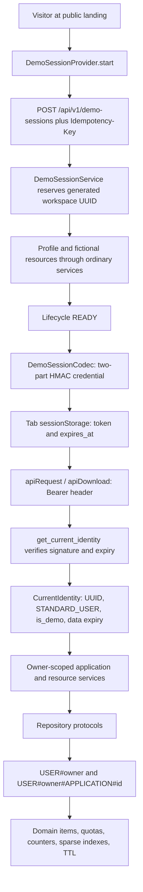
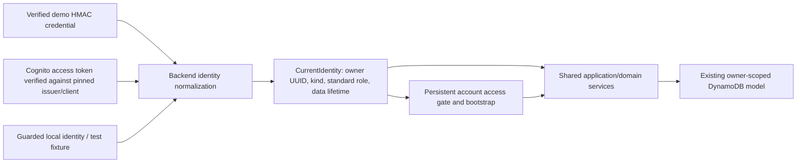

# Production account readiness — Phase 1

Date: 2026-10-05. Status: architecture proposal for review, not an accepted implementation ADR.

**Current Phase 3C update (2026-10-06):** staging and production now each
synthesize exactly one DynamoDB table with exact local/cloud schema parity,
TTL/on-demand/default encryption, stable identity and deliberate replaceable
staging/protected retained production. No table is deployed. Phase 3B's proven
Python 3.14/x86_64 ZIP and all backend runtime inputs remain unchanged. Phase 3D
is next, not started. See [ADR 0010](adr/0010-dynamodb-cloud-lifecycle.md) and
[section 42](#42-phase-3c-implementation-and-handoff). Production PITR historical
privacy/restore policy remains Phase 6 work; live-table erasure does not prove
erasure of historical copies. Earlier phase updates/results are completion snapshots.

**Phase 3A implementation update (2026-10-06):** the standalone TypeScript CDK
foundation now exists. Explicit staging/production configuration composes one
shared empty stack with distinct identity, namespace, and tags in `us-east-1`.
Accounts are unbound by default with optional environment-specific context.
Local synthesis is credential-isolated and tested with network blocking. No AWS
application resources or deployment exist. See [infra guide](../infra/README.md),
[ADR 0008](adr/0008-aws-cdk-environment-foundation.md), and section 40. Phase 3B
packaging is next; the bundled CDK dependency advisory remains an open follow-up.

**Phase 2C implementation update (2026-10-05):** the durable safety foundation is
implemented and validated. Strong application references, verified local backfill,
atomic ACTIVE write guards, DELETING/DELETED lifecycle, bounded resumable erasure,
and record/public-byte/work-limited strong JSON export are current local behavior.
See [ADR 0007](adr/0007-durable-workspace-manifest-and-erasure.md) and section 39.
The historical audit below remains historical. Phase 3A's current foundation is
described above; public authentication/deletion UX, provider finalization,
backup/privacy guarantees, and AWS deployment are still later work.
Repository baseline: `533cee182dc1a20ef7edb45db5d2c0ee21635dfd`.

**Phase 2A implementation update (2026-10-05):** the historical findings and
proposals below describe the Phase 1 baseline. Durable local principal/data-lifetime
separation, empty atomic bootstrap, and central durable readiness are now implemented;
see [ADR 0005](adr/0005-durable-local-workspace-bootstrap.md) and section 37.
No Cognito or AWS deployment is implemented.

**Phase 2B implementation update (2026-10-05):** general frontend workspace
sessions, the preserved demo adapter, and a development-only durable local
adapter are now implemented. Bootstrap precedes protected rendering; generation
fences, fresh caches, durable preference handling, and truthful lifetime UI are
validated. See [ADR 0006](adr/0006-frontend-workspace-session-boundary.md) and
section 38. This is not production authentication or personal-account readiness.
The accepted follow-on scope/order supersedes the earlier grouped Phase 2 proposal:
Phase 2B frontend sessions (completed); Phase 2C account deletion state, strong application
manifest, write guards, and expanded export safety; Phase 3 CDK synth only;
Phase 4 AWS staging demo; Phase 5 Cognito accounts in staging; Phase 6 hardening;
Phase 7 production deployment. Direct verified Cognito sub ownership remains
approved for the future verifier.

This audit covers the implemented local React/Vite → FastAPI → DynamoDB Local
system. AWS, Cognito integration, and CDK deployment remain future work. Phase 1
creates this document only; it does not change authentication, persistence, UI,
infrastructure, or existing product policy. File references below are relative
to the repository root. Proposed module names and contracts are explicitly future work.

## 1. Executive finding

**HireFlux is structurally ready to evolve, but is not ready to accept persistent
personal accounts today.** Its backend authentication seam is real: routes take
`CurrentIdentity`, services derive ownership from its `user_id`, and adapters use
owner-qualified keys. Persistent data is already representable by omitting TTL.
This does not require a database replacement, new general-purpose indexes,
microservices, or a separate implementation of the candidate workflow.

The smallest defensible evolution is:

- Preserve signed, fictional, disposable demos and their separate provisioning service.
- Accept verified Cognito **access tokens** alongside demo credentials at one backend boundary.
- Use the verified Cognito `sub` directly as owner ID within one pinned pool per environment.
- Separate credential expiration from workspace-data expiration explicitly.
- Bootstrap an empty durable workspace idempotently from authenticated requests.
- Replace frontend demo-only orchestration with a general workspace session boundary,
  retaining the demo adapter and clearing all identity-scoped state on replacement.
- Start with Cognito managed login, authorization code with PKCE, and no BFF.
- Keep FastAPI responsible for verification on shared demo/account API routes.
- Add account lifecycle and erasure access paths before public personal-data release.

The principal blockers are exclusive auth modes, no Cognito verifier/configuration,
ambiguous lifetime semantics, stale profile authority, frontend credential/session
coupling, returning-user preference handling, and missing persistent account
disable/delete/recovery operational contracts. Domain ownership and status policy
are assets to preserve, not redesign.

### Evidence and scope

Reviewed `AGENTS.md`, `ARCHITECTURE.md`, `README.md`, `.env.example`,
`docs/roadmap.md`, `docs/deployment-environments.md`,
`docs/dynamodb-access-patterns.md`, `docs/domain-model.md`, `docs/data-export.md`,
`docs/status-transitions.md`, and all four current ADRs. Inspected backend auth,
dependencies, composition/configuration, domain models, service/port boundaries,
routes/schemas, serializers, quota/counter/projection writes, demo cleanup,
cursors, and export behavior; frontend auth/storage, API/download helpers,
router/layout, settings, landing, forms, query hooks, and test fixtures.
Repository-wide searches covered the identity/lifetime/session/role/export terms
in the request and additional logging, browser-storage, and projection coupling.

Existing tests were inspected for owner isolation, foreign-resource 404s, request
validation, optimistic conflicts, quotas, cursors, seed failures, settings,
exports, configuration guards, route protection, cache clearing, and expiry.
The validation record at the end distinguishes tests run from code inspection.
This is a readiness assessment, not proof of a deployed AWS system or a complete
penetration test.

## 2. Current identity and data flow



`application/demo_sessions.py` reserves `WORKSPACE` plus an optional hashed
idempotency record, creates 30 fictional applications and related resources,
then issues a token only after `READY`. Failures get best-effort cleanup and a
short-lived `FAILED` marker. The HMAC payload in `auth/demo.py` contains `sub`,
`iat`, `exp`, `kind=demo_session`, and version; it is **not a three-part JWT**.
`auth/demo.identity_from_claims` normalizes it to `CurrentIdentity` with a
synthetic email. `api/dependencies.py` verifies before services see an owner.

The owner UUID doubles as the demo workspace ID. No separate tenant/membership
model exists. `auth/local.py` supplies a fixed, non-demo identity with no expiry;
this already exercises many durable backend semantics in tests.

## 3. Demo-coupling inventory

Classification applies to the current implementation, not just its naming.

- **Already identity-agnostic:** `application/services.py`, `resource_services.py`,
  `insights.py`, `pipeline.py`, and `opportunity_workspace.py` consume normalized
  identity or owner strings. `application/ports.py` and `resource_ports.py` expose
  no boto3 keys. Application/child primary keys, all current GSI partitions, and
  `CursorCodec` scopes are owner-derived. HTTP writes exclude ownership fields.
- **Already identity-agnostic with a bounded-scale condition:** application lists,
  duplicate advice, dashboard/analytics, notes/interviews and CSV export. They
  remain viable only while the configured lifetime/child limits bound fan-out.
- **Thin adaptation required:** `domain/models.CurrentIdentity` has mandatory
  name/email and optional `expires_at`, but no explicit provider/kind invariant.
  Keep owner-neutral identity; distinguish profile attributes and token lifetime.
  `UserService` and `DynamoUserRepository` need an explicit persistent profile
  projection contract; `WorkspaceResourceService.get_settings` can be reused.
- **Production-account blocker:** `config.AuthMode`, `api/dependencies.py`, and
  `api/routes/demo_sessions.py` select exactly one mode. `COGNITO` exists but
  always returns authentication-unavailable; it does not support coexistence.
- **Production-account blocker:** `frontend/src/main.tsx`,
  `auth/DemoSessionProvider.tsx`, `demoSessionContext.ts`, `DemoSessionGuard.tsx`,
  `sessionStore.ts`, `api/client.ts`, and `app/router.tsx` assume authenticated
  access means a demo. Storage restoration and API 401 handling are demo-specific.
- **Thin adaptation required:** `components/AppLayout.tsx`, `pages/SettingsPage.tsx`,
  and `pages/LandingPage.tsx` select identity wording/actions from demo context;
  query keys throughout `features/*/queries.ts` omit owner identity.
- **Thin adaptation required:** `auth/timeZonePreference.ts` and
  `features/resources/queries.useAutoDetectTimeZone` treat a tab marker as evidence
  of a manual preference. Returning accounts need server-persisted initialization
  semantics. Search-tour state and Settings preview state need centralized cleanup.
- **Demo-specific by design:** codec, demo-session endpoint, fictional seed,
  lifecycle/idempotency records, failed-seed cleanup, countdown, demo reset/exit,
  demo trust copy, and account-control simulations. Keep these separate adapters
  and surfaces; do not run them when provisioning real users.
- **Demo-specific policy by design:** full JSON export rejects `identity.is_demo`;
  CSV remains available. The future UI should consume one small capabilities
  object rather than infer this from the presence of a stored demo token.

## 4. Existing production-ready seams

`CurrentIdentity` is provider-neutral enough for ownership. No Cognito SDK or
demo token object enters ordinary application/domain methods. The domain and
resource dataclasses all allow `expires_at=None`; `mapping.serialize_item`
omits `None` values, and readers accept missing TTL. Quotas and counters append
TTL assignments only when a data expiration exists. Optimistic concurrency and
transactional activity/projection updates are independent of the provider.

`get_or_create_profile` and `create_settings` use conditional creation and
strongly consistent reads after a lost race. Empty counters are read as zero;
empty application/child queries are valid. No fixture seed is required for the
backend dashboard. Local auth is rejected outside local/test and under the two
AWS runtime markers checked in `config.py`. CORS is explicit; errors are safely
normalized; table operations remain operator commands.

These seams are implemented. Registration, JWKS handling, returning browser
sessions, account erasure, and deployed operations are not.

## 5. Production-account blockers and priority

1. **Before any account integration:** separate data lifetime from token `exp`;
   enforce valid identity kinds; establish additive auth capability configuration;
   define profile/verification authority and idempotent empty bootstrap.
2. **Before browser account flows:** general credential access and route guards;
   initialization state; session generation fencing; identity replacement cleanup;
   demo-specific capability presentation; persistent time-zone initialization.
3. **Before AWS staging:** real signature/claims verifier, safe JWKS cache,
   public-client OAuth configuration, callback handling, deployment isolation,
   packaging and observability. Missing Cognito configuration must fail startup.
4. **Before accepting public personal data:** tested logout/recovery/revocation
   semantics, account access-denial and recoverable erasure, export limits in
   bytes/time as well as records, abuse limits, backups/restore and privacy hygiene.

The current 2,048-character demo token bound cannot be blindly reused for Cognito
tokens carrying scopes/groups/revocation metadata. Use a bounded, tested JWT
limit appropriate to the selected configuration and infrastructure header limits.

## 6. Recommended target identity model



One identity owns one personal workspace. No tenant selection, team memberships,
identity broker, or browser-selected owner is needed. Define kinds such as demo,
persistent, and guarded local; local exercises durable semantics. Verification
outputs credential expiry separately. In a durable identity, domain expiry must
be absent, regardless of how frequently the browser refreshes its tokens.

Allow one fixed Cognito issuer/client configuration per deployment initially.
Do not accept arbitrary pools based on unverified `iss`. Existing owner key
strings stay intact. Reject a bootstrap that encounters a profile with a
conflicting recorded identity kind/provider binding instead of adopting or
stripping TTL from another workspace.

## 7. Cognito sub versus internal HireFlux ID

**Option A: verified `sub` → `owner_user_id`. Recommended initially.** It fits
the UUID conventions and documented intent in `docs/domain-model.md`, eliminates
a mapping lookup/transaction on first use, and preserves all key constructors.
Security depends on pinning issuer/client before trusting `sub`. Email and
username must never be ownership keys or account-linking evidence. AWS itself
recommends `sub` instead of mutable/case-varying usernames or emails.
[AWS identifier guidance](https://docs.aws.amazon.com/en_en/cognito/latest/developerguide/user-pool-case-sensitivity.html).

The cost is a genuine pool-lifecycle dependency. Recreating/deleting the pool or
deleting/recreating a user does not restore the old workspace association.
Protect durable pools against accidental replacement/removal; document recovery
and require explicitly verified operator-assisted re-linking/migration if this
ever happens. A DynamoDB restore alone does not restore Cognito accounts.
Retaining provenance (`identity_provider`, pinned issuer, schema version) in a
profile helps diagnose mismatches but is not an internal-ID mapping.

**Option B: `(issuer, sub)` → generated internal UUID → owner.** This isolates
physical owner keys from a provider change and lets approved replacement
identities attach to existing owners. It requires a unique linkage entity,
atomic account/link creation, race handling, deletion of links, and a carefully
authorized recovery/linking workflow. It does not by itself establish who owns
an orphaned account after a disaster. Lookup by verified email alone remains
unsafe. It could use primary-key lookups without a GSI, but adds work to every
account lifecycle operation.

Both options can be secure. At portfolio scale, with one pool per environment
and no current provider migration requirement, Option B buys hypothetical
portability at disproportionate complexity. Option A is the approval-level
ownership tradeoff. A later migration would need an explicit old-owner/new-owner
plan covering all partitions/projections, not just profile replacement.

## 8. Identity source of truth and profile audit

Current `DynamoUserRepository.get_or_create` stores name, email, role,
`created_at`, `last_login_at`, and optional TTL only on creation. On subsequent
calls it returns the old profile. Its sole synchronization is a string-based
`Demo Recruiter` → `Demo Workspace` rename when the incoming name matches.
`last_login_at` therefore currently means first profile initialization, not
latest login. `/me` reads can also create a profile; authentication itself does
not ensure one exists. Profiles have no account-state/verification fields or
profile-edit endpoint. Routes authorize using identity, not the stored role.

Recommended authorities:

- **User ID:** verified Cognito issuer/sub, mapped directly as in section 7;
  generated demo UUID or configured local UUID for their respective modes.
- **Email and verification:** Cognito. Store an optional display/export projection
  with synchronization time; it is not proof for linking accounts or sending
  future email. Verification is checked from a trusted provider response.
- **Display name:** Cognito `name` initially, projected for display/export. A
  missing name uses a neutral display fallback without changing ownership.
  Future editing calls the provider and refreshes the projection; do not turn
  the existing local preview into a second authority.
- **Role:** server policy gives all initial identities `STANDARD_USER`.
  Stored role is informational; ignore arbitrary group/custom role values for
  privilege. Reserve `ADMIN` without implementing an administrative access path.
- **Authentication account state:** Cognito controls confirmation, disablement,
  credentials and recovery. Offline JWT validation has bounded stale acceptance.
- **HireFlux account state:** a durable server-owned account record controls
  workspace bootstrap version and `ACTIVE`/`DELETING`/`DELETED` denial. It cannot
  reactivate a Cognito-disabled user or authorize an invalid token.

Cognito access tokens ordinarily provide identity/scopes, not the email/name
fields this `CurrentIdentity` currently requires. Do not invent those claims or
accept a browser's ID-token payload as enrichment. Separate the verified
principal from optional profile attributes. At persistent bootstrap and renewed
session hydration, the backend fetches configured Cognito `userInfo` with the
verified access token and requested `openid email profile` scopes, checks its
`sub` against the principal, validates types, and requires verified email.
`email_verified` can be returned as a string; normalize strictly, never by
truthiness. Provider rejection denies hydration; provider outage returns safe
retryable failure. Do not create a durable account from unverified metadata.
[AWS userInfo contract](https://docs.aws.amazon.com/cognito/latest/developerguide/userinfo-endpoint.html).

Email/name changes update only their projections after a successful trusted
refresh; they never rename partitions. Configure verification-before-email-
update so the original address remains active pending verification.
[AWS attribute update settings](https://docs.aws.amazon.com/cognito-user-identity-pools/latest/APIReference/API_UserAttributeUpdateSettingsType.html).
Admin confirmation must not implicitly bypass the verified-email gate. The
backend's session-validation snapshot may be reused only until that access
token expires; reject expired or missing snapshots for workspace access and
hydrate again. Cognito remains the authority; this short-lived snapshot is not
an indefinitely trusted DynamoDB `email_verified` flag.

Replace misleading login timestamps with explicit `last_seen_at`/attribute-sync
semantics, or update `last_login_at` only when a real authentication event can
be established. Avoid per-request profile writes. Preserve the legacy demo
rename narrowly for demo identity and make concurrent synchronization conditional
so a delayed refresh cannot overwrite newer metadata.

## 9. Backend authentication boundary

Keep credential parsing and authentication selection in `auth/` composed by
`app_factory.py` and invoked by `api/dependencies.py`. A small typed verifier
interface is justified for demo, Cognito, and deterministic test fixtures; it
needs only verify/normalize behavior, not an enterprise provider framework.
Provider-specific claim parsing, cryptography and network calls do not enter
application/domain services. Profile enrichment/account access is a separate
service using a provider port and repository protocol.

Retain `AUTH_MODE=local` as a strictly guarded developer convenience. Evolve
deployed configuration additively to specify demo availability independently
from persistent verifier availability. Preserve legacy demo/local defaults;
do not silently reinterpret `AUTH_MODE=cognito` as permission to issue demos
with an unchecked default key. Validate every enabled capability's configuration.

Central bearer parsing rejects ambiguous/multiple credentials and bounds input.
The two-part legacy demo format and three-part JWT format can select an enabled
verifier; format selection is not authentication. Each verifier must fully
verify its own format. A failed JWT must never fall back to local identity or
demo verification. Unknown formats/issuers fail closed. Local ignores credentials
today; keep that behavior only behind its explicit local/test guard.

Preserve existing demo error codes. Add general required/expired/invalid auth
categories for persistent tokens; return the existing safe envelope, 401 with
`WWW-Authenticate`, and distinguish configuration/provider outages (503).
Authorization against foreign resources remains 404; account state denial is
separate from resource existence. No user-selectable provider/owner query fields.

## 10. Frontend auth and session boundary

Replace the top-level demo-only context with a `WorkspaceSessionProvider`
(proposed name) with a discriminated authenticated session and separate demo
operations. Prefer orthogonal lifecycle (`initializing`, `anonymous`, `ready`,
`switching`, `signing_out`, `error`) and identity kind, plus an expiry reason,
over duplicating every lifecycle state for each provider. During initialization
or switching, unmount/block workspace consumers. Preserve demo reset failure
recovery intentionally; it is distinct from account logout.

The provider owns asynchronous credential retrieval/refresh, session hydration,
safe redirect state, bootstrap readiness, logout, and identity replacement.
`api/client.ts` obtains the active credential from this boundary for JSON and
downloads; it no longer directly reads demo storage. OAuth exchange requests
must never accidentally receive the demo bearer token. API and UI session
events carry a generation identifier so an old request's 401 cannot log out a
new identity. Retry refresh once under a shared in-flight promise; do not replay
non-idempotent writes on uncertain network outcomes.

Use owner/kind-scoped query keys or a QueryClient per active session, plus a
session generation fence on mutation callbacks, downloads, auto-detection,
toasts and navigation. Query cancellation alone cannot stop a mutation already
accepted by the server. Existing hooks call `setQueryData` on mutation success;
clearing the cache without fencing those callbacks is not a sufficient proof
of isolation. `keepPreviousData` must never span identities. No persisted
personal-data query cache is required.

Current coupling and required behavior:

- **Routes/deep links:** `DemoSessionGuard` currently redirects to `/` with
  `from`; account restoration must finish before deciding anonymous. OAuth
  return paths must be validated same-origin workspace paths; reject `//`,
  external URLs, auth callbacks, and foreign application redirects. The current
  landing allowlist does not preserve all query-string-only deep links.
- **Expiry:** current provider schedules one demo deadline and the API clears
  only demo 401 categories. Durable token expiry triggers refresh/re-authentication,
  never data expiry. No refresh loop or repeated expired-credential requests.
- **Refresh:** demo restores validated `sessionStorage`. Persistent hydration
  re-establishes credentials/readiness, then loads profile/settings before workspace
  content. Invalid storage must become anonymous safely, including storage errors.
- **Cross-tab:** current custom session event is window-local, with no auth
  `BroadcastChannel` or cross-tab logout coordination. Keep demos tab-scoped.
  Durable logout/account switch broadcasts a credential-free event to clear other
  account tabs; do not broadcast tokens or workspace content.
- **Preferences:** clear manual-zone marker, both tour keys, account-preview key,
  query/mutation state, drawers, forms, download references and identity toasts
  centrally. Current tour cleanup is in layout reset/exit, not provider expiry.
  Theme and sidebar collapse may remain device preferences; apply saved account
  theme once available, without leaking profile/content.
- **Time zone:** `useAutoDetectTimeZone` can PATCH the browser zone even when the
  saved zone differs; the only manual marker is tab-scoped. Initialize once on
  new durable workspace using a validated hint, or persist an initialization
  flag. Returning visits must not silently replace the saved zone.
- **Unsaved forms:** `ApplicationForm` has `useBlocker` and `beforeunload`.
  Intentional sign-in/switch/logout should confirm discard before leaving;
  forced expiry/denial clears sensitive state even if a navigation blocker is
  active. No automatic upload or carryover of drafts to the new identity.
- **Anonymous landing:** remains available without hydration-dependent marketing
  content. Provide distinct Try demo, Create account, Sign in and Continue actions.
  Do not issue a new demo merely because account restoration failed.

## 11. Initial browser session architecture

**Recommendation: managed Cognito login using authorization code + S256 PKCE,
a public client with no client secret, and a SPA bearer session.** Managed login
and PKCE are complementary choices: the former owns credential/verification/
recovery screens; the latter secures the redirect code exchange. Validate OAuth
`state`, OIDC nonce when processing ID tokens, exact callback URI and code
transaction expiry; remove code/state from browser history promptly. Use a
maintained OAuth client with explicitly configured storage, not hand-written
protocol/cryptography. Cognito supports public-client PKCE code exchange.
[AWS token endpoint](https://docs.aws.amazon.com/cognito/latest/developerguide/token-endpoint.html).

For the initial model, keep access/ID tokens in memory, and the rotating refresh
token plus short-lived PKCE transaction in tab `sessionStorage` so refresh and
return visits in that tab work. Do not use persistent `localStorage` for account
credentials. On a new tab/closed-browser return, redirect to managed login;
its provider session may allow continuation, otherwise the user signs in again.
The workspace is durable even when browser credentials are gone. Never equate
remembered identity with a valid session. This is a deliberate UX/security
tradeoff requiring approval, not an assertion that sessionStorage prevents XSS.

Recommend five-minute access tokens and a bounded seven-day refresh lifetime
initially, rotation enabled, minimal bounded grace for retry races, and one
refresh at a time per tab. Re-check exact supported limits/tier at Phase 3/4;
these are proposed settings, not current configuration. Cognito rotation returns
replacement refresh tokens; clients must save the replacement and handle a lost
response without uncontrolled retries. Rotation must be supported by the chosen
client's actual refresh method.
[AWS refresh/rotation behavior](https://docs.aws.amazon.com/cognito/latest/developerguide/amazon-cognito-user-pools-using-the-refresh-token.html).

Realistic alternatives:

- **Custom signup/login UI using Cognito APIs:** still delegates passwords to
  Cognito but puts challenge, recovery, resend, enumeration and error-flow
  complexity in HireFlux. It does not fix JavaScript token exposure. Defer until
  there is a real product need for custom authentication screens.
- **HttpOnly-cookie/BFF session inside the existing FastAPI deployment:** protects
  refresh/access tokens from direct JavaScript reading and allows shared browser
  sessions, but adds server session storage, cookie-domain/SameSite decisions,
  CSRF checks, OAuth backend callbacks, session rotation, and expiry/cleanup.
  Cookies must be Secure/HttpOnly, narrowly scoped, and mutations require origin
  checks plus CSRF protection. XSS can still act through the victim's session.
  This need not be a new microservice, but is more work than current needs justify.
- **Memory-only refresh credential:** reduces at-rest exposure but loses tab
  refresh continuity and relies on reauthorization; viable if that UX is preferred.
- **Gateway JWT authorizer:** a verification layer, not a browser-session design;
  see section 12. It does not create recovery, refresh, or logout behavior.

Bearer API calls are not automatically authenticated by cookies, so traditional
API CSRF is reduced; OAuth login/session substitution still needs state/PKCE.
All JavaScript-readable tokens remain exposed to successful XSS. Preserve strict
script CSP, safe React text rendering, dependencies/lockfile checks, HTTPS and
no credentials in URLs/logs. Public OAuth clients using refresh tokens need a
replay-defense design such as rotation.
[OAuth security BCP](https://www.rfc-editor.org/rfc/rfc9700.html).

Logout clears/fences local data first, revokes the refresh session using the
provider, broadcasts logout, and redirects through managed `/logout` to clear
provider browser continuity. Provider failures leave the local session signed
out with safe retry guidance, not restored personal content.
[Cognito revocation](https://docs.aws.amazon.com/cognito/latest/developerguide/token-revocation.html),
[managed logout](https://docs.aws.amazon.com/cognito/latest/developerguide/logout-endpoint.html).

Initial credibility requires PKCE/state, server verification, explicit storage,
refresh rotation, reliable cleanup, bounded tokens and truthful logout. A BFF,
long-lived remember-me, custom auth screens, MFA/session-device dashboards,
federation and immediate per-token revocation are future hardening unless the
approved threat/UX requirements make them release gates.

## 12. JWT and claim-validation contract

Before assigning owner identity, the Cognito verifier must:

- Verify an RS256 signature with the configured pool's public key; reject `none`,
  HMAC substitution, unsupported algorithms, missing/invalid `kid`, and malformed JWTs.
- Pin `iss` exactly; require `token_use=access` and the configured `client_id`.
  An ID token is not accepted for API access. If resource-bound `aud` is enabled,
  validate that exact resource as well; do not substitute `aud` for `client_id`.
- Require a nonempty valid subject compatible with the UUID ownership contract,
  numeric non-boolean `exp`/`iat`, valid optional `nbf`, and sensible chronology.
  Reject expired tokens, excessive future issue times and malformed scope types.
- Require the agreed API scope when introduced; no group/custom claim may grant
  privileges without explicit server policy. Metadata cannot establish ownership.

AWS documents the access-token client/issuer/token-use distinction and signature
checks. These are validation requirements, not a license to decode and trust.
[AWS JWT validation](https://docs.aws.amazon.com/cognito/latest/developerguide/amazon-cognito-user-pools-using-tokens-verifying-a-jwt.html).

HireFlux-specific operational policy: allow at most 30 seconds configured clock
skew; include that in the advertised acceptance bound. Cache JWKS with bounded
freshness in warm processes; refresh once on unknown `kid`, single-flight and
rate-limit misses, retain known keys only under a documented freshness policy.
Use HTTPS to a derived allowlisted JWKS URL, timeouts and response-size bounds;
never follow token `jku`/`x5u`/arbitrary issuer URLs. Unknown keys and outages
without usable trusted keys fail closed. Inject clock/key provider for tests.

**Initial choice: FastAPI verifies both formats.** This preserves shared
`/api/v1/applications`, settings, interviews and export routes for demo and account
identities, local/test portability and the error envelope. An API Gateway HTTP
API route's native Cognito JWT authorizer would reject the demo's non-JWT
credential before FastAPI. Do not attach it to all shared routes or claim it
supports either credential. Edge throttling still applies without a JWT authorizer.

**Gateway-only** verification would require trusted integration context handling
and guaranteed absence of direct backend bypass; it also leaves local auth
behavior different. **Both** are useful if account-only route groups are later
justified, but duplicate key/claim configuration and may require separate paths
or a custom multi-format Lambda authorizer. Defer that complexity initially.
If a native JWT authorizer is added, require route scopes to distinguish access
tokens, align issuer/audience, and test resource-bound `aud` versus fallback
`client_id`. Gateway key caching and claims behavior differ from application
verification.
[AWS HTTP API authorizer contract](https://docs.aws.amazon.com/apigateway/latest/developerguide/http-api-jwt-authorizer.html).

Offline checks cannot establish immediate revocation/disablement/deletion.
For ordinary access accept only the proposed short token lifetime plus skew,
with provider-backed hydration no longer valid than its token and immediate
HireFlux tombstone denial. Sensitive account changes/erasure require fresh online
provider validation and recent authentication. If instant rejection of all
stolen tokens is required, add online status checks or server sessions; do not
pretend Gateway or signature verification supplies it.

## 13. Persistent account lifecycle

The initial flow is managed signup → email confirmation → code/PKCE login →
trusted attribute/verification hydration → empty HireFlux bootstrap → first
workspace visit. Returning sessions refresh/hydrate without seeding or replacing
settings. Logout removes session access, not workspace data. Recovery and
password reset belong to Cognito; HireFlux provides entry/return/error guidance
and session cleanup. Passwords/codes never enter HireFlux DynamoDB or logs.

Responsibility and edge cases:

- **Cognito:** account uniqueness, password policy, confirmation/resend/code
  expiry, authentication challenges, recovery, provider sessions/tokens, account
  disablement and identity deletion. Configure verified email as the initial
  confirmation/recovery channel; no HireFlux password endpoint or email worker.
  [AWS signup/confirmation](https://docs.aws.amazon.com/cognito/latest/developerguide/signing-up-users-in-your-app.html),
  [recovery policy](https://docs.aws.amazon.com/cognito/latest/developerguide/managing-users-passwords.html).
- **HireFlux:** callbacks/session UI, verified workspace admission, profile
  projection, settings, account access gate, data retention/export/erasure, safe
  error handling, and retryable bootstrap. The browser reports intent only.
- **Abandoned unverified signup:** no workspace is created. Do not scan/delete
  DynamoDB to clean a user who never reached HireFlux. A later pool-retention
  operator policy can address abandoned identity records if needed.
- **Duplicate signup/already-used email:** provide safe continuation to sign-in
  or recovery. Do not link a new subject to an existing workspace by email.
  Enable existence-error suppression where applicable but acknowledge signup
  uniqueness and alias behavior can still reveal existence; managed UI must be
  tested. Do not claim the setting prevents every enumeration path.
  [AWS existence-error behavior](https://docs.aws.amazon.com/cognito/latest/developerguide/cognito-user-pool-managing-errors.html).
- **Expired verification/recovery challenge:** return to resend/recovery with
  bounded retry guidance, never self-confirm through a browser flag.
- **Changed email:** Cognito verification-before-update, then refresh projection;
  failed confirmation preserves current ownership/settings and provider authority.
- **Disabled/deleted provider user:** subsequent hydration/refresh fails. Already
  issued offline-verifiable credentials have the bounded acceptance described
  above. Disablement is not an erasure request.

## 14. First-login provisioning

Backend dashboard needs valid identity and settings; the profile is consumed by
`/me`/layout and export. Quotas/status/funnel counters are not preconditions:
`DynamoApplicationRepository.create` creates them transactionally on first write,
and counter reads supply zeros when absent. No onboarding record, fictional
application, interview, note, notification, schedule, or attachment is required.

Choose **explicit request-driven, idempotent bootstrap with lazy counters**.
A proposed authenticated `POST /api/v1/me/bootstrap` coordinates trusted metadata,
account access state, conditional profile creation and conditional default
settings. It returns the resulting profile/settings/capabilities and a bootstrap
schema version. An ordinary workspace-access dependency rejects uninitialized
persistent accounts with a safe bootstrap-required response; bootstrap itself
does not require prior readiness. Authentication and bootstrap failures remain
distinct so Cognito success plus a DynamoDB outage can be retried without
creating another account.

Do not copy the demo `PROVISIONING`/seed-cleanup workflow. For these small durable
records, each conditional ensure operation can safely resume after partial
success. Mark an account `ACTIVE`/bootstrap version complete only after required
records exist. Creation must never overwrite existing settings or reactivate a
`DELETING`/`DELETED` account. Concurrent callers read the conditional winner and
continue; existing metadata synchronization uses its own version/observation
ordering. A READY marker is not evidence that a settings read can never fail:
if a required record is missing, repair only defaults under an active account
gate, then return the recovered result.

Profile/settings race handling already exists in their adapters; atomic account
state checks must be added to bootstrap completion and future persistent writes.
Use a small account-state transaction condition for mutating paths so deletion
cannot race a preflight-only state check. The provider response is fetched and
verified before database provisioning, not within a long DynamoDB transaction.
No Cognito trigger or event bus is necessary for initial provisioning.

For time zone, a validated initial hint is a preference, never identity proof.
Set it only when initializing a new settings record; returning accounts keep
their stored zone. UTC remains the fallback. Defer product onboarding state
until a real onboarding flow exists.

## 15. Demo and durable workspace coexistence

Both identities use the same applications, notes, interviews, dashboard,
analytics, settings, status transitions, concurrency and owner isolation.
Centralize a small server-reported capability contract alongside session
hydration: demo reset, workspace deadline, full-account export, and available
account management. Do not add an entitlement engine. Frontend capabilities
choose presentation; server endpoints still enforce identity/type/state.

Demo shows fictional/temporary copy, deadline, reset and exit; reset creates a
new owner, rather than deleting a permanent workspace. Persistent shows durable
workspace copy, sign out, account/recovery management and export; no reset-to-
fiction button or data-lifetime countdown. Delete account is a separately
authorized destructive flow, not a renamed demo exit. Notifications remain
unavailable until delivery exists. Quotas remain server-owned for both types;
initially the same bounded limits are acceptable if clearly disclosed.

## 16. Demo → account transition

**No automatic migration.** Demo data is explicitly fictional, uses historical
seed timestamps, synthetic profile details and TTL, and may have been edited
arbitrarily. Importing it would pollute a real search, retain demo TTL on
auxiliary records, and complicate ownership/erasure. Registration creates an
empty durable workspace under a different owner. This is an instruction of this
phase, not an unresolved approval question.

Sequence for a deliberate conversion action:

1. Confirm any unsaved-form discard before beginning the intentional redirect.
2. Enter switching state and advance generation; unmount personal workspace
   consumers and stop new queries/mutations.
3. Cancel queries, clear query and mutation state, and fence all late completion
   callbacks/401s/exports from the old generation.
4. Remove demo credential and demo-specific tour, zone marker, preview preferences
   and UI state. Preserve only device theme/sidebar if desired.
5. Authenticate/verify the persistent session, validate callback state, then run
   empty bootstrap and obtain its server identity/capabilities.
6. Activate a fresh scoped client/state and navigate to Home or a safe return
   route. Old demo application IDs do not become new-account resources.

The demo's server data expires normally; there is no cross-owner copy, TTL
removal, or aliasing. Cancellation/failure leaves anonymous retry guidance or an
explicit new demo option; do not silently revive a credential already cleared
for account conversion. Future selective import would require a separate
verified, transactional migration design and explicit user intent.

## 17. Complete implemented DynamoDB persistence audit

Owner scope comes from identity, not from provider-specific key encodings.
For all ordinary implemented entities below, demo TTL is the workspace epoch;
durable TTL is **omitted**. There is no independent TTL per GSI entry: indexes
project the underlying item and eventually reflect its removal/update.

- **USER_PROFILE:** `USER#owner / PROFILE`; conditional creation by
  `DynamoUserRepository`, strong read on race, legacy demo-name update. Owner
  partition; TTL optional through `profile_to_item`. No ordinary delete API.
- **WORKSPACE_SETTINGS:** `USER#owner / SETTINGS`; lazy conditional creation,
  versioned replacement; strong GetItem. TTL optional through settings mapping.
  No ordinary delete API.
- **WORKSPACE_QUOTA:** `USER#owner / WORKSPACE_QUOTA`; created/incremented by
  application transaction; optional TTL assignment; bounds lifetime creations.
  No decrement on application archive, no standalone client mutation/delete.
  The primary key supplies scope; this item need not repeat owner as an attribute.
- **APPLICATION:** `USER#owner#APPLICATION#id / METADATA`; versioned transactional
  writes; owner GetItem, GSI1 recent non-archived and GSI2 every-status lists;
  GSI3 only outstanding active follow-ups. Archive/restore keeps the item and
  GSI2 discoverability. TTL optional and preserved during edits/transitions.
- **ACTIVITY:** same application partition, `ACTIVITY#instant#id`; transactionally
  appended by services; bounded owner/parent prefix Query with signed cursor.
  TTL taken from normalized identity on new events, optional serializer. Ordinary
  behavior never deletes/edits history; account erasure is a separate service.
- **NOTE:** same partition, `NOTE#id`; parent authorization, conditional/versioned
  create/edit/delete plus activity and resource quota. Optional identity TTL on
  create, preserved on edit. Prefix query and bounded recent preview. Notes can
  be physically deleted ordinarily; that does not delete their activity record.
- **INTERVIEW:** same partition, `INTERVIEW#id`; transactional create/update/status/
  preparation/debrief writes; parent authorization. Optional identity TTL on
  create, preserved on replace. GSI1 `USER#owner#INTERVIEWS` includes history;
  GSI3 `USER#owner#SCHEDULE` includes scheduled interviews only. There is no
  separate owner-interview projection entity: index keys live on the interview.
  Completion/cancellation retains history; no ordinary physical-delete route.
- **RESOURCE_QUOTA:** same partition, `RESOURCE_QUOTA`; transaction updates
  activity/note/interview bounds. `resource_quota_update` conditionally assigns
  optional TTL. Some paths inherit application/child TTL, note deletion inherits
  activity TTL. Notes decrement their count on removal; interviews/activity retain
  lifetime bounds. No direct client access or ordinary deletion.
- **WORKSPACE_CONTEXT:** same partition, `WORKSPACE_CONTEXT`; earliest scheduled
  interview/preparation projection created/replaced/deleted in interview
  transactions; GSI1 `USER#owner#OPPORTUNITY_CONTEXT`; TTL comes from the proposed
  interview. Deleted when no scheduled interview remains. This is a separate
  physical item and must be covered by TTL and account erasure tests.
- **Status counters:** `USER#owner / COUNTER#STATUS#status`; atomic create/transition
  increments/decrements; strongly consistent base counter prefix Query. TTL
  inherited from application only if present. They are not separate GSI records.
- **Funnel counter:** `USER#owner / COUNTER#FUNNEL`; atomic historical milestone
  increments, strong owner query; optional application TTL. Historical counters
  are not reset when a current status changes.
- **Demo lifecycle:** `USER#workspace / WORKSPACE`, entity `DEMO_WORKSPACE`;
  conditional reservation and state transactions, strong lookup. Expiration is
  required; no durable use. Failed cleanup retains the marker briefly.
- **Demo idempotency:** `DEMO_IDEMPOTENCY#sha256(key) / SESSION`; separate non-owner
  primary partition containing a generated workspace reference, created with
  reservation and updated with lifecycle state. Required demo/failure TTL; queried
  by opaque operation key, not by a client-selected owner. It grants replay access
  to the same demo token: treat the raw key as sensitive until expiry. No durable
  account linkage, session record, or export record exists here.
- **Export metadata:** no stored job/artifact entity today; CSV/JSON are generated
  synchronously. Application/account responses omit physical storage keys.
- **Attachments, notifications/reminders, durable sessions and account linkage:**
  documented future concepts, not implemented persistence. Do not count roadmap
  item shapes as audited live resources.

Primary evidence: `infrastructure/dynamodb/mapping.py`, `resource_mapping.py`,
`repositories.py` (quota/status/funnel updates), `resource_quota.py`,
`resource_repositories.py` (`_opportunity_context_write`),
`demo_workspace_repository.py`, `table_schema.py`, and service constructors in
`application/services.py`/`resource_services.py`. The guarded local
`reconciliation.py` rebuilds projections/counters from canonical resources and
also supports missing TTL; it is not a production migration/erasure API.

No ordinary path inspected requires an expiry for every owner. The deliberate
exceptions are demo session/lifecycle models. **A fresh durable owner works
without TTL; reusing a demo owner does not safely convert it.** Update expressions
that omit TTL do not REMOVE a previously stored TTL. Replacements can preserve
it on canonical records, while new activity uses identity TTL. That is another
reason to forbid in-place demo conversion and verify parent/profile lifetime
consistency before introducing durable identities.

## 18. Lifetime invariants and persistence tests

- Demo identity has a verified future workspace deadline; every temporary
  domain, quota, counter, context, lifecycle and idempotency item receives its
  intended TTL. Token expiry denies access immediately, regardless of cleanup.
- Durable/local identity has no data expiration; every ordinary item written
  from it omits numeric `expires_at`, including helper updates and projections.
- JWT `exp`, refresh-token expiry, authentication failure, sign out, and browser
  closure never add TTL, archive, decrement counters, or delete durable resources.
- Child/projection lifetime matches canonical owner/application lifetime;
  transitions and reflection updates preserve it. Reject conflicting owner/kind
  admission; do not attempt to repair lifetime by clearing TTL opportunistically.
- Account erasure uses explicit, resumable owner-scoped deletion. Account access
  tombstones and deletion recovery metadata must not accidentally expire and
  allow workspace recreation. Future export/session artifacts may have their
  own cleanup deadlines, never shared with ordinary workspace domain data.

Phase 2 must inspect actual serialized items after create/edit/transition/
archive/restore/note delete/interview scheduling/preparation/status changes for
both kinds. A test merely asserting `identity.expires_at is None` is insufficient.
Include status/funnel counters, both quotas and context, not just METADATA.

## 19. Authorization and role findings

Inspected `api/routes/applications.py`, `workspace_resources.py`, `settings.py`,
`insights.py`, `pipeline.py`, `me.py`, their services/ports and adapter queries.
All current owner-sensitive routes obtain `IdentityDependency`; public exceptions
are health and demo creation. Route UUIDs identify resources, never owners.
`RequestModel` forbids extra body fields; domain services whitelist mutable
fields. `ApplicationService.get` and resource parent checks address the owner
partition; notes/interviews must first belong to an owned parent. Guessing a
foreign ID yields the same missing-resource behavior, without an admin bypass.
Dashboard/analytics/quotas and export all derive owner from identity. Cursor
signatures bind owner fingerprint, kind and query/parent scope; index partitions
are rebuilt from trusted identity. No request-path Scan was found.

No current cross-owner access gap was identified in the inspected paths.
This is evidence for retaining the design, not a guarantee about future account
endpoints. GSI results are eventually consistent; that is a correctness/erasure
enumeration concern, not permission to query another owner's partition.
Existing tests cover foreign/missing application, notes/interviews, forbidden
ownership fields, cursor scope/tamper and bounded exports.

`UserRole` defines STANDARD_USER/ADMIN, but no administrative service or role
gate grants an owner bypass. Initial accounts need ordinary candidate access
only. Assign STANDARD_USER in normalization. Do not build Cognito groups or a
HireFlux editable role field now. If administration later becomes required,
choose one authoritative role source (a narrowly mapped verified group or a
server-controlled authorization record), implement a separate guarded service,
and define change/revocation latency. The stored profile must remain a projection
and browser inputs must never grant role. This recommendation revises the
future Cognito-group assumption in `docs/domain-model.md`, not live policy.

## 20. Account erasure and export readiness

Distinguish operations precisely: sign out ends a session; disable blocks
authentication/account access; delete workspace data erases domain records;
delete account erases workspace and provider identity under a tracked lifecycle.
Ordinary application DELETE continues to archive. Account erasure is a new,
separately authorized exception to ordinary append-only history preservation.

### Erasure

Current demo cleanup is best effort, not a complete durable erasure mechanism.
Applications occupy many primary partitions. `Query PK=USER#owner` cannot find
those partitions; GSI2 can discover all statuses including archive, but is
eventually consistent. `demo_workspace_repository.cleanup` supplements GSI
enumeration with known created IDs, may leave failed batches, retains lifecycle,
and depends on TTL as fallback. Do not present it as Delete my account.

Recommend one small additive owner application manifest:
`USER#owner / APPLICATION_REF#id`, created atomically with every persistent
application and retained on archive. Strong owner-prefix Query then enumerates
application partitions without a Scan/new GSI. This resolves a real erasure
access-pattern gap, not hypothetical general search needs. Add it before real
persistent writes; demo support may carry demo TTL if the same transaction
builder is reused. Backfill only deliberately retained old durable/local test
workspaces; disposable demos need not be migrated into accounts.

At this scale choose a synchronous **bounded batch attempt with durable resume
state**, not a guarantee that one HTTP call erases up to all configured maxima.
An account can accumulate thousands of items across partitions. First validate
recent authentication online and freeze the account (`DELETING`). Persistent
mutations must transactionally check ACTIVE to prevent in-flight creation after
freeze. Deny bootstrap, normal reads and exports while deleting; keep a narrow
authenticated status/retry path.

Query manifest strongly, query each application partition, delete children,
metadata/context/quotas and then its manifest reference only after the partition
is confirmed empty. Handle unprocessed BatchWrite entries with bounded backoff;
store progress safely and return in-progress if the time/item budget runs out.
Delete owner settings/profile/counters/quota after application erasure; preserve
minimal deletion/tombstone state. Recheck residual manifest/owner records before
claiming workspace completion. Deleting canonical records removes GSI entries
eventually; indexes are not independent objects to delete.

Delete Cognito identity **last**, after workspace erasure is complete, so a
provider deletion failure can be retried while the subject still authenticates
only to deletion recovery. If provider identity disappears earlier/outside the
flow, use a separately authorized operator procedure with the stored deletion
state; never allow email-based self-reclaim. Duplicate delete requests see the
same progress; a failed attempt never reactivates or lazily reseeds the workspace.
A deleted-account tombstone rejects still-live old tokens until they cannot be
accepted; initial permanent minimal tombstone retention avoids unsafe bootstrap.

No queue/worker is required now. If browser-independent completion, measured
maximum duration or future attachments/reminders require it, add a job/worker
as a distinct later capability. Future erasure must remove private S3 objects,
export artifacts, notification records and schedules before deleting the final
account reference. Backup retention/restore must document how deletion
tombstones are reapplied; do not promise immediate erasure from historical backups.

### Export

`WorkspaceExportService.export` already rejects demos (403), queries only the
owner, collects profile/settings/all statuses/activities/notes/interviews, and
returns `export_version=1` plus counts. CSV is safe for both kinds, includes
archived applications, escapes CSV text and neutralizes formula prefixes. Routes
set `no-store`; there are no persistent export artifacts, tokens or password data
in either export. Durable profile projection becomes real PII.

Keep the synchronous endpoints at initial bounded scale, but do not equate
`max_sync_export_records=5000` with a byte/time limit: large descriptions/notes
can produce an oversized Lambda/API response, and child pages are collected
before the cumulative count is checked. Add incremental count/serialized-byte/
duration budgets and safe too-large guidance before public account release.
Neither export is a transactional point-in-time snapshot; application discovery
uses eventual GSI reads, then child reads occur over time. Describe it as a
best-effort current copy, or use the strong manifest for complete discovery and
explicit snapshot expectations. Do not claim it includes Cognito MFA/security
events or future attachments that are not represented.

Future larger jobs read bounded pages, write a private expiring S3 artifact and
authorize job/download access by owner, with short-lived links and cancellation
on account deletion. No such system is implemented in Phase 1. Export cannot
run concurrently with account erasure; do not retain artifacts after deleting
the source account. Ordinary resource export needs current auth; account deletion
and security changes additionally need recent authentication.

## 21. Focused threat findings

The transition raises the consequence of existing issues from disposable fiction
to a private job-search history. The following controls address concrete paths.

- **Token theft/replay:** demo token and future tab refresh token are readable by
  JavaScript; PKCE does not protect tokens after an XSS compromise. Strict hosted
  script CSP and text rendering reduce injection exposure; short access lifetime,
  refresh rotation and logout cleanup bound persistence. Never put credentials
  in URL query strings, telemetry or error details. Stolen tokens may still be
  used within the bounded acceptance window; immediate revocation is a distinct
  architecture requirement.
- **Forged credentials/auth bypass:** the current codec verifies HMAC and expiry;
  Cognito must verify signature and pinned claims. Current Cognito requests fail
  closed at dependency time, but there is no startup validation of pool/client.
  Add it, preserve local runtime guards, and reject verifier fallback.
- **Account enumeration/recovery:** managed authentication reduces HireFlux's
  challenge implementation surface; configure existence-error behavior and test
  actual signup/recovery response distinctions. Do not expose provider exceptions
  or implement email-based workspace linking.
- **Cross-identity browser leakage:** unscoped query keys, `keepPreviousData`,
  delayed mutation cache writes, old 401s, account preview storage and tour state
  require generation fencing and centralized cleanup. Reset currently cancels
  queries and hides content; start/exit/expiry mainly clear. Extend the invariant
  to all switch paths and writes, with explicit adversarial timing tests.
- **IDOR/cursor replay:** owner-qualified primary/GSI keys and signed scoped
  cursors are strong existing controls. Keep foreign children and parent reads
  at 404. New account/bootstrap/delete/export-job routes must use the same
  server-derived owner and their own capability/state checks.
- **Accidental persistent deletion:** populating identity TTL from token expiry,
  reuse of demo IDs, or auto-repair of stale TTL would destroy durable data.
  Encode kind/lifetime invariants and assert every serialized helper item.
- **PII leakage through responses/logs:** safe error handlers drop raw AWS errors,
  exception content and validation input values. Future gateway/access/ASGI logs
  need scrutiny: URL queries can contain company searches and cursors. Log route
  templates rather than full request URLs; never enable request/response bodies
  or Authorization logging for diagnosis.
- **Excessive payload/cost:** schemas bound individual prose/arrays and quotas
  bound growth; parsing still has no application-wide request byte limit in the
  inspected code. Define a body limit appropriate to actual forms and reject
  oversize requests early. Bounded record export alone does not bound memory,
  serialized bytes or Lambda execution time.
- **CORS/redirect/environment mistakes:** current allowlist is a good seam;
  deployed origin validation should additionally require exact HTTPS origins,
  no embedded credentials/wildcards. Separate pool/table/API/CSP/callback values
  across staging/production. CORS is not authentication, and copying `user_id`
  from browser state is never acceptable.
- **Erasure race:** preflight ACTIVE checks alone do not prevent a concurrently
  accepted write after freeze. Transactional account-state conditions, strong
  manifests and resumable batches are required for an erasure completion claim.
- **Infrastructure exposure:** API execution role must access only its own
  table/indexes and required secret configuration. No browser DynamoDB credentials,
  public data bucket, deployed local endpoint, Lambda public URL bypass, or
  broad Cognito admin role is needed for the proposed initial flow.

## 22. Privacy and PII hygiene

Applications contain employer/role/location, compensation context, private
description and job-search outcomes; notes, next-step prose, interview meeting
URLs, questions, preparation and reflections are private content. Email/name
become identity PII. Meeting links can contain reusable join secrets. Exports
contain that content and must be treated as personal downloads, not test artifacts.

`api/error_handlers.unexpected_exception_handler` currently logs only a generic
event, request ID and exception type without stack trace. Validation details
exclude raw inputs. Searches found no production browser tracking integration
or server content-logging framework; product Analytics is owner-specific domain
analysis, not third-party behavioral telemetry. Existing seed/test/browser
fixtures use synthetic identities and sample content. Preserve that boundary.

Do not capture real-account browser screenshots/traces in committed Playwright
snapshots, seed fixtures, CI artifacts or support messages. Staging uses synthetic
workspaces/test email accounts only. Developer tools and routine CloudWatch logs
must exclude tokens, email/name, form bodies, export contents, meeting URLs,
passwords/codes and provider responses. Prefer field/error categories and counts,
not rejected values. Device storage retains only permitted credentials and
non-sensitive preferences; do not add job-search drafts or query persistence
without a privacy design. No legal/compliance program is proposed here.

## 23. Observability and auditability

Request-ID middleware already validates a supplied ID against a safe 64-character
pattern and returns `X-Request-ID`. Unexpected errors use safe categories.
It does not currently provide a complete request latency/metric pipeline.

Before staging add structured events with request ID, route template, method,
status, duration, environment, identity kind, and safe auth/provisioning failure
category. A stable environment-specific pseudonymous owner identifier is useful
for correlated failures; hash/HMAC it deliberately, restrict access/retention,
and recognize that pseudonyms remain sensitive operational data. Do not use raw
owner IDs as high-cardinality metric dimensions. Prefer metrics for auth failures,
bootstrap failures, conditional conflicts, throttling, DynamoDB errors,
Lambda duration/error/concurrency, and export-too-large events. Separate normal
optimistic 409 conflicts from persistence 503 failures.

Application activity remains the owner's append-only workflow history; it is
not operational logging or an authentication audit trail. Record safe lifecycle
operation state for deletion and bootstrap recovery separately. Do not log
signup forms, full JWT claims, recovery codes, changed emails or note/reflection
content as security events. Provider audit sources, alarm routing, retention
and diagnostic access belong in the later infrastructure/release plan.

## 24. Abuse, quota and cost boundaries

**Before public staging:** protect public demo creation and API request volume
with HTTP API throttles, bounded Lambda concurrency/timeouts, table limits and
alerts; preserve demo idempotency and resource quotas. Use a restricted preview
origin/access policy when possible. Pool signup/verification/recovery limits and
safe retry handling must be tested; do not build a second HireFlux email system.
Demo creation seeds many transactional writes, so a public button has greater
cost than one request. Warm JWKS miss storms also need bounded refresh behavior.

**Before public production:** decide and disclose durable workspace lifetime
quotas, export frequency/size limits and support behavior when full. Defaults
currently permit 100 lifetime applications, 100 notes/application, 25 interviews
and 500 activity entries/application. Archive does not free application capacity;
there is no activity reset. Raising limits affects dashboard/list/export memory
and query cost, not just one validation check. Validate worst-case configured
bounds, ensure signup/recovery throttling monitoring, deletion retry budgets,
finite logs and spend alarms. Budget alarms are alerts, not spending caps.

**Safely deferred:** WAF/CAPTCHA unless observed abuse warrants it; paid tiers,
entitlements, scalable asynchronous export workers, attachment storage quotas,
reminder/email delivery limits until those features exist. Before introducing
attachments or reminders, add size/ownership/content/cleanup and per-user send
controls in that feature's release gate. Do not add Redis/queues for hypothetical
cost problems.

## 25. Configuration and secrets

Current `Settings` has local/demo/cognito modes but no pool/client/issuer/OAuth
configuration. It validates signing-key length/local prefix, configured local
endpoint, CORS, docs exposure and selected runtime guards. `app_factory.py`
constructs the demo codec/service even when auth mode is not demo; current demo
key validation runs only in DEMO mode. A combined mode must validate the demo
key whenever demo creation or verification is enabled.

Configuration classes for future work:

- **Secret, backend only:** demo signing key, cursor signing key, any future
  server session encryption/HMAC secret, and any confidential-client secret if
  a BFF is chosen. No client secret is needed for the recommended SPA client.
  Passwords, tokens, recovery codes and real AWS credentials are secrets/data,
  not checked-in environment configuration.
- **Public browser environment configuration:** API/site origin, Cognito region,
  pool ID, public app-client ID, managed-login domain, callback/logout URLs and
  scopes. Client ID identifies a public client; it is not a password. Each
  `VITE_*` value is compiled into downloadable assets. Use visibly fake examples.
- **Server-only non-secret configuration:** pinned issuer/client/region and JWKS
  derivation, table name, enabled verifier capabilities, token skew/size policy,
  allowed API scopes, quotas, CORS, logs and export/body limits. Some identifiers
  are also public, but the backend's independently configured trust settings are
  authoritative; it must never load them from browser payloads.

Preserve fail-closed startup. Invalid enabled Cognito config, missing deployed
secrets, local signing defaults or incompatible origins must prevent startup.
In deployed environments require HTTPS browser/API/provider URLs. Test
configuration isolation and reject local/test identity fixtures under AWS markers.
The current DynamoDB client omits endpoint and explicit credentials when no
local endpoint exists; deployed Settings should also explicitly reject supplied
local credential-shaped settings. Boto3's ambient credential resolution still
needs an IAM-role-only deployment environment; Lambda platform role credentials
are distinct from committed/user-provided keys.

`.env.example` remains unchanged in Phase 1, because none of these values is live.
Future additions must not make Cognito a hidden dependency of the local demo.
Update `frontend/src/securityHeaders.ts`, `customHttp.template.yml` and hosted
header rendering together: OAuth token/userInfo/revocation fetches introduce
provider connect origins beyond the existing exact API allowlist. Allow only
the exact required HTTPS origins, not a broad AWS wildcard or unsafe scripts.
Callback routes also require SPA rewriting without hiding missing static assets.

## 26. Local development strategy

Continue ordinary development with demo auth and the existing fixed local
identity. The fixed identity is already non-expiring and non-demo; extend its
bootstrap/profile semantics rather than requiring live AWS. Backend tests can
inject a verifier/principal and provider-attribute fixture through app composition
or dependency overrides, with fixtures impossible to enable in deployed config.
Frontend tests use deterministic anonymous/demo/durable session adapters and
MSW HTTP contracts. These fixtures must exercise real services/serializers and
must never be selected by a browser header in a deployed API.

Locally verify JWT cryptography against generated test RSA keys and simulated
JWKS/provider responses, including rotation and failures. Moto remains the
DynamoDB integration boundary; Docker is optional for tests. No live Cognito
signup, SES, AWS admin credentials or table creation at API startup is needed.

Staging alone validates actual managed-login callback/cookie behavior, signup
email and confirmation/recovery delivery, real OAuth refresh/rotation/revocation,
disabled/deleted accounts against provider endpoints, HTTP API/Lambda payloads,
CORS/security headers, real GSI lag/TTL cleanup, IAM and deployed resource limits.
Local mocks can validate decisions and failure handling, not those services'
real operational behavior.

## 27. Implementation test matrix

The current suites supply a baseline, not Cognito/account coverage. Extend
existing tests instead of replacing them with provider-dependent smoke tests.

- **Unit — identity:** signature/RS256 allowlist, wrong issuer/client/token_use,
  ID-token rejection, scopes, malformed subject/timestamps/claims, future time,
  skew boundaries, unknown/rotated keys, bounded JWKS outage/misses, no verifier
  fallback; normalized kind/lifetime and strict userInfo boolean/subject handling.
  Extend `backend/tests/unit/test_config.py` and add verifier tests beside
  `test_demo_session_codec.py`; keep generated keys and clocks deterministic.
- **Unit — account:** bootstrap decisions, active/deleting/deleted admission,
  trusted profile projection synchronization and last-seen semantics; no seed
  or token-expiry-to-data mapping. Existing domain matrix, milestone/time-zone
  and export-formula tests remain unchanged.
- **Moto/API — persistence:** two durable owners and two demos; missing/foreign
  equivalence across all routes; body ownership rejection; cursor owner/parent/
  filter scope; complete serialized TTL/no-TTL inventory; transaction rollback
  when quotas, account-state condition or projection fails; bootstrap races,
  partial profile/settings recovery, empty dashboard/analytics and limits.
  Extend `test_api_flow.py`, `test_workspace_resources.py`, `test_demo_sessions.py`
  and `test_insights.py`. Add strong manifest enumeration and erasure/retry tests
  when those contracts are implemented.
- **Frontend — session:** initializing/anonymous/demo/durable/error/expired;
  refresh and storage failures; deep links/callback state; logout; failed reset;
  generation fencing for delayed query, mutation, download and old 401; cache/
  tour/preview/manual-zone clearing; device preference preservation; no prior
  identity placeholder; returning settings not overwritten; unsaved discard and
  forced expiry focus/routing. Extend `DemoSessionFlow.test.tsx`, `client.test.ts`,
  `AppLayout.test.tsx` and `WorkspaceFeatures.test.tsx` with durable fixtures.
- **E2E local:** real demo remains intact; deterministic durable identity exercises
  empty-first-visit → create → interview/note → refresh → logout → return. Include
  account A → B and demo → account with deferred responses and multi-tab cleanup.
  Current Playwright `e2e/fixtures.ts` injects a demo-shaped stored session and
  mocks API calls, so it does not validate real authentication/DynamoDB wiring.
  Add a distinct full local API path and retain useful mocked layout coverage.
- **AWS staging:** actual signup/resend/expired code/verification/duplicate email,
  login/recovery failure/reset, token/refresh rotation and lost response,
  logout/provider continuity, disabled/deleted user and stale-token bound,
  bootstrap outage recovery, environment issuer/table separation, direct route
  refresh/missing assets/CSP/CORS, Lambda packaging/JWKS cold start and quotas.
  If a Gateway authorizer is later selected, test both its rejection cases and
  intentional demo route compatibility; otherwise verify FastAPI shared-route auth.

All account behavior changes must run the full affected checks from `AGENTS.md`.
Do not claim a mock proves delivery, managed browser cookies, IAM, JWT-authorizer
payload mapping, DynamoDB eventual deletion, or maximum deployed response size.

## 28. First-login failure and recovery matrix

Each case states durable recovery; no manual database repair is the normal path.

- **Cognito account exists, profile absent:** verified hydration plus bootstrap
  conditionally creates an empty profile/settings/account record; no seed.
- **Profile exists, settings absent:** active bootstrap creates defaults only,
  preserves profile creation time, and returns authoritative resulting settings.
- **Settings exist, profile absent:** ensure missing profile from trusted metadata;
  preserve user's settings and validate lifetime/provider compatibility.
- **Duplicate/retried bootstrap:** conditional ensures return the same owner and
  winner records; do not update settings/version as a side effect of retry.
- **Two tabs bootstrap concurrently:** unique owner partition and conditional
  creation select one record; losing requests strongly read/retry completion.
  Conflicting preference hints cannot overwrite the winner.
- **Provider login succeeds, bootstrap database call fails:** browser holds an
  authenticated but not workspace-ready state; show safe retry and request ID.
  Retry same owner; do not sign up again or create a demo fallback.
- **Network fails after server success:** repeating bootstrap reads completed
  state; never repeat seed or replace resource ownership.
- **Account marker incomplete after profile/settings success:** validate existing
  records and conditionally finish schema version/ACTIVE transition. No cleanup
  deleting a durable partial account.
- **Account marked ready, required record missing:** under active state, repair
  the missing default/metadata projection; surface unavailable errors honestly.
  Do not guess user's previously customized missing settings.
- **Browser thinks onboarding incomplete but workspace exists:** server bootstrap
  readiness wins; frontend dismissal/tour state does not cause reprovisioning.
- **Metadata refresh delayed/out of order:** newer server observation/version wins;
  stale tab cannot roll name/email/verification projection backward.
- **Provider unavailable/attributes invalid:** deny hydration with retryable
  provider failure or safe invalid-auth category; no fabricated verified profile.
  Ordinary cached validation is usable only within its previously verified token
  lifetime, never renewed by an outage.
- **Deleting/deleted account receives bootstrap:** deny ordinary recreation and
  expose only the authorized deletion-status/retry path. Missing profile is not
  proof of a new user if a tombstone exists.

For the proposed server attribute-validation snapshot, use a bounded in-memory
cache keyed by token digest and principal, never raw tokens in logs/persistence.
Expire it no later than the access token; a Lambda cold start/cache miss performs
the online check again. This makes a cached verified-email result usable without
adding token-expiry TTL to durable domain records or trusting client metadata.

## 29. AWS target architecture and orphan behavior

Retain Amplify static hosting → API Gateway HTTP API → one Lambda with
FastAPI/Mangum → one on-demand DynamoDB table per environment, plus Cognito User
Pool and CloudWatch. The repository includes Mangum as a dependency but inspected
`main.py` currently exports the ASGI `app`, not a `Mangum` Lambda handler. Packaging/
handler wiring is future work, not an already-deployed integration. Keep Python
3.13/3.14 support and choose the deployed runtime after verifying its current AWS
support; Python 3.14 is listed by AWS at this audit date.
[Lambda runtime reference](https://docs.aws.amazon.com/lambda/latest/dg/lambda-runtimes.html).

No VPC/private-subnet compute/NAT is required for the API to use DynamoDB/Cognito.
No EC2/ECS/RDS/Redis/OpenSearch, worker, queue, or event bus is justified by initial
identity/provisioning. Amplify hosting does not require using Amplify to provision
an independent second authentication backend. API execution uses its role;
browser authentication requires no Cognito Identity Pool or direct AWS credentials.

Realistic divergences and initial response:

- **Provider deleted externally, workspace remains:** inaccessible orphan after
  the bounded token window; durable data does not acquire TTL. Use an explicit
  audited operator cleanup/recovery process tied to proven subject provenance.
  Never reconnect by matching email. Avoid routine console deletion by access
  controls and documented procedures.
- **Provider disabled:** auth renewal/hydration rejects; keep workspace for possible
  re-enable. Operators needing immediate HireFlux denial also set its account
  access gate. No content deletion is implied.
- **Profile without provider:** fixed local/test is legitimate; otherwise preserve
  orphan state for operator resolution. Do not create provider users from a
  stale DynamoDB email automatically.
- **Partial deletion:** DELETING state plus retained progress permits bounded
  retries; provider deletion occurs after data completion. Failure is observable
  without logging personal content.
- **Profile/email/name mismatch:** synchronize from trusted provider observation;
  account-role/access decisions do not consult old display projections.
- **Pool disaster/recreation:** retained table does not establish replacement
  identity ownership; controlled migration is required. Protect and separately
  document recovery of pool and table. Direct sub mapping makes this dependency
  explicit rather than claiming portable identities.

Do not add an orphan-cleanup Scan to ordinary request paths or require event-driven
identity synchronization. Later operational reconciliation can be a separate
guarded access path if measured need warrants it.

## 30. CDK readiness and environment boundaries

TypeScript CDK remains appropriate: the frontend already uses TypeScript, target
AWS resources are small, and deterministic synth/assertion tests can precede
deployment. No CDK source/stack is added now.

Start with a reusable construct set and **one environment stack for each staging
and production**. Constructs group user pool/public client/domain, DynamoDB,
API/Lambda, secrets references and monitoring; hosting integration/environment
outputs may be configuration or a small construct. Do not create one stack per
resource. Split retained state from replaceable execution later only if a clear
deployment lifecycle makes it safer; protect stateful resources from accidental
replacement regardless of stack count.

Each deployed environment has distinct pool/client/domain, table, API/Lambda,
demo/cursor secret values, log groups, alarms, callback/logout allowlists and
hosting environment. Local is a separate Compose/runtime configuration, not a
CDK-managed AWS pool. Separate AWS accounts are desirable when available, but
unique resource identities and scoped roles are still required. No mutable data
or signing secrets are shared between staging and production.

**Configuration:** environment name/region, origins, quotas, token lifetimes,
retention/concurrency budgets. **Outputs:** API origin, region, pool/public-client
ID, managed-login domain and frontend public settings. **Secrets:** signing keys
through secret references/secure deployment configuration; no secret-valued
CloudFormation output or Vite setting. **Shared constructs:** implementation,
not shared tables/pools/secrets.

Ordering: settle stable frontend callback/logout origins → create retained
pool/client/table and secret references → package/deploy API with exact trust/
table/origin settings → publish frontend with matching public outputs and
rendered CSP/rewrite policy → staging smoke tests → protected production promotion.
If hosting origin is not known until creation, provision hosting identity first
and configure the pool/client before releasing auth UI. No table initialization
from app startup and no local reset script used as a deployment migration.

CDK assertions should check separate names/outputs, no client secret for SPA,
verification and rotation configuration, least-privilege IAM, TTL attribute,
deletion protection/removal/backup policies, explicit origins, docs exposure,
concurrency/throttles, finite log retention and no accidental NAT/VPC resources.
Review Cognito immutable settings/replacement diffs before any deploy.

## 31. Schema evolution and backwards compatibility

**Persistence alone requires no table/index migration:** optional TTL and current
owner keys already support durable local identities. Cognito access integration
needs additive application contracts, not table replacement.

Recommended additive evolution for complete account readiness:

- profile provenance/schema version and explicit synchronization/last-seen fields,
  with legacy name/email/role/time defaults readable;
- an owner account-state/bootstrap record with no domain TTL;
- a small `APPLICATION_REF#id` manifest entity for strong erasure discovery,
  atomically written with future persistent applications;
- optional persistent settings initialization metadata if needed to fix returning
  time-zone behavior; no extra onboarding system by default.

No account linkage record is required under direct sub mapping. No new GSI is
required for these owner-prefix access patterns. New attribute readers must
handle existing demo/local items; only the verified demo adapter may classify
legacy demo identities. Do not infer authority solely from a browser-stored
session, profile name/email, or missing TTL. Existing signed demo token format
can remain valid for its issued lifetime. If reconfigured signing keys rotate,
declare demo-session invalidation behavior explicitly.

Backwards gates: one-click demo without signup; complete fictional seed;
signature/tamper/expiry handling; TTL on all temporary items; reset to a new
isolated owner with recoverable failure; exit/cache clearing; protected routes;
foreign-resource 404; full-export demo rejection and sample CSV; unchanged
status matrix, archive/restore, milestones and server-owned metrics. Do not reset
the local table merely to add attributes/entities. Manifest backfill for retained
durable fixtures must be explicit and owner-scoped, with current schema version
checked before erasure claims.

## 32. Product surface implications

`SettingsPage.tsx` currently contains three distinct classes of control:

- **Real:** API-backed time zone, follow-up days, application view, dashboard range
  and theme; CSV download; profile read; JSON-export API is real for non-demo
  identities even though the normal browser session is demo-only.
- **Demo simulations:** profile-name override is component-local; notification
  toggles use `hireflux-account-preview.v1` in sessionStorage with a token-derived
  marker; recovery/MFA/session controls only manipulate preview state. They do
  not create recovery challenges, MFA enrollment, revoke provider tokens or
  deliver notifications. They are correctly labeled as previews today.
- **Future-facing copy/placeholders:** persistent login, connected providers,
  account conversion, permanent deletion, real notification delivery, security
  events and session management. None should become operational merely because
  the guard accepts a durable identity.

Persistent settings must remove/hide demo simulation controls or replace them
with real provider-backed actions. Display trusted projected name/email and
truthful verification state; recovery/verification can link to the selected
managed flow. Add Create account/Sign in entry and auth callback/error routes,
sign out, verified bootstrap feedback, durable empty workspace guidance, and
deletion/export status. Defer detailed signup-page design when managed login is
selected. No production MFA/device list is promised initially.

Settings' future “What would carry over?” copy currently suggests possible
account conversion; replace that future promise with an explicit empty-account
initial flow when implementing coexistence. `AppLayout` must not label all
sessions temporary or show reset/expiry for accounts. Preserve focus management,
44-pixel controls, loading/error/retry/empty states and accessible unsaved forms.

## 33. Documentation impacts

No broad rewrite is needed in Phase 1. On implementation, update these exact
contracts and clearly separate current from planned behavior:

- `ARCHITECTURE.md`: combined verifier/credential flow, data versus token lifetime,
  bootstrap/account-state/manifest access, chosen browser storage and actual AWS
  resources only after deployment. Preserve modular-monolith target.
- `README.md`: keep frictionless demo; introduce real account availability only
  when ready; remove simulation implications from the durable path and explain
  no seed migration. Do not claim AWS deployed from a synth-only phase.
- `docs/roadmap.md`: persistent accounts are now an intentional milestone;
  use this bounded sequence and remove unneeded initial role-claim requirement.
  Existing `.github/workflows/quality.yml` already supplies tests/build/supply-
  chain gates; future AWS OIDC deployment automation is additional work.
- `docs/deployment-environments.md`: separate pools/callbacks/public settings,
  shared-route FastAPI verification, cookie/BFF deferral, CSP provider origins,
  retention/backups/deletion and measured export budgets. Its future HttpOnly
  language currently suggests an architecture not chosen here.
- `docs/domain-model.md`: identity kind/data lifetime, source-of-truth projections,
  standard-only initial role policy, correct last-login semantics and account
  lifecycle. Cognito role claims are currently future text, not implemented auth.
- `docs/dynamodb-access-patterns.md`: account record/manifest queries and erasure;
  mark attachments/notifications clearly unimplemented; retain GSI1/2/3, no scans.
- `docs/data-export.md`: durable PII coverage, synchronization metadata, byte/time
  limits and non-snapshot behavior; async system remains deferred.
- `docs/adr/0002-local-auth-and-cognito.md` and `0004-isolated-recruiter-demo-sessions.md`:
  retain historical decisions; add a new accepted coexistence/session ADR after
  review rather than rewrite history. Explicitly preserve local guards and demos.
- `.env.example` and `AGENTS.md`: new capability/config validation, local fixtures,
  schema commands and account gates only when real; examples stay fake.
- `docs/status-transitions.md`: no policy change is needed for identity work.
  `Diagrams/` are historical design artifacts; preserve them and link to the
  canonical current overview rather than silently redraw/remove them.

## 34. Bounded implementation roadmap

### Phase 1 — this audit

**Objective:** verify seams, lifecycle/security gaps and smallest target.
**Prerequisites:** current repository inspected. **Files:** this document only.
**Validation:** evidence references, targeted baseline tests where runnable,
document/diff checks. **Non-goals:** behavior changes, Cognito, CDK or AWS.
**Acceptance gate:** user reviews architectural tradeoffs in section 35; no
later-phase work starts in this request.

### Phase 2 — identity-neutral local durable semantics

**Objective:** establish kind/lifetime, profile/attribute and account bootstrap
contracts, general frontend session boundary and local durable fixtures.
**Prerequisite:** approved ownership/session direction. **Likely modules:**
`domain/models.py`, `auth/`, `api/dependencies.py`, `app_factory.py`,
`config.py`, `application/services.py`/new bootstrap/account service and ports,
`infrastructure/dynamodb/*`, `api/routes/me.py`, schemas;
`frontend/src/auth/*`, `api/client.ts`, `app/router.tsx`, `main.tsx`, layout,
settings and query hooks. Add account/manifest contracts after the first narrow
slice; enforce state conditions before durable public writes.
**Tests:** local durable/demo TTL inventory, empty bootstrap/races/failure,
ownership/concurrency/transaction rollback, session generation fencing, durable
refresh fixtures, time-zone preservation and demo regression; full cross-stack
checks plus meaningful browser QA.
**Non-goals:** live provider signup, AWS dependencies/deployment, CDK, migration
of seed data, admin/MFA/email/attachments.
**Gate:** synthetic durable workspace survives credential expiry/refresh/logout;
demo remains unchanged; account-state/strong enumeration contracts are testable;
both paths share core workflow and no cross-identity data flash occurs.

### Phase 3 — CDK definitions and integration contracts, synth only

**Objective:** codify separate environments, resource protection and outputs;
define provider trust/client contract before deployment.
**Prerequisite:** Phase 2 normalized session/data/config contracts.
**Likely files:** proposed `infra/` TypeScript CDK package/tests, configuration
examples, environment/architecture docs; Lambda handler/packaging definition and
hosting-header/callback contract. Choose verification library after current
primary-doc/dependency review; no live AWS-dependent tests.
**Tests:** synth/assertions, IAM/resource/retention isolation, packaging import
smoke, env validation and secret-output checks.
**Non-goals:** deploy, resource creation, real-account signup, queues/workers.
**Gate:** reviewed synth produces only intended resources, separate state and
public outputs, no secret/client-local bypass; durable resources protected.

### Phase 4 — AWS staging and real Cognito integration

**Objective:** implement real verifier/provider adapter and managed OAuth session
against isolated staging, reusing Phase 2 contracts.
**Prerequisites:** approved synth/deployment and trust/session choices, stable
callback origins, secrets/roles, staging test identities. Deployment requires
separate authorization; this audit authorizes none.
**Likely modules:** Cognito verifier/JWKS and attribute adapter, auth composition,
frontend OAuth adapter/callbacks/account capability surfaces, Lambda/Mangum
handler, CDK configuration and staging smoke tests/docs.
**Tests:** section 27 local cryptographic/fixture suites plus real staging signup,
verification/resend/recovery/refresh/logout/disable/delete, bootstrap failure,
mixed demo/account routes, IAM/CORS/CSP/deep links and deployed bounds.
**Non-goals:** public-production personal data, seed migration, full custom login
UI, attachments/notifications, administrator features.
**Gate:** actual provider flows and both identities work in staging, measured
short-token/revocation behavior matches copy, no local bypass/secrets/PII logging.

### Phase 5 — public-account readiness and delivery

**Objective:** release durable personal data with operationally credible controls.
**Prerequisites:** staging acceptance; validated release limits/recovery/deletion.
**Likely modules:** account lifecycle/erasure service and UI, export budgets,
safe structured logs/metrics, alarms/backups/restore runbook, throttles and scoped
GitHub Actions OIDC deployment/promotion alongside existing quality workflow.
**Tests:** erasure/races/resume/provider partial failure, worst-case exports and
request limits, cross-tab logout and no-flash timings, restore/tombstone handling,
production isolation and accessibility/browser regression.
**Non-goals:** unlimited workspaces, enterprise IAM, BFF unless selected, paid
plans, attachments/reminder delivery and distributed services.
**Gate:** no simulation misrepresented as live; public signup/recovery/export/
deletion and abuse controls verified, finite diagnostics, protected durable
resources and documented rollback/recovery. Separate deployment approval.

## 35. Decision log and approvals

### Already decided; preserve

Modular monolith, single DynamoDB table/access-pattern model, owner-qualified
resources, centralized policy/metrics, conditional transactions, no passwords,
ordinary archive/append-only activity, explicit local schema commands, isolated
signed fictional demos, local development without live AWS. The user has also
decided initial demo data is not migrated into accounts. Do not reopen these.

### Recommended Phase 1 decisions

Normalized identity with explicit data lifetime; server-owned verification and
metadata authority; idempotent request bootstrap with lazy counters; server
standard-user role only; central small capabilities; session generation fencing;
saved time-zone preservation; additive account-state/strong manifest records;
FastAPI verification on shared routes; same minimal AWS target and TypeScript
CDK; no new GSI/BFF/worker by default. These are routine design recommendations
within the proposed architecture, not a list of separate approval questions.

### Architectural choices requiring review before implementation

1. **Ownership portability:** accept direct Cognito `sub` ownership with a retained
   single pool per environment, rather than an internal identity mapping.
   Recommended: direct sub. Tradeoff: replacement pools/users require controlled
   migration/recovery instead of transparent relinking.
2. **Browser session/UX boundary:** accept managed login + PKCE with memory access
   tokens and tab-scoped rotating refresh storage, rather than an HttpOnly server
   session. Recommended: SPA initially. Tradeoff: XSS token exposure and re-login/
   reauthorization after a tab/browser closes; no persistent remember-me promise.
3. **Revocation/disablement guarantee:** accept a five-minute access-token window
   plus at most 30-second skew for already-issued ordinary API credentials, with
   provider-backed hydration and immediate HireFlux deletion/access gates.
   Recommended: bounded acceptance initially. If immediate provider revocation
   is mandatory, choose online validation/server sessions before implementing
   persistent auth, not after release.

Approval of this document does not authorize AWS deployment or later destructive
account operations. These three choices determine meaningful architecture/UX;
ordinary names, file organization, test utilities and additive implementation
details do not need individual approvals.

### Deferred decisions

Social identity linking/provider migration, custom signup/login screens, MFA and
device-session UI, remember-me/BFF hardening, admin roles, larger quota/pricing
policy, asynchronous export/erasure workers, attachments/reminders/email delivery,
multi-region recovery and WAF. Production retention/backup policies and exact
release budgets must be selected before Phase 5, not invented as live promises.

## 36. Exact first Phase 2 slice

Start with **backend-only, local durable identity and empty bootstrap contracts**:

1. Make normalized identity kind and workspace data lifetime explicit. Keep the
   existing local fixed UUID as the durable developer path and demo as the
   temporary path; no Cognito verifier or live AWS config is added in this slice.
2. Define an idempotent bootstrap service/port and authenticated route for local
   durable profile + settings, with versioned readiness/account access semantics
   and no seeding. Preserve ordinary demo provision/codec behavior.
3. Separate profile read/projection semantics from ambiguous `last_login_at` and
   narrowly gate the legacy demo rename. Leave provider synchronization behind
   an explicit future port; local metadata remains deterministic.
4. Add Moto tests proving empty dashboard, concurrent/retried/partial bootstrap,
   settings preservation, foreign isolation, expired credentials leaving durable
   data intact in fixtures, and **no TTL across canonical items, children, both
   quotas, counters and opportunity context after product mutations**.
5. Update only the affected contracts/config examples and run the full affected
   backend checks plus diff checks; keep frontend behavior unchanged initially.

Expected initial files: `domain/models.py`, `auth/local.py`,
`application/services.py`/proposed `workspace_bootstrap.py` and port,
`api/dependencies.py`, `api/routes/me.py`, schemas, `app_factory.py`, profile/
account DynamoDB adapter and focused backend tests. Follow with the frontend
session/generation boundary and the manifest/state write conditions in later
bounded Phase 2 slices before real durable accounts become writable publicly.

This slice proves the data/ownership/lifecycle contract without mixing OAuth
delivery, frontend signup design, infrastructure and persistent semantics in one
change. **This was the Phase 1 recommendation. Phase 2A implementation is recorded below; later slices remain deferred.**

## Phase 1 validation record

- Started from a clean working tree at the baseline above. Created only
  `docs/production-account-readiness.md`; no production behavior was changed.
- Ran backend unit suites `test_config.py`, `test_demo_session_codec.py`,
  `test_cursor.py` and `test_workspace_export.py`: **20 passed**, one existing
  FastAPI/Starlette TestClient deprecation warning.
- Attempted those units plus `test_demo_sessions.py`, `test_api_flow.py` and
  `test_workspace_resources.py`. The run emitted the 20 unit successes then
  stopped producing progress in this environment; interrupted it. Integration
  tests were inspected, but this audit does **not** claim an integration pass.
- Attempted four focused frontend suites (demo session flow, client, layout and
  workspace features). The documented npm invocation failed on the Windows
  ampersand-containing workspace path. Direct Node invocation reached Vitest,
  then all suites failed before test execution with a sandbox temporary-cache
  rename EPERM. An outside-sandbox retry was not executed because automatic
  approval review was unavailable at model capacity; this was a review-system
  failure, not a judgment that the test command was unsafe. No frontend test
  success is claimed. Application/dependency configuration was not weakened.
- No deployment, resource mutation, browser account implementation, live AWS
  signup, full cross-stack build or live layout QA was performed. This is a
  documentation-only audit; future code changes must meet `AGENTS.md` gates.
- Document structure/references and `git diff --check` are checked before handoff.
  External AWS/IETF citations were consulted on 2026-10-05; target choices and
  lifetimes are HireFlux recommendations, not evidence of current deployment.

## 37. Phase 2A implementation and handoff

Phase 2A implements the durable backend foundation locally. This update does not
turn the Phase 1 proposals into a claim of Cognito integration, personal-account
production readiness, or deployed AWS infrastructure. ADR 0005 records the accepted
bounded decision and the revised roadmap.

### Capabilities and contract

- `CurrentIdentity` is now a principal containing owner UUID, role, `IdentityKind`,
  and explicit `data_expires_at`. DEMO requires a positive integer data expiry;
  LOCAL and the future provider-neutral PERSISTENT kind forbid it. `is_demo` is a
  derived property. Token expiration remains in verified demo claims rather than
  a generic principal expiry usable as durable TTL. Authentication modes and
  local/test/deployment-runtime guards remain unchanged.
- `TrustedProfileAttributes` separates display name/email from principal claims.
  Local bootstrap obtains them from validated server configuration. Demo seeding
  constructs fictional attributes internally. No authoritative browser fields or
  impersonation header/query were introduced.
- Authenticated non-demo `POST /api/v1/me/bootstrap` accepts no body or an empty
  object. Unknown fields are rejected. It returns HTTP 200 with state, identity
  kind, bootstrap version, timestamps, profile, and settings for both creation and
  replay. It does not authenticate, seed, create counters, or require an
  idempotency key. The response carries `Cache-Control: no-store`.
- A `DURABLE_WORKSPACE` record at `USER#owner / WORKSPACE` stores owner, provenance
  kind, schema version 1, ACTIVE state, and UTC timestamps without TTL. The same
  slot also holds the distinct demo lifecycle type, so collisions cannot be
  converted by overwriting a separate unrelated marker. The model recognizes
  PROVISIONING for incomplete-state recovery; normal new bootstrap transacts
  directly to ACTIVE with profile and settings in one atomic write.
- The central ordinary identity dependency validates complete readiness before
  owner routes call application services. GET /me, settings, dashboard, analytics,
  pipeline, application/resource operations, and export cannot provision a fresh
  durable owner accidentally. Missing/incomplete readiness returns
  `409 WORKSPACE_BOOTSTRAP_REQUIRED`; incompatible state returns
  `409 WORKSPACE_BOOTSTRAP_CONFLICT`. Persistence failures retain the safe 503
  envelope. Health/demo creation/bootstrap are exempt. Verified demo principals
  bypass durable readiness without an additional datastore read.
- GET /me reads an established profile. Legacy Demo Recruiter names are presented
  as Demo Workspace only for demos, without a write on a read. Durable names are
  preserved. `last_login_at` is deprecated and always null in responses and no
  longer written on new profiles. Legacy stored creation-only values are left
  untouched rather than relabeled as login evidence. `created_at` truthfully
  remains the initialization instant; no per-request last-seen write was added.
- Default settings remain UTC, 7 follow-up days, ACTIVE application view, 30d
  dashboard range, SYSTEM theme, version 1. Browser timezone/session handling is
  deferred to Phase 2B.

### Retry, partial recovery, and legacy compatibility

Bootstrap strongly queries the owner partition and validates owner/type/lifetime.
A transaction conditionally creates only absent required items, condition checks
all modeled fields of existing profile/settings, and conditionally finalizes the
workspace record. Existing preferences, versions, profile attributes, and creation
timestamps are not rewritten. Conditional/concurrent transaction conflicts reread
and retry up to five times; storage/capacity failures return a safe retryable 503.
A lost response after commit is naturally idempotent on the next request.

Atomic new bootstrap cannot leave only a new profile or settings behind. Existing
compatible profile-only/settings-only records and incomplete markers can be
completed without deleting durable data. An ACTIVE workspace with a missing
profile can recover from the trusted source. An ACTIVE workspace whose settings
are missing returns an explicit conflict requiring operator recovery: the API
cannot honestly reconstruct customized preferences.

Compatible local legacy application data is retained. Adoption queries all nine
existing GSI2 owner/status partitions, including ARCHIVED, and strongly checks
each discovered application partition for TTL/owner conflicts, including child
records and helpers. Owner-partition TTL, demo metadata, foreign ownership,
wrong entity/provenance, or incompatible schema cannot be repaired by removing
expiry or reseeding. No table/index migration or reset is required.

**Remaining limitation:** legacy GSI discovery is eventually consistent; it is
not a strong manifest and cannot prove absence of unindexed/orphan partitions.
This compatibility path does not claim deletion completeness or production erasure
safety. No DELETING/DELETED states, manifest, deletion/write guards, expanded
export safety, or account-erasure workflow were pulled into Phase 2A.

### Changed files

Paths below are relative to the repository root; generated build/contract output
is ignored and is not part of the deliverable.

- Principal/model/defaults: `backend/src/hireflux_backend/domain/models.py`,
  `domain/workspace.py`, `auth/local.py`, and `auth/demo.py`.
- Application layer: `application/workspace_bootstrap.py` (including the typed
  persistence protocol), `application/ports.py`, `application/errors.py`,
  `application/services.py`, `application/resource_services.py`,
  `application/demo_sessions.py`, and `application/workspace_export.py`.
- DynamoDB: `infrastructure/dynamodb/workspace_bootstrap_repository.py`,
  `infrastructure/dynamodb/repositories.py`, and `infrastructure/dynamodb/mapping.py`.
- HTTP/composition: `api/bootstrap_schemas.py`, `api/dependencies.py`,
  `api/routes/me.py`, `api/schemas.py`, `api/error_handlers.py`, and `app_factory.py`.
- Tests: `backend/tests/conftest.py`, integration `test_workspace_bootstrap.py`
  and `test_api_flow.py`; unit `test_identity_lifetime.py`,
  `test_application_service.py`, `test_dashboard_timezone.py`,
  `test_demo_session_codec.py`, `test_opportunity_workspace.py`, and `test_pipeline.py`.
- Documentation/config example: `.env.example`, `ARCHITECTURE.md`,
  `docs/domain-model.md`, `docs/dynamodb-access-patterns.md`, this readiness record,
  and `docs/adr/0005-durable-local-workspace-bootstrap.md`. Existing ADRs and
  original diagrams are preserved. Frontend implementation and dependency
  manifests/lockfiles are unchanged.

### Validation record

The final bootstrap/identity-focused run passed **45 tests**. Coverage includes
all ordinary OpenAPI operations before bootstrap with no writes, empty initialization,
repeat/restart stability, client-authority rejection, partial component recovery,
active settings-loss behavior, incompatible TTL/type/owner/schema/provenance,
transaction failure with existing components preserved, a lost response after
commit, concurrent bootstrap from the same stale snapshot, concurrent settings
edits, persistence-read failures, legacy application/archived adoption, and shared
product flows. Stored-item inspection covers complete demo seeds and idempotency
metadata, profile/settings, applications, notes, interviews/preparation, activity,
quotas, status/funnel counters, and opportunity context. Durable items omit TTL;
every inspected demo item retains the signed workspace expiry.

Commands run from the repository root with the existing backend virtual environment:

```text
backend\.venv\Scripts\python.exe -m ruff check backend
backend\.venv\Scripts\python.exe -m ruff format --check backend
backend\.venv\Scripts\python.exe -m mypy backend\src
backend\.venv\Scripts\python.exe -m pytest backend -q
```

All passed: **312 backend tests**, 63 typed source files, 93 formatted backend
files. API tests were run outside the filesystem/network sandbox because its
Windows socket-pair restriction blocked TestClient's event loop. The existing
Starlette/httpx deprecation warning remains; no dependency was changed to hide it.
The repository virtual environment unexpectedly runs Python 3.12, outside the
project's declared 3.13–3.14 range. Therefore the same checks were also run in an
isolated temporary Python 3.14 environment using the existing manifest pins and
all existing `uv.lock` package versions as installation constraints. The source,
repository virtual environment, and dependency files were not modified for this.
All four checks passed again on **Python 3.14.7**, including **312 backend tests**.
The isolated validation environment was removed after verification.

Frontend checks ran from `frontend/` using the underlying Node entry points to
avoid the existing Windows npm-wrapper problem with an ampersand in the repo path:

```text
node node_modules/eslint/bin/eslint.js . --max-warnings 0
node node_modules/typescript/bin/tsc -b
node node_modules/vitest/vitest.mjs run
node node_modules/vite/bin/vite.js build
```

All passed: **45 frontend test files / 322 tests**, plus lint, type checking, and
production build. No frontend tests were rewritten. No layout/navigation/theme
behavior changed, so live layout/browser QA was not needed for this backend slice.

The normal `backend/scripts/generate_openapi.py --output artifacts/hireflux-openapi.json`
command succeeded with `PYTHONPATH` set to `backend/src`, including on Python 3.14.
The generated bootstrap request has no allowed client fields, the response schema
is present, and the legacy nullable login field is marked deprecated. The output
remains ignored.

A real DynamoDB Local Docker smoke test used one uniquely named disposable
single-table test database, leaving HireFluxLocal untouched. Two fresh Python
processes proved persisted bootstrap/profile, application, note, interview,
customized settings, identical readiness timestamps on replay, and no durable TTL.
Concurrent initialization against the real local datastore converged from the
same empty owner snapshot. Both checks passed again on Python 3.14. Each disposable
table was removed in a guarded finally block. This exercised process restarts,
not a Docker restart or an AWS deployment. Moto's threaded rollback emulation was
serialized only around its atomic transaction operation in the focused race test;
request/read concurrency still raced, and the real local datastore separately
verified transaction concurrency.

`git diff --check` passed. No secret, environment file, generated artifact,
dependency change, frontend code, or diagram modification is included. No commit,
push, infrastructure deployment, or table reset was performed.

### Follow-on boundary

Phase 2A is the backend foundation for a durable owner. Phase 2B still needs a
general frontend session boundary and returning-user preference handling. Phase 2C
still needs the strong application manifest, persistent-account deletion lifecycle,
write guards, and expanded export safety. Cognito verification/profile sourcing
is Phase 5, after CDK synth and the existing demo in AWS staging. Persistent
personal-data production readiness is not claimed by this local implementation.

## 38. Phase 2B implementation and handoff

Date: 2026-10-05. Phase 2B supports temporary and durable workspace semantics
through one frontend boundary. Phase 2C is the next milestone; no work from it
or subsequent phases is implemented here. The six documentation files already
dirty when this task began were preserved and updated in place.

1. **Enabled:** the existing fictional demo and the empty, development-only
   durable local workspace share the candidate workflow.
2. **State model:** discriminated initializing, anonymous, activating,
   bootstrapping, ready, reset switching, expired/invalidation, and stable error.
3. **Demo adapter:** tab restore, 24-hour signed expiry, synchronized launch,
   idempotency keys, reset, valid previous-workspace recovery, and exit remain.
   Already-expired issued tokens cannot become ready.
4. **Local adapter:** fixed backend identity, no browser credential or owner
   selection; refresh replays bootstrap. Leaving stores only a tab-local boolean
   and preserves server data. Configured local development ignores demo storage.
5. **Bootstrap:** validates ACTIVE state, LOCAL identity kind, version 1,
   timestamp formats/order, UUID profile ID, profile/settings, and IANA zone.
   Only the current generation seeds profile/settings and exposes protected pages.
   Failures remain stable until explicit retry; no fallback or repair is invented.
6. **Credentials:** JSON and downloads use the same immutable request scope.
   The API client no longer imports demo storage; local requests have no bearer.
7. **Fencing:** every transition advances a unique generation before cancellation
   or cleanup. Headers/body reads and all relevant async continuations retain
   origin scope. Adapter invalidation callbacks carry no profile/data/credential.
8. **Caches:** old queries and mutation caches are cancelled/cleared; ready
   generations receive fresh QueryClients. The shared workspace query subtree
   remounts because TanStack observers retain their original client. Reset dialog
   intent survives the loading boundary. No identity cache is persisted.
9. **Mutations:** scoped variables preserve origin even if observer options
   change. Shared hooks guard mutation functions, observer/per-call callbacks,
   errors, settlement, and mutateAsync. Compound calls and page continuations
   check scope; navigation/toasts are scoped. No generic write replay is added.
10. **401s:** current authenticated failures invalidate their scope; late errors
    from old JSON/download requests cannot terminate a replacement identity.
11. **Exports:** stale bodies/files are discarded before browser exposure;
    object URLs are revoked, including failure during URL exposure.
12. **Routing:** authoritative initialization/bootstrap block protected consumers.
    Landing stays public. Only validated local workspace return paths are used;
    external, protocol-relative, callback, control-character, and encoded paths
    used to escape scope are rejected. Existing not-found handling remains.
13. **Intentional/forced transitions:** leave checks registered unsaved forms and
    asks before discarding. Reset explicitly confirms discard. Forced expiry or
    invalidation fences/clears first, unmounts protected content, and bypasses
    the application form's stale navigation blocker. No draft autosave crosses
    identity boundaries.
14. **Preferences:** durable saved zones, including UTC/defaults, never trigger
    browser auto-detection. Current server settings control durable appearance;
    stale theme rollback cannot overwrite a newer generation. Demo manual-zone,
    tour, and optional account-preview state are cleaned on identity changes;
    same-demo tab restoration preserves optional simulations. Device sidebar/
    appearance preferences remain harmless device state.
15. **Capabilities:** temporary lifetime, expiry/reset, full JSON export, optional
    simulations, account management, and real sign-out are centralized. These
    are presentation capabilities; backend authorization remains authoritative.
    Account management and real sign-out remain unavailable.
16. **UI:** shared layout has truthful local development/durable labels and no
    local demo countdown/reset. Settings offers real saved preferences and JSON
    export while hiding account simulations for durable local workspaces. Landing
    offers the dev-only reopen action; configuration failure disables activation.
17. **Production:** the normal production demo builds. A deliberately local-mode
    production build was exercised in Chromium: public landing works, activation
    is disabled, protected content is rejected, and zero API requests occur.
    Bundle inspection found no local owner ID, debug owner header, local credential,
    or secret marker. CSP and dependency manifests are unchanged.
18. **Exact changed files:** listed below. This includes preserved documentation
    edits from the preceding task; no backend source, dependency, diagram, normal
    table, or secret/environment file was changed.
19. **Tests:** 42 deterministic session tests added, plus the real durable browser
    smoke/config. Existing API tests now establish their credential source via the
    adapter/controller; the existing reset cache assertion proves fresh-client
    replacement. The ordinary app test helper uses injected adapters/controllers.
20. **Validation:** frontend lint/typecheck/build passed; 46 Vitest files and 364
    tests passed; hosting-header tests 3/3; existing production-demo Playwright
    workspace/theme suite 12/12; real durable browser smoke 1/1; Python 3.14.7
    backend Ruff, formatting (93 files), mypy (63 source files), and all 312 tests
    passed. The existing Starlette/httpx deprecation warning remains. OpenAPI
    generation was unnecessary because no backend contract changed. Diff whitespace
    validation passed. Direct Node entry points were used for package-script
    equivalents on this Windows path containing an ampersand.
21. **Full-stack smoke:** real React development build → FastAPI AUTH_MODE=local
    on port 8012 → DynamoDB Local on 8001, using disposable table
    `HireFluxPhase2B-20261005-8e426f70`. Verified empty bootstrap, application,
    note, scheduled interview, custom Asia/Tokyo/LIGHT preferences, browser
    refresh, intentional leave with protected content gone, leave retained on
    refresh, and reactivation with the same saved data. Settings passed 1280,
    768, 390, and 320px overflow checks and an axe accessibility check. One
    bootstrap occurred on initial hydration; profile/settings came from it.
    Earlier smoke-selector failures were corrected without changing product
    behavior; a concurrent browser run hit transient ERR_NO_BUFFER_SPACE, then
    the sequential rerun passed. Temporary processes/table were removed after QA.
22. **Demo regression:** existing launch/restore/expiry/reset/failure recovery,
    application/notes/interview/analytics/settings/export flows pass. The 12-test
    browser suite also checks themes, responsive routes, feedback, and accessibility.
23. **Backend changes:** none. The Phase 2A contract was sufficient; ownership,
    policy, TTL, transaction, key/index, and error contracts remain unchanged.
24. **DEFERRED TO 2C:** persistent deletion lifecycle, strong application manifest,
    deletion/write guards, and expanded export safety.
25. **DEFERRED TO PHASE 3:** TypeScript CDK definitions and synth only. AWS staging
    is Phase 4, not deployed by this work.
26. **DEFERRED TO PHASE 5+:** Cognito/JWT/JWKS, managed login/OAuth/PKCE, token
    refresh/revocation, real account controls, production cross-tab logout,
    attachments/reminders/email, and production hardening/deployment gates.
27. **Phase 2C blockers:** none identified within the Phase 2B exit gate. Local
    durable access is not approval for production personal accounts. Stop here.

### Changed-file inventory

```text
.env.example
ARCHITECTURE.md
README.md
docs/adr/0006-frontend-workspace-session-boundary.md
docs/architecture.md
docs/data-export.md
docs/deployment-environments.md
docs/devlog.md
docs/production-account-readiness.md
docs/roadmap.md
frontend/e2e/local-durable-smoke.pw.ts
frontend/playwright.phase2b.config.ts
frontend/src/api/client.test.ts
frontend/src/api/client.ts
frontend/src/api/demoSessions.ts
frontend/src/api/workspaceBootstrap.ts
frontend/src/app/queryClient.ts
frontend/src/app/router.tsx
frontend/src/auth/DemoSessionGuard.tsx
frontend/src/auth/DemoSessionProvider.tsx
frontend/src/auth/WorkspaceSession.test.tsx
frontend/src/auth/WorkspaceSessionGuard.tsx
frontend/src/auth/WorkspaceSessionProvider.tsx
frontend/src/auth/demoSessionContext.ts
frontend/src/auth/identityCleanup.ts
frontend/src/auth/sessionAdapters.ts
frontend/src/auth/sessionGeneration.ts
frontend/src/auth/sessionStore.ts
frontend/src/auth/workspaceCapabilities.ts
frontend/src/auth/workspaceQueries.ts
frontend/src/auth/workspaceReturnPath.ts
frontend/src/auth/workspaceSessionContext.ts
frontend/src/auth/workspaceSessionController.ts
frontend/src/components/AppLayout.tsx
frontend/src/components/ui/ThemeToggle.tsx
frontend/src/components/ui/Toast.tsx
frontend/src/features/applications/ApplicationCreateForm.tsx
frontend/src/features/applications/ApplicationForm.tsx
frontend/src/features/applications/NextStepPlanner.tsx
frontend/src/features/applications/StatusTransitionForm.tsx
frontend/src/features/applications/queries.ts
frontend/src/features/landing/QuietCoda.tsx
frontend/src/features/pipeline/queries.ts
frontend/src/features/resources/ApplicationNotesSection.tsx
frontend/src/features/resources/InterviewScheduleWorkspace.tsx
frontend/src/features/resources/InterviewWorkspaceDrawer.tsx
frontend/src/features/resources/InterviewsPanel.tsx
frontend/src/features/resources/NotesPanel.tsx
frontend/src/features/resources/queries.ts
frontend/src/features/workspace/queries.ts
frontend/src/main.tsx
frontend/src/pages/ApplicationCreatePage.tsx
frontend/src/pages/ApplicationDetailPage.tsx
frontend/src/pages/ApplicationEditPage.tsx
frontend/src/pages/ApplicationListPage.tsx
frontend/src/pages/DashboardPage.tsx
frontend/src/pages/DemoSessionFlow.test.tsx
frontend/src/pages/InterviewsPage.tsx
frontend/src/pages/LandingPage.tsx
frontend/src/pages/SettingsPage.tsx
frontend/src/test/renderApp.tsx
frontend/src/test/setup.ts
```

### Repeating the isolated durable browser smoke

Choose a new disposable local table; this test requires an empty workspace.
Do not use the normal development table or a deployed endpoint. With the usual
fake local credentials and Docker DynamoDB Local available, use a separate
backend Command Prompt:

```bat
set AUTH_MODE=local
set DYNAMODB_TABLE_NAME=HireFluxPhase2BSmoke
set DYNAMODB_ENDPOINT_URL=http://127.0.0.1:8001
set CORS_ALLOWED_ORIGINS=http://127.0.0.1:5175
backend\.venv\Scripts\python.exe backend\scripts\init_local_table.py
backend\.venv\Scripts\python.exe -m uvicorn hireflux_backend.main:app --app-dir backend\src --host 127.0.0.1 --port 8012
```

In another Command Prompt from the repository root:

```bat
set HIREFLUX_LOCAL_SMOKE=1
cd frontend
node node_modules\@playwright\test\cli.js test --config playwright.phase2b.config.ts
```

The config starts its own development Vite on 5175 and requires explicit test
opt-in; the backend/table remain explicit operator resources. Use the supported
Python 3.13/3.14 environment, stop the temporary processes, and remove only the
new disposable table when finished. No schema reset is required for Phase 2B.

## 39. Phase 2C implementation and handoff

Date: 2026-10-05. Phase 2C is complete; Phase 3 is next and has not started.
The accepted uncommitted Phase 2A/2B baseline was preserved. No commit, push,
AWS resource, Cognito implementation, new index, or production deletion UI was added.

1. **Enabled:** a strong durable owner/application inventory, commit-time freeze
   exclusion, non-reactivating lifecycle, bounded resumable live-table erasure,
   and trustworthy bounded synchronous full JSON export.

2. **Lifecycle:** PROVISIONING remains initialization/recovery; ACTIVE allows
   ordinary access; DELETING freezes ordinary access and permits only lifecycle
   status/retry; DELETED is terminal HireFlux workspace erasure, not provider deletion.

3. **Workspace/tombstone:** owner WORKSPACE stores DURABLE_WORKSPACE, owner
   provenance, identity kind, bootstrap version 1, state, created_at/updated_at,
   optional manifest version, deletion_started_at, and deletion_completed_at.
   Final DELETED omits manifest version and contains no product/profile/preferences,
   email/name, application IDs, counters, or TTL. Its provisional non-expiring
   retention prevents stale-subject resurrection; production privacy/backup/token
   policy remains unsettled and explicitly deferred.

4. **Manifest:** PK USER#owner / SK APPLICATION_REF#application_id. Other fields
   are only entity_type=APPLICATION_REF, owner_user_id, application_id. No index,
   labels/status/content, duplicated projection, or TTL. Demos do not create refs.

5. **Atomic creation:** the reference Put is in the same DynamoDB transaction as
   application metadata, initial activity, workspace quota, resource quota,
   status/funnel counters, and the durable ACTIVE ConditionCheck. Failed creation
   changes none of these. Archive, restore, transitions, and children retain refs.

6. **Completeness:** application_manifest_version=1 is independent of unchanged
   bootstrap_version=1. Fresh empty durable bootstrap sets it with an absent-quota
   condition; old/adopted records remain incomplete until explicit verified backfill.
   Full JSON export and deletion refuse unsupported/missing manifest evidence.

7. **Legacy LOCAL adoption:** backend/scripts/backfill_local_manifest.py requires
   explicit owner and exact table confirmation plus existing local endpoint/fake
   credential/environment guards. Paginated status indexes supply candidates;
   strong canonical partition and owner/ref checks verify provenance, TTL, quota
   bounds, and archived records. Missing refs are conditionally transacted. Final
   ref/canonical equality must match lifetime application_count. Existing records,
   settings, timestamps, and TTL are not rewritten. Safe to rerun; no table reset.

8. **Failed completeness proof:** count mismatch, GSI lag, orphan/wrong-owner refs,
   missing/malformed canonical records, TTL, demo collisions, incompatible state,
   and concurrent application creation fail closed. Final marker transaction
   conditions on unchanged authoritative quota and compatible ACTIVE workspace.
   A failed attempt may leave valid unversioned refs but never a false marker.

9. **Write guard:** workspace_guard.active_condition supplies one ConditionCheck
   for state ACTIVE, DURABLE_WORKSPACE entity type, owner provenance, LOCAL or
   PERSISTENT identity kind, bootstrap version 1, and absence of expires_at.
   guarded_transact adds it to each durable mutation; guarded_put converts
   formerly single-item durable writes. Optimistic/version conditions remain.
   Temporary writes keep the old path. Cancellation rereads state only for safe
   classification, never as the correctness mechanism.

10. **Mutation inventory:** application create; details edit; details plus activity;
    details plus synchronized interview labels (with/without activity); status,
    archive/restore; follow-up/next-step changes; settings create fallback/edit;
    note create/edit/delete; interview create/edit/status/preparation/debrief and
    custom preparation items. Required activity/quota/counter/opportunity writes
    share their parent guard transaction. Bootstrap has its own conditional
    lifecycle transaction; profile creation is demo-only. Confirmed local
    projection repair also excludes frozen owners, with a separate explicit
    pre-bootstrap legacy operator condition. No ordinary admin bypass was added.

11. **Race property:** write-first commits data and reference before freeze,
    so strong erasure finds it. Freeze-first makes the write transaction fail
    atomically: no canonical/activity/ref/counter/quota/projection changes. Moto
    deterministic commit interception and real DynamoDB Local paused requests
    prove application creation and settings exclusion after HTTP/read preflight.

12. **API:** authenticated durable DELETE /api/v1/me initiates/advances erasure;
    GET /api/v1/me/deletion reads status; POST /api/v1/me/deletion/retry continues.
    Write bodies are absent or {}; client owner/inventory/version fields are
    rejected. Responses contain state, nullable deletion timestamps, and
    retryable_failure. They have Cache-Control: no-store. In progress returns
    202; completed returns 200. Ownership comes only from verified identity.
    Demos receive 403; uninitialized subjects receive bootstrap-required errors.

13. **Status/retry:** duplicate initiation, response loss, process restart, and
    partial erasure safely reuse remaining server refs/keys. DELETED calls return
    the stable result without restarting. Transient failure after freeze retains
    DELETING and reports retryable_failure when status can be read; unavailable
    status storage uses the existing safe 503 envelope. No rollback to ACTIVE.

14. **Erasure algorithm:** strong query one remaining reference; strong query a
    bounded application partition page; delete whole partition contents; strong
    query again until empty; only then remove reference. Repeat within item/time/
    operation budgets. Once refs are gone, strongly query and erase all owner
    items except WORKSPACE, including unknown types. Strong empty-owner-content
    verification precedes conditional DELETING-to-DELETED finalization. No Scan,
    GSI discovery authority, TTL reliance, client cursor, or background worker.

15. **Batch retries:** at most 25 DeleteRequest keys per batch, four attempts for
    UnprocessedItems, exponential 25/50/100ms backoff only within remaining work
    time. Retry attempts consume item/operation budget. Exhaustion retains
    DELETING; still-unprocessed/transient failures can be retried. Budgets check
    between SDK operations rather than interrupting an already-running call.

16. **Erasure result:** only the minimal WORKSPACE tombstone remains in the live
    owner partition. All inventoried application partitions, unknown owned child
    and owner records, profile, preferences, quotas, counters, and refs are gone.
    Foreign owner data remains. Eventual GSI cleanup is not authorization or the
    completion criterion. No claim about historical backup erasure is made.

17. **Bootstrap/read errors:** WORKSPACE_DELETING and WORKSPACE_DELETED (409)
    deny bootstrap and ordinary reads/writes/exports. Missing foundation remains
    WORKSPACE_BOOTSTRAP_REQUIRED; incompatible foundation remains
    WORKSPACE_BOOTSTRAP_CONFLICT. Missing manifest uses
    WORKSPACE_MANIFEST_INCOMPLETE. Frozen/deleted workspaces cannot recreate
    profile/settings. Previously started reads can still finish; no instantaneous
    cancellation claim is made.

18. **Strong JSON discovery:** complete owner manifest queries and canonical
    application/child pages use ConsistentRead=True, including archived records.
    Record collection does not fully load child collections before checking the
    cumulative budget. ACTIVE is rechecked after traversal. It is a current
    best-effort copy, not a database-wide transactional snapshot. CSV keeps its
    existing owner/status-index discovery for a convenient application list.

19. **Limits:** MAX_SYNC_EXPORT_RECORDS defaults to 5000 and preserves the
    existing application/activity/note/interview counting model. Fixed profile/
    settings are included in bytes. MAX_SYNC_EXPORT_BYTES defaults to 4000000
    (1024..10000000); MAX_SYNC_EXPORT_WORK_SECONDS defaults to 5 (0.1..20).
    ACCOUNT_ERASURE_MAX_ITEMS_PER_REQUEST defaults to 250 (1..1000);
    ACCOUNT_ERASURE_MAX_SECONDS_PER_REQUEST defaults to 2 (0.1..10).
    Public-record byte measurement includes derived interview guidance and framing;
    the exact final JSON bytes/time are checked before return. CSV also enforces
    bounded record/UTF-8 bytes/work during row writing and final serialization.
    These are backend settings, not VITE values or deployed AWS gateway claims.
    The maximum interview setting is now 96, default 25, reserving four items
    for the worst-case 100-item atomic label-sync transaction.

20. **Oversized exports:** 413 WORKSPACE_EXPORT_TOO_LARGE retains the safe error
    envelope/request ID and returns no partial success or private content.
    Async artifacts are deferred. CSV formula neutralization and no-store remain.

21. **Demo regression:** launch/seed/token/TTL, restore/expiry/reset and recovery,
    shared product behavior/ownership, CSV and JSON rejection remain. Demos get
    no durable manifest overhead/guard query and never enter durable erasure.
    Backend full regression and the unchanged 12-test production browser suite pass.

22. **Frontend changes:** none in Phase 2C. All existing Phase 2B generation,
    cache, mutation, download, route, and durable-local behavior is preserved.
    The generic safe error envelope handles the new codes; no deletion button,
    simulated recent login, Cognito, or session rewrite was introduced.

23. **Exact Phase 2C file inventory:** 33 files, listed below. Existing Phase 2A/2B
    changes remain in the wider working tree and are not Phase 2C changes.

24. **Tests:** 46 new cases: 37 lifecycle/manifest/race/backfill/export cases and
    nine configuration-bound cases. Distinct ordinary transaction implementations
    are exercised, plus operator write denial, GSI lag/concurrent quota proof,
    unknown/foreign cleanup, retries/UnprocessedItems, malformed provenance,
    time/byte/record limits, deletion read denial, and tombstone non-reactivation.
    Added opt-in real local smoke script; unchanged frontend/browser tests reused.

25. **Backend validation:** supported Python 3.14.7 isolated environment, pinned
    dependencies plus backend/uv.lock constraints. Ruff passed; format check 101
    files passed; mypy 68 source files passed; full pytest 358 passed (final 76.04s).
    Existing Starlette/httpx TestClient deprecation warning remains. OpenAPI
    generation passed and includes the new lifecycle response/routes; output is
    ignored. Existing Python 3.12 environment was not changed.

26. **Frontend validation:** ESLint with zero warnings, tsc -b, production Vite
    build passed. Vitest 46 files/364 tests passed with two workers (78.94s),
    including all Phase 2B session tests. Hosting headers 3/3 passed. Production
    demo Playwright desktop-1280, one worker: 12/12 passed (54.5s). Real durable
    local browser smoke: 1/1 passed (18.8s), refresh/leave/reactivation and saved
    application/note/interview/preferences; responsive widths and axe passed.

27. **Real datastore evidence:** Docker DynamoDB Local loopback 8001, new
    HireFluxPhase2C-7a284d96285e only. Real paused application/settings transactions
    released after freeze returned WORKSPACE_DELETING with exact unchanged table
    assertions. Pre-freeze committed refs/data were erased. Mixed active/archived
    resources and synthetic unknown owned entities converged in ten bounded calls
    to only the minimal tombstone. Repeated delete and denied bootstrap passed.
    Scan was used only for isolated assertion snapshots, never runtime discovery.

28. **Migration smoke:** the same disposable real table emulated pre-2C missing
    refs/version. Backfill passed twice without changing saved preferences or
    application/child content; strong JSON exported both applications, two notes,
    and two interviews. No normal local table reset/backfill/erasure was performed.

29. **Environment issues:** no required check remains blocked. Sandbox Windows
    asyncio socket setup and Vitest cache rename restrictions required host runs.
    High-concurrency frontend loading timeouts and an initial loaded browser wait
    passed on lower-concurrency/sequential reruns without assertion changes.
    Temporary test Python, preview/backend processes, and the disposable table
    were removed; normal local data/Docker and user development services remain.

30. **Deferred Phase 3:** TypeScript CDK definitions, synth, and infrastructure
    tests only. Not started. Actual staging deployment is Phase 4.

31. **Deferred Phase 5:** Cognito access verification/login/PKCE, provider deletion
    and revocation, real sign-out, account controls, and meaningful recent auth
    before destructive public UX. Future sequence: recent provider auth, HireFlux
    freeze/erasure/DELETED, then provider finalization.

32. **Deferred Phase 6:** production privacy/tombstone retention, deletion-aware
    backup/restore guarantees, release hardening and operational qualification.
    Async export/background erasure infrastructure and optional attachments/email
    remain later scoped work; no provider/backup deletion claims apply today.

33. **Remaining gate:** no unresolved Phase 2C blocker to starting Phase 3 was
    identified. Phase 2 is over. Stop here; no CDK/AWS/Cognito work was started.

### Exact Phase 2C files

Paths are repository-relative. All earlier frontend changes/untracked deliverables
remain the accepted Phase 2B baseline. New files are identified explicitly.

```text
.env.example
ARCHITECTURE.md
README.md
docs/architecture.md
docs/data-export.md
docs/devlog.md
docs/dynamodb-access-patterns.md
docs/production-account-readiness.md
docs/roadmap.md
docs/adr/0007-durable-workspace-manifest-and-erasure.md [new]
backend/scripts/backfill_local_manifest.py [new]
backend/scripts/smoke_workspace_safety_local.py [new]
backend/src/hireflux_backend/api/deletion_schemas.py [new]
backend/src/hireflux_backend/api/dependencies.py
backend/src/hireflux_backend/api/error_handlers.py
backend/src/hireflux_backend/api/export_schemas.py
backend/src/hireflux_backend/api/routes/me.py
backend/src/hireflux_backend/app_factory.py
backend/src/hireflux_backend/application/errors.py
backend/src/hireflux_backend/application/workspace_bootstrap.py
backend/src/hireflux_backend/application/workspace_export.py
backend/src/hireflux_backend/application/workspace_safety.py [new]
backend/src/hireflux_backend/config.py
backend/src/hireflux_backend/domain/workspace.py
backend/src/hireflux_backend/infrastructure/dynamodb/manifest_backfill.py [new]
backend/src/hireflux_backend/infrastructure/dynamodb/reconciliation.py
backend/src/hireflux_backend/infrastructure/dynamodb/repositories.py
backend/src/hireflux_backend/infrastructure/dynamodb/resource_repositories.py
backend/src/hireflux_backend/infrastructure/dynamodb/workspace_bootstrap_repository.py
backend/src/hireflux_backend/infrastructure/dynamodb/workspace_guard.py [new]
backend/src/hireflux_backend/infrastructure/dynamodb/workspace_safety_repository.py [new]
backend/tests/integration/test_workspace_safety.py [new]
backend/tests/unit/test_config.py
```

### Local operator commands

Use a supported Python 3.13/3.14 backend environment. From the repository root,
confirmed loopback `.env` and the actual configured local owner/table:

```bat
backend\.venv\Scripts\python.exe backend\scripts\backfill_local_manifest.py --confirm-table HireFluxLocal --owner 00000000-0000-4000-8000-000000000001
backend\.venv\Scripts\python.exe backend\scripts\smoke_workspace_safety_local.py --confirm-local-smoke
```

Backfill preserves existing data. The smoke creates and deletes only its own
unique disposable table. Never use ordinary local data for destructive erasure
validation. The optional smoke keep-table flag exists only to prepare a fresh
browser owner for isolated QA; an operator must then stop the isolated backend
and explicitly remove that exact disposable loopback table.

## 40. Phase 3A implementation and handoff

Date: 2026-10-06. Phase 3A establishes local CDK composition/configuration only.
The accepted Phase 2 product remains the local runtime. No AWS application
resources, bootstrap, deployment, or Phase 3B packaging have been implemented.

- **Package:** independent `infra/`, exact direct pins and lockfile; CDK library
  2.272.0, CLI 2.1144.0, constructs 10.8.1, TypeScript 5.9.3, Node types 24.10.1.
  Node 22.12+; built-in Node test runner plus CDK assertions, strict TypeScript.
- **Selection:** exact explicit `environment=staging|production` CDK context;
  absent, empty, unsupported, or aliased names fail. One shared `HireFluxStack`.
- **Configuration:** readonly environmentName, stackName, resourceNamePrefix,
  awsRegion, optional awsAccount, and Project/Environment/ManagedBy tags. Both
  retain `us-east-1`; source controls region, not local CLI/profile defaults.
- **Identity:** construct IDs `HireFlux-staging`/`HireFlux-production`; stack names
  and namespaces `hireflux-staging`/`hireflux-production`. Semantic resource IDs
  stay stable. Explicit physical names are exceptional, environment-prefixed,
  validated and capped at 63 characters; future services add their own rules.
- **Accounts:** default unbound; optional validated 12-digit `stagingAccount` and
  `productionAccount` context binds only the selected environment. No real IDs,
  secrets or credentials are committed; no assumption of a shared account.
- **Tags:** Project=HireFlux, Environment=staging|production, ManagedBy=AWS-CDK;
  asserted in assembly stack tags. Future supported resources receive propagation.
- **Offline:** local CLI wrapper isolates credentials/config files, removes
  inherited AWS/CDK defaults, supplies canonical region, disables IMDS credential
  access, telemetry, notices and lookups, and rejects deploy/bootstrap/destroy.
  Network-blocking tests record even caught attempts. Repeated template bytes
  match; explicit distinct account bindings also synthesize without network access.
- **Inventory, each environment:** zero Resources and Outputs. Only description,
  environment metadata, BootstrapVersion parameter and CheckBootstrapVersion
  rule. Assembly bootstrap roles/asset references describe future prerequisites,
  not created infrastructure or synthesis-time SSM lookups. Empty-Resources
  warnings are intentional. No VPC/NAT/database/API/function/auth/monitoring exists.
- **Validation:** lockfile npm ci passed, including cached/offline root-command
  install; typecheck/build passed; 37 tests passed in 21.344s; both documented
  synth commands passed; YAML parsed/local-command/read-only-permission checks and
  diff whitespace checks passed. Generated output is ignored. Windows sandbox
  lock-file rename restrictions required host tests. An early blocked IMDS region
  attempt was eliminated by setting the canonical CLI region.
- **Product regression scope:** no backend/frontend source or dependency graph,
  .env/.env.example, local data, running product services, or original diagrams
  changed. Product suites were not rerun for this independent package/docs change.
- **Open finding:** npm audit fails with one high-severity vulnerable dependency,
  CDK's bundled brace-expansion 5.0.9. Npm cannot fix/override a bundled copy.
  Recorded in the infra guide; no manual patch retained. The foundation has no
  assets or untrusted glob inputs. Recheck/update upstream before 3B asset
  packaging; synthesis/test success is not a clean supply-chain audit claim.
- **CI:** quality.yml adds only npm ci, typecheck/tests and both local synths;
  backend/frontend jobs and read-only permissions are preserved. No AWS secrets,
  OIDC, promotion, deployment commands, or deployment roles were added.

Exact scripts/commands are in [infra/README.md](../infra/README.md). From root:

```bat
npm --prefix infra ci
npm --prefix infra run typecheck
npm --prefix infra run build
npm --prefix infra test
npm --prefix infra run synth:staging
npm --prefix infra run synth:production
```

### Exact Phase 3A files (25)

```text
.github/workflows/quality.yml
.gitignore
ARCHITECTURE.md
README.md
docs/architecture.md
docs/deployment-environments.md
docs/devlog.md
docs/production-account-readiness.md
docs/roadmap.md
docs/adr/0008-aws-cdk-environment-foundation.md [new]
infra/README.md [new]
infra/bin/hireflux.ts [new]
infra/cdk.json [new]
infra/lib/app.ts [new]
infra/lib/config/environment.ts [new]
infra/lib/config/naming.ts [new]
infra/lib/hireflux-stack.ts [new]
infra/package-lock.json [new]
infra/package.json [new]
infra/scripts/cdk-local.mjs [new]
infra/test/block-network.ts [new]
infra/test/cli.test.ts [new]
infra/test/config.test.ts [new]
infra/test/stack.test.ts [new]
infra/tsconfig.json [new]
```

**Deferred:** 3B handler/runtime/packaging/artifact; 3C DynamoDB and deliberate
removal/deletion-protection/PITR/stable-identity policy; 3D Lambda/IAM/API Gateway/
secret references; 3E hosting/origins; 3F/3G monitoring/throttles/cost controls/full
isolation and template review. Phase 4 handles real bootstrap/staging deployment;
Phase 5 handles Cognito. Server secrets never become Vite settings, templates,
outputs, snapshots or static AWS keys. No functional foundation blocker remains;
the dependency finding is an explicit follow-up before asset packaging. Stop at
Phase 3A; no commit/push/deploy occurred.

## 41. Phase 3B implementation and handoff

Date: 2026-10-06. This supplements the preserved, uncommitted Phase 3A baseline.
It implements backend packaging locally, with no AWS resource definition or
deployment. [Backend guide](../backend/README.md) gives the complete operator
contract and [ADR 0009](adr/0009-lambda-runtime-and-deterministic-packaging.md)
records the decision. The numbered handoff follows the Phase 3B acceptance format.

1. **Enables:** a self-contained backend ZIP with proven Linux imports and HTTP
   adaptation, ready for future infrastructure to consume deliberately.
2. **Handler:** source `backend/src/hireflux_backend/lambda_handler.py`;
   Lambda setting `hireflux_backend.lambda_handler.handler`.
3. **Mangum:** 0.21.0, default root base path, `lifespan="off"`. No lifecycle
   hooks exist; cold construction reuses the app/SDK client. The adapter sets
   Python 3.14's event loop. A filter preserves safe logging after a 500 response.
4. **Runtime:** Python 3.14, standard CPython; build/full-suite Python 3.14.7,
   validation-image Python 3.14.8.
5. **Architecture:** Linux x86_64 (`linux/amd64` for Docker).
6. **Compatibility:** supported AWS AL2023 runtime, glibc 2.34, existing Python
   project range and all six locked native wheels imported successfully. Phase
   3D must match the runtime/architecture; ARM64 and free-threaded Python are not
   validated alternatives. Primary runtime/packaging references are in ADR 0009.
7. **Packaging:** backend-owned stdlib builder, production export from uv lock,
   hash verification, clean target install, normalized ZIP and external manifest.
8. **Windows/Linux:** explicit `--python-version 3.14 --python-platform
   x86_64-manylinux_2_34 --only-binary :all: --require-hashes --no-deps`; no host
   site-packages, editable fallback or sdist compilation. Pinned uv is 0.12.5.
9. **Canonical source:** unchanged `backend/pyproject.toml` and `backend/uv.lock`;
   no parallel dependency list or production lock is introduced.
10. **SDK policy:** bundle boto3 1.43.53, botocore 1.43.78 and their locked graph.
    Deployed clients pass region only and use the execution-role chain. Temporary
    role environment credentials are allowed; static credentials are not bundled.
11. **ZIP layout:** `hireflux_backend/`, production packages, 31 `.dist-info`
    directories, Linux `.so` libraries and runtime data at root. No wrapper
    `backend/`, `src/` or `python/` directory. SDK documentation helpers remain.
12. **Output:** `artifacts/lambda/hireflux-backend-lambda.zip`, alongside
    `hireflux-backend-lambda.manifest.json`; both ignored, uncommitted.
13. **Build command from root:** `uv run --no-project --python 3.14 python
    backend/scripts/build_lambda_artifact.py --verify-reproducible`. Validate with
    the same prefix and `backend/scripts/validate_lambda_artifact.py`. In this
    workspace, the isolated interpreter is `.tools/phase3b-validation/Scripts/python.exe`
    and the pinned executable is `.tools/phase3b-tooling/bin/uv.exe` (builder
    `--uv` option). The existing `backend/.venv` was not modified.
14. **Determinism:** sorted case-sensitive POSIX paths, 1980 timestamps, Unix
    mode 0644, no directory entries, LF project sources, normalized relative
    RECORD metadata and DEFLATE 9. Two fresh installs/builds matched every
    manifest field and ZIP SHA-256. Same source/lock/target/uv/Python-zlib
    toolchain is the reproducibility boundary; arbitrary toolchains may differ.
15. **SHA-256:** `e60378e34385cbd52f81baa9767b1b9e6d64610c1697bbed7cae87847fe8a4d9`.
16. **Compressed bytes:** 26,643,818 (25.410 MiB).
17. **Expanded bytes:** 57,534,564 (54.869 MiB).
18. **Files:** 3,755.
19. **Budgets:** warnings above 30/150 MiB ZIP/expanded, failure above 40/200 MiB.
    Actual margin to project budgets is 14.590/145.131 MiB; to verified AWS
    direct-upload ZIP/expanded limits (50/250 MiB) is 24.590/195.131 MiB.
20. **Native proof:** pydantic-core, httptools, PyYAML, uvloop, watchfiles and
    websockets imported their Linux x86_64 extensions from the ZIP in AL2023.
    ELF header validation also rejects foreign native binaries during the build.
21. **Import isolation:** official image digest
    `sha256:b81a4aa3bc1d56999090333cefea611e5a84bb4e2638c1ae4107fdc9b8622da3`;
    `-I -S -B`, only ZIP/probe mounts, no checkout, PYTHONPATH, editable install
    or runtime site-packages/SDK. Imported native origins and 31 distributions
    are verified. No network/DNS attempts occurred.
22. **Cold:** real v2 `/health` returned 200 and `{"status":"ok"}` with request ID
    and exact-origin CORS. No DynamoDB/AWS request was required.
23. **Warm:** second health returned 200 using the same app instance.
24. **v2 fixtures:** request context/path/method, repeated/encoded query values,
    headers/request ID, CORS/preflight, 404, 401, safe generic 500/logging and
    unsupported event. Separate ephemeral ASGI transport checks cover base64
    input, cookies/Set-Cookie, CSV/text and Content-Disposition without product
    test routes. These do not claim API Gateway deployment or full export scale.
25. **Local auth:** local/staging settings with local auth under Lambda markers
    are rejected. Missing values, weak keys, wildcard CORS and custom application/
    SDK endpoints fail closed; errors do not echo secret input values.
26. **Demo init:** explicit synthetic staging/demo settings initialize the actual
    app/SDK client. No `.env`, real credential or table is needed for probe paths.
27. **Filesystem:** no app filesystem writes, startup schema mutation, file logging
    or long-lived-process requirement. Non-root, read-only container/root/package;
    attempted package write fails. Ephemeral extraction tmpfs permits native
    executable mappings only; no application change adds `/tmp` writes.
28. **Scan:** prohibited member checks, private configured-value scan and host-path
    scan pass for all 3,755 files, without printing private values. No repository
    tests/docs/scripts, frontend/infra, tools, `.env`, credentials, Windows binaries
    or caches are included. SDK helper subpackages/assets are intentionally kept.
29. **CDK recheck:** latest library 2.272.0 / CLI 2.1144.0 remain unchanged. Audit
    still reports one high vulnerable bundled dependency, `minimatch` 10.2.5 ->
    `brace-expansion` 5.0.9. No safe upstream replacement was available; no manual
    patch/ineffective override is retained. The Python builder neither invokes
    this toolchain nor provides its glob inputs; it is absent from the ZIP. No
    new 3B runtime exposure is identified. Recheck before future CDK asset work.
30. **Backend audit:** pip-audit 2.10.1, hash-locked requirements derived from all
    31 actual artifact distributions (including Linux-only uvloop), zero known
    vulnerabilities. Metadata versions match the lock. Product locks are unchanged.
31. **Backend checks:** Python 3.14.7; lock check and pip check pass; Ruff check
    and format check pass (108 files); strict Mypy passes (70 source files);
    full pytest **389 passed**, one existing Starlette/httpx deprecation warning,
    **70.12s**. Focused Lambda/packaging **31 passed**. OpenAPI and 63-component
    lock-derived CycloneDX generation pass. Original ASGI/factory and clean-runner
    OpenAPI regression tests remain green. Docker is not needed for these tests.
32. **Infra regression:** typecheck/build pass; **37 passed**, zero failures/skips,
    **19.668s**; documented staging/production synth commands pass. Tests include
    network-blocked repeated synth and separate account bindings. Expected empty
    template warnings persist. No infra source/dependency lock was modified in 3B.
33. **Templates:** inspected staging and production outputs each have zero
    Resources and zero Outputs; bootstrap parameter/rule metadata remains only.
34. **CI:** full backend matrix now 3.13/3.14 with distinct evidence upload names;
    existing audit, SBOM, OpenAPI and frontend/infra gates remain. Independent
    Linux artifact job builds twice and validates the pinned image locally.
    Read-only permissions, no AWS credentials/OIDC/deployment. YAML/contract
    checks pass locally; GitHub-hosted jobs have not been run from this workspace.
35. **Docs:** backend guide, ADR 0009, README, canonical/index architecture,
    environment contract, roadmap, infra advisory, devlog and this handoff updated.
    `.env.example` already accurately describes local ASGI and remains unchanged.
36. **Changed-file inventory:** 19 incremental Phase 3B files listed below. The
    complete current dirty inventory is 34 files, including the preserved 25-file
    Phase 3A baseline; the ten overlapping documents/config files count once.
37. **AWS:** no API mutation, bootstrap, deployment, table/function/API/IAM/secret
    resource or CDK asset binding occurred. Public dependency/image downloads are
    tooling retrieval, not AWS provisioning. No local table/data/service changed.
38. **Generated material:** ZIP/manifest, OpenAPI, SBOM, temporary tooling/env,
    synth output and dependency modules stay ignored; nothing was committed/pushed.
39. **3C:** DynamoDB infrastructure and deliberate removal, deletion protection,
    PITR/backup and stable-identity policies only; not implemented here.
40. **3D:** real ZIP Lambda using the selected runtime/architecture/handler,
    least-privilege IAM, HTTP API, environment/secret references, memory/timeout
    and actual artifact binding; not implemented here.
41. **3E:** frontend hosting/Amplify and actual public-origin integration.
42. **3F/3G:** logs/metrics/alarms, throttles/concurrency/cost controls, full
    infrastructure isolation assertions and template review.
43. **4/5+:** bootstrap and actual staging deployment/end-to-end smoke (4), Cognito
    accounts (5), production hardening/release (6), production deployment (7).
    Attachments/reminders/email remain separately scoped optional capabilities.
44. **Blocker:** none for Phase 3C's DynamoDB definition. The open CDK advisory
    remains explicitly tracked; package readiness is not deployment readiness.

### Incremental Phase 3B files (19)

```text
.github/workflows/quality.yml
.gitignore
ARCHITECTURE.md
README.md
backend/README.md [new]
backend/scripts/build_lambda_artifact.py [new]
backend/scripts/lambda_artifact_probe.py [new]
backend/scripts/validate_lambda_artifact.py [new]
backend/src/hireflux_backend/lambda_handler.py [new]
backend/src/hireflux_backend/lambda_settings.py [new]
backend/tests/unit/test_lambda_packaging.py [new]
backend/tests/unit/test_lambda_runtime.py [new]
docs/architecture.md
docs/deployment-environments.md
docs/devlog.md
docs/production-account-readiness.md
docs/roadmap.md
docs/adr/0009-lambda-runtime-and-deterministic-packaging.md [new]
infra/README.md [Phase 3A new file, updated in 3B]
```

### Complete current dirty inventory (34)

```text
.github/workflows/quality.yml
.gitignore
ARCHITECTURE.md
README.md
backend/README.md
backend/scripts/build_lambda_artifact.py
backend/scripts/lambda_artifact_probe.py
backend/scripts/validate_lambda_artifact.py
backend/src/hireflux_backend/lambda_handler.py
backend/src/hireflux_backend/lambda_settings.py
backend/tests/unit/test_lambda_packaging.py
backend/tests/unit/test_lambda_runtime.py
docs/architecture.md
docs/deployment-environments.md
docs/devlog.md
docs/production-account-readiness.md
docs/roadmap.md
docs/adr/0008-aws-cdk-environment-foundation.md
docs/adr/0009-lambda-runtime-and-deterministic-packaging.md
infra/README.md
infra/bin/hireflux.ts
infra/cdk.json
infra/lib/app.ts
infra/lib/config/environment.ts
infra/lib/config/naming.ts
infra/lib/hireflux-stack.ts
infra/package-lock.json
infra/package.json
infra/scripts/cdk-local.mjs
infra/test/block-network.ts
infra/test/cli.test.ts
infra/test/config.test.ts
infra/test/stack.test.ts
infra/tsconfig.json
```

Phase 3B is complete locally. Stop here; Phase 3C has not been started.

## 42. Phase 3C implementation and handoff

Date: 2026-10-06. This is the current local infrastructure milestone. Earlier
phase handoffs are historical completion snapshots. The accepted uncommitted
Phase 3A/3B baseline remains intact. No AWS resource is deployed.

1. **Enables:** one exact-schema DynamoDB table definition per environment with
   deliberate lifecycle protection, stable identity and automatic schema parity,
   ready for Phase 3D's separately scoped compute/integration definition.
2. **Construct/module:** `infra/lib/hireflux-stack.ts`, `HireFluxStack.workspaceTable`.
3. **Stable ID:** `WorkspaceTable`; path `<environment stack>/WorkspaceTable/Resource`.
4. **Abstraction:** mature CDK v2 `aws_dynamodb.Table` L2; single-region schema,
   lifecycle and direct future integration are supported without global-table
   machinery or helper/custom resources.
5. **Naming:** physical TableName omitted; independent CloudFormation-generated
   names belong to their own staging/production stacks/accounts. No shared table.
6. **Primary:** string `PK` HASH and string `SK` RANGE.
7. **GSI1:** name GSI1; string GSI1PK HASH and GSI1SK RANGE; ALL, no INCLUDE attrs.
   Existing non-archived application ordering, owner interviews and opportunity
   context use separate owner-qualified index partitions.
8. **GSI2:** name GSI2; string GSI2PK HASH and GSI2SK RANGE; ALL, no INCLUDE attrs.
   Owner/status applications, including archived and bounded view/export discovery.
9. **GSI3:** name GSI3; string GSI3PK HASH and GSI3SK RANGE; ALL, no INCLUDE attrs.
   Outstanding follow-ups and scheduled interviews by owner/time. No extra GSI/LSI.
10. **TTL:** Enabled true on optional `expires_at`, numeric epoch seconds when
    present. Demo items carry data expiry; durable items omit it. It is not a key
    AttributeDefinition. No automatic assignment, alias or cleanup worker is added.
11. **Billing/class:** PAY_PER_REQUEST and STANDARD in both environments. No
    provisioned capacities, autoscaling, prewarming or on-demand cap is introduced.
12. **Encryption:** AWS-owned/default at rest. CDK explicitly emits
    `SSESpecification: { SSEEnabled: false }`, which selects AWS-owned encryption
    under CloudFormation semantics; it does not disable at-rest encryption.
    There is no KMSMasterKeyId, customer KMS key or alias.
13. **Streams:** no StreamSpecification or consumer.
14. **Replication:** one region, us-east-1; no global table, replica or replication
    custom resource. Each environment owns its table independently.
15. **Staging:** PITR false, deletion protection false, RemovalPolicy DESTROY,
    DeletionPolicy Delete, UpdateReplacePolicy Delete. Disposable data is replaceable.
16. **Production:** PITR true, deletion protection true, RemovalPolicy RETAIN,
    DeletionPolicy Retain, UpdateReplacePolicy Retain. Frozen typed data policy
    rejects accidental environment cross-wiring/weakening.
17. **Production PITR:** `PointInTimeRecoverySpecification.PointInTimeRecoveryEnabled`
    true, using the supported non-deprecated CDK property. No recovery-period override.
18. **Production deletion protection:** DeletionProtectionEnabled true.
19. **Production DeletionPolicy:** Retain, asserted on the actual resource template.
20. **Production UpdateReplacePolicy:** Retain, asserted separately.
21. **Parity mechanism:** `backend/scripts/export_dynamodb_schema.py` imports the
    actual unchanged `create_table_request` and TTL constant. A versioned generated
    JSON contract is compared by `infra/lib/data/schema-parity.ts` and the dedicated
    network-blocked CLI with both synthesized schemas. Names/types, all keys/indexes,
    projection/INCLUDE sets, TTL enabled/name and billing are compared. Ordering
    and lifecycle-only policy do not create false differences. No committed fixture
    substitutes for a fresh backend export; normal synth does not invoke Python.
22. **Command/result:** fresh export, then
    `npm --prefix infra run test:schema-parity -- --schema ../artifacts/hireflux-dynamodb-schema.json`.
    Both staging and production report WorkspaceTable68AC2584 matching backend
    keys/types, three GSIs/projections, TTL and billing. Zero network attempts.
    Exact Windows/CI commands and prerequisites are in the infra guide. Local
    export used `.tools/phase3b-validation/Scripts/python.exe` (Python 3.14.7).
23. **Logical stability:** tests pin semantic path, default CfnTable and exact
    logical ID **WorkspaceTable68AC2584** in both environments. No overrideLogicalId
    is needed. Renaming/reparenting, primary-key or physical-name changes require
    deliberate replacement/migration review; GSI evolution has separate backfill/
    deployment review obligations.
24. **Phase 3D reference:** readonly `stack.workspaceTable` exposes tableName and
    tableArn tokens directly. No Table.fromTableName, AWS/SSM lookup, output parsing
    or IAM grant/principal exists in 3C.
25. **Staging inventory:** exactly `WorkspaceTable68AC2584: AWS::DynamoDB::Table`;
    one resource, zero outputs; expected bootstrap parameter/rule metadata only.
26. **Production inventory:** exactly the same logical ID/resource family; one
    resource, zero outputs; separately owned stack, environment tags and lifecycle.
27. **No other families:** no Lambda/layer/permission, IAM, API Gateway, KMS, S3,
    Cognito, Amplify, EC2/VPC/NAT, logs/alarms, queues/events/workflows, custom
    resources, data seed/import, resource policy or application permissions.
28. **Infra validation:** Node 22.20; typecheck/build pass; **60 passed**, zero
    failures/skips, **29.481s**. Both documented synth commands pass. Tests cover
    schema/lifecycle/tags/resource exclusions, separate ownership/naming, identity,
    malformed/parity drift, offline repeatability and explicit account bindings.
    Drift includes GSI2_SORT, omitted GSI3, scalar types, extra/duplicate indexes,
    projection changes, INCLUDE attr loss, TTL alias/disablement and extra attrs/LSIs.
    The real end-to-end CLI also rejected a fresh deliberately altered GSI2_SORT
    backend export with the expected schema-mismatch diagnostic.
29. **Backend validation:** no runtime/schema source changes. Python 3.14.7 Ruff
    and format pass (110 files), strict Mypy passes (70 runtime source files),
    **85 focused tests pass in 56.41s** for export/initializer, demo TTL, durable
    bootstrap/manifest and erasure. Tightened SDK/network-blocked export tests also
    pass (2/2). Existing Starlette/httpx test-client warning remains. Full product
    tests, frontend/browser reruns and OpenAPI regeneration are unnecessary for
    unchanged runtime behavior; no blocked check is presented as passing.
30. **Audit:** one high vulnerable bundled dependency persists, minimatch 10.2.5
    -> brace-expansion 5.0.9 under CDK. Current latest library/CLI remain
    2.272.0/2.1144.0, so no safe newer release was available. No dependency edit,
    override, patch or suppression occurred. Fixed table/source/schema values
    introduce no asset or untrusted glob input. No clean CDK audit is claimed.
31. **CI:** Python 3.14 backend job gets Node 22, freshly exports schema, installs
    the locked infra graph and runs parity. Existing infra tests/synths, backend
    3.13/3.14 quality/audit/SBOM/OpenAPI and independent Lambda packaging remain.
    YAML/command/permission checks pass locally. No remote workflow run occurred.
32. **Docs:** ADR 0010, current architecture/README/index/access patterns,
    environment contract, infra guide/advisory, roadmap, devlog and this section.
    Physical schema already matched implementation/docs; GSI1 architecture wording
    now includes its existing opportunity-context use. No diagrams are modified.
33. **Files:** exact 24 incremental Phase 3C files below. Current dirty inventory
    has 42 files, including the accepted preceding baseline; none were discarded.
34. **Lambda unchanged:** byte-for-byte comparison of all 70 runtime source files,
    backend pyproject/uv lock, infra dependency lock and accepted ZIP passes (74
    protected files). ZIP SHA-256 remains
    `e60378e34385cbd52f81baa9767b1b9e6d64610c1697bbed7cae87847fe8a4d9`.
    New script/tests/docs are outside packaging inputs; no rebuild is needed or run.
35. **AWS/data:** no AWS lookup/mutation/bootstrap/deploy/destroy, real table API,
    local table reset/backfill/data migration, cloud seed or local service change.
    Dependency audit/registry requests are tooling checks, not provisioning.
36. **Credentials:** no AWS credentials, secrets, real account IDs or OIDC added.
    CI remains contents:read. Generated schemas/assemblies/artifacts remain ignored.
    Existing `.env`, `.env.example` and backend virtual environment are preserved.
    Whitespace/ignore checks pass. No commit or push occurred.
37. **3D:** actual Lambda with proven Python 3.14/x86_64 ZIP, least-privilege IAM,
    HTTP API, environment/secret references and deliberate compute settings.
38. **3E:** frontend hosting/Amplify and environment origin integration.
39. **3F/3G:** observability/alarms, throttling/concurrency/cost controls, complete
    isolation assertions and template/resource review.
40. **4:** actual bootstrap, staging deployment and end-to-end/manual smoke tests.
41. **5:** Cognito authentication and real accounts; no provider behavior is added.
42. **6 privacy:** PITR history is outside the live-table erasure guarantee. Define
    backup retention, restore procedures, deletion tombstones after restore and
    privacy/account-erasure reconciliation before production qualification. Do not
    claim Delete Account removes every historical copy; keep production PITR on.
43. **Blocker to 3D:** none identified for the data definition. The CDK advisory
    remains explicitly open and must be rechecked before later toolchain/asset
    work. Local synthesis is not deployment or production release qualification.

### Exact incremental Phase 3C files (24)

```text
.github/workflows/quality.yml
.gitignore
ARCHITECTURE.md
README.md
backend/scripts/export_dynamodb_schema.py [new]
backend/tests/unit/test_dynamodb_schema_export.py [new]
docs/architecture.md
docs/deployment-environments.md
docs/devlog.md
docs/dynamodb-access-patterns.md
docs/production-account-readiness.md
docs/roadmap.md
docs/adr/0010-dynamodb-cloud-lifecycle.md [new]
infra/README.md
infra/lib/config/environment.ts
infra/lib/data/schema-parity.ts [new]
infra/lib/hireflux-stack.ts
infra/package.json
infra/scripts/check-schema-parity.mjs [new]
infra/test/cli.test.ts
infra/test/config.test.ts
infra/test/dynamodb.test.ts [new]
infra/test/schema-parity.test.ts [new]
infra/test/stack.test.ts
```

All Phase 3A/3B-only files remain unchanged. Phase 3C is complete locally; stop
here. Phase 3D has not been started and no application compute/API/IAM resource
or AWS deployment has been added.
